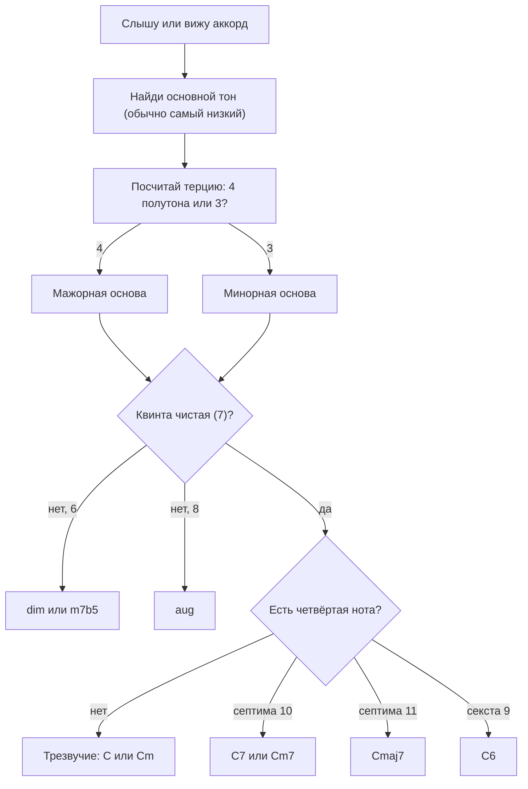

# Трезвучия, септаккорды и буквенные обозначения

Вторая часть теории модуля — аккорды тональности, функции и прогрессии:
[`theory-2-progressions-and-cadences.md`](./theory-2-progressions-and-cadences.md).

## Простыми словами

**Аккорд** — несколько нот, звучащих вместе. В подавляющем большинстве случаев это не
случайные ноты: аккорд собирают **через одну ступень гаммы**, то есть терциями.

Возьмите гамму C-мажор и выберите первую, третью и пятую ноты: `C E G`. Это аккорд `C`,
по-русски «до-мажор»: название аккорда — это имя основной ноты плюс качество. Три ноты —
значит **трезвучие** (triad). Добавьте седьмую ступень, `B`, — получится `Cmaj7`,
септаккорд.

Всё, что дальше в этом модуле, — варианты одной идеи:

```text
аккорд = основной тон + стопка терций сверху
трезвучие  = 1 + 3 + 5           (три ноты)
септаккорд = 1 + 3 + 5 + 7       (четыре ноты)
```

Качество аккорда (мажорный он или минорный) определяет **нижняя терция**, ровно как
третья ступень определяла лад гаммы. Большая терция снизу — мажор, малая — минор. И это
уже целиком объясняет разницу между `C` и `Cm`: одна нота, один полутон.

## Зачем это нужно

1. **Аккорды — то, чем играют песни.** Открываете аккорды любой песни — видите `Am F C G`.
   Пока эти буквы не расшифровываются, вы играете картинки, найденные в интернете.
2. **Аккорды объясняют, почему песня звучит так, а не иначе.** Одна и та же мелодия
   поверх разных аккордов меняет смысл.
3. **Через аккорды идёт подбор по слуху.** Услышать четыре аккорда проще, чем сорок нот
   мелодии, а аккорды сразу дают тональность и ступени.
4. **Аккорды — язык для сочинения.** Своя прогрессия — первый шаг к своей песне (модуль
   [`10-songwriting-basics`](../10-songwriting-basics/index.md)).
5. **Обозначения — стандарт индустрии.** `Cmaj7` понимают гитарист, клавишник и
   аранжировщик, и это компактнее нотной записи.

Приятная новость про объём работы: аккордов кажется бесконечно много, а конструкций
всего несколько. Выучив четыре вида трезвучий и четыре вида септаккордов, вы читаете
почти любой чарт. Остальное — арифметика по 12 нотам из модуля
[`03-scales-and-intervals`](../03-scales-and-intervals/index.md).

## Как устроено

### Четыре трезвучия

Трезвучие полностью описывается двумя терциями, поставленными друг на друга:

| Вид | Стопка | Полутоны от основного тона | От C | Символ |
|---|---|---|---|---|
| Мажорное (major) | б3 + м3 | 0 – 4 – 7 | C E G | `C` |
| Минорное (minor) | м3 + б3 | 0 – 3 – 7 | C Eb G | `Cm` |
| Уменьшённое (diminished) | м3 + м3 | 0 – 3 – 6 | C Eb Gb | `Cdim`, `C°` |
| Увеличенное (augmented) | б3 + б3 | 0 – 4 – 8 | C E G# | `Caug`, `C+` |

Читается это так: у мажорного и минорного трезвучия квинта **чистая** (7 полутонов), и
поэтому они звучат устойчиво. У уменьшённого квинта уменьшённая (6 полутонов — тритон!),
у увеличенного увеличенная (8). Оба «кривых» трезвучия неустойчивы: уменьшённое звучит
напряжённо и требует разрешения, увеличенное — странно и подвешенно. В популярной музыке
они встречаются как краска, а не как основа.

Как собрать трезвучие от любой ноты, не заглядывая в таблицу:

```text
1. основной тон (root)
2. прибавь 4 полутона для мажора или 3 для минора  → терция
3. прибавь 7 полутонов к основному тону             → квинта
проверка: у мажора и минора верхняя нота одна и та же, меняется только середина
```

Пример на F: `F` + 4 = `A`, `F` + 7 = `C` → **F = F A C**. И минор: `F` + 3 = `Ab` →
**Fm = F Ab C**. Обратите внимание, как мало работы: одна нота сдвинулась на полутон.

### Почему именно терции

Вопрос, который у аналитического человека возникает сразу: почему аккорды строят через
одну ступень, а не через две или подряд? Ответ практический, а не мистический.

Если взять ноты подряд (`C D E`), получится плотный кластер: интервалы по 1–2 полутона —
это диссонансы, звук выходит «грязным». Если взять через две ступени (`C F B`), интервалы
станут слишком широкими, и три ноты перестанут восприниматься как единое целое. Терции
(3–4 полутона) попадают в удобную середину: достаточно далеко, чтобы каждая нота была
слышна отдельно, и достаточно близко, чтобы слух собрал их в один объект.

Есть и вторая причина, чисто арифметическая. Стопка терций внутри гаммы автоматически
даёт **квинту** между крайними нотами — самый устойчивый интервал после октавы. Поэтому
трезвучие звучит как «одна вещь», а не как три ноты, случайно оказавшиеся вместе.

Аккорды, построенные не терциями, существуют — квартовые созвучия в джазе, кластеры в
современной музыке, `sus`-аккорды как частный случай. Но база тональной музыки — терции,
и с них разумно начинать.

### Обращения

Аккорд `C` можно сыграть не только как `C E G`. Перенесите нижнюю ноту на октаву вверх —
получите `E G C`, это **первое обращение** (first inversion). Ещё раз — `G C E`, второе
обращение. Ноты те же, аккорд тот же, но нижняя нота другая, и звучит он иначе: устойчивее
всего аккорд в основном виде, мягче и «текучее» — в обращениях.

```text
основной вид:     C E G     нижняя нота C (основной тон)   символ C
1-е обращение:    E G C     нижняя нота E (терция)         символ C/E
2-е обращение:    G C E     нижняя нота G (квинта)         символ C/G
```

Зачем обращения нужны на практике — ради **плавной смены аккордов**. Сыграйте `C` (C E G)
и `F` (F A C) в основном виде: рука прыгает. А теперь `C` (C E G) и `F` во втором
обращении (`C F A`): двигаются только два пальца, а нижняя нота вообще остаётся на месте.
Это и есть **голосоведение** (voice leading) — искусство менять аккорды, двигая ноты на
минимальное расстояние. Оно же делает аккомпанемент похожим на музыку, а не на серию
переездов. Детально — модуль
[`09-keyboard-chords-and-songs`](../09-keyboard-chords-and-songs/index.md).

### Септаккорды

Добавим к трезвучию четвёртую ноту — септиму. Вариантов много, но в реальной музыке
встречаются в основном эти пять:

| Название | Состав от C | Полутоны | Символ | Характер |
|---|---|---|---|---|
| Большой мажорный септаккорд | C E G B | 0 – 4 – 7 – 11 | `Cmaj7` | мягкий, «мечтательный» |
| Доминантсептаккорд | C E G Bb | 0 – 4 – 7 – 10 | `C7` | напряжённый, тянет вниз в кварту |
| Малый минорный | C Eb G Bb | 0 – 3 – 7 – 10 | `Cm7` | мягкий минор, джаз и соул |
| Полуумень. (m7b5) | C Eb Gb Bb | 0 – 3 – 6 – 10 | `Cm7b5`, `Cø` | шаткий, служебный |
| Уменьшённый септаккорд | C Eb Gb A | 0 – 3 – 6 – 9 | `Cdim7` | максимально напряжённый |

Одно различие стоит запомнить особо, потому что новички путают его постоянно: **`C7` и
`Cmaj7` — разные аккорды**. `C7` содержит **Bb** (малая септима) и звучит напряжённо,
как в блюзе. `Cmaj7` содержит **B** (большая септима) и звучит мягко, как в босанове.
Правило чтения: цифра 7 без слова «maj» всегда означает малую септиму.

Почему `C7` тянет: внутри него сидят E и Bb — тритон. Тритон неустойчив (модуль
[`03-scales-and-intervals`](../03-scales-and-intervals/theory-2-intervals-and-keys.md)),
поэтому аккорд просит разрешения, и удобнее всего он разрешается в F. Отсюда вся
доминантовая механика, разобранная во второй части теории.

### Читаем буквенные обозначения

Символ аккорда состоит из основного тона и приписок. Логика такая:

```text
C          мажорное трезвучие                     C E G
Cm, Cmin   минорное (m или min, иногда «-»)       C Eb G
C7         доминантсептаккорд (малая септима)     C E G Bb
Cmaj7      большая септима                        C E G B
Cm7        минорный септаккорд                    C Eb G Bb
C6         трезвучие + большая секста             C E G A
Csus4      терция заменена на кварту              C F G
Csus2      терция заменена на секунду             C D G
Cadd9      трезвучие + нона (терция на месте)     C E G D
C5         только основной тон и квинта           C G      (power chord)
Cdim, C°   уменьшённое трезвучие                  C Eb Gb
Caug, C+   увеличенное трезвучие                  C E G#
C/E        аккорд C с нотой E в басу              E G C
```

Два обозначения заслуживают отдельного слова. **`sus`** (suspended) — «подвешенный»
аккорд: терция убрана, поэтому он ни мажорный, ни минорный, и просится обратно в
обычный аккорд. Именно поэтому переход `Csus4 → C` звучит как вздох облегчения — приём
живёт в тысячах песен. **Слэш-аккорды** (`C/E`, `G/B`, `D/F#`) — это не «дробь» и не
два аккорда: слева аккорд, справа нота в басу. Чаще всего это обращение, иногда —
специально «чужой» бас для плавной линии.



### Расширенные аккорды — коротко

Стопку терций можно продолжать: за септимой идут нона (9), ундецима (11) и терцдецима
(13). Практически это выглядит так:

```text
C9    = C7 + нона D          (в аккорде есть септима Bb — это важно)
Cadd9 = C   + нона D          (септимы нет, отсюда add)
C11   = C7 + 9 + 11
C13   = C7 + 9 + 13
C6/9  = C  + секста A + нона D
```

Разница между `C9` и `Cadd9` — самая частая путаница в чартах. Цифра без `add`
подразумевает, что все ступени под ней тоже присутствуют, в первую очередь септима.
`add` означает буквально «добавь только эту ноту». Гитаристам `add9` попадается
постоянно: `Cadd9` — стандартная замена простому `C` в поп-аккомпанементе, потому что
звучит воздушнее и переставляется из `G` почти без движения пальцев.

Дальше в эту сторону идут джазовые обозначения с альтерациями (`C7b5`, `C7#9`), и это уже
вне рамок курса. Достаточно понимать правило чтения: основной тон, потом качество, потом
добавленные ступени, потом изменённые.

### Сколько нот нужно играть

Ещё один вопрос, который экономит время. В `Cmaj7` четыре ноты, но на гитаре шесть струн,
а на клавишах десять пальцев — что играть?

Практическая иерархия важности такая:

```text
1. основной тон  — даёт имя аккорду (часто его отдают басу)
2. терция        — говорит, мажор это или минор
3. септима       — говорит, какого типа септаккорд
4. квинта        — почти всегда можно выбросить
```

Отсюда джазовое правило «терция и септима» — двух нот достаточно, чтобы аккорд опознался,
если бас играет основной тон. И отсюда же понятно, почему в гитарных аккордах некоторые
струны глушат: лишние повторы квинты не нужны, а хват упрощается заметно.

### Аккорд как множество, а не как форма

Полезный сдвиг сознания. Аккорд `C` — это множество нот `{C, E, G}`, а не картинка на
грифе и не положение руки. Одно и то же множество можно взять десятком способов: на
гитаре в открытой позиции, баррэ на восьмом ладу, в трёх нотах на тонких струнах; на
клавишах — в любом обращении, в две руки, с басом в левой. Нот при этом можно и повторять:
в гитарном `C` (x32010) звучат C E G C E — пять струн, но всего три разных ноты.

Отсюда практический вывод, который сэкономит вам месяцы: **учите составы, а не только
формы**. Гитарист, который знает, что в `C` живут C E G, найдёт этот аккорд где угодно на
грифе и сможет заменить его на `C/E`, добавить септиму или выкинуть квинту. Гитарист,
знающий только картинку, застрянет на первых пяти аккордах.

## На гитаре

Открытые аккорды — то, с чего начинают все. Проверенные формы (цифры — лады, `x` —
струна не звучит, `0` — открытая струна):

```text
   Am           C            G            Em           D
e|--0--      e|--0--      e|--3--      e|--0--      e|--2--
B|--1--      B|--1--      B|--0--      B|--0--      B|--3--
G|--2--      G|--0--      G|--0--      G|--0--      G|--2--
D|--2--      D|--2--      D|--0--      D|--2--      D|--0--
A|--0--      A|--3--      A|--2--      A|--2--      A|--x--
E|--x--      E|--x--      E|--3--      E|--0--      E|--x--
```

Проверьте состав `Am` по карте грифа: открытая A (нота A), D на втором ладу (E), G на
втором (A), B на первом (C), открытая e (E). Итого звучат A, C и E — ровно минорное
трезвучие от A. Никакой магии, только счёт полутонов.

Power chord — это `C5`, аккорд без терции: только основной тон и квинта на соседней
струне двумя ладами выше. Он не мажорный и не минорный, потому что квинта одинакова в
обоих ладах, — поэтому им и играют рифы, где терция мешала бы. Техника постановки,
баррэ и смена аккордов — модули
[`06-guitar-foundations`](../06-guitar-foundations/index.md) и
[`07-guitar-scales-and-songs`](../07-guitar-scales-and-songs/index.md).

## На клавишах

На клавиатуре трезвучие видно глазами: три ноты через одну белую или чёрную, в
зависимости от тональности. `C` — это первая, третья и пятая белые клавиши от C:

```text
аккорд C = C E G (отмечены *)
    C#   D#        F#   G#   A#
    Db   Eb        Gb   Ab   Bb
 ___________________________________
|   |#|  |#|       |#|  |#|  |#|   |
|   |#|  |#|       |#|  |#|  |#|   |
|   |_|  |_|       |_|  |_|  |_|   |
|    |    |    |    |    |    |    |
| C* | D  | E* | F  | G* | A  | B  |
|____|____|____|____|____|____|____|
```

Чтобы получить `Cm`, опустите среднюю ноту на полутон — вместо белой E нажмите чёрную Eb.
Один палец, одно движение, полная смена настроения: лучшая демонстрация того, что терция
решает всё.

Практическая рекомендация, если клавиши у вас основной инструмент: играйте аккорд правой
рукой, а основной тон — левой, отдельно. Так у вас сразу появляется бас, и звучит это
несравнимо полнее, чем трезвучие в одной руке. Обращения, аккомпанемент и педаль —
модули [`08-keyboard-foundations`](../08-keyboard-foundations/index.md) и
[`09-keyboard-chords-and-songs`](../09-keyboard-chords-and-songs/index.md).

## Послушай

- **Мажор против минора** — сыграйте сами `C` и `Cm` подряд и послушайте разницу в один
  полутон. Это самый показательный «эксперимент» в модуле, и его не заменит никакая запись.
- **`Csus4 → C`** — приём «подвесить и разрешить» слышен во множестве поп- и рок-песен;
  сыграйте его сами несколько раз, и дальше вы начнёте узнавать его в записях.
- **Доминантсептаккорд** — любой 12-тактовый блюз: «Johnny B. Goode» (Chuck Berry),
  «Rock Around the Clock» (Bill Haley). Там доминантсептаккорды стоят подряд, и их
  напряжённый характер слышен сразу.
- **`maj7`** — мягкое, «расслабленное» звучание, характерное для босановы и джаза.
  Проверь на слух: сыграйте `Cmaj7` и `C7` подряд, разница огромна.
- **Power chord** — любой рок-риф на перегруженной гитаре; отсутствие терции и есть
  причина того самого «плотного» звука.

Методика тренировки узнавания аккордов на слух (мажор / минор / dim / dom7) — модуль
[`05-ear-training-and-practice`](../05-ear-training-and-practice/index.md).

## Типичные ошибки

- **Путать `C7` и `Cmaj7`.** Цифра 7 без «maj» — это малая септима. `C7` содержит Bb,
  `Cmaj7` содержит B.
- **Учить формы без составов.** Через месяц вы играете пять картинок и не можете
  подставить шестую.
- **Читать `C/E` как «C или E».** Это аккорд C с E в басу.
- **Считать, что аккорд обязан звучать в основном виде.** Обращения — не «неправильно»,
  а основной инструмент плавной смены.
- **Забывать, что квинта в мажоре и миноре одинакова.** Различие только в терции; из
  этого же следует, что power chord нейтрален.
- **Брать `dim` и `aug` как обычные аккорды.** Они неустойчивы по конструкции и просят
  продолжения; вне контекста звучат «сломанно».
- **Играть все ноты аккорда обязательно.** В реальной игре квинту часто выкидывают, а
  основной тон отдают басу. Аккорд узнаётся по терции и септиме.
- **Ждать чистого звука сразу.** На гитаре первые недели струны дребезжат — это вопрос
  техники, а не понимания (модуль
  [`06-guitar-foundations`](../06-guitar-foundations/index.md)).

## Словарь терминов

- **Аккорд (chord)** — три и более нот, звучащих вместе.
- **Трезвучие (triad)** — аккорд из трёх нот: основной тон, терция, квинта.
- **Основной тон (root)** — нота, от которой строится аккорд и по которой он назван.
- **Терция аккорда (third)** — вторая нота стопки; определяет мажор или минор.
- **Квинта аккорда (fifth)** — третья нота стопки; чистая у мажора и минора.
- **Уменьшённое трезвучие (diminished)** — м3 + м3, квинта уменьшённая.
- **Увеличенное трезвучие (augmented)** — б3 + б3, квинта увеличенная.
- **Обращение (inversion)** — вариант аккорда с другой нотой в басу.
- **Слэш-аккорд (slash chord)** — обозначение вида `C/E`: аккорд слева, бас справа.
- **Септаккорд (seventh chord)** — трезвучие плюс септима.
- **Доминантсептаккорд (dominant 7th)** — `C7`: мажорное трезвучие + малая септима.
- **`maj7`** — мажорное трезвучие + большая септима.
- **`sus`-аккорд (suspended)** — терция заменена на кварту или секунду.
- **`add9`** — трезвучие плюс нона, терция на месте.
- **Power chord** — `C5`: основной тон и квинта, без терции.
- **Голосоведение (voice leading)** — смена аккордов с минимальным движением голосов.

## См. также

- Вторая часть теории модуля:
  [`theory-2-progressions-and-cadences.md`](./theory-2-progressions-and-cadences.md).
- Уроки: [`lessons/01-triads-major-minor.md`](./lessons/01-triads-major-minor.md),
  [`lessons/02-diatonic-chords-roman-numerals.md`](./lessons/02-diatonic-chords-roman-numerals.md),
  [`lessons/03-progressions-in-real-songs.md`](./lessons/03-progressions-in-real-songs.md).
- **musictheory.net** — «Lessons: Chords» и упражнения «Chord Identification»,
  «Chord Construction».
- **teoria.com** — «Chords» с проигрыванием и слуховыми упражнениями.
- **Open Music Theory** (openmusictheory.github.io) — главы про трезвучия, септаккорды
  и обращения.
- **Michael Pilhofer, Holly Day, «Music Theory For Dummies»** — аккорды простым языком.
- **Kostka & Payne, «Tonal Harmony»** — строгие определения обращений и септаккордов.
- **Bill Hilton, «How to Really Play the Piano»** — аккордовый подход к клавишам.
- **MuseScore** (musescore.org) — набрать аккорд и услышать его; удобно проверять составы.
- Предыдущий модуль: [`03-scales-and-intervals`](../03-scales-and-intervals/index.md).
- Дальше — слух и методика:
  [`05-ear-training-and-practice`](../05-ear-training-and-practice/index.md).
