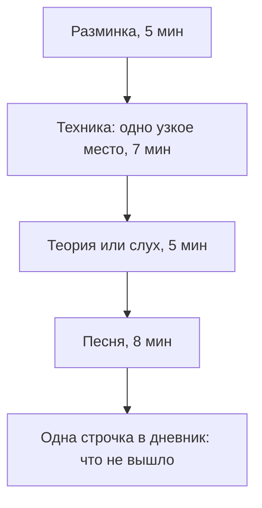

# Урок 03 — План занятий: сессия, неделя, метроном-лесенка

Длительность: **35–40 минут**, из которых 25 — реальная сессия по собственному плану.
Нужны: метроном (**GuitarTuna** или **Soundbrenner**), таймер, куда-то
записать план (файл в `notes/`, бумага, что угодно), телефон для записи.

## Разогрев — 3 минуты

Один прогон четвёрки интервалов голосом (ч5, ч8, б3, м3) и одна пара «мажор — минор» с
ярлыками вслух. Полторы минуты. Дальше — работа с планом.

## Шаг 1. Сессия на 25 минут — 5 минут на сборку

Правило простое: **блоки заданы заранее, у каждого свой таймер**. Иначе «поиграть песню»
съедает всё занятие, а техника и слух не случаются никогда.



Разберём блоки.

1. **Разминка, 5 минут.** Фиксированный состав, не меняется месяцами. Для слуха и
   теории это интервалы голосом; для инструмента — то, что даёт ваш инструментальный
   модуль ([`06-guitar-foundations`](../../06-guitar-foundations/index.md) или
   [`08-keyboard-foundations`](../../08-keyboard-foundations/index.md)).
2. **Техника, 7 минут.** Ровно **одно узкое место** и ровно одна цель, сформулированная
   числами: «такты 5–6 без остановки на 80 BPM». Не «поработать над песней».
3. **Теория или слух, 5 минут.** Карточки или приложение. Не больше: 5–7 минут в день
   работают, 40 минут по субботам — нет.
4. **Песня, 8 минут.** В конце и как награда. Играть целиком, не поправляя каждую ошибку.
5. **Строчка в дневник.** «Такты 5–6 рассыпаются на 75 BPM». Это готовая цель следующей
   сессии; без неё каждое занятие начинается с нуля.

Напишите свой вариант этих пяти блоков **своими словами и со своими цифрами**. Общий
шаблон — не ваш план, пока вы не подставили в него конкретное узкое место.

## Шаг 2. Метроном-лесенка — 7 минут практики

Способ поднимать темп, не обманывая себя. Правило: **три чистых прохода подряд → +5 BPM.
Ошибка → −10 BPM.** «Чистый» значит без остановок, без фальши и в темпе — три условия
сразу, иначе проход не считается.

```text
цель: такты 5–6 чисто на 90 BPM

  60 BPM   ✓ ✓ ✓   → +5
  65 BPM   ✓ ✓ ✓   → +5
  70 BPM   ✓ ✓ ✗   → повторить на этом же темпе
  70 BPM   ✓ ✓ ✓   → +5
  75 BPM   ✗       → −10
  65 BPM   ✓ ✓ ✓   → +5  и снова вверх
```

Откат вниз — не наказание, а способ не закреплять брак: ошибка, повторённая на скорости
десять раз, становится частью навыка.

Второй обязательный приём — **петля**. Не играйте песню с начала до трудного места: за
20 минут получите двадцать повторений лёгкого и двадцать провалов трудного. Изолируйте
**2–4 такта**, доведите, потом присоедините по такту до и после. Это **chunking**.

```drill
type: free-form
prompt: "7 минут. Метроном-лесенка на одном узком месте: выбрать 2–4 такта, поставить темп, где ошибок ноль, и вести лесенку по правилу +5 за три чистых прохода, −10 за ошибку. Записать стартовый и финальный BPM."
answer: "Стартовый темп был выбран по критерию «ноль ошибок», а не «примерно как в песне»; лесенка шла по правилу, а не по настроению; откат вниз действительно делался при ошибке; стартовый и финальный BPM записаны числами; играли только выбранные такты, а не всю песню."
check: manual
hint: "Проход считается чистым, только если выполнены все три условия: без остановок, без фальши, в темпе."
```

## Шаг 3. Неделя — 4 минуты на сборку

Пять-шесть коротких дней сильнее двух длинных: навык растёт на частоте контактов, а не
на суммарных часах. Рабочая сетка, которую можно взять как есть:

```text
Пн  разминка · техника · слух (интервалы)       · песня A
Вт  разминка · техника · теория (карточки)      · песня A
Ср  разминка · техника · слух (аккорды и бас)   · песня B
Чт  разминка · техника · ритм под метроном      · песня B
Пт  разминка · техника · слух (диктант)         · песни A и B
Сб  только песни: репертуар целиком, без правок · запись на телефон
Вс  выходной или 10 минут «просто поиграть»
```

Две детали легко пропустить. **Суббота без правок** — день, когда вы играете, а не
исправляете; он держит мотивацию. **Запись на телефон раз в неделю** — самый честный
график прогресса, потому что в моменте руки заняты и вы не слышите ускорений. Файлы —
в `misc/` с датой.

Репертуар держите по **интервальным повторениям**: три стопки — «свежая» (каждый день),
«оседает» (раз в три дня), «в репертуаре» (раз в неделю).

```drill
type: free-form
prompt: "4 минуты. Написать свой план: пять блоков сессии со своими цифрами и недельная сетка на 7 дней с указанием, какие песни A и B и в какой день запись."
answer: "В блоке техники записано конкретное узкое место, а не «поработать над песней»; у каждого блока указано время; в неделе есть день без правок и день записи; план записан в файл или на бумагу, а не «в голове»; общая длительность дня 20–30 минут, а не час."
check: manual
```

## Шаг 4. Провести сессию — 25 минут

Прямо сейчас, по своему плану, с таймером. Не «когда-нибудь потом» — иначе план
останется текстом.

```drill
type: multiple-choice
prompt: "Вечер, сил нет, полную сессию делать не хочется. Что предписывает методика модуля?"
options: ["пропустить день, отдых важнее", "сделать 10 минут: разминка и одна песня", "отработать пропуск двойной сессией завтра", "заменить занятие прослушиванием музыки"]
answer: "сделать 10 минут: разминка и одна песня"
check: exact
hint: "Пропущенные дни подряд убивают привычку надёжнее, чем короткие занятия."
```

## Итог

План занятий — это не мотивация, а конструкция: **пять блоков по таймеру, одна узкая
цель в блоке техники, строчка в дневник в конце**. Темп поднимается лесенкой (+5 за три
чистых прохода, −10 за ошибку), трудные места живут в петлях по 2–4 такта, репертуар
повторяется по расписанию, а не по памяти.

Неделя из пяти-шести коротких дней с одним днём «только песни» работает годами. Плато
будут, это норма: на плато меняют **формат**, а не цель. А если сил нет совсем, есть
правило десяти минут.

Дальше — инструмент: [`06-guitar-foundations`](../../06-guitar-foundations/index.md) или
[`08-keyboard-foundations`](../../08-keyboard-foundations/index.md). Упражнения этого
модуля не заканчиваются: 5–7 минут слуха в день идут параллельно всему остальному курсу.
