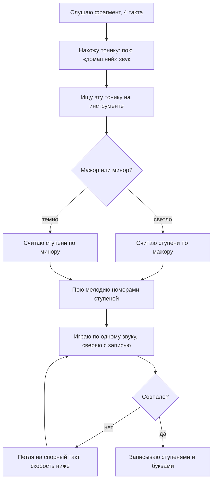
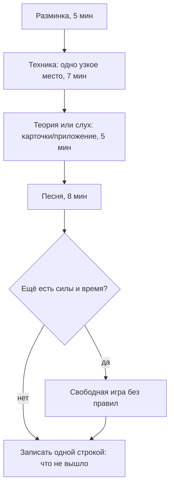

# Слух и методика занятий

## Простыми словами

**Музыкальный слух** — это умение назвать то, что слышишь, и воспроизвести то, что
назвал. Всё. Никакого шестого чувства, никакого «дано или не дано».

Аналогия для программиста. Первый раз глядя в незнакомый стек-трейс, ты видишь стену
текста. Через полгода тот же трейс читается за две секунды: «а, nil в третьем кадре».
Символы не изменились — изменился ты. С музыкой то же самое: сначала песня это стена
звука, потом «так, бас идёт вниз на квинту, а тут минорный аккорд».

Слух бывает двух видов, и их постоянно путают:

- **Относительный слух (relative pitch)** — слышу *отношения*: этот звук выше того на
  квинту, этот аккорд минорный, бас ушёл на четвёртую ступень. Тренируется у всех,
  всегда. Это 95 % рабочего слуха любого музыканта.
- **Абсолютный слух (perfect pitch, absolute pitch)** — слышу *имя* звука без опоры:
  «это A». Редкий, обычно формируется в детстве, и — сюрприз — для практической музыки
  почти бесполезен. Человек с абсолютным слухом без тренировки относительного не подберёт
  песню быстрее тебя.

Ещё одна аналогия. Абсолютный слух — это как назвать hex-код цвета, посмотрев на стену.
Относительный — увидеть, что этот серый на два тона светлее того. Дизайнеру нужнее
второе. Музыканту тоже.

Вывод, который стоит принять сразу: **слух — это навык, а не свойство**. Он ставится
протоколом и повторениями, как аппликатура. И как всякий навык, требует не вдохновения,
а расписания — про расписание вторая половина этого файла.

## Зачем это нужно

Четыре очень конкретные вещи, которые даёт слух.

1. **Подобрать песню без табов.** Услышал — нашёл аккорды — играешь. Не «нашёл кривой
   таб на сайте, где половина аккордов неверная», а сам.
2. **Играть с людьми.** «Давай в Am» — и ты уже слышишь, куда идёт гармония, даже если
   песню не знаешь. Без слуха совместная игра превращается в чтение с листа с чужого
   плеча.
3. **Слышать свои ошибки.** Это самое недооценённое. Пока ухо не отличает «сыграл верно»
   от «сыграл примерно», ты закрепляешь ошибки часами практики. Слух — это встроенный
   линтер.
4. **Сочинять.** Мелодия в голове → ноты на инструменте. Без этого сочинение сводится к
   перебору аккордов наугад. Подробно — в [`10-songwriting-basics`](../10-songwriting-basics/index.md).

И пятое, идеологическое: слух превращает теорию из бумажки в звук. Ты уже знаешь, что
минорное трезвучие — это 0-3-7 полутонов ([`04-chords-and-harmony`](../04-chords-and-harmony/theory.md)).
Слух — это когда «0-3-7» и «вот этот грустный аккорд» становятся одной и той же мыслью.

## Как устроено

### Интервалы: песни-якоря плюс пение

Первый инструмент — **песня-якорь (reference song)**. Берём хорошо известную мелодию,
где нужный интервал стоит в самом начале, и привязываем к ней ощущение. Услышал скачок,
не понял — пробегаешь по внутреннему списку якорей, пока не совпадёт.

```text
инт.  полутоны  песня-якорь
м2       1      «Jaws» — два чередующихся звука
б2       2      «Happy Birthday to You» — «хэп-пи»
м3       3      «Smoke on the Water» — первый скачок рифа
б3       4      «When the Saints Go Marching In» — начало
ч4       5      «Bridal Chorus» Вагнера; «Amazing Grace» — начало
тритон   6      «Maria» (West Side Story); тема «The Simpsons»
ч5       7      «Twinkle Twinkle Little Star»; тема «Star Wars»
м6       8      надёжного якоря нет — «почти квинта, но грустнее»
б6       9      «My Bonnie Lies Over the Ocean» — начало
м7      10      «Somewhere» (West Side Story) — «there's a place for us»
б7      11      якоря ненадёжны — «почти октава, но режет»
ч8      12      «Somewhere Over the Rainbow» — «some-where»
```

Про м6 и б7 честно: массовых надёжных якорей для них нет, и попытка выдумать себе якорь
из полузнакомой песни только запутает. Их проще добить в приложении, опираясь на
описание («почти квинта, но грустнее» и «почти октава, но режет»). И вообще — где
сомневаешься, **проверь на слух**: сыграй интервал на инструменте и сравни.

Второй инструмент, без которого первый работает вполовину, — **пение**. Спеть интервал
означает построить его внутри себя, а не угадать. Голос тут не про красоту: попадаешь в
ноту ±полутон — уже достаточно. Стесняться некому, ты один в комнате.

Порядок освоения: сначала ч5, ч8, б3, м3 (они самые характерные), потом ч4, б2, б6, м7,
и в конце тритон, м2, м6, б7.

### Функциональный слух: ступени вместо интервалов

Есть подход, который в реальной музыке работает лучше «интервалов в вакууме»:
**функциональный слух (functional ear training)**. Идея — слышать не расстояние между
двумя случайными звуками, а **ступень относительно тоники**. В песне ты почти никогда не
слышишь абстрактный интервал: ты слышишь «пятая ступень», «третья», «седьмая, которая
тянет домой».

Мыслить надо номерами: **1 2 3 4 5 6 7** («do-based» numbers, где 1 всегда тоника). Это
транспонирующее мышление: та же мелодия в C и в F имеет одни и те же номера ступеней,
а буквы разные. Программисту это понятно сразу — номера ступеней это относительный путь,
буквы это абсолютный.

Метод, на который стоит посмотреть отдельно, — методика **Alain Benbassat**, реализованная
в приложении **Functional Ear Trainer**: сначала играется каденция, задающая тональность,
потом одиночный звук, и надо назвать его ступень. Именно так слух и используется в жизни.

### Качество аккордов на слух

Здесь работают не якоря, а ярлыки-ощущения. Проверенный минимум из четырёх:

- **мажорное трезвучие** — светло, устойчиво, «всё в порядке»;
- **минорное** — темно, мягко, «грустно, но спокойно»;
- **уменьшённое** — напряжённо, нестабильно, «сейчас что-то случится» (саундтреки ужасов
  живут на нём);
- **доминантсептаккорд (dom7, `G7`)** — «хочет разрешиться», зудит, требует продолжения.

Протокол: слушаешь аккорд → говоришь ярлык → **проверяешь**, спев его по звукам сверху
вниз. Пропел — значит правда услышал, а не угадал. Строение этих аккордов — в
[`04-chords-and-harmony`](../04-chords-and-harmony/theory.md), здесь только уши.

### Бас: самая короткая дорога к аккордам песни

Практический секрет: **чтобы снять аккорды, слушай бас**. Самый низкий звук почти всегда
и есть основной тон (root) текущего аккорда. Определил четыре басовые ноты в куплете —
получил каркас гармонии, дальше остаётся решить только «мажор или минор» на каждой.

Как слушать бас, когда его «не слышно»: подпевай ему. Гуди самым низким голосом, какой
есть, вместе с записью. Ухо цепляется за то, что воспроизводит тело. На нормальных
наушниках или колонках это сильно проще, чем на телефонном динамике — телефон
низ обрезает физически.

### Мелодический диктант: шаг и скачок

Диктант — записать услышанное. Начинается с грубого различения:

- **поступенное движение (step)** — соседние ступени, мелодия «ползёт»: 1-2-3-2;
- **скачок (skip / leap)** — через ступень и больше, мелодия «прыгает»: 1-3-5.

Первый вопрос к любой мелодии — не «какая нота», а «вверх или вниз, шаг или скачок».
Направление и тип движения ловятся сразу, точное имя ноты — потом. Дальше подставляешь
номера ступеней.

### Ритмический диктант

То же, но по времени. Слушаешь два такта, отхлопываешь, потом записываешь сеткой
`1 e & a`. Тут работает правило из [`01-sound-and-rhythm`](../01-sound-and-rhythm/theory.md):
сначала определи, куда падают доли, потом дели. Практически: включи метроном на 60 BPM
и попробуй уложить услышанный рисунок в четыре доли. Не уложился — рисунок длиннее
такта, попробуй два.

### Снятие мелодии: протокол

Не «слушаю и подбираю наугад», а последовательность с точками возврата.



«Найти тонику» на практике: останови запись и пропой звук, на котором мелодия хочет
закончиться и успокоиться. Это и есть 1.

### Пение: три упражнения на всю жизнь

1. **Попадание в звук (matching pitch).** Играешь ноту — поёшь её. Проверка тюнером
   (GuitarTuna показывает высоту голоса так же, как высоту струны).
2. **Гамма вверх и вниз** номерами: 1-2-3-4-5-6-7-8-7-6-5-4-3-2-1. Медленно, с
   инструментом, потом без.
3. **Интервал от заданной ноты.** «Спой ч5 от D» → поёшь, потом проверяешь на
   инструменте. Это упражнение и есть настоящая проверка, знаешь ты интервалы или
   только читал про них.

### Приложения и как ими пользоваться

Инструменты реальные и бесплатные (или почти):

- **musictheory.net → Exercises**: *Interval Ear Training* и *Chord Ear Training*.
  Настройка на старте: интервалы только ч5, ч8, б3, м3, вверх, в пределах октавы.
  Расширять набор, когда точность стабильно выше 90 %.
- **Tenuto** — платное мобильное приложение от тех же авторов, те же упражнения в
  кармане.
- **teoria.com** — упражнения на интервалы, аккорды и диктант, с настройкой тональности.
- **Functional Ear Trainer** — ступени относительно тоники, метод Benbassat. Начинать с
  первого уровня (1, 3, 5) и не спешить.

Дозировка: **5–7 минут в день**, каждый день. Не 40 минут по субботам. Приложение — это
таблица умножения, а не тренировка; настоящий слух растёт на живой музыке, когда ты
снимаешь песни.

### Методика: осознанная практика

**Осознанная практика (deliberate practice)** — это не «играл час». Это:

- **узкая цель** («такты 5–6 без остановки на 80 BPM»), а не «поработать над песней»;
- **обратная связь** сразу (метроном, запись, тюнер) — иначе тренируешь ошибку;
- **край возможностей**: чуть труднее, чем получается. Легко — не растёшь, невозможно —
  ломаешься.

Тридцать минут по этой схеме дают больше, чем два часа проигрывания песни от начала.

### Медленно — значит быстро

Правило: **если не получается медленно, быстро не получится**. Ошибка на скорости — это
не «недостаток скорости», это неверное движение, отработанное до автоматизма. Практика:
опусти темп до того, где ошибок ноль, и живи там столько, сколько нужно. Скорость
приходит бонусом, чистота — нет.

### Петля на трудный такт

Классический способ терять время: играть песню с начала, доходить до трудного места,
спотыкаться, начинать с начала. За 20 минут — двадцать повторений лёгкой части и
двадцать неудач в трудной.

Правильно: **изолируй 2–4 такта**, где ломается, и играй **только их** по кругу.
Заработало — присоедини один такт до и один после. Метод называется **chunking**:
разбить на куски по 2–4 такта, каждый довести отдельно, потом сшить.

### Метроном-лесенка

Как повышать темп, не обманывая себя:

```text
цель: такты 5–6 чисто на 90 BPM

  60 BPM   ✓ ✓ ✓   → +5
  65 BPM   ✓ ✓ ✓   → +5
  70 BPM   ✓ ✓ ✗   → повторить на этом же темпе
  70 BPM   ✓ ✓ ✓   → +5
  75 BPM   ✗       → −10
  65 BPM   ✓ ✓ ✓   → +5  и снова вверх
```

Правило простое: **три чистых прохода подряд → +5 BPM. Ошибка → −10 BPM.** «Чистый» —
без остановок, без фальши, в темпе. Откат вниз не наказание, а способ не закреплять
брак. Метроном — из [`01-sound-and-rhythm`](../01-sound-and-rhythm/theory.md); приложения
GuitarTuna и Soundbrenner годятся.

### Интервальные повторения для репертуара

Песни забываются так же, как слова языка. Лечится тем же способом: **интервальные
повторения (spaced repetition)** по расписанию, а не «играю что вспомнил». Держи список
из 3–6 песен и три стопки: «свежая» (каждый день), «оседает» (раз в три дня), «в
репертуаре» (раз в неделю). Сбилась — вернулась на стопку вверх.

### Запись себя

Телефон в метре от инструмента — этого достаточно. Слушать запись неприятно первые
недели и полезно всегда: в моменте ты занят руками и не слышишь, что ускоряешься,
глушишь струны и играешь без динамики. Раз в неделю — запись одной песни в `misc/` с
датой. За месяц набирается самый честный график прогресса, какой бывает.

### Шаблон сессии

25 минут, разбитые заранее. Таймер обязателен, иначе «поиграть песню» съест всё.



Последний шаг не пропускать: строчка «такты 5–6 рассыпаются на 75 BPM» — это готовая
цель следующей сессии. Без неё каждая сессия начинается с нуля.

### Неделя

Пять-шесть коротких дней сильнее двух длинных: навык растёт на частоте контактов, а не
на суммарных часах. Рабочая сетка:

```text
Пн  разминка · техника · слух (интервалы)       · песня A
Вт  разминка · техника · теория (карточки)      · песня A
Ср  разминка · техника · слух (аккорды и бас)   · песня B
Чт  разминка · техника · ритм под метроном      · песня B
Пт  разминка · техника · слух (диктант)         · песни A и B
Сб  только песни: репертуар целиком, без правок · запись на телефон
Вс  выходной или 10 минут «просто поиграть»
```

### Плато и мотивация

**Плато** — период, когда занимаешься, а прогресса не слышно. Это норма и признак того,
что навык переваривается, а не сломался. Что делать: не менять цель, менять **формат**.
Тот же материал — другой темп, другая тональность, другая рука, игра под запись, игра
с закрытыми глазами.

И правило против пропусков: **правило десяти минут**. Нет сил на сессию — сделай 10
минут разминки и одну песню. Ноль дней подряд убивает привычку гораздо надёжнее, чем
десяток коротких дней.

## На гитаре

Слуховые упражнения на гитаре удобно делать на одной струне: полутон = один лад, значит
интервал буквально измеряется в ладах. Сыграл открытую A, потом 7-й лад той же струны —
вот ч5, вот ощущение, вот «Twinkle Twinkle». Настройка **E A D G B e** сама даёт
интервальные ориентиры: между соседними струнами ч4 (5 ладов), кроме пары G–B, где б3
(4 лада) — это и есть готовый тренажёр.

Пение с гитарой: играешь ноту, поёшь её, потом играешь интервал и поёшь второй звук.
Механика левой руки, боксы и аппликатуры — не здесь, а в
[`06-guitar-foundations`](../06-guitar-foundations/index.md) и
[`07-guitar-scales-and-songs`](../07-guitar-scales-and-songs/index.md).

## На клавишах

Клавиатура — лучший тренажёр для слуха, потому что полутон виден глазами: интервал это
просто число клавиш, включая чёрные. Сыграл C и G — посчитал семь полутонов — услышал
квинту. Плюс два звука легко брать одновременно, а гармонический интервал (два звука
вместе) узнавать надо отдельно от мелодического (по очереди).

Дополнительный бонус для программиста: MIDI-номера. Разница номеров = число полутонов,
и приложения-тренажёры можно подключить прямо к клавиатуре, отвечая нажатием, а не
мышкой. Посадка, пальцы и аппликатура — в
[`08-keyboard-foundations`](../08-keyboard-foundations/index.md) и
[`09-keyboard-chords-and-songs`](../09-keyboard-chords-and-songs/index.md).

## Послушай

- **Песни-якоря из таблицы выше** — это и есть основной материал для слушания. Прогони
  весь список подряд один раз: если якорь не звучит у тебя в голове мгновенно, замени
  его на другую песню, которую знаешь наизусть.
- **«Stand By Me», Ben E. King** — учебный пример хорошо слышимой басовой линии: бас
  ведёт песню, и его легко подпевать. Конкретные аккорды проверь по аккордам или табам.
- **Любой 12-тактовый блюз** (жанр, а не конкретная запись) — материал для слуха на
  гармонию: за 12 тактов проходит вся схема, и повторяется бесконечно. Слушай только
  бас и считай, где он меняется.
- **Собственная запись недельной давности** — самый информативный трек в этом списке.

Если про какую-то песню сомневаешься, что слышишь именно тот интервал — сыграй интервал
на инструменте рядом с записью и сравни. Ухо доверяет сравнению, а не тексту.

## Типичные ошибки

- **Ждать абсолютный слух.** «Я не слышу, какая это нота» — и не надо. Работает
  относительный слух, а он тренируется.
- **Угадывать вместо пения.** Ответил в приложении наугад, попал, пошёл дальше. Пение —
  это проверка; без него растёт статистика, а не слух.
- **Только приложения.** Идеальные синтезированные интервалы в вакууме и живая песня —
  разные задачи. Приложение 5 минут, снятие песен — всё остальное время.
- **Учить интервалы «в вакууме» и не учить ступени.** В музыке звук почти всегда
  относится к тонике. Функциональный слух даёт больше на единицу усилий.
- **Слушать на телефонном динамике.** Баса там физически нет, а бас — половина работы.
- **Играть песню с начала вместо петли.** Двадцать повторений лёгкого и двадцать
  провалов трудного.
- **Задирать темп.** Ошибка на скорости закрепляется так же прочно, как правильное
  движение. Лесенка с откатом −10 существует ровно поэтому.
- **Сессия без таймера и без цели.** Превращается в проигрывание того, что уже умеешь.
- **Марафоны по выходным.** Пять коротких дней сильнее двух длинных.
- **Не записывать себя.** Тогда все выводы о своей игре — это выводы человека, занятого
  руками.
- **Бросать на плато.** Плато проходят сменой формата, а не сменой цели.

## Словарь терминов

- **Относительный слух (relative pitch)** — слышать отношения между звуками: интервалы,
  ступени, качество аккордов. Тренируется.
- **Абсолютный слух (absolute / perfect pitch)** — называть звук без опоры. Редкий и для
  практики почти не нужный.
- **Песня-якорь (reference song)** — известная мелодия, начинающаяся нужным интервалом.
- **Ступень (scale degree)** — номер звука относительно тоники, 1…7. Мыслить номерами
  значит мыслить транспонирующе.
- **Функциональный слух (functional ear training)** — узнавание ступени относительно
  заданной тоники, а не изолированного интервала.
- **Поступенное движение (step)** — переход на соседнюю ступень.
- **Скачок (skip / leap)** — переход через ступень и дальше.
- **Диктант** — запись услышанного: мелодический (высоты) или ритмический (длительности).
- **Снятие (transcribing)** — разбор песни на слух до нот и аккордов.
- **Осознанная практика (deliberate practice)** — узкая цель + обратная связь + работа
  на краю возможностей.
- **Петля (looping)** — многократное проигрывание изолированных 2–4 тактов.
- **Chunking** — разбиение материала на короткие куски, отработка по отдельности и сшивка.
- **Метроном-лесенка** — повышение темпа по правилу «3 чистых прохода → +5 BPM, ошибка →
  −10 BPM».
- **Интервальные повторения (spaced repetition)** — повторение по расписанию с растущими
  интервалами; здесь — для репертуара.
- **Плато** — период без слышимого прогресса при регулярных занятиях.
- **Правило десяти минут** — минимальная сессия, которая сохраняет привычку.

## См. также

- **musictheory.net** — раздел *Exercises*: Interval Ear Training, Chord Ear Training;
  там же теория в коротких уроках. [musictheory.net](https://www.musictheory.net)
- **Tenuto** — мобильное приложение от авторов musictheory.net с теми же упражнениями.
- **teoria.com** — упражнения на интервалы, аккорды, гармонический и мелодический
  диктант. [teoria.com](https://www.teoria.com)
- **Functional Ear Trainer** — приложение по методике **Alain Benbassat**: узнавание
  ступеней относительно тоники.
- **Open Music Theory** — открытый учебник, разделы про ступени и гармонический анализ.
  [openmusictheory.github.io](https://openmusictheory.github.io)
- **Michael Pilhofer, Holly Day, «Music Theory For Dummies»** — главы про интервалы и
  слуховые упражнения, спокойным языком.
- **Hooktheory** — [hooktheory.com](https://www.hooktheory.com): прогрессии реальных
  песен; удобно для проверки снятой гармонии.
- **Rick Beato** (YouTube) — разборы, «что здесь происходит гармонически»; **Adam
  Neely** — про ритм и слух; **David Bennett Piano** — разборы приёмов на примерах песен.
- **GuitarTuna**, **Soundbrenner** — тюнер и метроном; тюнер годится и для проверки
  попадания голосом.
- Теория интервалов и тональностей: [`03-scales-and-intervals`](../03-scales-and-intervals/theory.md).
- Аккорды, функции и прогрессии: [`04-chords-and-harmony`](../04-chords-and-harmony/theory.md).
- Ритм, счёт и метроном: [`01-sound-and-rhythm`](../01-sound-and-rhythm/theory.md).
- Уроки: [`lessons/01-sing-and-recognize-intervals.md`](./lessons/01-sing-and-recognize-intervals.md),
  [`lessons/02-major-minor-and-bass-by-ear.md`](./lessons/02-major-minor-and-bass-by-ear.md),
  [`lessons/03-practice-plan-session-week.md`](./lessons/03-practice-plan-session-week.md).
- Дальше — инструмент: [`06-guitar-foundations`](../06-guitar-foundations/index.md) или
  [`08-keyboard-foundations`](../08-keyboard-foundations/index.md); своё —
  [`10-songwriting-basics`](../10-songwriting-basics/index.md).
