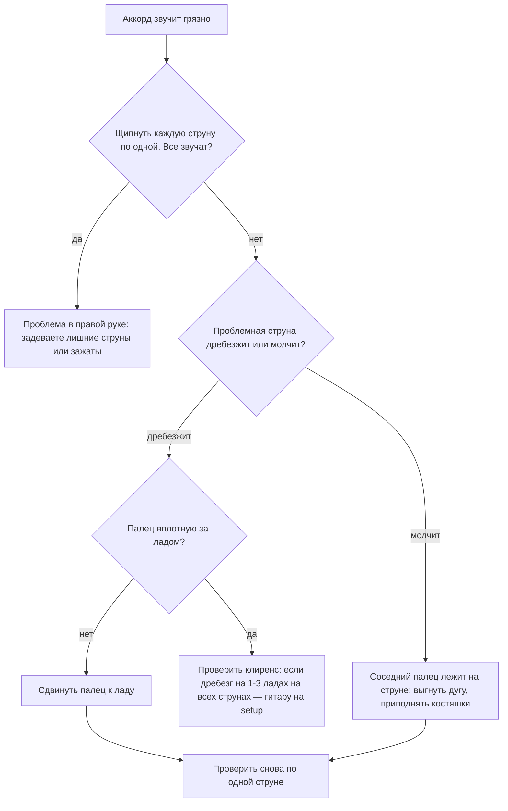

# Открытые аккорды, бой, TAB и первые песни

## Простыми словами

**Открытый аккорд (*open chord*)** — форма, в которой часть струн звучит открытыми,
без прижатия. Поэтому таких аккордов мало (их можно взять только около нулевого лада),
поэтому они лёгкие, и поэтому на них играется примерно вся песенная музыка.

Восемь форм ниже — это ваш словарь на первые месяцы. Восемь картинок, из которых
собираются тысячи песен. Что за ноты внутри этих аккордов и почему трезвучие звучит
мажорно или минорно — [`04-chords-and-harmony/theory.md`](../04-chords-and-harmony/theory.md);
здесь только «куда ставить пальцы и чем это лечится, когда дребезжит».

## Зачем именно такой порядок изучения

Порядок **Em → Am → E → A → D → G → C → Dm** выбран не по алфавиту и не по
популярности, а по трудности для руки:

1. **Em** — два пальца, соседние струны, играются все шесть струн. Самый лёгкий аккорд
   на гитаре, и он звучит «взросло» сразу.
2. **Am** — те же два пальца плюс один на 1-м ладу. Появляется навык «не глушить соседа».
3. **E** — это Am, сдвинутый на одну струну вниз (буквально та же геометрия). Один
   бесплатный аккорд, если Am уже стоит.
4. **A** — три пальца в один лад, впервые тесно.
5. **D** — треугольник, впервые «неудобная» форма и всего 4 звучащие струны.
6. **G** — растяжка через весь гриф, впервые далеко.
7. **C** — растяжка по диагонали, самый трудный из восьми для новичка.
8. **Dm** — как D, но с переносом пальца; закрывает базовый минор.

Такой порядок используют и **JustinGuitar** (Grade 1), и **Hal Leonard Guitar
Method** — не потому что «CAGED плохой», а потому что система CAGED про баррэ и
переносимые формы, а она понадобится только в модуле 07.

## Как устроено: восемь форм

Чтение схемы: колонки — струны от 6-й (толстая E) к 1-й (тонкая e). Ряд `o` — открытая
струна, `x` — не играем совсем, `.` — струна зажата ниже. Цифры 1–4 — номера пальцев
(1 = указательный, 4 = мизинец).

```text
     Em = E G B  (0 2 2 0 0 0)          Am = A C E  (x 0 2 2 1 0)
   E  A  D  G  B  E                   E  A  D  G  B  E
   o  .  .  o  o  o                   x  o  .  .  .  o
1  -  -  -  -  -  -                1  -  -  -  -  1  -
2  -  2  3  -  -  -                2  -  -  2  3  -  -
3  -  -  -  -  -  -                3  -  -  -  -  -  -
```

```text
     E = E G# B  (0 2 2 1 0 0)          A = A C# E  (x 0 2 2 2 0)
   E  A  D  G  B  E                   E  A  D  G  B  E
   o  .  .  .  o  o                   x  o  .  .  .  o
1  -  -  -  1  -  -                1  -  -  -  -  -  -
2  -  2  3  -  -  -                2  -  -  1  2  3  -
3  -  -  -  -  -  -                3  -  -  -  -  -  -
```

```text
     D = D F# A  (x x 0 2 3 2)          G = G B D  (3 2 0 0 0 3)
   E  A  D  G  B  E                   E  A  D  G  B  E
   x  x  o  .  .  .                   .  .  o  o  o  .
1  -  -  -  -  -  -                1  -  -  -  -  -  -
2  -  -  -  1  -  2                2  -  1  -  -  -  -
3  -  -  -  -  3  -                3  2  -  -  -  -  3
```

```text
     C = C E G  (x 3 2 0 1 0)           Dm = D F A  (x x 0 2 3 1)
   E  A  D  G  B  E                   E  A  D  G  B  E
   x  .  .  o  .  o                   x  x  o  .  .  .
1  -  -  -  -  1  -                1  -  -  -  -  -  1
2  -  -  2  -  -  -                2  -  -  -  2  -  -
3  -  3  -  -  -  -                3  -  -  -  -  3  -
```

Заметьте закономерности — они экономят месяцы:

- **Em и E** отличаются одним пальцем (1-й на 3-й струне, 1-й лад). E — это Em с терцией G#.
- **Am и E** — одна и та же форма, сдвинутая на одну струну.
- **D и Dm** отличаются одним пальцем на 1-й струне (F# → F).
- **Am и C** делят два пальца: 1-й на 2-й струне 1-го лада и 2-й на 4-й струне 2-го
  лада стоят в обоих. Это первые **опорные пальцы (*anchor fingers*)**.

## На гитаре пошагово: как ставить аккорд и как его менять

**Постановка (один раз для каждой новой формы, 2–3 минуты):**

1. Поставьте пальцы по схеме, не спеша, глядя на руку.
2. **Проверьте струну за струной**: щипните каждую по отдельности сверху вниз. Каждая
   звучащая струна должна звенеть чисто.
3. Нашли глухую или дребезжащую — не переставляйте всю руку, поправьте один палец.
4. Уберите руку с грифа полностью и поставьте аккорд заново. Повторите 5 раз.
5. Только после этого играйте аккорд боем.

**Смена аккордов** — главный навык модуля, и он решается не силой, а тремя приёмами.

**Приём 1: опорные пальцы (*anchor fingers*).** Если палец стоит в обоих аккордах на
том же месте — он не поднимается. Примеры:

```text
Am -> C   : палец 1 (2-я струна, 1-й лад) остаётся, палец 2 остаётся,
            двигается только палец 3 (с 3-й струны 2-й лад на 5-ю струну 3-й лад)
C  -> G   : нет общих пальцев, но общее движение вниз-влево — двигаем всю руку целиком
Em -> Am  : пальцы 2 и 3 сдвигаются на одну струну вверх, добавляется палец 1
D  -> Dm  : двигается только палец на 1-й струне
```

**Приём 2: минимум движения.** Пальцы поднимаются на 3–5 мм, а не «в воздух». Форма
собирается **до касания струн**: рука уже в воздухе принимает новую форму и опускается
целиком, а не строит аккорд по одному пальцу.

**Приём 3: «смена за минуту» (*one-minute changes*, приём из JustinGuitar).**
Ставите таймер на 60 секунд, берёте два аккорда и меняете их туда-обратно, считая
каждую **чистую** смену. Не играете песню, не играете бой — только смена. Записываете
число.

```text
день 1:  Em <-> Am    11 смен
день 3:  Em <-> Am    19 смен
день 7:  Em <-> Am    34 смены   <- цель для любой пары
```

Ориентиры: **20 смен в минуту** — можно играть медленную песню, **30–35** — можно
играть в темпе, **60** — уровень «не думаю об этом». Считаются только те смены, где
аккорд после постановки **звучит чисто**. Это единственное упражнение, которое стоит
делать каждый день без исключений.

## Как устроено: бой и ритм

Главная идея, из-за которой у 90 % новичков «не получается бой»: **рука не
останавливается**. Она качается непрерывно, как маятник метронома: вниз на счёт
(1, 2, 3, 4), вверх на «и» между ними. Пропуск удара — это не остановка руки, а
проход **мимо** струн. Как только рука начинает стартовать и тормозить под каждый
удар, ритм разваливается.

```text
Шаг 1. Только вниз, четвертями:

счёт:   1     2     3     4    | 1     2     3     4
рука:   v     v     v     v    | v     v     v     v
бой:    D     D     D     D    | D     D     D     D

Шаг 2. Маятник восьмыми (вниз-вверх на всё):

счёт:   1  &  2  &  3  &  4  &
рука:   v  ^  v  ^  v  ^  v  ^
бой:    D  U  D  U  D  U  D  U

Шаг 3. Паттерн D DU UDU («старый верный»):

счёт:   1  &  2  &  3  &  4  &
рука:   v  ^  v  ^  v  ^  v  ^
бой:    D  .  D  U  .  U  D  U
                ^     ^
             точка = рука движется, струн НЕ касается
```

Разберём `D DU UDU` вслух: «раз — два-и — (и) — четыре-и». Ключ к нему — что рука на
третьей доле идёт вниз **мимо струн**, поэтому получается характерный «провал»
в середине такта. Считайте вслух «1 и 2 и 3 и 4 и» всё время, пока играете. Не про
себя — вслух. Как только вы перестаёте считать, темп начинает плыть.

**Громкость и акценты.** Ровный бой звучит как швейная машинка. Оживляют его две вещи:
акцент на счёт 1 (чуть сильнее) и разная амплитуда — на «и» взмахи короче и задевают
только 2–3 тонкие струны, а не все шесть. Это происходит естественно, если рука
расслаблена, и никогда — если она зажата.

**Глушение (*muting*).** Два разных приёма:

- **Левой рукой**: чуть ослабить пальцы, не снимая их со струн, — звук обрывается,
  остаётся перкуссионный «чик». Так делается пауза в бою.
- **Правой рукой**: положить ребро ладони на струны у бриджа. Понадобится для
  power chords в модуле 07.

Дополнительно: в аккордах с `x` (A, Am, C, D, Dm) толстые струны глушатся мягкой
частью прижимающего пальца или большим пальцем, иначе бой сверху вниз захватит лишний
низ. У D и Dm 6-ю и 5-ю струны просто не задевают — бой начинается с 4-й.

## Как устроено: TAB, аккордовые схемы, ритмические палочки

Гитарная нотация без нотного стана — три формата, все три надо читать.

**TAB (табулатура).** Шесть линий = шесть струн, **верхняя линия — самая тонкая**
(1-я, e). Цифра на линии — номер лада. Ноль — открытая струна. Читается слева направо.

```text
e|-----------------------|
B|-----------------------|
G|-----------------------|
D|--0---2---3---2---0----|   пример: четыре ноты по 4-й струне: D E F E D
A|-----------------------|
E|-----------------------|
    1   2   3   4   1
```

Что TAB **не** передаёт: длительности нот. Поэтому TAB всегда слушается вместе с
записью. Обозначения поверх: `h` — hammer-on, `p` — pull-off, `/` и `\` — слайды,
`b` — бенд, `x` — заглушенная струна, `~` — вибрато.

**Аккордовая схема** — то, что вы уже читали выше: сетка `струны × лады` с номерами
пальцев. В песенных сборниках она часто заменена строкой чисел: `Am = x02210`.

**Ритмические палочки (*rhythm slashes*)** — запись «какой аккорд сколько тактов»:

```text
|| G    /  /  /  | C    /  /  /  | D    /  /  /  | G    /  /  /  ||
   ^ аккорд      ^ каждая палочка = одна четверть в этом же аккорде
```

Четыре палочки = такт 4/4, аккорд держится весь такт. Если в такте два аккорда, они
пишутся через два удара: `| G / C / |` значит по половине такта на каждый.

## На гитаре пошагово: первая песня

Алгоритм, который работает для любой песни:

1. **Найдите аккорды.** Реальный источник — **Ultimate Guitar** (ultimate-guitar.com),
   ищите версию с высоким рейтингом и пометкой Chords.
2. **Проверьте набор аккордов.** Если там есть баррэ (F, Bm, B) или экзотика
   (Cadd9, Dsus4) — либо ищите упрощённую версию, либо см. пункт «упрощение».
3. **Сыграйте прогрессию по одному удару вниз на такт.** Только смены, без ритма.
   Когда смены идут без запинок — добавьте четверти, потом паттерн.
4. **Играйте под метроном на 60–70 BPM**, даже если оригинал 120. Темп добавляется
   последним, всегда.
5. **Пойте или считайте вслух.** Если не можете считать, играя, — темп ещё высок.

**Настоящие песни на трёх-четырёх открытых аккордах.** Названы только те, в чьей
базовой схеме я уверен; всё остальное — «поищи табы на Ultimate Guitar».

| Песня | Аккорды | Замечание |
|---|---|---|
| «Knockin' on Heaven's Door» — Bob Dylan | G, D, Am и G, D, C | эталонная первая песня, медленная |
| «A Horse With No Name» — America | Em и D | два аккорда на всю песню |
| «Bad Moon Rising» — Creedence Clearwater Revival | D, A, G | быстрая, хороша под четверти |
| «Sweet Home Alabama» — Lynyrd Skynyrd | D, C, G | вступление сложное, аккомпанемент простой |
| «Zombie» — The Cranberries | Em, C, G, D | в оригинале последний аккорд D/F#, играйте D |

Любая песня на **G–C–D–Em** или **A–D–E** подойдёт: этих двух наборов хватает на
огромную часть поп- и рок-репертуара. Ищите по запросу «easy 3 chord songs» — списки
на Ultimate Guitar и JustinGuitar реальны и большие.

**Как упростить песню, если она пока не по силам:**

- Заменить сложный аккорд на его основу: `Cadd9 → C`, `Dsus4 → D`, `G7 → G`,
  `Em7 → Em`, `Amaj7 → A`.
- Заменить баррэ на что-то открытое рядом: `F → Fmaj7` (`xx3210`, только четыре
  тонкие струны) или поставить каподастр и играть в другой форме (модуль 07).
- Играть один удар вниз на такт вместо паттерна.
- Играть в темпе 70 % от оригинала и не извиняться.
- Выкинуть вступление и соло, играть только куплет и припев.

## На клавишах

Те же трезвучия на клавиатуре берутся тремя пальцами одной руки и не требуют месяца
на постановку — см. [`08-keyboard-foundations`](../08-keyboard-foundations/index.md);
зато на гитаре у вас сразу шесть голосов и бой.

## Послушай

- **Один аккорд, четыре характера.** Возьмите Em и сыграйте его: (1) одним ударом вниз,
  (2) четвертями, (3) паттерном `D DU UDU`, (4) заглушив левой рукой на счёт 3.
  Аккорд один, музыка разная — это и есть вклад ритма.
- **Считайте бой в знакомых песнях.** Включите любую песню в 4/4 и считайте «1 и 2 и
  3 и 4 и», пытаясь услышать, где гитара бьёт вниз, а где вверх. Через неделю такого
  слушания паттерны начинают распознаваться сами.
- **Сравните мажор и минор на грифе.** E и Em, A и Am, D и Dm — по одному пальцу
  разницы, а настроение противоположное. Это самая наглядная демонстрация того, что
  такое терция, из [`03-scales-and-intervals`](../03-scales-and-intervals/theory.md).

## Типичные ошибки

Дребезг и глухота — не одна проблема, а семь разных. Диагностика:

| Симптом | Причина | Лечение |
|---|---|---|
| Дребезжит одна конкретная струна | палец стоит в середине между ладами | сдвинуть палец вплотную к ладу со стороны корпуса |
| Струна звучит глухо, «мёртво» | прижимаете подушечкой, а не кончиком | встать на кончик, подстричь ногти, поднять костяшки |
| Струна не звучит вообще | её глушит мягкая часть соседнего пальца | выгнуть дугу, приподнять ладонь от грифа |
| При щипке чисто, при бое грязно | задеваете струну, помеченную `x` | глушить её большим пальцем или начинать бой ниже |
| Дребезг на всех струнах у 1–3 ладов | высокий клиренс или кривой анкер | это гитара, а не вы — на setup к мастеру |
| Нота обрывается на смене аккорда | палец соскальзывает, ногти длинные | ногти под ноль, больше площади кончика |
| Всё дребезжит после 15 минут игры | усталость и потеря формы кисти | пауза 5 минут, проверить угол грифа и запястье |



Прочие классические ошибки:

- **Давить изо всех сил.** Дребезг лечится точностью, а не силой. Регулярно проверяйте
  минимальное усилие.
- **Большой палец сверху грифа.** На аккордах он должен быть сзади, иначе пальцы не
  встают дугой.
- **Останавливать правую руку.** См. выше: рука — маятник.
- **Торопиться на смене.** Классика: аккорд взят, но следующий такт уже начался.
  Лечение — играть медленнее, чем хочется, и считать вслух.
- **Не считать вслух.** Практически всё, что «звучит неправильно», — это ритм.
- **Боль в кончиках пальцев как повод бросить.** Ноющая боль и вдавленные полоски
  первые 2–3 недели — норма, мозоли формируются. Не норма: острая боль в кисти,
  запястье или предплечье, онемение, боль в шее. Это про технику и позу — остановитесь
  и переставьте руку.
- **Заниматься 2 часа раз в неделю.** 15 минут каждый день дают радикально больше;
  для пальцев критична регулярность, а не объём.
- **Учить аккорд как картинку.** Проговаривайте ноты: «Am — это A, C, E».

## Словарь терминов

| Термин | Значение |
|---|---|
| Открытый аккорд (*open chord*) | форма у нулевого лада, часть струн звучит открытыми |
| Бой (*strumming*) | игра всеми струнами взмахами вниз/вверх |
| Удар вниз / вверх (*downstroke / upstroke*) | `D` и `U` в схемах боя |
| Опорный палец (*anchor finger*) | палец, не меняющий позицию между двумя аккордами |
| Смена за минуту (*one-minute changes*) | упражнение: считать чистые смены пары аккордов за 60 с |
| Глушение (*muting*) | обрыв звука ослаблением левой руки или ладонью правой |
| TAB (*tablature*) | запись «струна + лад», верхняя линия — тонкая струна |
| Ритмические палочки (*rhythm slashes*) | `/` — одна четверть в текущем аккорде |
| Hammer-on / pull-off | извлечение ноты ударом или срывом пальца левой руки |
| Мозоли (*calluses*) | затвердевшая кожа на кончиках, формируется 2–3 недели |

## См. также

- [`theory.md`](./theory.md) — инструмент, настройка, посадка, карта грифа.
- [`04-chords-and-harmony/theory.md`](../04-chords-and-harmony/theory.md) — из чего
  состоят трезвучия, римские цифры, прогрессии.
- [`01-sound-and-rhythm/theory.md`](../01-sound-and-rhythm/theory.md) — счёт, размер, метроном.
- [`07-guitar-scales-and-songs`](../07-guitar-scales-and-songs/index.md) — баррэ,
  каподастр, пентатоника, перебор.
- **JustinGuitar**, justinguitar.com — Grade 1: уроки на Em/Am/D/A/E, «one-minute
  changes», паттерн «old faithful» (`D DU UDU`).
- **Hal Leonard Guitar Method, Book 1** — открытые аккорды и чтение ритма.
- **Ultimate Guitar**, ultimate-guitar.com — табы и аккорды к песням.
- **Paul Davids** (YouTube) — разборы правой руки и звука боя.
