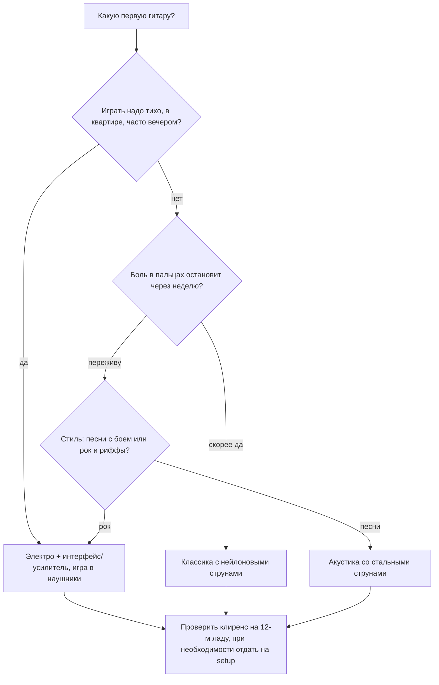

# Гитара: инструмент, настройка, руки, гриф

## Простыми словами

Гитара — это шесть натянутых струн разной толщины и планка с металлическими
порожками. Толстая струна звучит низко, тонкая — высоко. Прижимаешь струну к грифу
ближе к корпусу — звучащая часть становится короче, и нота становится выше. Один
порожек (лад) = один полутон. Вот и весь инструмент.

Аналогия для программиста: гриф — это шесть массивов, в каждом лежит одна и та же
последовательность из 12 нот, просто начинается с разного индекса. Струна E начинается
с E, струна A — с A. Прижать лад номер `n` = взять элемент со смещением `n` по
модулю 12. Дальше вся гитара — это адресация в этой таблице.

Про 12 нот и полутоны — [`02-notes-and-notation/theory.md`](../02-notes-and-notation/theory.md);
здесь мы только раскладываем ту же систему по грифу.

## Зачем разбираться в инструменте до игры

Три очень практичные причины, а не «положено».

**Первая: неудобная гитара убивает мотивацию быстрее, чем что угодно.** Если струны
стоят высоко над грифом (большой «клиренс», по-английски *action*), новичок давит
изо всех сил, палец болит, аккорд всё равно дребезжит, и через две недели гитара
уезжает в шкаф. Дешёвая гитара с хорошей настройкой (*setup*) играется легче, чем
дорогая без настройки.

**Вторая: расстроенная гитара ломает слух.** Вы будете час играть аккорды, которые
звучат неправильно, и мозг запомнит их как норму. Настройка — это 40 секунд перед
каждым занятием, всегда.

**Третья: понимание грифа отличает музыканта от нажимателя картинок.** Аккорд как
картинка из точек забывается и не переносится. Аккорд как «вот тут корень A, вот
терция C, вот квинта E» — переносится куда угодно и через год превращается в умение
подобрать песню на слух.

## Как устроено: выбор гитары

Три реальных варианта для первой гитары.

| Тип | Плюсы | Минусы | Кому |
|---|---|---|---|
| Акустика со стальными струнами (*steel-string acoustic*, дредноут) | громкая, «та самая» песенная гитара, ничего не нужно кроме гитары | жёсткие струны, больно первые 2–3 недели, широкий корпус | поп, рок, песни у костра |
| Классика с нейлоновыми струнами (*classical / nylon*) | мягкие струны, почти не больно, широкий гриф удобен для пальцев | тише, нет «бренчащего» стального звона, широкий гриф неудобен для баррэ | если боль в пальцах — реальный стоп-фактор |
| Электрогитара + маленький усилитель или интерфейс | самые лёгкие струны и низкий клиренс, тише всех без усилителя, точный звук | нужен усилитель/интерфейс и кабель (+ бюджет) | рок/метал/блюз, игра в наушники в квартире |

Если выбор непонятен, пройдите по решениям сверху вниз:



Что реально важно при выборе — по убыванию:

1. **Настройка (setup).** Клиренс на 12-м ладу: у акустики ориентир около 2–2.5 мм
   под 6-й струной, у электро 1.5–2 мм. Если больше — гитару можно и нужно отдать
   мастеру на настройку (регулировка анкера, подпиливание порожка, высота седла).
   Это стоит дешевле новых струн и меняет ощущения радикально.
2. **Мензура (*scale length*)** — длина звучащей части струны. Акустика обычно
   25.5" (648 мм), Fender-типа электро 25.5", Gibson-типа 24.75", есть «короткие»
   3/4 и travel-гитары. Короче мензура = мягче натяжение = легче зажимать.
3. **Ширина грифа у нулевого лада (*nut width*).** 43 мм — типичная акустика,
   52 мм — классика. Большая рука любит широкий гриф, маленькая — узкий.
4. **Бренд и красота — в самом конце.** Yamaha, Ibanez, Squier, Cort, Epiphone в
   бюджетном сегменте предсказуемо нормальны.

**Про бюджет.** Уровни примерно такие: «играть невозможно» (совсем безымянная фанера,
её видно по кривому грифу и струнам в сантиметре от лада), «нормальный старт» —
уровень Yamaha F310 / Squier Bootcamp-класса, «хорошо и надолго» — вдвое дороже.
Разница между первым и вторым уровнем принципиальна, между вторым и третьим — нет.
**Б/у — отличная идея**: гитара не изнашивается как автомобиль, а обесценивается сразу.
Проверьте при покупке: гриф не «пропеллер» (смотрите вдоль струн), нет трещин на
корпусе и у пятки грифа, лады не разной высоты, колки держат строй.

**Электро отдельно.** Нужен либо маленький усилитель (10–20 Вт достаточно для дома,
меньше — тоже), либо аудиоинтерфейс + компьютер: тогда усилитель эмулируется
программно и можно играть в наушники в любое время. Второй путь для программиста
обычно приятнее и дешевле.

**Обязательный минимум аксессуаров:**

- **Тюнер.** Приложение (GuitarTuna) бесплатно и достаточно; клипсовый тюнер удобнее
  в шумной комнате.
- **Медиаторы (*picks*)** — купите набор разной толщины. Для аккордов и боя тонкие
  0.46–0.73 мм, для одиночных нот и риффов средние 0.73–1.0 мм. Они теряются, берите 10.
- **Каподастр (*capo*)** — понадобится в модуле 07, но покупается сразу.
- **Ремень (*strap*)** — если планируете играть стоя.
- **Запасной комплект струн** — рано или поздно порвётся, обычно 1-я или 3-я.
- **Метроном** — приложение; тот же, что в [`01-sound-and-rhythm`](../01-sound-and-rhythm/theory.md).

Не нужны на старте: педали эффектов, дорогой кабель, подставка под ногу, самоучитель
на 400 страниц.

## Как устроено: струны и стандартный строй

Струны нумеруются **от тонкой к толстой**: 1-я — самая тонкая, 6-я — самая толстая.
Это контринтуитивно и постоянно путается, запомните сразу.

```text
номер:  6      5      4      3      2      1
нота:   E      A      D      G      B      E
        ^ толстая, низкая              ^ тонкая, высокая
        E2     A2     D3     G3     B3     E4      (октавы)
        40     45     50     55     59     64      (MIDI)
```

Мнемоники на порядок 6→1 «E A D G B E»:

- **E**ddie **A**te **D**ynamite, **G**ood **B**ye **E**ddie — классическая английская.
- По-русски удобнее «**Е**сли **А**ккорд **Д**авит — **Г**ни **Б**ольшим **Е**щё».
- Программисту хватает и просто «EADG» (как у бас-гитары, у неё эти четыре струны) плюс
  «BE» сверху.

Интервалы между соседними струнами (это важнее мнемоники): **кварта, кварта, кварта,
большая терция, кварта**. То есть 5, 5, 5, 4, 5 полутонов. Единственное исключение —
между 3-й (G) и 2-й (B) струнами: там 4 полутона, а не 5. Из этого «сдвига на один
лад» растут почти все неровности гитарных аппликатур.

**Почему строй такой.** Кварты дают удобную растяжку: в пределах четырёх ладов рука
достаёт больше двух октав. Терция между G и B нужна, чтобы открытые аккорды вообще
были возможны: без неё E и A не легли бы под пальцы. Строй — компромисс между
логичностью и удобством, и компромисс победил.

## На гитаре пошагово: настройка

**Способ 1 — приложением (основной).**

1. Откройте GuitarTuna (или любой хроматический тюнер), режим Standard / Chromatic.
2. Дёрните 6-ю струну открытой (не зажимая). Приложение покажет ноту и отклонение.
3. Крутите колок медленно, по четверти оборота, **всегда доводя строй снизу вверх**:
   если нота выше нужной, опустите заметно ниже и подтяните обратно. Так струна
   держится стабильнее.
4. Пройдите 6 → 1. Затем **пройдите второй раз**: подтяжка одной струны меняет
   натяжение грифа и слегка сбивает остальные.
5. Новые струны первую неделю уходят каждые 10 минут. Это нормально: тяните каждую
   струну рукой вверх на пару сантиметров, чтобы «сели», и настраивайте снова.

**Способ 2 — по 5-му ладу (проверка слухом).** Метод, который надо уметь, потому что
он тренирует слух и спасает без телефона.

```text
5-й лад 6-й струны  == открытая 5-я струна   (A)
5-й лад 5-й струны  == открытая 4-я струна   (D)
5-й лад 4-й струны  == открытая 3-я струна   (G)
4-й лад 3-й струны  == открытая 2-я струна   (B)   <- ИСКЛЮЧЕНИЕ: 4-й лад!
5-й лад 2-й струны  == открытая 1-я струна   (E)
```

Играете две ноты подряд (или вместе) и слушаете **биения** (*beating*) — пульсацию
громкости. Чем биения медленнее, тем ближе строй; когда они исчезли — струна в строю.
Исключение на паре G–B — это ровно та большая терция вместо кварты.

Обязательное условие: хотя бы одна струна должна быть настроена абсолютно верно
(по приложению, по пианино, по камертону A440). Иначе вы получите гитару, идеально
настроенную саму под себя, но не совпадающую ни с одной записью.

## На гитаре пошагово: посадка и руки

**Посадка.**

1. Стул без подлокотников, стопы на полу, спина прямая, но не «по-военному».
2. Корпус гитары лежит на правом бедре (для правши), выемка корпуса упирается в бедро.
3. **Гриф поднят вверх на 15–30°**, головка примерно на уровне вашего плеча. Плоско
   лежащий гриф заставляет выворачивать левое запястье — главная причина боли.
4. Правая рука лежит на корпусе предплечьем, не висит.
5. **Не наклоняйте голову, чтобы смотреть на струны сверху.** Хочется постоянно; из
   этого получается сгорбленная шея и привычка играть только глазами. Смотрите
   сбоку или, лучше, вовсе не смотрите.
6. Проверка: отпустите левую руку. Гитара должна остаться на месте сама. Если она
   съезжает — переставьте её, а не держите рукой.

**Левая рука (прижимающая, *fretting hand*).**

1. Прижимайте **кончиком пальца**, не подушечкой и не суставом. Ногти на левой руке
   коротко подстрижены — иначе физически не получится.
2. **Прямо за ладом**, а не в середине между ладами. Чем ближе к металлическому
   порожку (со стороны корпуса), тем меньше силы нужно и тем чище звук.
3. Пальцы **выгнуты дугой** (*arch*), костяшки приподняты. Плоский палец глушит
   соседние струны.
4. **Большой палец сзади грифа**, примерно напротив 1-го и 2-го пальцев, примерно
   по центру грифа по высоте. Не обхватывайте гриф «как рукоятку молотка» и не
   выводите большой палец сверху над грифом — на аккордах это блокирует дугу пальцев.
5. Давление — **минимально достаточное**. Найдите его так: зажмите ноту, извлеките,
   и медленно ослабляйте палец до момента, когда звук начал дребезжать. Точка чуть
   выше этой — ваше рабочее усилие. Обычно это в два раза меньше, чем вы давите сейчас.

**Правая рука (играющая, *picking hand*).**

1. **Хват медиатора:** медиатор лежит на боковой поверхности согнутого указательного
   пальца, сверху прижат большим. Наружу торчит 5–8 мм. Хват «как ручку» и
   «тремя пальцами» — не надо.
2. Держите **свободно**: медиатор должен вылетать, если сильно потянуть. Мёртвая
   хватка = зажатая рука = ускорение темпа и боль в кисти.
3. **Бой (*strumming*) идёт от локтя и запястья вместе**, а не от пальцев. Основное
   движение — плавное покачивание запястья, как будто вы стряхиваете с руки воду;
   локоть добавляет амплитуду на широких взмахах.
4. Медиатор скользит **под небольшим углом**, не втыкается перпендикулярно в струны.
5. Рука **не останавливается** между ударами: она качается непрерывно, как маятник, а
   струны задеваются только в нужные моменты. Это самая важная идея боя, и о ней
   подробно в [`theory-2-chords-and-strumming.md`](./theory-2-chords-and-strumming.md).

## Как устроено: карта грифа

Ключевой факт: **один лад = один полутон**. 12 ладов = октава. Точка на 12-м ладу
не украшение: это та же нота, что открытая струна, только выше на октаву. Дальше
рисунок повторяется (13-й лад = 1-й, 14-й = 2-й и так далее).

```text
        0    1    2    3    4    5    6    7    8    9   10   11   12
E(1) |  E   F   F#   G   G#   A   A#   B   C   C#   D   D#   E
B(2) |  B   C   C#   D   D#   E   F   F#   G   G#   A   A#   B
G(3) |  G   G#   A   A#   B   C   C#   D   D#   E   F   F#   G
D(4) |  D   D#   E   F   F#   G   G#   A   A#   B   C   C#   D
A(5) |  A   A#   B   C   C#   D   D#   E   F   F#   G   G#   A
E(6) |  E   F   F#   G   G#   A   A#   B   C   C#   D   D#   E
        ^маркеры на 3, 5, 7, 9, 12 ладах
```

Обратите внимание на два «естественных полутона»: **E→F** и **B→C** идут через один
лад, без чёрной клавиши между ними. Именно поэтому на 1-м ладу 6-й струны сразу F, а
на 1-м ладу 2-й струны сразу C. Это тот же факт, что «между E и F нет чёрной клавиши»
из [`02-notes-and-notation`](../02-notes-and-notation/theory.md).

**Как искать ноту, не заучивая таблицу.** Три опорных приёма:

```text
1) Октава через 2 струны и 2 лада (для струн 6-5-4-3):
   6-я струна, 3-й лад = G  ->  4-я струна, 5-й лад = G
   E(6) |--3--|            D(4) |--5--|

2) Октава на 12 ладов по той же струне:
   5-я струна, 0 = A  ->  5-я струна, 12-й лад = A

3) Унисон через 5 ладов (кроме пары G-B, там 4):
   6-я струна, 5-й лад = A  ==  5-я струна, 0 = A
```

Практический алгоритм: запомните **наизусть только 6-ю и 5-ю струны** до 12-го лада
(это два массива по 12 элементов), а всё остальное вычисляйте октавным сдвигом. Через
неделю ежедневных 3 минут это уже автоматизм.

## На клавишах

Тот же гриф в один ряд: на клавиатуре нота — это одна конкретная клавиша, а на
гитаре одна и та же нота живёт в 3–5 местах; подробно в
[`08-keyboard-foundations`](../08-keyboard-foundations/index.md).

## Послушай

Сравните на слух три вещи (это тренирует именно то, что нужно на этой стадии):

- **Расстроенная и настроенная гитара.** Расстройте 3-ю струну на четверть тона,
  сыграйте открытые струны подряд, потом настройте и сыграйте снова. Запомните, как
  звучит «плывущая» нота, — это те самые биения.
- **Нейлон против стали.** В любом магазине или на записях классической гитары
  (например, любая запись Andrés Segovia) против акустики со сталью. Разница в
  атаке и «звоне» сразу слышна.
- **Одна и та же нота на разных струнах.** Возьмите A на 5-й струне открытой и A на
  6-й струне 5-м ладу. Высота та же, тембр разный: толстая струна звучит плотнее.
  Это ответ на вопрос «зачем нужны дубли нот на грифе».

Демонстрационных примеров про настройку и посадку много у **Paul Davids** и в
бесплатном курсе **JustinGuitar** (Grade 1, модуль 0–1); конкретные номера видео не
привожу, чтобы не соврать — ищите по названию урока.

## Типичные ошибки

- **Играть на ненастроенной гитаре.** Тюнер включается раньше, чем звучит первая нота.
- **Высокий клиренс терпеть как должное.** Если после недели палец не может прижать
  1-ю струну на 1-м ладу — это вопрос к гитаре, а не к пальцу.
- **Плоско лежащий гриф.** Ведёт к вывернутому запястью и боли; поднимите головку на 15–30°.
- **Большой палец сверху грифа.** На одиночных нотах допустимо, на аккордах убивает дугу.
- **Прижимать в середине лада.** Вдвое больше силы за худший звук.
- **Давить изо всех сил.** Проверяйте минимальное усилие раз в неделю, привычка «жать»
  возвращается.
- **Смотреть сверху, свесив голову.** Через месяц болит шея, а пальцы всё равно не
  знают дороги.
- **Длинные ногти на левой руке.** Физически мешают, никакая техника не спасёт.
- **Учить гриф целиком за один вечер.** Учите 6-ю и 5-ю струны, остальное — октавами.
- **Настроить гитару относительно самой себя.** Как минимум одна струна должна быть
  выставлена по эталону.

## Словарь терминов

| Термин | Значение |
|---|---|
| Лад (*fret*) | металлический порожек; также промежуток между порожками. Один лад = полутон |
| Открытая струна (*open string*) | струна, играемая без прижатия |
| Клиренс / высота струн (*action*) | зазор между струной и ладом; чем меньше, тем легче играть |
| Настройка инструмента (*setup*) | регулировка анкера, седла, нижнего порожка мастером |
| Мензура (*scale length*) | длина звучащей части струны от нулевого порожка до седла |
| Нулевой порожок (*nut*) | верхний порожок у головки грифа |
| Седло / бридж (*bridge, saddle*) | место крепления струн на корпусе |
| Колок (*tuning peg / machine head*) | механизм натяжения струны |
| Медиатор (*pick, plectrum*) | пластинка для игры |
| Бой (*strumming*) | игра аккордов взмахами по всем струнам |
| Перебор (*fingerpicking*) | игра струн по отдельности пальцами |
| Биения (*beating*) | пульсация громкости у двух почти совпадающих нот |
| Стандартный строй (*standard tuning*) | E A D G B E от 6-й струны к 1-й |
| Каподастр (*capo*) | зажим, переносящий «нулевой лад» выше |

## См. также

- [`02-notes-and-notation/theory.md`](../02-notes-and-notation/theory.md) — 12 нот,
  октавы, MIDI-номера, чтение TAB.
- [`01-sound-and-rhythm/theory.md`](../01-sound-and-rhythm/theory.md) — счёт и метроном.
- [`theory-2-chords-and-strumming.md`](./theory-2-chords-and-strumming.md) — аккорды и бой.
- **JustinGuitar**, justinguitar.com — Grade 1, начальные модули (выбор гитары,
  настройка, посадка). Бесплатно, лучший систематический старт.
- **Hal Leonard Guitar Method, Book 1** (Will Schmid & Greg Koch) — классический
  печатный метод, первые главы про строй и посадку.
- **Paul Davids** (YouTube) — разборы техники и звука, много про посадку и правую руку.
- **GuitarTuna** — тюнер и метроном в одном приложении.
