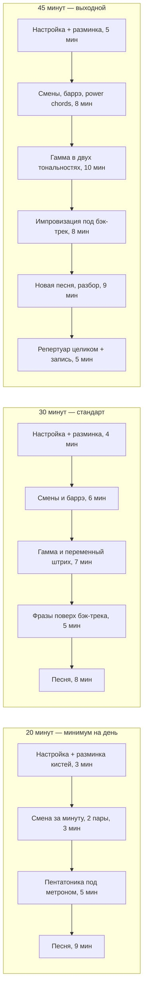

# Баррэ, power chords, каподастр, перебор и рутина

## Простыми словами

**Баррэ (*barre*)** — приём, когда один палец прижимает сразу несколько струн, работая
как искусственный нулевой порожок. Смысл ровно один: если открытый аккорд превратить в
форму, где нет открытых струн, эту форму можно **сдвигать по грифу** и получать все 12
тональностей одной аппликатурой.

**Каподастр (*capo*)** делает то же самое механически: зажимает все струны на выбранном
ладу, и открытые аккорды играются как обычно, но звучат выше.

**Перебор (*fingerpicking*)** — игра струн по отдельности пальцами вместо боя
медиатором. Большой палец занимается басом, остальные — верхними голосами.

Три инструмента, которые снимают три разных ограничения: баррэ снимает ограничение по
тональностям, каподастр — по удобству, перебор — по фактуре.

## Зачем это нужно, если открытых аккордов хватает

Не хватает. Три конкретных стены, в которые упирается репертуар на открытых аккордах:

1. **Тональности.** Песня в F, B♭, E♭ или Bm на открытых аккордах не играется. А это
   тональности, в которых поют примерно все, у кого голос не совпал с G-мажором.
2. **Плотность.** Power chord с глушением ладонью — это весь рок и метал; открытым
   аккордом такого звука не получить в принципе.
3. **Фактура.** Бой — один способ. Перебор, арпеджио и шаффл — ещё три, и без них весь
   репертуар звучит одинаково.

Каподастр в этом списке отдельно: он не заменяет баррэ, а решает другую задачу —
сохранить **звучание** открытых аккордов (с открытыми струнами, звонкими) в другой
тональности. Баррэ звучит плотнее и глуше; это не хуже, это другое.

## Как устроено: баррэ E-формы и A-формы

**E-форма.** Берём открытый E, переставляем пальцы так, чтобы указательный
освободился, и его роль (открытые струны) отдаём баррэ. Корень — на **6-й струне**.

```text
   F = E-форма баррэ на 1-м ладу  (1 3 3 2 1 1)
      E  A  D  G  B  E
   1  1  1  1  -  1  1     <- палец 1 плашмя через все шесть струн
   2  -  -  -  2  -  -
   3  -  3  4  -  -  -

   Fm = Em-форма баррэ на 1-м ладу  (1 3 3 1 1 1)
      E  A  D  G  B  E
   1  1  1  1  1  1  1
   2  -  -  -  -  -  -
   3  -  3  4  -  -  -
```

Минорное баррэ **легче** мажорного: пальца задействовано меньше. Начинать стоит с него.

**A-форма.** Корень — на **5-й струне**, 6-я не играется.

```text
   B = A-форма баррэ на 2-м ладу  (x 2 4 4 4 2)
      E  A  D  G  B  E
   2  x  1  -  -  -  1     <- баррэ пальцем 1 со 5-й струны
   3  -  -  -  -  -  -
   4  -  -  2  3  4  -     (можно и одним пальцем 3 плашмя)

   Bm = Am-форма баррэ на 2-м ладу  (x 2 4 4 3 2)
      E  A  D  G  B  E
   2  x  1  -  -  -  1
   3  -  -  -  -  2  -
   4  -  -  3  4  -  -
```

Две формы плюс знание нот на 6-й и 5-й струнах = все мажорные и минорные аккорды:

| Аккорд | E-форма (корень на 6-й струне) | A-форма (корень на 5-й струне) |
|---|---|---|
| F / Fm | 1-й лад | 8-й лад |
| G / Gm | 3-й лад | 10-й лад |
| A / Am | 5-й лад | открытый или 12-й лад |
| B / Bm | 7-й лад | 2-й лад |
| C / Cm | 8-й лад | 3-й лад |
| D / Dm | 10-й лад | 5-й лад |
| E / Em | 12-й лад | 7-й лад |

Практическое правило: до 5-го лада удобнее E-форма, выше 5-го — часто A-форма, потому
что она не требует растяжки в узкой части грифа.

## На гитаре пошагово: как построить баррэ

Баррэ болит и не звучит по трём причинам: сила прижатия недостаточна, палец лежит
неправильно, и локоть не помогает. Разбираем по шагам.

1. **Палец 1 кладётся не плоско, а чуть на бок** — на внешнее ребро, ближе к большому
   пальцу. Плоская подушечка мягкая, и струны провалятся в складки между суставами.
2. **Прижимайте вплотную к ладу**, как обычный палец. В середине лада баррэ не
   работает вообще.
3. **Кончик пальца выходит за 6-ю струну** на пару миллиметров. Если он не достаёт,
   аккорд не выйдет никогда.
4. **Большой палец сзади грифа**, примерно напротив пальца 1. Не сверху.
5. **Тяните локтем.** Правильное баррэ — это не сила кисти, а лёгкое движение локтя
   вперёд-вниз: рука повисает на грифе, и вес делает половину работы. Пока вы жмёте
   только кистью, будет больно и не будет звучать.
6. **Складка между 2-м и 3-м суставом попадает на струну?** Сдвиньте палец на
   полсантиметра вдоль струны — найдётся положение, где ни одна складка не мешает.

**Строим силу постепенно** — за неделю баррэ не появится, за 3–4 недели появится:

```text
неделя 1: частичное баррэ — палец 1 прижимает только 2 тонкие струны
          Fmaj7 = xx3210 (баррэ не нужно, звучит почти как F)
          F-lite = xx3211 (баррэ на двух струнах)
неделя 2: баррэ на 3 струны + минорная E-форма (Fm) на 5-м ладу,
          где струны мягче, а не на 1-м, где натяжение максимально
неделя 3: Fm на 3-м, потом на 1-м ладу; проверка каждой струны по одной
неделя 4: F мажор; смена F <-> C и F <-> G по 60 секунд
```

Важно: начинайте не с 1-го лада. Там самое высокое натяжение и самый широкий гриф.
Ставьте баррэ на 5–7-м ладу, где физически легче, и спускайтесь вниз по мере
готовности. И **проверяйте каждую струну по отдельности** — иначе вы месяц будете
играть аккорд, в котором молчат две струны.

## Как устроено: power chords и глушение ладонью

**Power chord** — не полноценный аккорд, а два звука: **корень и квинта** (плюс
удвоение корня октавой). Терции нет, поэтому он ни мажорный, ни минорный — отсюда его
универсальность и обозначение `G5`, `E5`, `A5`.

```text
   G5 (6-я струна, 3-й лад)        A5 (5-я струна, открытая)
      E  A  D                         A  D  G
   3  1  -  -   G   корень         0  A  -  -   A   корень
   5  -  3  4   D+G квинта+октава  2  -  3  4   E+A квинта+октава
```

Форма переносимая: палец 1 на корне, пальцы 3 и 4 на две струны выше и на два лада
дальше. Играются только эти 2–3 струны, остальные глушатся.

**Глушение ладонью (*palm muting*)** — ребро ладони правой руки лежит на струнах
у бриджа. Звук становится коротким и перкуссионным, «чуф-чуф-чуф» вместо «зззз».
Регулируется давлением: чуть тронуть — звук приглушён, надавить — почти пропадает.
Это половина всего рок-звучания.

Рифы из power chords читаются в TAB как аккорды-двойки:

```text
e|--------------------|
B|--------------------|
G|--------------------|
D|--5--5--7--7--5-----|
A|--5--5--7--7--5-----|   A5  A5  B5  B5  A5
E|--3--3--5--5--3-----|
```

## Как устроено: каподастр и транспонирование

Каподастр зажимает все струны на ладу `n` и превращает его в новый нулевой лад. Всё,
что вы играете, звучит **на `n` полутонов выше**. Формы пальцев не меняются, названия
аккордов — меняются.

| Каподастр | форма G → | форма C → | форма D → | форма Em → | форма Am → |
|---|---|---|---|---|---|
| 1-й лад | A♭ | D♭ | E♭ | Fm | B♭m |
| 2-й лад | A | D | E | F♯m | Bm |
| 3-й лад | B♭ | E♭ | F | Gm | Cm |
| 4-й лад | B | E | F♯ | G♯m | C♯m |
| 5-й лад | C | F | G | Am | Dm |
| 7-й лад | D | G | A | Bm | Em |

Арифметика простая: **звучащий аккорд = форма + n полутонов**. Каподастр на 5-м ладу,
играете форму G — звучит C, потому что от G до C пять полутонов.

Два практических сценария:

- **Песня не в вашем голосе.** Она в G, вам нужно на тон выше — каподастр на 2-й лад,
  играете те же формы, звучит в A.
- **Песня в неудобной тональности.** Схема требует B♭, E♭, Cm — три баррэ. Ставите
  каподастр на 3-й лад и играете G, C, Am. Та же музыка, открытыми аккордами.

**Как читать пометки.** В табах и сборниках пишут `Capo 2`, `Capo on 2nd fret` или
«каподастр на 2-м ладу». После этого **все номера ладов считаются от каподастра**:
«0» — это струна, зажатая каподастром, «3» — три лада выше него. Часто добавляют
пометку вида «звучит в E» или «actual key: E» — это реальная тональность записи.
Классический пример осознанного каподастра — «Wonderwall» группы Oasis, которая
играется с каподастром на 2-м ладу; конкретную схему проверьте по табам.

**Технические мелочи, из-за которых каподастр «фальшивит»:**

- Ставить **сразу за ладом**, а не в середине; иначе строй уезжает вверх.
- Не пережимать: слишком сильный зажим тянет струны и повышает их.
- **Настраивать после установки**, а не до. И перепроверять при переносе.
- Дешёвый каподастр с неравномерным нажимом даёт дребезг на 1-й или 6-й струне —
  это не ваша техника, это железка.

## На гитаре пошагово: перебор и фингерстайл

Правая рука без медиатора. Испанские обозначения пальцев (они же в любом самоучителе):

```text
   p  (pulgar,  большой)   -> басовые струны 6, 5, 4
   i  (indice,  указательный) -> 3-я струна
   m  (medio,   средний)   -> 2-я струна
   a  (anular,  безымянный) -> 1-я струна
```

Правило распределения: каждый палец отвечает за свою струну и **не бегает** по грифу.
Кисть при этом висит спокойно, не опирается на струны, предплечье лежит на корпусе.

**Шаг 1: арпеджио.** Возьмите Am и играйте по одной струне: `p i m a m i` — то есть
5-я, 3-я, 2-я, 1-я, 2-я, 3-я. Шесть нот на такт — это готовый рисунок в 6/8. То же на
Dm (басом 4-я струна) и E (басом 6-я). Метроном 60 BPM, по восьмой на щелчок.

**Шаг 2: бас на счёт.** Большой палец играет корень аккорда на каждую сильную долю
(1 и 3), пальцы i-m берут пару верхних струн на 2 и 4. Это простейший аккомпанемент,
которым можно сыграть любую песню.

**Шаг 3: паттерн в стиле Трэвиса (*Travis picking*).** Смысл — **чередующийся бас**:
большой палец переключается между двумя басовыми струнами, создавая непрерывную
пульсацию, а пальцы вставляют верхние ноты между ударами баса.

```text
   C, упрощённый Трэвис
   счёт:    1      &      2      &      3      &      4      &
   p (бас)  5-я    -      4-я    -      5-я    -      4-я    -
   i (3-я)  -      x      -      -      -      x      -      -
   m (2-я)  -      -      -      x      -      -      -      x
```

Учить так: **сначала только большой палец** (бас 5–4–5–4 на четверти, два такта),
пока он не идёт автоматически, и только потом добавлять i и m. Пытаться сразу играть
целиком — верный способ застрять на неделю.

## Как устроено: ритмические варианты

Бой `D DU UDU` — не единственный рисунок. Три, которые расширяют репертуар сильнее
всего:

```text
1) 6/8 (баллада, вальсовое ощущение шести восьмых):
   счёт:  1   2   3   4   5   6
   бой:   D       U   D       U

2) Шаффл (shuffle, «ломаные» восьмые: длинная-короткая):
   счёт:  1   -   a   2   -   a   3   -   a   4   -   a
   бой:   D       U   D       U   D       U   D       U
   ощущение «та-ти та-ти», основа блюза; ровные восьмые тут звучат неправильно

3) Перкуссионный бой (глушение левой рукой на слабые доли):
   счёт:  1   &   2   &   3   &   4   &
   бой:   D   U   x   U   D   U   x   U
   x = ослабить пальцы левой руки, не снимая со струн: сухой «чик»
```

Шаффл — это то же деление на три из [`01-sound-and-rhythm`](../01-sound-and-rhythm/theory.md):
восьмые не ровные, а первая и третья доли триоли. Просчитайте вслух «раз-и-а
два-и-а», играя только на «раз» и «а», — получите шаффл.

## Как устроено: рутина и репертуар

Занятие без структуры превращается в «поиграл то, что уже умею». Каркас всегда один:
**разминка → смены → гамма → песня**. Меняются только пропорции.



Три правила поверх шаблона:

- **Таймер обязателен.** Без него 80 % времени уходит на любимую песню.
- **Новое — в начале**, когда голова свежая. Репертуар — в конец, как награда.
- **Запись раз в неделю** в `misc/`. Прогресс слышен на записи, а не в моменте.

**Репертуар** — отдельная сущность, и её надо вести списком: 3–5 песен, которые вы
играете **целиком, от начала до конца, без остановок**. Не «знаю аккорды», а «могу
сыграть». Список растёт медленно и это нормально: одна новая песня в 2–3 недели — это
20 песен в год.

**Как разучивать песню по слуху и по табам** — рабочий порядок:

1. Прослушать целиком и определить размер и темп (постучать, поймать BPM тюнером
   или приложением).
2. Найти тональность: попробовать басовую ноту первого аккорда на 6-й или 5-й струне.
   Первый и последний аккорды почти всегда тоника.
3. Взять табы с Ultimate Guitar как **гипотезу**, а не истину: версии пользовательские
   и часто с ошибками. Сверить со слухом.
4. Разбить на секции (вступление, куплет, припев) и разучивать по одной, в петле.
5. Собрать под метроном на 70 % темпа, потом поднять.

## На клавишах

То же транспонирование на клавишах делается кнопкой Transpose или сдвигом руки на
`n` клавиш — см. [`09-keyboard-chords-and-songs`](../09-keyboard-chords-and-songs/index.md).

## Послушай

- **Баррэ против открытого.** Сыграйте A открытым (`x02220`) и A баррэ E-формой на
  5-м ладу. Первый звонче за счёт открытых струн, второй плотнее и ровнее. Выбор
  между ними — художественный.
- **Каподастр против транспонирования баррэ.** Сыграйте прогрессию C–G–Am–F сначала
  через баррэ, потом с каподастром на 3-м ладу формами A–E–F♯m–D. Звучат в разных
  тональностях, но разница в **характере** слышна сразу.
- **Power chord с глушением и без.** Один и тот же риф: сначала открыто, потом с
  ладонью на струнах у бриджа. Второй вариант — это то, что вы слышали всю жизнь в
  рок-музыке.
- **Шаффл против ровных восьмых.** Сыграйте один и тот же бой ровно и «ломано» под
  блюзовый бэк-трек. Ровный вариант мгновенно звучит неуместно — это и есть свинг.

## Типичные ошибки

- **Учить бокс, не зная корня.** Форма без корня непереносима и не даёт подбирать по
  слуху. Проговаривайте ноты вслух.
- **Баррэ дребезжит, а вы давите сильнее.** Почти всегда дело в трёх вещах: палец
  плоско лежит вместо ребра, стоит не вплотную к ладу, или складка сустава попала на
  струну. Проверьте это, прежде чем добавлять силу.
- **Начинать баррэ с 1-го лада.** Там максимальное натяжение. Начинайте с 5–7-го.
- **Форсировать баррэ через боль.** 5 минут в день на протяжении месяца, а не 40 минут
  за один вечер. Резкая боль в кисти или предплечье — стоп.
- **Каподастр в середине лада или пережатый.** Гитара будет фальшивить, и вы будете
  винить себя. Ставьте вплотную к ладу и **настраивайтесь после установки**.
- **Забыть, что лады в табах считаются от каподастра.** Классический источник
  «почему-то не похоже».
- **Играть всё в одном темпе.** Одна и та же песня должна уметь звучать на 60 и на
  100 BPM. Один темп = ритм не выучен, а заучен.
- **Играть непрерывно при импровизации.** Такт играешь — такт молчишь.
- **Учить перебор целиком сразу.** Сначала только большой палец, потом верхние голоса.
- **Не менять струны.** Тусклые струны демотивируют больше, чем кажется.

## Уход за инструментом

- **Струны.** Меняются, когда звук стал тусклым, струна на ощупь шершавая или потемнела
  — при ежедневной игре это раз в 1–3 месяца. Меняйте **все сразу**, тяните каждую
  новую струну рукой, чтобы она села, и настраивайте несколько раз в первые дни.
  Лишние концы у колков откусите, они колючие.
- **Чистка.** Протирайте струны сухой тряпкой после каждой игры — это удваивает их
  срок. Гриф из палисандра/венге раз в 6–12 месяцев (при смене струн) протирают
  специальным маслом для грифов; клён с лаком просто вытирают насухо.
- **Влажность (для акустики).** Дерево живое. Комфорт — **40–55 %** относительной
  влажности. Зимой рядом с радиатором воздух суше, и корпус может треснуть или
  «просесть». Решения: держать гитару в чехле, поставить увлажнитель в комнате или
  использовать увлажнитель для розетки гитары. Электрогитаре с болченым грифом это
  почти безразлично, акустике — нет.
- **Хранение.** На стойке или в чехле, не у окна, не у радиатора, не в багажнике.

## Словарь терминов

| Термин | Значение |
|---|---|
| Баррэ (*barre*) | прижатие нескольких струн одним пальцем как искусственный порожок |
| E-форма / A-форма | баррэ-аккорды с корнем на 6-й и на 5-й струне соответственно |
| Частичное баррэ (*partial barre*) | баррэ на 2–3 струны; этап на пути к полному |
| Power chord | корень + квинта (+ октава), без терции; обозначается `G5`, `A5` |
| Глушение ладонью (*palm muting*) | ребро правой ладони на струнах у бриджа |
| Каподастр (*capo*) | зажим, переносящий нулевой лад; повышает всё на `n` полутонов |
| Транспонирование | перенос музыки в другую тональность на `n` полутонов |
| p i m a | большой, указательный, средний, безымянный пальцы правой руки |
| Арпеджио (*arpeggio*) | аккорд, сыгранный по одной ноте |
| Трэвис-пикинг (*Travis picking*) | перебор с чередующимся басом большого пальца |
| Шаффл (*shuffle*) | неровные восьмые с триольным ощущением; основа блюза |
| Репертуар | список песен, которые играются целиком без остановок |

## См. также

- [`theory.md`](./theory.md) — пентатоника, мажорная гамма, переменный штрих.
- [`06-guitar-foundations/theory-2-chords-and-strumming.md`](../06-guitar-foundations/theory-2-chords-and-strumming.md)
  — открытые аккорды и базовый бой.
- [`01-sound-and-rhythm/theory.md`](../01-sound-and-rhythm/theory.md) — деление на три,
  из которого берётся шаффл и 6/8.
- [`05-ear-training-and-practice/theory.md`](../05-ear-training-and-practice/theory.md)
  — методика занятий и подбор по слуху.
- **JustinGuitar**, justinguitar.com — Grade 2: F-баррэ по шагам, power chords,
  каподастр; Grade 3: фингерстайл и Travis picking.
- **Hal Leonard Guitar Method, Book 2** — баррэ-аккорды и позиционная игра.
- **Paul Davids** (YouTube) — техника баррэ и правой руки, разборы звука.
- **Ultimate Guitar**, ultimate-guitar.com — табы, пометки `Capo N`.
- **GuitarTuna** — тюнер и метроном; настраивайтесь после установки каподастра.
