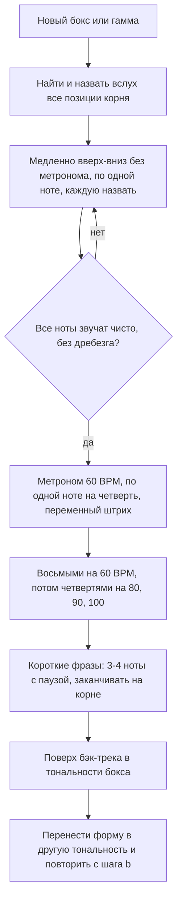

# Пентатоника, мажорная гамма и переменный штрих

## Простыми словами

**Пентатоника** — гамма из пяти нот вместо семи. Из мажорной гаммы выбросили две самые
«капризные» ступени, и осталось то, что звучит хорошо почти над любым аккордом внутри
тональности. Отсюда её роль: это первая гамма, на которой можно импровизировать, не
зная теории.

На гитаре пентатоника живёт в виде **боксов (*box*, позиция)** — компактных фигур на
четырёх ладах, которые целиком берутся одной позицией руки. Бокс 1 минорной
пентатоники — самая используемая фигура на инструменте вообще: на ней стоит блюз,
рок-соло, гитарные рифы и половина всего, что вы когда-либо подпевали гитаристу.

Что такое гамма и интервал в полутонах — [`03-scales-and-intervals/theory.md`](../03-scales-and-intervals/theory.md);
здесь мы только выкладываем эти формулы на гриф.

## Зачем гаммы гитаристу, который играет песни

Честный ответ: не для того, чтобы «гонять гаммы». А для трёх конкретных вещей.

**Первое: мелодия и рифы.** Аккорды дают аккомпанемент. Всё, что звучит поверх, —
вокальная линия, вступление, соло, риф — сделано из гаммы. Не зная гамму, вы можете
только скопировать TAB и не можете придумать ни одной фразы.

**Второе: подбор по слуху.** Когда вы знаете, что песня в A-миноре, и знаете бокс
A-минорной пентатоники, поиск мелодии сужается с 22 ладов × 6 струн до пяти нот в
одной позиции. Разница между «искать наощупь час» и «найти за минуту».

**Третье: техника.** Гамма под метроном — это единственный способ поставить ровный
переменный штрих и синхронизировать руки. Аккорды этому не учат.

Чего гаммы **не** дают: музыкальности. Бокс, проигранный вверх-вниз шестнадцатыми,
звучит как упражнение, потому что он и есть упражнение. Музыка получается, когда из
бокса делают короткие фразы с паузами.

## Как устроено: минорная пентатоника, бокс 1

Формула минорной пентатоники: **1, ♭3, 4, 5, ♭7**. В A: **A, C, D, E, G**.

```text
   A-минорная пентатоника, бокс 1 (A C D E G)
   лад:      5     6     7     8
   1 e |     A     .     .     C
   2 B |     E     .     .     G
   3 G |     C     .     D     .
   4 D |     G     .     A     .
   5 A |     D     .     E     .
   6 E |    (A)    .     .     C        (A) = корень, 6-я струна, 5-й лад
```

Пальцы: **палец 1 → 5-й лад**, **палец 3 → 7-й лад**, **палец 4 → 8-й лад**.
Рука стоит в позиции и не ездит; двигаются только пальцы.

Форма в цифрах ладов (её и запоминают): `5-8 / 5-7 / 5-7 / 5-7 / 5-8 / 5-8` от 6-й
струны к 1-й. Обратите внимание на симметрию: две крайние пары струн дают 5–8, три
средние — 5–7. Это ровно тот сдвиг на паре G–B, о котором шла речь в
[`06-guitar-foundations/theory.md`](../06-guitar-foundations/theory.md).

**Где корень.** Три позиции корня A в этом боксе: 6-я струна 5-й лад, 4-я струна 7-й
лад, 1-я струна 5-й лад. Знать их обязательно: фраза, законченная на корне, звучит
завершённо, фраза, брошенная на случайной ноте, — как обрыв.

**Как перенести в любую тональность.** Бокс привязан к корню на 6-й струне. Хотите
E-минорную пентатонику — поставьте палец 1 туда, где на 6-й струне E: 12-й лад (или
открытая позиция, лады 0–3). Хотите G — 3-й лад. Хотите C — 8-й лад.

| Тональность (минор) | Корень на 6-й струне | Бокс 1 занимает лады |
|---|---|---|
| E | 0 (открытая) или 12 | 0–3 или 12–15 |
| F | 1 | 1–4 |
| G | 3 | 3–6 |
| A | 5 | 5–8 |
| B | 7 | 7–10 |
| C | 8 | 8–11 |
| D | 10 | 10–13 |

Одна форма плюс знание 6-й струны = пентатоника во всех двенадцати тональностях. Это
и есть главная выгода гитары как инструмента: транспонирование бесплатно.

## Как устроено: мажорная пентатоника и блюзовая нота

**Мажорная пентатоника**: формула **1, 2, 3, 5, 6**. В C: C, D, E, G, A. Сравните с
A-минорной пентатоникой — A, C, D, E, G. **Те же пять нот.** Мажорная и минорная
пентатоники параллельных тональностей — это одна гамма с разным корнем, ровно как
натуральный минор и мажор в [`03-scales-and-intervals`](../03-scales-and-intervals/theory.md).

Практический вывод: бокс 1 на 5-м ладу — это **и** A-минорная, **и** C-мажорная
пентатоника. Разница только в том, какую ноту вы слышите как дом:

```text
бокс 1 стоит на ладу n:
  корень на 6-й струне, лад n       -> минорная пентатоника (для n=5: Am)
  корень на 6-й струне, лад n+3     -> мажорная пентатоника (для n=5: C)
```

Отсюда рецепт: чтобы сыграть **A-мажорную** пентатонику боксом 1, поставьте бокс на
**2-й лад** (там F#, а F#-минорная пентатоника = A-мажорная). Проверьте на слух:
над аккордом A бокс на 5-м ладу звучит блюзово-грустно, бокс на 2-м ладу — светло.

**Блюзовая нота (*blue note*)** — уменьшённая квинта, ♭5. В A это E♭. Добавьте её к
минорной пентатонике — получите **блюзовую гамму (*blues scale*)**: 1, ♭3, 4, ♭5, 5, ♭7.

```text
   A-блюзовая гамма, бокс 1 (добавлены Eb, помечены [ ])
   лад:      5     6     7     8
   1 e |     A     .     .     C
   2 B |     E     .     .     G
   3 G |     C     .     D   [Eb]
   4 D |     G     .     A     .
   5 A |     D   [Eb]    E     .
   6 E |    (A)    .     .     C
```

Блюзовая нота **проходная**: на ней не задерживаются, её проскакивают по пути к
квинте (E) или соскальзывают с неё вниз к D. Оставленная звучать долго, она звучит
просто фальшиво — это её работа, создавать напряжение и тут же его снимать.

## Как устроено: мажорная гамма в позиции

Пентатоника хороша для фраз, но полная **мажорная гамма** (T T S T T T S) нужна, чтобы
видеть, откуда берутся аккорды.

**C-мажор в открытой позиции** — классика из Hal Leonard Guitar Method, первое, что
играет любой ученик:

```text
   C-мажор, открытая позиция (C D E F G A B)
   лад:      0     1     2     3
   1 e |     E     F     .     G
   2 B |     B     C     .     D
   3 G |     G     .     A     .
   4 D |     D     .     E     F
   5 A |     A     .     B     C
   6 E |     E     F     .     G
```

Пальцы: 1-й лад — палец 1, 2-й лад — палец 2, 3-й лад — палец 3. Играется от C на
5-й струне 3-го лада вверх до G на 1-й струне 3-го лада и обратно.

**Переносимая форма от 6-й струны («G-форма»)** — та, которой пользуются всю жизнь.
Корень на 6-й струне; для G это 3-й лад:

```text
   G-мажор, переносимая форма, корень на 6-й струне (3-й лад)
   лады:  3   4   5   6   7   8
   1 e |  .   .   A   .   B   C
   2 B |  .   .   E   .   F#  G
   3 G |  .   B   C   .   D   .
   4 D |  .   F#  G   .   A   .
   5 A |  C   .   D   .   E   .
   6 E | (G)  .   A   .   B   .
```

В цифрах ладов от корня `n`: `n, n+2, n+4` на струнах 6 и 5, `n+1, n+2, n+4` на
струнах 4 и 3, `n+2, n+4, n+5` на струнах 2 и 1. Форма растянута на шесть ладов —
это нормально, растяжка приходит за пару недель. Перенесите её на 5-й лад — получите
A-мажор, на 8-й — C-мажор.

## На гитаре пошагово: как разучивать бокс



**Переменный штрих (*alternate picking*)** — строгое чередование удара вниз и вверх,
без исключений: `D U D U D U ...`. Даже при переходе на другую струну. Это скучно,
но именно это даёт ровность и скорость; «как получится» на скорости разваливается.

Работа с метрономом, порядок, который реально работает:

1. Темп, на котором **все** ноты выходят чисто. Обычно это 60 BPM четвертями, и это
   ощущается унизительно медленно. Так и надо.
2. Пять раз подряд без ошибки — поднимаем на **4–5 BPM**, не больше.
3. Ошибка — опускаемся на 10 BPM и играем пять раз чисто.
4. Проблемное место (обычно переход через пару G–B) вырезается в **петлю** из четырёх
   нот и играется отдельно 20 раз.

Правило, которое стоит вытатуировать: **скорость — это побочный эффект точности**.
Играть быстро и грязно можно с первого дня, и это тупик: мозг закрепляет ошибочные
движения.

**Фразы вместо гамм.** Как только бокс идёт под метроном, начинайте делать из него
музыку. Три приёма, из которых состоит примерно весь рок-словарь:

```text
1) Мотив вверх-вниз с возвратом на корень:
e|-------------------|
B|-------------------|
G|-------5---7-------|
D|--5-7--------------|   G A C D ... и обратно к A
A|-------------------|
E|-------------------|

2) Двойной удар и пауза (пауза - половина фразы):
e|-------------------|
B|--5--5--8----------|
G|-------------7--5--|   E E G ... D C
D|-------------------|

3) Спуск с блюзовой нотой:
G|--8--7--5----------|   Eb D C -> и в корень
D|-----------7--5----|   A G
```

Пауза важнее нот. Начинающий импровизатор играет непрерывно; в результате фраз нет,
есть поток. Правило на первый месяц: **играешь такт — молчишь такт**.

**Бэк-трек.** Играть бокс над тишиной бессмысленно: не слышно, работает нота или нет.
Нужен аккомпанемент. Варианты: записать самому два-три аккорда в DAW и поставить в
петлю (самый полезный вариант — заодно тренирует ритм), взять бесплатные бэк-треки
на YouTube (их там десятки тысяч; искать по запросу вида «A minor backing track
120 bpm», конкретный канал не называю, чтобы не соврать), или использовать
12-тактовый блюз из [`04-chords-and-harmony`](../04-chords-and-harmony/theory.md)
в A: A7 – D7 – E7.

## На клавишах

Та же пентатоника на клавиатуре берётся без всяких боксов — это просто пять клавиш;
про фигуры и аппликатуры на клавишах см.
[`09-keyboard-chords-and-songs`](../09-keyboard-chords-and-songs/index.md).

## Послушай

- **Минор против мажора над одним аккордом.** Включите бэк-трек в A и сыграйте бокс на
  5-м ладу, потом на 2-м. Первый — блюзовый и жёсткий, второй — светлый, почти
  деревенский. Одна форма, два настроения.
- **Блюзовая нота в деле.** Сыграйте C – D – E♭ – E (3-я струна 5, 7, 8 лады и 5-я
  струна 7-й лад) медленно, задерживаясь на E♭. Услышите то самое «щемящее»
  напряжение, которое просит разрешения.
- **Пентатоника в песнях, которые вы знаете.** Практически любое гитарное соло в
  рок-музыке начинается в этом боксе. Возьмите любое соло, которое помните наизусть,
  найдите его первые три ноты в боксе 1 — они там будут.
- **Разборы.** У **Rick Beato** много выпусков про то, как построены знаменитые соло,
  у **Paul Davids** — про фразировку и то, почему одни ноты «работают», а другие нет.

## Типичные ошибки

- **Учить бокс как картинку, не зная корня.** Самая частая и самая дорогая ошибка.
  Признак: вы не можете сказать, какую ноту играете, и не можете перенести бокс в
  другую тональность. Лечение: каждый проход бокса — с проговариванием нот вслух.
- **Играть бокс вверх-вниз и называть это импровизацией.** Из гаммы надо делать фразы
  с паузами и с возвратом на корень.
- **Гнать темп.** Пять чистых проходов — потом +5 BPM. Не наоборот.
- **Не чередовать штрих.** «Как получится» ломается на 100 BPM.
- **Играть без метронома и без бэк-трека.** Тогда не слышно ни ритмических промахов,
  ни того, попадает ли нота в гармонию.
- **Учить только бокс 1.** Он даёт быстрый результат, но через полгода становится
  клеткой. Как только бокс 1 свободен, добавляйте следующую позицию.
- **Забывать блюзовую ноту.** Или наоборот, сидеть на ней. Она проходная.
- **Играть всё одной динамикой и одной длительностью.** Ровные восьмые на одной
  громкости — это упражнение, а не музыка.

## Словарь терминов

| Термин | Значение |
|---|---|
| Пентатоника (*pentatonic*) | гамма из пяти нот; минорная 1 ♭3 4 5 ♭7, мажорная 1 2 3 5 6 |
| Бокс / позиция (*box, position*) | компактная фигура гаммы на 4–6 ладах в одной позиции руки |
| Корень (*root*) | основная нота гаммы или аккорда; на ней фраза звучит завершённо |
| Блюзовая нота (*blue note*) | ♭5, проходная нота блюзовой гаммы |
| Блюзовая гамма (*blues scale*) | минорная пентатоника + ♭5 |
| Переменный штрих (*alternate picking*) | строгое чередование удара вниз и вверх |
| Фраза / лик (*lick*) | короткая законченная мелодическая идея, обычно 3–8 нот |
| Бэк-трек (*backing track*) | зацикленный аккомпанемент для игры поверх |
| Петля (*loop*) | вырезанный трудный фрагмент, проигрываемый многократно |
| Позиция руки (*hand position*) | лад, на котором стоит палец 1; вся форма отсчитывается от него |

## См. также

- [`03-scales-and-intervals/theory.md`](../03-scales-and-intervals/theory.md) — гаммы,
  интервалы, параллельные тональности.
- [`04-chords-and-harmony/theory.md`](../04-chords-and-harmony/theory.md) —
  12-тактовый блюз, прогрессии для бэк-треков.
- [`05-ear-training-and-practice/theory.md`](../05-ear-training-and-practice/theory.md)
  — методика: медленно, петлями, с записью.
- [`theory-2-barre-capo-fingerstyle.md`](./theory-2-barre-capo-fingerstyle.md) — баррэ,
  каподастр, перебор, рутина.
- **JustinGuitar**, justinguitar.com — Grade 2–3: минорная пентатоника, бокс 1,
  первые лики, блюзовая гамма.
- **Hal Leonard Guitar Method, Book 1–2** — мажорная гамма в открытой позиции и
  позиционная игра.
- **Rick Beato** и **Paul Davids** (YouTube) — разборы соло и фразировки.
- **Ultimate Guitar**, ultimate-guitar.com — табы рифов и соло.
