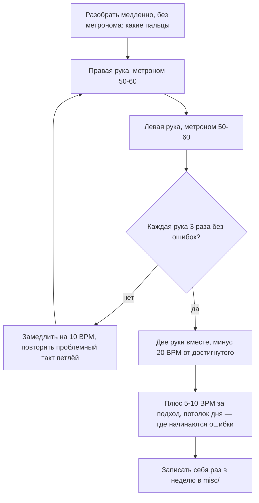

# Клавиатура, руки и первые упражнения

## Простыми словами

Клавиатура — это линейная развёртка цикла из двенадцати нот. Слева низко, справа
высоко, и один и тот же узор из семи белых и пяти чёрных клавиш повторяется без конца.
Выучить надо ровно один узор — дальше только копипаста.

Чёрные клавиши сгруппированы по **две** и по **три**. Это встроенная система координат:
без неё все белые клавиши выглядели бы одинаково, и найти конкретную ноту было бы
невозможно.

## Зачем: правило «глаза не нужны»

Цель этого раздела не «правильная классическая техника» (это вне рамок курса), а две
вещи: **не мешать себе телом** и **находить клавиши, не глядя**. Пианист смотрит в ноты
или в lead sheet, а не на руки. Привычка искать клавиши глазами упирается в потолок
очень быстро: как только надо одновременно читать и играть, всё рассыпается.

Поэтому пятипальцевые позиции с самого начала играются наощупь.

## Как устроено: карта клавиатуры

```text
        ___ ___     ___ ___ ___          ___ ___
       |C# |D# |   |F# |G# |A# |        |C# |D# |
    ___|___|___|___|___|___|___|_____ ___|___|___|__
   |   |   |   |   |   |   |   |   |   |   |   |
   | C | D | E | F | G | A | B | C | D | E | F | G
   |___|___|___|___|___|___|___|___|___|___|___|___
     ^                           ^
     C: белая слева от           следующая C — тот же
     группы из ДВУХ чёрных       узор через 12 клавиш
```

Правила поиска, которые надо довести до автоматизма:

- **C** — белая клавиша слева от группы из **двух** чёрных.
- **F** — белая клавиша слева от группы из **трёх** чёрных.
- **D** — между двумя чёрными; **G** и **A** — между тремя чёрными (G слева, A справа).
- **E** — справа от группы из двух; **B** — справа от группы из трёх.

Чёрные клавиши имеют по два имени (энгармонизм): C# = Db, D# = Eb, F# = Gb, G# = Ab,
A# = Bb. Какое из них правильное — зависит от тональности, см.
[`03-scales-and-intervals`](../03-scales-and-intervals/theory.md).

**Октавы и MIDI.** Полное имя ноты = буква + номер октавы: C4, F#3, A5. Номер меняется
на C, а не на A. Средняя C (middle C) на 88-клавишном пианино — четвёртая слева, это
**C4 = MIDI 60**. Дальше арифметика: +1 полутон = +1 номер, +1 октава = +12.

```text
C2 = 36   C3 = 48   C4 = 60   C5 = 72   C6 = 84
                    ^ middle C, отсюда живёт правая рука новичка
A4 = 69  (440 Гц)   E4 = 64   G4 = 67   B3 = 59
```

**Velocity = динамика.** На клавишах громкость управляется только силой удара: нет
ни грифа, ни медиатора. Тихо — pp, громко — ff, и всё, что между. Тренируется это
осознанно: сыграй пять раз одну ноту от почти неслышной до полной, глядя на
индикатор velocity в DAW.

## На гитаре

Одна и та же нота на гитаре живёт в нескольких местах грифа, на клавиатуре — ровно в
одном; поэтому теорию удобнее «видеть» на клавишах, а
[`06-guitar-foundations`](../06-guitar-foundations/theory.md) — про переносимые формы.

## На клавишах: тело, руки, пальцы

### Посадка

1. **Высота.** Сидя, предплечья примерно горизонтальны, локти чуть выше уровня клавиш.
   Если сидишь низко, кисть проваливается и запястье упирается снизу — верный путь к
   боли. Обычный стул почти всегда низковат: подложи книгу или купи регулируемую банкетку.
2. **Расстояние.** Садись на **передний край**, ноги стоят на полу, правая нога — рядом
   с педалью. Не вжимайся в спинку.
3. **Центр.** Пупок напротив middle C (C4) — так обе руки симметрично достают куда надо.
4. **Плечи опущены.** Проверка каждые пять минут: подними плечи к ушам и сбрось. Если
   стало заметно легче — ты играл с поднятыми плечами.

### Форма кисти

Опусти руку вдоль тела и не напрягай — пальцы сами примут слегка согнутую форму.
Это и есть рабочая форма. Классическая подсказка: **как будто в ладони лежит яблоко**
(или мышка от компьютера). Проверки:

- Играешь **подушечками** пальцев, ногти не стучат по клавише.
- Костяшки не провалены внутрь: свод ладони — купол, а не тарелка.
- Запястье на уровне кисти, не свисает вниз и не задрано.
- Пятый палец стоит на подушечке, а не лежит на боку.
- Ноту не **давишь**, а **сбрасываешь**: вес руки падает в клавишу и сразу
  отпускается. Клавиша уже дошла до дна — дальше жать некуда, лишнее усилие уходит
  в напряжение предплечья.

### Номера пальцев

Универсальная нумерация, одинаковая для обеих рук:

```text
         1 = большой   2 = указательный   3 = средний
         4 = безымянный  5 = мизинец

левая рука                          правая рука
5 4 3 2 1  <- к центру клавиатуры ->  1 2 3 4 5
```

Ключевой момент: нумерация **зеркальна**. Большие пальцы обеих рук смотрят в центр.
Аппликатура (fingering) записывается цифрами над/под нотами — и её нельзя игнорировать:
она выбрана так, чтобы рука дошла до конца фразы, не запутавшись.

### Пятипальцевая позиция (five-finger position)

Пять соседних белых клавиш под пять пальцев, кисть не двигается. Позиция C:

```text
правая рука (от C4):   C=1  D=2  E=3  F=4  G=5
левая рука (от C3):    C=5  D=4  E=3  F=2  G=1
```

Базовые упражнения на позицию, каждое — под метроном 60 BPM, по одной ноте на щелчок:

1. **Вверх-вниз**: 1 2 3 4 5 4 3 2 1, ровно, одинаковой громкостью.
2. **Через одну**: 1 3 5 3 1 (C E G E C) — это разложенный аккорд C.
3. **Наощупь**: то же с закрытыми глазами. Сначала найди позицию пальцами (два чёрных
   слева от C), потом играй.
4. **Динамика**: 1 2 3 4 5 крещендо (тише→громче), потом 5 4 3 2 1 диминуэндо.

Ровность — главный критерий. Типично «проваливаются» 4-й и 5-й пальцы (слабые) и
«выпирает» 1-й (тяжёлый, потому что это вся кисть). Слушай, а не смотри.

### Гамма C-dur на октаву и подкладывание большого пальца

Восемь нот не влезают в пять пальцев, поэтому существует **подкладывание
(thumb under)**: большой палец проходит под ладонью и начинает новую пятёрку.
Стандартная аппликатура:

```text
     C   D   E   F   G   A   B   C
ПР:  1   2   3   1   2   3   4   5      <- вверх; вниз: 5 4 3 2 1 3 2 1
ЛР:  5   4   3   2   1   3   2   1      <- вверх; вниз: 1 2 3 1 2 3 4 5
              ^
     правая: после E (3) большой подкладывается под ладонь и берёт F
     левая:  после G (1) третий палец переносится через большой на A
```

Как отрабатывать подкладывание правой:

1. Играй только `E–F` (3 → 1) десять раз. Большой палец **идёт заранее**, пока 3-й
   ещё держит E; он не прыгает в последний момент.
2. Локоть чуть-чуть подаётся вперёд-вправо, помогая большому пройти. Кисть при этом
   **не выкручивается** наружу и не подпрыгивает.
3. Ищи «шов»: если в записи слышно, что F громче или позже соседей — подкладывание
   ещё не готово. Замедли до 50 BPM.

Порядок освоения любого нового упражнения — всегда один и тот же цикл:



**Руки вместе** — отдельный навык, не сумма двух. Правило: сначала каждая рука играет
уверенно и наощупь, только потом вместе, и обязательно **медленнее**, чем каждая по
отдельности. В унисон (обе руки одну и ту же гамму через октаву) на 40–50 BPM это
вполне посильно на первой неделе.

### Первые аккорды: C, F, G, Am

Все четыре — трезвучия в основном виде (root position): корень, терция, квинта, через
одну белую клавишу. Пальцы правой руки 1–3–5, левой 5–3–1.

```text
аккорд | ноты   | MIDI (от C4) | правая  | левая (октавой ниже)
-------+--------+--------------+---------+---------------------
  C    | C E G  | 60 64 67     | 1 3 5   | 5 3 1
  F    | F A C  | 65 69 72     | 1 3 5   | 5 3 1
  G    | G B D  | 67 71 74     | 1 3 5   | 5 3 1
  Am   | A C E  | 69 72 76     | 1 3 5   | 5 3 1
```

Три вещи, которые надо проверить на каждом аккорде:

- Все три ноты звучат **одновременно** и **одинаково громко**. Обычно отстаёт или
  проваливается 5-й палец. Слушай верхнюю ноту отдельно.
- Кисть не «клюёт» вниз: аккорд берётся весом руки, а не ударом пальцев.
- Ты можешь назвать ноты вслух, а не только показать форму. Формы без нот — тупик,
  см. [`04-chords-and-harmony`](../04-chords-and-harmony/theory.md).

Смена аккордов пока прямая: сыграл C, отпустил, посмотрел, поставил F. Плавные смены
через обращения — это модуль
[`09-keyboard-chords-and-songs`](../09-keyboard-chords-and-songs/index.md).

### Первые мелодии

**«Ода к радости»** (Бетховен) — идеальная первая мелодия, потому что её первая фраза
целиком укладывается в пятипальцевую позицию C правой руки:

```text
ноты:    E  E  F  G  | G  F  E  D  | C  C  D  E  | E  D  D
пальцы:  3  3  4  5  | 5  4  3  2  | 1  1  2  3  | 3  2  2
```

Все ноты по четверти, ровно, под метроном 60–70 BPM. Левая рука позже добавит бас:
целая нота C под первыми двумя тактами и G под третьим-четвёртым (сначала попробуй на
слух, какой бас звучит лучше — это уже подбор гармонии).

**«Twinkle, Twinkle, Little Star»** — C C G G A A G, F F E E D D C. Здесь есть A,
которая **выходит** за пятипальцевую позицию: это твоё первое упражнение на смену
позиции. Возьми A пятым пальцем, чуть сдвинув кисть вправо, и верни кисть на место.

**«Happy Birthday»** — начинается с затакта на G: G G A G C B. Дальше подбери по слуху
(мелодия известная, и подбор — ровно тот навык, который тренирует
[`05-ear-training-and-practice`](../05-ear-training-and-practice/theory.md)) или найди
ноты в любом сборнике для начинающих.

Общее правило про репертуар: **не печатай себе ноты, которым не доверяешь**. Если не
уверен в мелодии — подбирай по слуху от первой ноты, это полезнее.

## Послушай

- **Velocity-тест**: одна нота C4 пять раз от pp до ff. Слышишь, как меняется не только
  громкость, но и характер? Это твой главный выразительный инструмент.
- **Ровность гаммы**: запиши гамму C-dur в DAW и посмотри на piano roll. Ноты стоят на
  сетке или гуляют? Это то, чего не слышно «в моменте», но отлично видно в записи.
- Как звучит фортепиано в аккордовой популярной подаче — послушай любые записи из
  курсов **Pianote / Lisa Witt** или разборы **David Bennett Piano**; это ориентир по
  звуку и по подходу, а не обязательный репертуар.

## Типичные ошибки

- **Плоские пальцы.** Играешь фалангами лёжа — теряешь контроль и цепляешь соседние
  клавиши. Помни про яблоко в ладони.
- **Провалившееся запястье.** Кисть висит ниже уровня клавиш, предплечье устаёт за
  пять минут. Поднять стул.
- **Напряжение.** Плечи у ушей, локти прижаты, дыхание задержано. Останавливайся,
  сбрасывай руки вниз, играй медленнее.
- **Давить вместо сбрасывать.** Клавиша дошла до дна — усилие бесполезно.
- **Две руки слишком рано.** Даёт «кашу» и закрепляет ошибки в обеих руках сразу.
- **Игнорировать аппликатуру.** «Мне удобнее так» на трёх нотах превращается в тупик
  на восьмой: пальцы кончились.
- **Смотреть на руки.** Пока играешь пять белых клавиш, это незаметно; на первом же
  lead sheet станет блокером.
- **Не считать вслух.** «1 и 2 и 3 и 4 и» вслух ловит 90 % ритмических ошибок.
- **Учить только правую руку.** Левая отстаёт годами, если её не занимать с начала.

## Словарь терминов

- **Middle C (C4, MIDI 60)** — средняя до, точка отсчёта.
- **Аппликатура (fingering)** — какие пальцы играют какие ноты; цифры 1–5.
- **Пятипальцевая позиция (five-finger position)** — пять соседних клавиш под пять
  пальцев без смещения кисти.
- **Подкладывание (thumb under)** — проход большого пальца под ладонью в гаммах.
- **Перекладывание (finger over)** — перенос 3-го/4-го пальца через большой (обратное
  движение).
- **Основной вид (root position)** — аккорд, у которого снизу корень.
- **Основной тон / терция / квинта (root / third / fifth)** — ноты трезвучия.
- **Динамика (dynamics)** — pp, p, mp, mf, f, ff; на клавишах = velocity.
- **Легато / стаккато (legato / staccato)** — связно / отрывисто.
- **Затакт (pickup)** — ноты перед первой сильной долей.

## См. также

- [`theory.md`](./theory.md) — железо, подключение, DAW.
- [`02-notes-and-notation`](../02-notes-and-notation/theory.md) — ноты и MIDI-номера.
- [`03-scales-and-intervals`](../03-scales-and-intervals/theory.md) — формула мажора.
- [`04-chords-and-harmony`](../04-chords-and-harmony/theory.md) — трезвучия и обращения.
- [`09-keyboard-chords-and-songs`](../09-keyboard-chords-and-songs/index.md) — что дальше.
- **Alfred's Basic Adult All-in-One Piano Course, Book 1** (Palmer, Manus, Lethco) —
  посадка, позиции, первые пьесы.
- **Bill Hilton — «How to Really Play the Piano»** и его канал — аккордовое фортепиано.
- **Pianote / Lisa Witt** — видеокурсы по посадке, форме кисти и первым гаммам.
- **musictheory.net** — тренажёр «Keyboard Note Identification».
