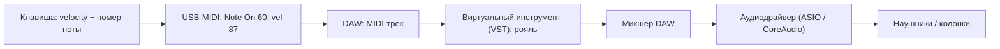

# Клавиши: железо, подключение и DAW

## Простыми словами

Есть два разных предмета, которые выглядят как «клавиши».

**MIDI-контроллер** — это клавиатура без звука. Совсем без звука. Внутри нет ни рояля,
ни колонок: нажатие клавиши превращается в сообщение «нота 60, сила 87, включить» и
уезжает по USB в компьютер. Звук делает программа. Для программиста это привычная
картинка: контроллер — устройство ввода, вроде клавиатуры компьютера, только вместо
символов он посылает номера нот.

**Цифровое пианино** — самодостаточный инструмент: 88 взвешенных клавиш, встроенные
звуки, встроенные динамики. Включил в розетку — играешь. И почти любое современное
цифровое пианино **дополнительно** умеет быть MIDI-контроллером: у него есть USB-порт,
через который оно посылает те же самые сообщения о нотах.

То есть выбор не «клавиши или компьютер», а «покупаю ли я вместе с клавишами ещё и
звук с механикой».

## Зачем это решать заранее

Потому что ошибка здесь стоит денег и мотивации. Купить 25-клавишный контроллер и
обнаружить, что двумя руками на нём физически не разойтись, — типичная история. Купить
цифровое пианино за большие деньги и играть на нём три раза — тоже.

Практический критерий один: **что мешает заниматься каждый день**. Инструмент,
который надо собирать, — не будет использоваться. Инструмент, который пищит, — не
будет использоваться. Инструмент, который отвечает на нажатие с задержкой, — не будет
использоваться, потому что играть под задержку невозможно физически.

## Как устроено: MIDI, velocity, механика

**MIDI** (Musical Instrument Digital Interface, стандарт 1983 года) — это не звук, это
протокол событий. Основные сообщения, которые тебе действительно нужны:

| Сообщение | Что несёт | Диапазон |
|---|---|---|
| `Note On` | номер ноты + velocity | нота 0–127, velocity 1–127 |
| `Note Off` | номер ноты | 0–127 |
| `Control Change 64` | педаль сустейна | 0 = отпущена, 127 = нажата |
| `Pitch Bend` | колесо высоты | 14 бит |
| `Control Change 1` | модуляция | 0–127 |

Номер ноты — линейная шкала полутонов: **C4 = 60**, каждый следующий полутон +1,
октава = +12. То есть C5 = 72, C3 = 48, A4 (камертонная ля, 440 Гц) = 69. Это тот же
счёт из [`02-notes-and-notation`](../02-notes-and-notation/theory.md), просто в виде
целых чисел.

Оговорка про названия октав: MIDI-номера однозначны, а вот буквенные имена — нет.
Стандарт научной нотации зовёт средню ноту 60 «C4», а Yamaha исторически зовёт её «C3».
Если DAW показывает C3 там, где ты ждёшь C4, — это не поломка, а другая нумерация.
Ориентируйся на число 60.

**Velocity** — сила удара, измеренная как время между двумя контактами под клавишей.
Клавиша замыкает верхний контакт, потом нижний; чем меньше интервал, тем больше
velocity. Дальше уже инструмент решает, что с этим делать: рояль играет громче и
ярче, орган — вообще ничего (у настоящего органа нет динамики от касания).
Клавиатура **без velocity** (все нажатия = 127) — это калькулятор, а не инструмент;
такие бывают в самых дешёвых 25-клавишных моделях, их брать нельзя.

**Механика.** Три уровня, по возрастанию цены и веса:

- **Synth-action** — пружинка. Легко, быстро, дёшево. Годится для аккордов, битов,
  синтезаторных партий. Динамику контролировать сложнее: клавиша почти не сопротивляется.
- **Semi-weighted** — пружинка плюс груз. Компромисс; на этом уже приятно учить гаммы.
- **Hammer action / weighted** (взвешенная, молоточковая) — имитация рояльного механизма,
  с градацией: басовые клавиши тяжелее верхних. Это то, что стоит в цифровых пианино.
  Пальцы, поставленные на такой механике, потом сыграют на чём угодно; обратное неверно.

**Количество клавиш** — это про размах рук, а не про престиж:

```text
25 клавиш (2 октавы)  — одна рука, эскизы битов. Двумя руками неудобно.
49 клавиш (4 октавы)  — минимум для двух рук: бас слева, мелодия справа. Разумный старт.
61 клавиша (5 октав)  — комфортно почти для всего популярного репертуара.
76 / 88 клавиш        — полноценный диапазон, классика, «настоящее пианино».
```

**Педаль сустейна** (sustain pedal) — обязательная докупка, если её нет в комплекте.
Она поднимает демпферы: нота продолжает звучать после того, как палец ушёл с клавиши.
Без педали фортепианный аккомпанемент звучит сухо и обрубленно. У контроллеров это
разъём с подписью `SUSTAIN` или `PEDAL`; подойдёт любая педаль с моментным
переключателем (momentary), но пианинного типа (широкая, с наклонной площадкой) —
удобнее, чем «квадратик» от синтезатора.

### Ориентиры по бюджету

Конкретные модели устаревают, поэтому думай тирами, а не названиями:

- **Минимум.** 49 клавиш, synth-action, velocity, USB-питание, в комплекте лицензия на
  Ableton Live Lite. Плюс педаль. Этого достаточно на весь этот модуль и модуль 09.
- **Разумный.** 61 клавиша, semi-weighted, нормальная педаль, стойка. Здесь уже не
  захочется «доплатить и поменять» через полгода.
- **Сразу инструмент.** Цифровое пианино 88 клавиш, hammer action, встроенные звуки и
  динамики, USB-MIDI наружу. Дороже и тяжелее, зато играть можно без компьютера — а
  это самый сильный фактор регулярности занятий.

Что **не** нужно на старте: 88 клавиш ради «как у настоящего», куча ручек и
фейдеров, встроенные ритм-паттерны, обучающие «подсвечивающиеся» клавиши, аранжировщик
с 700 тембрами.

Что стоит докупить, но **после** первых двух недель, когда занятия войдут в привычку:

- **Наушники.** Единственная обязательная покупка помимо педали. Любые закрытые или
  полуоткрытые «мониторные» наушники честнее, чем встроенные динамики ноутбука, на
  которых фортепиано звучит как игрушка. Беспроводные не подходят: Bluetooth добавляет
  десятки миллисекунд задержки.
- **Банкетка или регулируемый стул.** Обычный стул почти всегда низкий, а высота
  посадки напрямую влияет на запястье. Первое время лечится книгой под таз.
- **Стойка X-типа** — если клавиши лежат на столе слишком высоко или слишком низко.
- **Аудиоинтерфейс** — только когда захочется записывать микрофон или гитару. Для
  MIDI он не нужен: контроллер идёт напрямую в USB.

## На гитаре

Аналог этой главы для гитары — выбор акустика/электро, комбик и тюнер; см.
[`06-guitar-foundations`](../06-guitar-foundations/theory.md). Разница в том, что
гитара звучит сама, а MIDI-контроллер без компьютера молчит.

## На клавишах: подключение шаг за шагом

### Шаг 1. Цепь сигнала

Что происходит между пальцем и звуком:



Полезное следствие: если звука нет, ищи разрыв по этой цепи слева направо, а не
«наугад». Индикатор MIDI-входа в DAW дёргается? Значит первые три звена живы, и
проблема правее — в инструменте или в выходе.

### Шаг 2. Подключение

1. Кабель USB из контроллера в компьютер. Драйверы для class-compliant устройств не
   нужны — система видит его как MIDI-порт сама.
2. Если это цифровое пианино — найди на задней панели `USB TO HOST` (не `USB TO
   DEVICE`, тот для флешки).
3. Педаль — в разъём `SUSTAIN`.
4. Наушники — **в компьютер**, если звук делает DAW, и в пианино, если играешь его
   встроенным звуком. Это две разные цепи; путаница здесь даёт классическое «я всё
   подключил, звука нет».

### Шаг 3. Латентность простыми словами

Компьютер не обрабатывает звук по одному отсчёту — он копит их пачками, **буферами**.
Размер буфера меряется в отсчётах (samples): 64, 128, 256, 512, 1024. Задержка — это
примерно размер буфера, делённый на частоту сэмплирования:

```text
256 отсчётов / 48000 Гц ≈ 5.3 мс   (в одну сторону)
512 отсчётов / 48000 Гц ≈ 10.7 мс
1024 отсчётов / 48000 Гц ≈ 21.3 мс
```

Ориентир: **до ~10 мс не замечаешь, 20 мс уже мешает, 40 мс играть невозможно** —
рука начинает ждать звук и сбивается с ритма. Компромисс всегда один и тот же:
маленький буфер = маленькая задержка, но больше нагрузка на процессор и риск
щелчков (dropouts). Ставь 128 или 256, а если щёлкает — поднимай до 512.

**Драйвер.** На Windows стандартный путь для звука (WASAPI shared, DirectSound) даёт
десятки миллисекунд, потому что он не для этого. Нужен **ASIO** — низколатентный
протокол Steinberg. Варианты: родной ASIO-драйвер от звуковой карты или
аудиоинтерфейса (лучший вариант), либо бесплатный универсальный **ASIO4ALL** для
встроенной звуковой карты. На macOS ничего делать не надо: **CoreAudio** и так
низколатентный. На Linux — JACK или PipeWire.

Проверка одной фразой: если ты слышишь свой удар «сразу», настройка правильная. Если
слышишь эхо собственных пальцев — правь буфер и драйвер.

### Шаг 4. Выбор DAW

DAW (Digital Audio Workstation) — программа, которая записывает MIDI и аудио,
хостит инструменты и делает из этого файл. Реальные бесплатные и дешёвые варианты:

| DAW | Платформа | Особенности |
|---|---|---|
| **Reaper** | Win/mac/Linux | Полнофункциональный, 60-дневная оценочная версия, недорогая лицензия, крошечный установщик |
| **GarageBand** | macOS / iOS | Бесплатный, идёт с системой, свои приличные рояли |
| **LMMS** | Win/mac/Linux | Полностью бесплатный, открытый, ориентирован на паттерны |
| **Ableton Live Lite** | Win/mac | Часто идёт в комплекте с контроллером, ограничен числом дорожек |

Совет без религиозных войн: возьми то, что уже есть (GarageBand на Mac, Live Lite
в коробке контроллера), иначе Reaper. Смена DAW через год — нормальная история, ничего
из выученного не пропадёт.

### Шаг 5. Загрузить нормальный рояль

Стандартные звуки в DAW обычно так себе. Бесплатные и настоящие варианты:

- **Spitfire LABS** — бесплатная библиотека Spitfire Audio, свой плагин-загрузчик,
  много инструментов; для нас интересны фортепианные, в том числе **Soft Piano**
  (тихий, залипающий, идеальный для медленной игры и для баллад).
- **Salamander Grand Piano** — бесплатный сэмплированный рояль Yamaha C5 (автор
  Alexander Holm) в формате SFZ. Играется через бесплатный SFZ-плеер, например
  **Plogue Sforzando**.

Порядок действий в DAW: создать MIDI/instrument-трек → выбрать входное устройство
(твой контроллер) → загрузить инструмент → включить monitoring → нажать клавишу.
Дальше — только музыка.

## Послушай

Слушать здесь особо нечего, зато есть что **сравнить** ушами, и это полезное
упражнение на velocity:

- Возьми одну и ту же ноту C4 (MIDI 60) пять раз, стараясь взять velocity примерно
  20, 50, 80, 110, 127. Смотри на индикатор velocity в DAW и слушай: у хорошего рояля
  меняется не только громкость, но и **тембр** — тихая нота глуше, громкая ярче.
  Это и есть причина, по которой рояль звучит живо, а дешёвый тембр — нет.
- Сыграй аккорд C (C–E–G) сначала на Soft Piano, потом на любом «электропиано» или
  «строке» из набора DAW. Один и тот же MIDI, разный смысл: инструмент — половина
  музыки.

## Типичные ошибки

- **Купить 25 клавиш.** Две октавы — это одна рука. Уже на уроке 03 будет тесно.
- **Купить клавиатуру без velocity.** Динамика — не украшение, это половина
  выразительности; без неё занятия превращаются в набор текста.
- **Забыть педаль.** Она стоит копейки и меняет звук радикально.
- **Играть на встроенном динамике планшета/ноутбука** и решить, что «пианино скучное».
  Наушники обязательны с первого дня.
- **Не настроить ASIO/буфер.** Играть под задержку 40 мс невозможно, и виноват в этом
  не ученик.
- **Утонуть в DAW вместо занятий.** Первые недели DAW нужен ровно для двух вещей:
  загрузить рояль и включить метроном. Всё остальное — потом (модуль 09).
- **Скачать 40 гигабайт библиотек** и не выучить гамму. Один хороший рояль закрывает
  весь курс.
- **Играть без метронома**, потому что «пока и так нормально». См.
  [`01-sound-and-rhythm`](../01-sound-and-rhythm/theory.md).

## Словарь терминов

- **MIDI** — протокол сообщений о нотах, не звук.
- **Velocity** — сила нажатия, 1–127; в фортепианном тембре = громкость + яркость.
- **Note On / Note Off** — сообщения «нота нажата» / «нота отпущена».
- **CC64 (sustain)** — сообщение педали сустейна.
- **Synth-action / semi-weighted / hammer action (взвешенная)** — типы механики клавиш.
- **DAW (Digital Audio Workstation)** — Reaper, GarageBand, LMMS, Ableton Live.
- **VST / AU** — форматы плагинов-инструментов и эффектов.
- **Виртуальный инструмент (virtual instrument)** — программа, делающая звук из MIDI.
- **ASIO / CoreAudio** — низколатентные аудиодрайверы (Windows / macOS).
- **Буфер (buffer size)** — размер пачки отсчётов; определяет задержку.
- **Латентность (latency)** — задержка между нажатием и звуком.
- **Dropout (щелчок)** — пропуск в звуке из-за перегрузки процессора.
- **Monitoring** — прослушивание того, что играешь, через DAW в реальном времени.
- **Class-compliant** — устройство, работающее без установки драйверов.

## См. также

- [`02-notes-and-notation`](../02-notes-and-notation/theory.md) — ноты, октавы, MIDI-номера.
- [`theory-2-technique.md`](./theory-2-technique.md) — руки, посадка, первые упражнения.
- **Reaper** — документация и User Guide: reaper.fm.
- **LMMS** — lmms.io, документация проекта.
- **GarageBand** — справка Apple по GarageBand.
- **ASIO4ALL** — asio4all.org (универсальный ASIO для встроенных звуковых карт).
- **Spitfire LABS** — spitfireaudio.com/labs (бесплатные инструменты, включая Soft Piano).
- **Plogue Sforzando** — plogue.com (бесплатный SFZ-плеер для Salamander Grand Piano).
- **musictheory.net** — ноты и клавиатура, интерактивные упражнения.
- **Bill Hilton — «How to Really Play the Piano»** — аккордовый подход к фортепиано.
