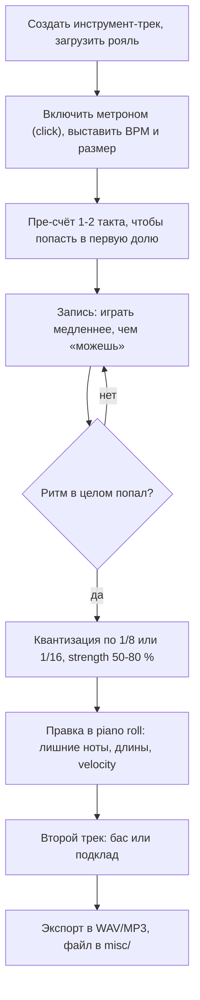

# Аккомпанемент левой руки, lead sheet и запись в DAW

## Простыми словами

Правая рука отвечает за то, **что** играется (мелодия, аккорды), левая — за то, **как
это звучит**. Один и тот же аккорд C, взятый левой рукой пятью разными способами, даёт
пять разных жанров: колыбельную, баллинг-балладу, вальс, блюз и церковный хорал.

Поэтому «выучить аккомпанемент» — это не выучить сто песен, а выучить **пять
паттернов** и научиться подставлять в них любые аккорды. Дальше почти любая песня
собирается за десять минут: взял lead sheet, выбрал паттерн, поехал.

## Зачем: экономия, которую видно сразу

Пять паттернов × сорок аккордов = двести песен, и это без единой выученной наизусть
партии. Именно так работает аккордовое фортепиано: ты не воспроизводишь чужую запись,
а собираешь свою из известных деталей. Плюс это единственный способ играть под
собственное пение и аккомпанировать другим людям.

## Как устроено: паттерны левой руки

Все примеры — на аккорде C (ноты C, E, G); левая рука работает в районе C2–C3.
Обозначения: `1 2 3 4` — доли такта 4/4, `&` — «и» (восьмые).

### 1. Только корень

```text
доли:  1    2    3    4
левая: C--------------------   (целая нота, держится весь такт)
```

Самое простое и самое недооценённое. Годится под мелодию, под пение, под медленную
баллату. Если сомневаешься, что играть — играй корень.

### 2. Корень–квинта

```text
доли:  1    2    3    4
левая: C         G
```

Корень на «1», квинта на «3». Классическая «народно-баллада»: даёт пульс, не мешает
правой. Пальцы 5 и 1 (C=5, G=1) — рука почти не двигается.

### 3. Корень–октава

```text
доли:  1    2    3    4
левая: C2        C3        (или восьмыми: C2 C3 C2 C3 ...)
```

Мощный, «рок-фортепианный» вариант. Пальцы 5 и 1 в растяжке на октаву. Если рука
маленькая — играй не одновременно, а по очереди, это даже лучше звучит.

### 4. Арпеджио (разложенный аккорд)

```text
доли:  1    &    2    &    3    &    4    &
левая: C    E    G    C5   G    E    C    E
пальцы:5    3    2    1    2    3    5    3
```

Ровное движение вверх-вниз по нотам аккорда. Идёт под баллады и «мечтательные»
куплеты. Требует ровности: любая выпирающая нота слышна сразу.

### 5. Бас Альберти

```text
доли:  1    &    2    &    3    &    4    &
левая: C    G    E    G    C    G    E    G
пальцы:5    1    3    1    5    1    3    1
```

Формула **корень – квинта – терция – квинта**, повторённая дважды за такт. Названа по
итальянскому композитору Доменико Альберти (XVIII век), это стандартная фактура
раннего классицизма — узнаваемо «моцартовски». Играется почти без движения кисти.

### 6. Поп-баллада: бас плюс аккорд

Здесь работают обе руки, и это самый «песенный» из паттернов.

```text
доли:   1    &    2    &    3    &    4    &
левая:  C(бас)              G(бас)
правая:           [C E G]        [C E G]  [C E G]
```

Бас на «1» и «3», аккорд правой на слабых долях («2» и «4» или на «и»). Мгновенно
даёт ощущение поп-песни, потому что слабые доли — это то, что в поп-музыке делает
гитара или дисторшн-фортепиано.

### Ритмические рисунки по жанрам

```text
поп 4/4 (аккорд на «2» и «4»):
  1   &   2   &   3   &   4   &
  B       ch      B       ch          B = бас, ch = аккорд

баллада 4/4 (арпеджио восьмыми, аккорд держится):
  1   &   2   &   3   &   4   &
  C   E   G   C   G   E   C   E

вальс 3/4 (бас — аккорд — аккорд):
  1       2       3
  B       ch      ch

шаффл (свингованные восьмые, «трёхдольное» ощущение):
  1  --a  2  --a  3  --a  4  --a
  B   ch  B   ch  B   ch  B   ch     первая восьмая длиннее второй
```

Про счёт, доли и свинг — база в
[`01-sound-and-rhythm`](../01-sound-and-rhythm/theory.md).

## На гитаре

Гитарный аналог этих паттернов — бой и перебор: то же деление на «бас плюс
доля/слабая доля», только правой рукой по струнам; см.
[`07-guitar-scales-and-songs`](../07-guitar-scales-and-songs/theory.md).

## На клавишах: педаль, правая рука, lead sheet

### Педаль сустейна — ритмический инструмент

Педаль не «делает красиво», она **связывает**. Правило одно и главное:

> **Меняешь аккорд — меняешь педаль.** Отпустить ровно в момент нажатия нового
> аккорда и сразу нажать снова.

Это называется «смена педали» (pedal change) и делается синхронно с рукой, а не
после неё. Если держать педаль через смену, ноты двух аккордов складываются, и
получается гул (в англоязычных курсах — «pedal mud», педальная грязь). Диагностика:
запиши себя; если в записи невозможно разобрать, где кончился один аккорд и начался
другой — педаль держится слишком долго.

```text
такт:      | C            | G            | Am           | F            |
рука:      аккорд         аккорд         аккорд         аккорд
педаль:    вниз-----------^вниз----------^вниз----------^вниз----------
                          ^ здесь мгновенно вверх-вниз
```

Второе правило: **пятка на полу**, педаль давится передней частью ступни. Снимать
всю ногу с педали не нужно, движение маленькое.

### Правая рука: мелодия поверх аккордов

Три уровня сложности, осваивать по порядку:

1. **Аккорды справа, бас слева.** То, что уже умеешь. Пение — сверху.
2. **Мелодия справа, аккорды слева.** Левая берёт аккорд в закрытой голосовке (или
   корень с квинтой), правая ведёт мелодию одним голосом. Самый практичный вариант
   для игры «песни без певца».
3. **Мелодия и аккорд в одной руке.** Мелодия — верхним голосом (5-й или 4-й палец),
   под ней аккорд пальцами 1–2–3. Мелодия должна быть **громче** аккорда: она берётся
   чуть большей velocity. Это трудно, но именно так звучит фортепианное соло.

Простейшие украшения, которые не требуют новой теории:

- **Форшлаг с полутона снизу**: перед нотой E быстро тронуть D# (или Eb) — придаёт
  блюзовость.
- **Терция сверху**: сыграть мелодическую ноту вместе с нотой аккорда на терцию выше.
- **Разложить аккорд**: вместо одновременного C–E–G взять их подряд быстро вверх.
- **Опевание**: перед целевой нотой аккорда сыграть соседнюю ноту гаммы (проходящая
  нота, passing tone), см.
  [`03-scales-and-intervals`](../03-scales-and-intervals/theory.md).

### Игра по lead sheet

**Lead sheet** — минимальная запись песни: мелодия нотами плюс буквенные обозначения
аккордов над тактами. Ни голосовок, ни аппликатур, ни аккомпанемента: всё это решаешь ты.

```text
| C    | G    | Am   | F    | C    | G    | F    | C    |
```

Порядок чтения, десять минут на песню:

1. **Тональность.** Смотришь первый и последний аккорд и знаки при ключе. Здесь C.
2. **Римские цифры.** Переводишь буквы в функции: C G Am F = I V vi IV. Это позволяет
   понять песню, а не выучить её.
3. **Голосовки.** Выбираешь обращения по принципу «двигать минимум пальцев» (см.
   [`theory.md`](./theory.md)).
4. **Паттерн.** Выбираешь фактуру левой руки под характер: баллада — арпеджио,
   энергичное — корень–октава, вальс — бас плюс два аккорда.
5. **Проходишь глазами** всю форму до игры: где повторы, где единственный «странный»
   аккорд, где смена секции.
6. **Играешь на 60 % темпа** и только потом ускоряешь.

Отдельно: если аккорд обозначен с косой чертой (`C/G`, `F/A`) — это указание на
конкретную басовую ноту, играй её левой рукой. Если стоит `G7` — можно играть G7 или,
на первое время, просто G: доминантсептаккорд редко бывает обязательным.

## Запись в DAW

### Рабочий цикл



**Метроном и BPM.** Сначала темп, потом запись. Ставь BPM ниже комфортного: в записи
слышно всё, и «почти в темпе» превращается в «мимо». Обязательно включи **пре-счёт
(count-in)** на 1–2 такта, иначе первая доля всегда будет смазана.

**Квантизация (quantize)** — притягивание нот к сетке. Что важно понимать:

- Квантизация двигает **начало** ноты (а по настройке — и длину) к ближайшему делению
  выбранной сетки: 1/4, 1/8, 1/16.
- **Strength** (сила) 100 % ставит ноты идеально на сетку, и музыка становится
  механической. 50–80 % подтягивает, оставляя человеческую неровность. Для
  фортепиано это почти всегда лучше.
- Выбирай сетку **по самой мелкой длительности** в партии. Заквантуешь партию с
  шестнадцатыми по сетке 1/8 — половина нот слипнется.
- **Когда не квантовать вообще**: рубато и свободные баллады; арпеджио, где
  намеренная неровность и есть характер; «раскатанные» аккорды (нижняя нота чуть
  раньше верхней) — квантизация их выровняет и убьёт.

**Piano roll** — сетка, где по вертикали высота, по горизонтали время.

```text
      |такт 1         |такт 2         |
G4    |###############|               |
E4    |###############|#######        |
C4    |###############|###############|
      |1   2   3   4  |1   2   3   4  |
      ^ аккорд C держится такт, во втором такте E укорочена
```

Что здесь чинят руками: убирают случайно задетые ноты, дотягивают или подрезают
длины (особенно последнюю ноту фразы), сдвигают явно опоздавшую ноту.

**Velocity.** В большинстве DAW под piano roll есть полоса velocity — столбики по
нотам. Типичная беда новичка: все аккорды одной силы, партия звучит как автомат.
Лечение: понизить velocity на слабых долях, поднять на «1» и на самых важных нотах
мелодии; в аккорде верхнюю ноту сделать чуть громче остальных.

**Слоями.** Записывай по одному, а не всё сразу: сначала левая рука (или бас),
потом правая, потом мелодия отдельным треком. Так и играть проще, и править легче.
Второй трек с другим тембром (например, «строки» или электропиано тише под роялем)
даёт объём почти бесплатно.

**Экспорт.** Render/Bounce/Export → WAV для архива, MP3 для отправки. Кладём в
`misc/` с датой в имени: слушать через месяц свои записи — самая честная линейка
прогресса.

### Транспонирование: два разных навыка

1. **MIDI-транспонирование** — сдвиг всех нот на N полутонов средствами DAW (или
   кнопкой `TRANSPOSE` на инструменте). Мгновенно, полезно, когда песню надо
   подстроить под голос певца, а концерт завтра.
2. **Игра в новой тональности руками** — читаешь те же римские цифры и берёшь аккорды
   новой тональности. Медленно, зато навык растёт.

Правило: **учи оба, но не подменяй второе первым**. Если ты только жмёшь `TRANSPOSE`,
через год ты всё ещё играешь в одной тональности. Если ты только играешь руками — не
сможешь помочь певцу, которому нужно на полтора тона ниже. Полезное упражнение:
одна и та же прогрессия I–V–vi–IV в C, G, F, D — руками, по таблице из
[`theory.md`](./theory.md).

### Репертуар: как набирать

- **Три песни в работе одновременно**, не больше: одна новая, одна дорабатываемая,
  одна «готовая», которую играешь для удовольствия.
- Готовая = сыграна три раза подряд без остановок под метроном и записана.
- Веди простой список в `notes/` или в `misc/`: название, тональность, аккорды,
  паттерн, темп. Через полгода это твой концертный набор.
- Выбирай песни по **прогрессии**, а не по любви: если в ней I–V–vi–IV, ты её уже
  почти умеешь.

## Послушай

- **Бас Альберти** — любая ранняя классика для фортепиано; самый известный пример,
  который назовут в любом курсе, — начало Сонаты №16 до мажор К. 545 Моцарта. Послушай
  и опознай формулу «корень–квинта–терция–квинта» на слух.
- **Паттерн поп-баллады** — послушай любую медленную поп-песню с фортепиано и попробуй
  отделить ушами бас от аккорда: где бас, где слабая доля.
- **Педальная грязь** — лучший «послушай» здесь свой: запиши прогрессию C–G–Am–F два
  раза, один раз со сменой педали, второй раз держа педаль всю прогрессию. Разница
  будет неприятно очевидной.
- Разборы аккордового фортепиано — **Bill Hilton**, **Pianote / Lisa Witt**; для
  анализа прогрессий в песнях — **Hooktheory** (проверяй разборы там, а не на слух
  «примерно»).

## Типичные ошибки

- **Педальная грязь.** Педаль держится через смену аккорда. Меняешь аккорд — меняешь
  педаль.
- **Все аккорды одной velocity.** Партия звучит как MIDI-файл из 1998 года. Слабые
  доли тише, «1» и мелодия громче.
- **Спешить на смене аккорда.** Не «рука не успевает», а «начал переставлять поздно».
  Рука едет на последней доле.
- **Только основные виды.** См. [`theory.md`](./theory.md): прыжки, рвано, медленно.
- **Левая рука играет аккорды слишком низко.** Трезвучие ниже C3 гудит. В басу —
  корень или корень с квинтой, а не всё трезвучие.
- **Квантизация на 100 % всего подряд.** Убивает фортепианную фактуру, особенно
  арпеджио и раскатанные аккорды.
- **Записывать всё сразу двумя руками с первого дубля.** Пиши слоями.
- **Играть песню только в «своей» тональности.** Один и тот же паттерн в четырёх
  тональностях — упражнение на десять минут, а свободы даёт на годы.
- **Заучивать песни целиком вместо чтения lead sheet.** Двадцать заученных песен
  проигрывают навыку «читаю и играю любую».

## Словарь терминов

- **Паттерн аккомпанемента (accompaniment pattern)** — повторяющаяся фактура левой руки.
- **Бас Альберти (Alberti bass)** — корень–квинта–терция–квинта.
- **Арпеджио (arpeggio)** — аккорд, сыгранный нотами по очереди.
- **Педаль сустейна (sustain pedal), смена педали (pedal change)** — держит звук после
  снятия пальцев; меняется вместе с аккордом.
- **Lead sheet** — мелодия плюс буквенные обозначения аккордов.
- **Слэш-аккорд (`C/G`)** — аккорд с указанной басовой нотой.
- **Клик / метроном (click)** — щелчки темпа в DAW.
- **Пре-счёт (count-in)** — такты отсчёта перед записью.
- **Квантизация (quantize)** — притягивание нот к ритмической сетке.
- **Strength (сила квантизации)** — насколько сильно ноты притягиваются к сетке.
- **Piano roll** — редактор MIDI: высота по вертикали, время по горизонтали.
- **Velocity** — сила нажатия, редактируется в отдельной полосе под нотами.
- **Слой / дорожка (layer / track)** — отдельная запись, накладываемая на остальные.
- **Экспорт / рендер (export, bounce, render)** — сведение проекта в звуковой файл.
- **Транспонирование (transpose)** — сдвиг на N полутонов.
- **Рубато (rubato)** — намеренно свободный, неровный темп.
- **Проходящая нота (passing tone)** — неаккордовая нота между двумя аккордовыми.

## См. также

- [`theory.md`](./theory.md) — обращения, голосоведение, септаккорды, sus/add.
- [`01-sound-and-rhythm`](../01-sound-and-rhythm/theory.md) — доли, счёт, свинг.
- [`04-chords-and-harmony`](../04-chords-and-harmony/theory.md) — римские цифры и функции.
- [`05-ear-training-and-practice`](../05-ear-training-and-practice/theory.md) — подбор
  аккордов по слуху и методика занятий.
- [`10-songwriting-basics`](../10-songwriting-basics/index.md) — как из этого сделать
  свою песню.
- **Reaper** — документация по MIDI-редактору и квантизации: reaper.fm.
- **GarageBand** — справка Apple: запись MIDI, квантизация («Time Quantize»).
- **LMMS** — lmms.io/documentation: piano roll и паттерны.
- **Hooktheory** — hooktheory.com: прогрессии песен римскими цифрами.
- **Bill Hilton — «How to Really Play the Piano»** — паттерны левой руки и lead sheet.
- **Alfred's Basic Adult All-in-One Piano Course** — педаль и аккордовые фактуры.
