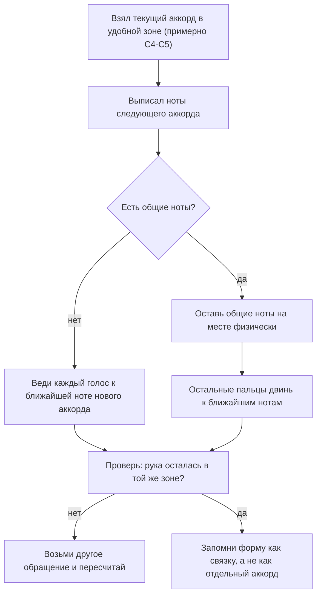

# Обращения, голосоведение и цветные аккорды

## Простыми словами

Аккорд — это **множество** нот, а не картинка. C — это «C, E и G», и порядок снизу
вверх никто не задавал. Если поднять нижнюю ноту на октаву, получится другой порядок
тех же нот: E–G–C. Это по-прежнему аккорд C, просто в другом **обращении (inversion)**.

Зачем это нужно на практике: в основном виде рука прыгает. Прогрессия C–G–Am–F,
сыгранная только основными видами, заставляет кисть носиться по клавиатуре, звучит
рвано и играется медленно. Стоит выбрать обращения — и рука почти не двигается, а
каждый следующий аккорд забирает предыдущие ноты, где может.

Это и есть **голосоведение (voice leading)**, и правило для новичка формулируется в
пять слов: **двигай минимум пальцев на минимальное расстояние.**

## Зачем: три разных выигрыша

1. **Физика.** Меньше движения = быстрее смена = можно играть в темпе.
2. **Звук.** Общие ноты, оставшиеся на месте, склеивают аккорды в цепь, а не в набор.
3. **Регистр.** Аккорды остаются в одной удобной зоне (примерно C4–C5), не улетают в
   гулкий низ и не звенят в верху. Низ — работа левой руки.

## Как устроено: обращения трезвучия

Трезвучие имеет три ноты, значит три возможных нижних → три позиции.

```text
основной вид        1-е обращение       2-е обращение
(root position)     (снизу терция)      (снизу квинта)

  G  квинта           C  корень           E  терция
  E  терция           G  квинта           C  корень
  C  корень           E  терция           G  квинта

  C E G               E G C               G C E
  пальцы 1 3 5        пальцы 1 2 5        пальцы 1 3 5
```

Механика на клавиатуре: **берёшь нижнюю ноту и переносишь её на октаву вверх**.
C E G → (C уехала вверх) E G C → (E уехала вверх) G C E → (G уехала) C E G, но уже
октавой выше. Три шага — и ты вернулся к той же форме.

Как узнавать обращение глазами, не считая: смотри на **дырку**. В основном виде две
терции подряд, промежутки одинаковые. В обращениях один промежуток шире (кварта) —
и нота **сразу над дыркой** и есть корень.

```text
E G C   -> дырка между G и C, значит корень C -> это аккорд C
G C E   -> дырка между G и C, корень C        -> тоже аккорд C
```

Обозначение на lead sheet: `C/E` значит «аккорд C, снизу E» (это первое обращение),
`C/G` — «аккорд C, снизу G» (второе). Косая черта читается как «на басу».

## На гитаре

На гитаре обращения тоже есть, но там их роль меньше: гитарист чаще двигает форму
по грифу и подкладывает баррэ; см.
[`07-guitar-scales-and-songs`](../07-guitar-scales-and-songs/theory.md).

## На клавишах: пошагово

### Шаг 1. Как выбрать обращение

Алгоритм, который работает всегда:



### Шаг 2. I–V–vi–IV с голосоведением

Прогрессия C – G – Am – F. Основными видами это прыжки. С обращениями:

```text
   C          G/B         Am/C        F/C         (и назад в C)
   G4         G4          A4          A4          G4
   E4         D4          E4          F4          E4
   C4         B3          C4          C4          C4
пальцы:
   1 3 5      1 2 5       1 2 5       1 3 5       1 3 5
движение:
   -          C->B (-1)   B->C (+1)   E->F (+1)   F->E (-1)
              E->D (-2)   D->E (+2)   C,A стоят   A->G (-2)
              G стоит     G->A (+2)
```

Посмотри на третий переход: `Am/C → F/C` — двигается **один палец на один полутон**
(E→F), остальные стоят. Это и есть цель. Кисть за всю прогрессию не сдвинулась ни на
сантиметр.

Названия по римским цифрам (из
[`04-chords-and-harmony`](../04-chords-and-harmony/theory.md)): I – V – vi – IV.
На lead sheet:

```text
| C    | G    | Am   | F    |
```

### Шаг 3. Та же прогрессия в четырёх тональностях

Главный подарок обращений: **форма руки не меняется**. Меняются буквы, а порядок
«root position → 1-е обращение → 1-е обращение → 2-е обращение» остаётся тем же.

```text
тональность | I          | V           | vi          | IV
------------+------------+-------------+-------------+-------------
     C      | C  (C E G) | G/B (B D G) | Am/C (C E A)| F/C  (C F A)
     G      | G  (G B D) | D/F# (F# A D)| Em/G (G B E)| C/G  (G C E)
     F      | F  (F A C) | C/E (E G C) | Dm/F (F A D)| Bb/F (F Bb D)
     D      | D  (D F# A)| A/C# (C# E A)| Bm/D (D F# B)| G/D (D G B)
пальцы      | 1 3 5      | 1 2 5       | 1 2 5       | 1 3 5
```

Проверь по таблице закономерность: в каждой тональности нижняя нота аккордов vi и IV
совпадает с тоникой, а форма V — всегда «на полутон ниже тоники снизу». Это не
совпадение, это одна и та же геометрия, сдвинутая по клавиатуре.

Тональность D — первая, где под пальцы попадают чёрные клавиши (F# и C#). Это
нормально и даже полезно: чёрные клавиши осязаемы, играть по ним наощупь проще, чем по
однородно белым.

### Шаг 4. Септаккорды: maj7, 7, m7

Четвёртая нота добавляет к трезвучию характер. Считаем от корня в полутонах:

| Аккорд | Формула (полутоны от корня) | Пример на C | Ощущение |
|---|---|---|---|
| `Cmaj7` | 0–4–7–11 | C E G B | мягкий, «мечтательный», не хочет никуда двигаться |
| `C7` (доминантсептаккорд) | 0–4–7–10 | C E G Bb | напряжённый, тянет вниз на кварту (C7 → F) |
| `Cm7` | 0–3–7–10 | C Eb G Bb | мягкий минор, основа поп/соул-аккомпанемента |
| `Cm(maj7)` | 0–3–7–11 | C Eb G B | редкий, «саспенс»; знать, но не использовать |

Разница `maj7` и `7` — **один полутон** в верхней ноте (B против Bb), а функция
меняется полностью: maj7 стоит на месте, 7 требует разрешения. На клавишах это стоит
сыграть подряд десять раз, чтобы услышать.

Играть четырёхзвучия целиком одной рукой тесно. Практичное решение — **шелл-голосовка
(shell voicing)**: левая рука берёт корень, правая — только **терцию и септиму**
(так называемые guide tones, ноты-ориентиры). Они и несут весь характер аккорда.

```text
ii - V - I в C, шелл-голосовки:

аккорд | левая (корень) | правая (3 + 7) | пальцы правой
-------+----------------+----------------+--------------
 Dm7   | D2 / D3        | F4  C5         | 1 5  (или 1 4)
 G7    | G2 / G3        | F4  B4         | 1 3
 Cmaj7 | C2 / C3        | E4  B4         | 1 4
```

Обрати внимание: между Dm7 и G7 правая рука двигает **один палец** (C5→B4, а F стоит),
между G7 и Cmaj7 — тоже один (F4→E4, B стоит). Классическое джазовое голосоведение,
доступное на второй неделе.

### Шаг 5. sus и add: аккорды без решения и с добавкой

- **sus4** — терция заменена на кварту: `Csus4` = C F G (0–5–7). Звучит «повисшим»,
  просит разрешения в обычный C (F→E).
- **sus2** — терция заменена на секунду: `Csus2` = C D G (0–2–7). Открытый, нейтральный,
  ни мажор, ни минор.
- **add9** — терция **осталась**, добавлена нона: `Cadd9` = C D E G (0–2–4–7). Тот же
  мажор, но «шире» и современнее. Любимый аккорд поп-баллад.

Ключевое отличие, на котором путаются все: **в sus терции нет, в add терция есть**.
`Csus2` = C D G, `Cadd9` = C E G + D. Слышится совершенно по-разному.

Практический приём: заменить в прогрессии один аккорд на его sus4 за такт до смены и
разрешить. `| C  | C  | Csus4 | C |` — и статичный такт ожил, не потребовав новой
гармонии.

### Шаг 6. Закрытая и открытая голосовка

Пока все примеры были **закрытыми (close voicing)**: ноты стоят максимально плотно, в
пределах октавы, всё в одной руке. Это рабочая заготовка для аккомпанемента.

Есть второй вариант — **открытая (open voicing)**: те же ноты разнесены больше чем на
октаву, обычно между двумя руками.

```text
закрытая (одна рука)        открытая (две руки)

  G4                          G4  E5   <- правая: квинта и терция октавой выше
  E4                          E4
  C4                          C3       <- левая: только корень
```

Когда что брать:

- **Закрытая** — когда поверх идёт голос или мелодия другого инструмента. Аккорд
  должен занимать мало места и не спорить с мелодией.
- **Открытая** — когда клавиши играют одни. Пустое пространство между басом и
  аккордом даёт «воздух», и инструмент звучит крупнее.

Два практических правила, которые избавляют от 90 % мутного звука:

1. **Не дублируй терцию в басу.** Если левая рука играет корень, а правая — обращение
   с терцией снизу, всё в порядке. Но если и левая, и правая берут терцию низко,
   аккорд становится тяжёлым и невнятным.
2. **Октава сверху для мелодии.** Хочешь, чтобы мелодическая нота была слышна поверх
   аккорда — продублируй её октавой выше 5-м пальцем. Дешёвый и всегда работающий приём.

И заготовка на будущее: любой аккорд можно свести к формуле «левая — корень (иногда с
квинтой), правая — всё остальное». Если растеряешься на незнакомой песне, начинай
именно с неё.

## Послушай

Прогрессия I–V–vi–IV — самая узнаваемая последовательность в поп-музыке. Хорошо
документированные примеры, на которых её слышно:

- **The Beatles — «Let It Be»** (в C: C G Am F).
- **Journey — «Don't Stop Believin'»** (в E: E B C#m A).
- **U2 — «With or Without You»** (в D: D A Bm G).

Прогрессия I–vi–IV–V («fifties progression») — **Ben E. King — «Stand By Me»**.

Все четыре — общеизвестные разборы, но привычку всё равно завести полезно: **проверь
на Hooktheory** (hooktheory.com) или в любом источнике аккордов, прежде чем считать
разбор своим. И слушай не только буквы: обрати внимание, что пианист почти никогда не
играет основные виды подряд — он держит руку на месте.

Отдельное упражнение на maj7 и 7: сыграй `Cmaj7` и `C7` подряд десять раз и попробуй
описать разницу словами. Потом сыграй `C7 → F` и `Cmaj7 → F`: первое звучит как
«так и надо», второе — как случайность.

## Типичные ошибки

- **Всё в основном виде.** Рука прыгает, звучит рвано, темп не растёт. Основной вид —
  это одно из трёх обращений, а не «правильное».
- **Учить обращения как отдельные аккорды.** `C`, `C/E` и `C/G` — один аккорд C.
  Считать их тремя новыми формами — гарантированно застрять.
- **Играть аккорды слишком низко.** Трезвучие ниже C3 превращается в гул: интервалы в
  басу надо разводить, а не складывать. Аккорды — в районе C4, бас — левой руке.
- **Путать sus и add.** «Csus2» вместо «Cadd9» меняет аккорд: пропадает терция.
- **Хватать все четыре ноты септаккорда одной рукой** и терять беглость. Шелл:
  корень слева, терция и септима справа.
- **Не называть ноты.** Форма без нот не транспонируется. В D ты не найдёшь F#,
  если знаешь только картинку из C.
- **Забывать про общие ноты.** Каждая общая нота, которую ты **не** двинул, — это
  подарок, экономящий и время, и звук.

## Словарь терминов

- **Обращение (inversion)** — тот же аккорд с другой нижней нотой.
- **Основной вид (root position)** — снизу корень.
- **Первое / второе обращение** — снизу терция / снизу квинта.
- **`C/E` (слэш-аккорд, slash chord)** — аккорд C с нотой E в басу.
- **Голосоведение (voice leading)** — как отдельные голоса переходят между аккордами.
- **Общая нота (common tone)** — нота, присутствующая в двух соседних аккордах.
- **Голосовка (voicing)** — конкретный набор и порядок нот, которыми взят аккорд.
- **Закрытая голосовка (close voicing)** — ноты плотно, в пределах октавы, в одной руке.
- **Открытая голосовка (open voicing)** — ноты разнесены шире октавы, обычно между руками.
- **Шелл-голосовка (shell voicing)** — корень плюс терция и септима.
- **Guide tones** — терция и септима, ноты, определяющие характер септаккорда.
- **maj7 / 7 / m7** — большой мажорный септаккорд / доминантсептаккорд / минорный
  септаккорд.
- **sus4 / sus2** — аккорд с квартой / секундой вместо терции.
- **add9** — трезвучие плюс нона; терция сохранена.
- **Разрешение (resolution)** — переход напряжённого аккорда в устойчивый.

## См. также

- [`04-chords-and-harmony`](../04-chords-and-harmony/theory.md) — теория аккордов,
  римские цифры, функции, прогрессии.
- [`03-scales-and-intervals`](../03-scales-and-intervals/theory.md) — тональности и знаки.
- [`theory-2-accompaniment-and-daw.md`](./theory-2-accompaniment-and-daw.md) —
  левая рука, педаль, lead sheet, запись.
- [`08-keyboard-foundations`](../08-keyboard-foundations/theory-2-technique.md) —
  аппликатура и посадка.
- **Hooktheory** — hooktheory.com: прогрессии в реальных песнях римскими цифрами.
- **Bill Hilton — «How to Really Play the Piano»** — обращения и голосоведение
  практическим языком.
- **Pianote / Lisa Witt** — уроки по обращениям и плавной смене аккордов.
- **musictheory.net** — разделы Chords и Chord Inversions плюс тренажёры.
- **David Bennett Piano** — разборы, чем maj7 отличается от 7 в реальных песнях.
