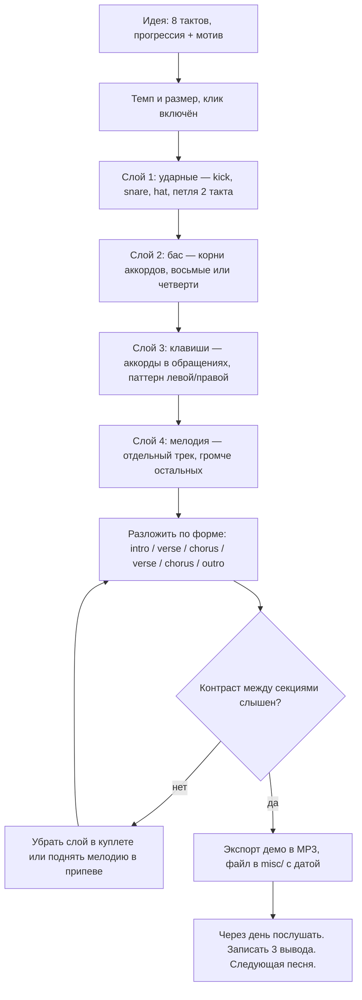
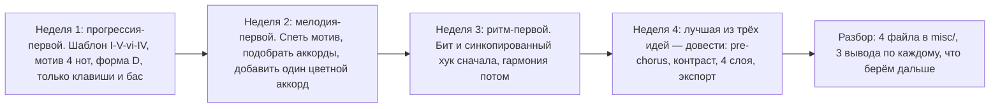

# Ритм, структура и аранжировка: из идеи в демо

## Простыми словами

У тебя есть восемь тактов: прогрессия и мотив. Песни пока нет. Песня появляется,
когда эти восемь тактов **поставлены в форму** и **окружены контрастом**.

Форма — это порядок секций: вступление, куплет, припев и так далее. Контраст — это
то, чем припев отличается от куплета: он выше, плотнее, громче, в нём чаще меняются
аккорды. Без контраста трёхминутная песня превращается в трёхминутную петлю, и это
самая частая болезнь первых песен.

Плюс есть третий слой, о котором новички забывают: **грув**. Один и тот же аккорд,
сыгранный ровно и синкопированно, — это две разные песни.

## Зачем: почему структура важнее гармонии

Потому что слушатель воспринимает не аккорды, а **изменения**. Ему нужно понимать, где
он находится: началось, развивается, вот главное, вот отдых, вот главное снова, вот
конец. Прогрессия из четырёх аккордов, поставленная в форму verse–chorus, звучит как
песня. Гениальная гармония без формы — как этюд.

Поэтому порядок работы такой: **идея → грув → форма → аранжировка → экспорт**. И
экспорт обязателен: незаконченное не учит.

## Как устроено: ритм и грув

### Темп и характер

Темп — первое решение после тональности, и он определяет жанр сильнее, чем аккорды.

| BPM | Ощущение | Что обычно бывает |
|---|---|---|
| 60–80 | медленно, дышит | баллада, рубато, арпеджио |
| 85–100 | «шагом» | поп средних темпов, соул, хип-хоп |
| 100–120 | энергично | поп, рок, фолк |
| 120–130 | танцевально | дэнс, хаус, диско (four-on-the-floor) |
| 140+ | быстро | панк, драм-н-бэйс (там часто половинное ощущение) |

**Ощущение (feel)** — отдельный от темпа параметр: ровные восьмые (straight) против
свингованных (shuffle/swing, первая восьмая длиннее). Одна и та же песня на 90 BPM в
straight и в shuffle звучит как две разные. Проверь на своей идее оба варианта — это
занимает минуту и иногда решает всё.

### Драм-паттерн в DAW: три инструмента и сетка

Для демо достаточно трёх звуков: **бочка (kick, KK)**, **рабочий (snare, SN)**,
**хэт (hi-hat, HH)**. Сетка — шестнадцатые, счёт «1 e & a 2 e & a…».

Базовый бэкбит 4/4 — бочка на 1 и 3, рабочий на 2 и 4, хэт восьмыми:

```text
      1  e  &  a  2  e  &  a  3  e  &  a  4  e  &  a
HH    x     x     x     x     x     x     x     x
SN                      o                       o
KK    o                       o
```

Три готовые вариации, которых хватит на первые песни:

```text
1) «Four on the floor» (танцевально): бочка на каждую долю
KK    o           o           o           o

2) Поп-вариация: добавлена бочка на «&» перед третьей долей
KK    o                 o     o

3) Половинное ощущение (half-time, для медленного и «тяжёлого»):
SN                                  o
KK    o                       o
```

Правило про бэкбит: **рабочий на 2 и 4 — это то, что делает музыку популярной
музыкой**. Если убрать его, всё сразу звучит «классически» или «фолково».

### Синкопированный хук

**Синкопа** — акцент не на долю, а между долями (см.
[`01-sound-and-rhythm`](../01-sound-and-rhythm/theory.md)). Это самый дешёвый способ
сделать банальную прогрессию цепкой.

```text
ровно (скучно):        аккорд на 1, 2, 3, 4
      1  &  2  &  3  &  4  &
      X     X     X     X

синкопированно (хук):  аккорд на 1, на «&» после 2, на 4
      1  &  2  &  3  &  4  &
      X        X        X
```

Практический приём: возьми свою прогрессию и сыграй её не ровными аккордами, а этим
рисунком. В девяти случаях из десяти станет лучше. Хук — это ритм плюс 3–4 ноты, и
запоминается чаще ритм, а не ноты.

### Структура песни

Секции и их работа:

| Секция | Что делает | Обычная длина |
|---|---|---|
| **Intro** (вступление) | ставит тональность, темп и настроение | 4–8 тактов |
| **Verse** (куплет) | рассказывает, держится ниже и спокойнее припева | 8–16 тактов |
| **Pre-chorus** (предприпев) | нагнетает, готовит взрыв; часто уходит на V | 4–8 тактов |
| **Chorus** (припев) | главное; самое высокое, плотное и повторяемое | 8 тактов |
| **Bridge** (бридж) | контраст и отдых; новая гармония или новый регистр | 4–8 тактов |
| **Outro** (кода) | завершает: затухание, повтор хука или один аккорд | 4–8 тактов |

Типовые формы, которые покрывают почти всю популярную музыку:

```text
A) Verse-Chorus:            intro | V1 | C | V2 | C | bridge | C | outro
B) С предприпевом:          intro | V1 | PC | C | V2 | PC | C | bridge | C | C
C) AABA (старый стандарт):  A | A | B (bridge) | A
D) Минимальная для демо:    intro(4) | V(8) | C(8) | V(8) | C(8) | outro(4)
```

Для первой песни бери форму **D**. Сорок тактов, полторы минуты, всё понятно.

### Контраст: чем припев отличается от куплета

Это главный технический раздел модуля. Четыре рычага, и достаточно двух-трёх:

1. **Регистр.** Припев выше. Мелодия куплета живёт в нижней части диапазона, припев
   уходит вверх — там же и вершина песни.
2. **Плотность.** В куплете меньше инструментов и меньше нот (например, только
   клавиши и бас); в припеве добавляются ударные, второй слой, октавы в левой руке.
3. **Скорость смены гармонии.** В куплете аккорд держится два такта, в припеве —
   меняется каждый такт. Ощущение движения возникает само.
4. **Стартовый аккорд.** Куплет начинается с vi (Am), припев — с I (C). Аккорды те
   же, ощущение разное: тот самый приём «одна прогрессия, разные точки входа» из
   [`theory.md`](./theory.md).

Проверка на контраст в один вопрос: **если выключить звук на пять секунд и включить
снова — поймёшь ли ты, куплет сейчас или припев?** Если нет — контраста нет.

### Текст: один абзац

Текст в этом курсе не главная тема, но минимум знать полезно. Главное правило —
**слоги ложатся на ритм**: сначала есть мелодия и её ритмический рисунок, потом
подбираются слова, у которых столько же слогов и совпадают акценты. Ударный слог
должен попадать на сильную долю; «за-мо́к» на слабой доле слышится как «за́-мок», и
это самая частая ошибка. Припев обычно содержит **название песни** и повторяется
дословно; куплеты меняют текст, но сохраняют ритм слогов. Если слов пока нет — пой
любые слоги («на-на-на»): это нормальный рабочий приём, он называется рыба и им
пользуются профессионалы.

## На гитаре: кто что играет

Когда играют и гитара, и клавиши, они начинают мешать друг другу, потому что живут
в одном регистре. Разделение ролей:

- **Бас** (или левая рука клавиш в низком регистре) — только корни, иногда квинты.
  Один инструмент в басу, не два.
- **Гитара** — ритм: бой или перебор, средний регистр, отвечает за грув
  ([`07-guitar-scales-and-songs`](../07-guitar-scales-and-songs/theory.md)).
- **Клавиши** — либо длинные аккорды-подклад (pad), либо арпеджио выше гитары, либо
  «чик» на слабых долях. Не то же самое, что играет гитара.
- **Мелодия** — один инструмент или голос. Два одновременно — это уже дуэт, и его
  надо писать намеренно.

Правило: **в каждом регистре — один главный инструмент**. Если гитара и клавиши
играют одинаковые аккорды в одинаковом ритме в одинаковом регистре, они звучат как
один плохо настроенный инструмент.

## На клавишах: аранжировка в DAW за четыре слоя



Практические детали, которые экономят время:

- **Пиши слоями и петлями.** Сделай 2 такта ударных и размножь копированием. Не играй
  сорок тактов вживую.
- **Бас = корни.** Самая частая ошибка новичка — сложный бас. Корень аккорда на «1»
  уже работает.
- **Клавиши не дублируют бас.** Аккорды в районе C4, бас в C2–C3.
- **Форма собирается копированием секций.** Куплет 2 = куплет 1 минус один слой или
  плюс шейкер. Не надо переигрывать.
- **Убирать полезнее, чем добавлять.** Если припев не «взрывается» — почти всегда
  надо не добавить в припев, а **убрать** из куплета.
- **Громкость.** Никакого микширования (это вне курса), но одно правило соблюди:
  мелодия громче аккордов, аккорды громче ударных, бас — ровный фон.

### Разбор известных песен римскими цифрами

Навык, который питает сочинение. Метод:

1. Найди тонику: сыграй песню и попробуй разные ноты — тоника «успокаивает».
2. **Пой басовую линию** — это почти всегда корни аккордов.
3. Переведи корни в ступени и запиши римскими цифрами.
4. Определи качество (мажор/минор) каждого аккорда на слух.
5. **Проверь на Hooktheory** (hooktheory.com) или в другом источнике аккордов.

Хорошо документированные примеры для тренировки:

- **The Beatles — «Let It Be»**, **Journey — «Don't Stop Believin'»**,
  **U2 — «With or Without You»** — I–V–vi–IV.
- **Ben E. King — «Stand By Me»** — I–vi–IV–V.
- **Radiohead — «Creep»** — I–III–IV–iv (заимствованный iv).
- **Pachelbel, Canon in D** — I–V–vi–iii–IV–I–IV–V, «канонная» прогрессия.

Смысл упражнения — не «поймать» песню, а увидеть, что разные хиты стоят на одних
шаблонах. После десяти разборов страх «мне нечего придумать» проходит: придумывать
надо мотив и грув, а гармонию можно взять готовую.

### Доведение до конца

- **Дедлайн вместо качества.** «Демо в пятницу» работает, «сделаю, когда будет
  хорошо» — нет.
- **Экспорт обязателен.** MP3 в `misc/` с датой в имени. Файл = песня закончена.
- **Послушай через день.** Не в момент создания: сегодня оценка бесполезна.
- **Три вывода после каждой песни.** Что получилось, что нет, что попробую в
  следующей. Один абзац, без самобичевания.
- **Покажи одному человеку.** Не пятидесяти. Одному, чьё мнение тебе интересно.
- **Итерируй в следующей песне, а не в этой.** Бесконечная доработка одного демо —
  ловушка; прогресс даёт количество законченных, а не совершенство одной.

### План: четыре маленькие песни за четыре недели



Ограничения, которые делают план выполнимым: **каждая песня не длиннее 1.5 минут**,
**не больше пяти аккордов**, **экспорт в конце недели независимо от качества**.

## Послушай

- **Контраст куплет/припев**: включи любую знакомую поп-песню и отметь на слух, что
  именно меняется в припеве — регистр, плотность, скорость смены аккордов. Обычно
  минимум два из трёх.
- **Бэкбит**: послушай трек и найди рабочий на 2 и 4. Потом послушай что-нибудь без
  бэкбита (вальс, классику) и почувствуй разницу в «популярности» звучания.
- **Straight против shuffle**: сыграй свою прогрессию ровными восьмыми, потом
  свингованными. Это самое быстрое упражнение на понимание грува.
- Разборы структуры и приёмов — **David Bennett Piano**, **Rick Beato**,
  **Adam Neely**, **Andrew Huang** (продакшн и грув), **12tone** (анализ).

## Типичные ошибки

- **Песня-петля.** Одна фактура сорок тактов. Нужны контраст и убирание слоёв.
- **Припев не выше куплета.** Тогда он и не припев. Поднимай мелодию.
- **Добавлять вместо убирать.** Припев «не взрывается» → облегчи куплет.
- **Сложный бас.** Корни. Просто корни.
- **Гитара и клавиши играют одно и то же.** Каша в среднем регистре.
- **Кривые секции.** 6 или 7 тактов в куплете почти всегда случайность. Считай такты.
- **Слоги против ритма.** Ударный слог на слабой доле — самая слышная ошибка текста.
- **Микшировать вместо сочинять.** Эквалайзер и компрессор — вне курса и вне задачи.
  Демо должно быть слышно, а не «звучать как радио».
- **Не экспортировать.** Проект в DAW — не песня. Файл — песня.
- **Доводить одну песню месяц.** Четыре законченные учат вчетверо больше.
- **Оценивать в момент создания.** Через день. Всегда через день.

## Словарь терминов

- **Грув (groove)** — характер ритма, ощущение движения.
- **Feel: straight / shuffle (swing)** — ровные / неровные восьмые.
- **Бэкбит (backbeat)** — рабочий барабан на слабых долях 2 и 4.
- **Four on the floor** — бочка на каждую долю.
- **Half-time** — половинное ощущение: рабочий раз в такт, звучит медленнее.
- **Синкопа (syncopation)** — акцент между долями.
- **Хук (hook)** — самая цепкая короткая часть песни, чаще ритмическая.
- **Intro / verse / pre-chorus / chorus / bridge / outro** — вступление / куплет /
  предприпев / припев / бридж / кода.
- **Форма (form)** — порядок секций песни.
- **Контраст (contrast)** — различие между секциями по регистру, плотности, гармонии.
- **Плотность (density)** — сколько инструментов и нот звучит одновременно.
- **Слой / трек (layer, track)** — отдельная партия в аранжировке.
- **Pad** — длинный аккордовый подклад.
- **Рыба (dummy lyrics)** — бессмысленные слоги вместо текста на этапе сочинения.
- **Демо (demo)** — черновая запись песни, достаточная, чтобы её понять.
- **Экспорт / рендер (export, bounce)** — сведение проекта в звуковой файл.

## См. также

- [`theory.md`](./theory.md) — прогрессии, цветной аккорд, мелодия и мотив.
- [`01-sound-and-rhythm`](../01-sound-and-rhythm/theory.md) — доли, синкопа, темп.
- [`04-chords-and-harmony`](../04-chords-and-harmony/theory.md) — шаблоны прогрессий.
- [`09-keyboard-chords-and-songs`](../09-keyboard-chords-and-songs/theory-2-accompaniment-and-daw.md)
  — запись, квантизация, паттерны аккомпанемента.
- [`07-guitar-scales-and-songs`](../07-guitar-scales-and-songs/theory.md) — гитарная
  ритм-партия.
- **Hooktheory** — hooktheory.com: прогрессии реальных песен, проверка своих разборов.
- **Open Music Theory** — openmusictheory.github.io: форма и фразировка.
- **Reaper** — reaper.fm: работа с секциями, копирование, рендер.
- **GarageBand** — справка Apple: Drummer, петли, экспорт.
- **LMMS** — lmms.io/documentation: паттерны ударных и Beat/Bassline editor.
- **Andrew Huang**, **Rick Beato**, **David Bennett Piano** — разборы аранжировки,
  грува и приёмов сочинения.
