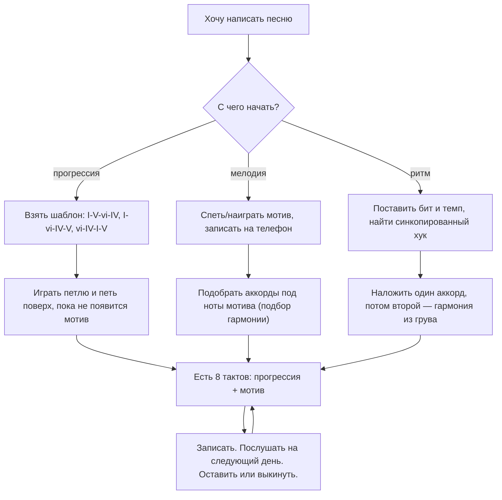

# Откуда берутся песни: прогрессия, цветной аккорд и мелодия

## Простыми словами

Песня — это очень мало материала, повторённого с вариациями. Типичная поп-песня
целиком построена на **четырёх аккордах, одном мотиве из трёх-четырёх нот и одном
ритмическом рисунке**. Всё остальное — повторы, перестановки и смена плотности.

Это хорошая новость для новичка: не нужно придумывать три минуты музыки. Нужно
придумать **восемь тактов** и научиться их разворачивать.

Второе, что стоит принять сразу: первые песни будут плохими. Это не признак
отсутствия таланта, это признак того, что их всего три. Правило: **лучше десять
законченных плохих песен, чем одна недоделанная гениальная.** Законченная песня учит,
недоделанная — нет.

## Зачем сочинять, если умеешь играть чужое

Три конкретных выигрыша:

1. **Теория становится своей.** Пока ты играешь чужое, I–V–vi–IV — факт из учебника.
   Как только ты выбираешь эту прогрессию сам, она превращается в инструмент.
2. **Слух растёт быстрее.** Сочиняя, ты постоянно проверяешь «звучит / не звучит», и
   это самая плотная тренировка уха, которая существует.
3. **Мотивация.** Своя, пусть кривая, восьмитактовая идея держит интерес лучше, чем
   двадцатая гамма.

## Как устроено: три входа в песню

Песня начинается с одного из трёх концов, и от выбора зависит следующий шаг.



**Прогрессия-первой** — самый надёжный путь для начинающего: гармония держит, петь
поверх петли легко. **Мелодия-первой** даёт более оригинальный результат, но требует
навыка подбора аккордов (модули
[`04-chords-and-harmony`](../04-chords-and-harmony/theory.md) и
[`05-ear-training-and-practice`](../05-ear-training-and-practice/theory.md)).
**Ритм-первой** — путь электронной и хип-хоп-музыки: сначала грув, гармония потом.

Попробовать нужно все три: они дают заметно разные песни, и «твой» способ выясняется
только на практике.

## Выбор тональности и прогрессии

**Тональность** выбирается по трём практическим причинам, а не по «характеру»:

- **Под инструмент.** На клавишах проще C, G, F, Am, Em. На гитаре — G, D, A, E, Em, Am
  (открытые аккорды, см.
  [`06-guitar-foundations`](../06-guitar-foundations/theory.md)).
- **Под голос.** Спой мотив; если верхние ноты кричишь, а нижние хрипишь — транспонируй.
  Удобный диапазон важнее удобных аккордов: аккорды можно взять с каподастром или через
  MIDI-транспонирование.
- **Мажор или минор.** Мажор — светлее, минор — темнее; но это грубое приближение,
  темп и фактура влияют сильнее.

**Прогрессия.** Не изобретай — бери шаблон из
[`04-chords-and-harmony`](../04-chords-and-harmony/theory.md):

| Шаблон | В C | Характер |
|---|---|---|
| I–V–vi–IV | C G Am F | универсальный поп, «работает всегда» |
| I–vi–IV–V | C Am F G | ретро, «fifties progression» |
| vi–IV–I–V | Am F C G | тот же набор, но начинается с минора — грустнее |
| I–IV–V–I | C F G C | простейшая, «народная» |
| ii–V–I | Dm G C | джазовая связка, хороша для бриджа |
| i–VI–III–VII | Am F C G | минорный вариант, очень частый в рок-балладах |

Обрати внимание: строки 1, 3 и 6 — **один и тот же набор аккордов**, только с разной
стартовой точки. Это уже готовый приём: куплет начинай с vi, припев — с I, и контраст
появится без единого нового аккорда.

Полезное ограничение на первые песни: **четыре аккорда, по одному на такт, петля из
четырёх тактов**. Всё, что сложнее, пока мешает, а не помогает.

## Один цветной аккорд

Четыре диатонических аккорда — это надёжно и слегка скучно. Дешёвый способ добавить
характер — **один** аккорд извне тональности, ровно один и на одно место.

### Заимствованный iv (borrowed iv)

В мажоре берём **минорную** субдоминанту вместо мажорной: в C-dur вместо F играем
**Fm** (F Ab C). Одна нота (A → Ab) — и появляется горечь. Работает лучше всего перед
возвратом в I.

```text
| C    | F    | C    | G    |     -> обычно
| C    | F    | Fm   | C    |     -> с заимствованным iv, звучит «кинематографично»
```

Хорошо документированный пример приёма: **Radiohead — «Creep»**, где идёт
I–III–IV–iv (в G: G–B–C–Cm). Разбор общеизвестный, но привычку заведи —
**проверь на Hooktheory** (hooktheory.com), прежде чем считать анализ своим.

### Побочная доминанта (secondary dominant)

Берём мажорный (или доминантсептаккорд) аккорд, стоящий в кварто-квинтовом отношении
к **не-тонике**. Самый частый — **V/V**, «доминанта доминанты»: в C это D или D7,
и он разрешается в G.

```text
| C    | Am   | D7   | G    |
              ^ D7 — это V/V: не входит в C-dur (в нём F#), но тянет в G
```

Слышится как «мы на секунду сдвинулись в другую тональность и вернулись». В песнях
Beatles такие аккорды встречаются постоянно (часто называют «Eight Days a Week» с его
II-аккордом) — **проверь на Hooktheory**, прежде чем цитировать разбор.

### sus как самый безопасный цвет

`sus4` и `sus2` не выводят из тональности вообще, поэтому испортить ими песню
практически невозможно:

```text
| C    | C    | Csus4 | C    |     статичный такт ожил
| G    | Gsus4 G | ...             перед припевом — классический ход
```

Правило на весь модуль: **один цветной аккорд на песню**. Два — уже эксперимент,
пять — обычно каша. Проверка простая: убери цветной аккорд и послушай. Если без него
хуже — оставляй. Если без него так же — он был не нужен.

## Мелодия поверх аккордов

Ключевая мысль: мелодия и гармония — не два независимых слоя. Мелодия **опирается**
на аккорды в предсказуемых точках и свободна между ними.

### Аккордовые ноты на сильных долях

Простое правило, из которого получается 80 % работающих мелодий: **на «1» (и вообще
на сильных долях) — нота, входящая в текущий аккорд**. Остальные ноты гаммы — между
ними, как проходящие (passing tones).

```text
аккорд:  | C          | F          | G          | C          |
доли:      1  2  3  4   1  2  3  4   1  2  3  4   1  2  3  4
мелодия:   E  D  C  D   F  E  F  G   D  E  D  C   C  -  -  -
           ^ E из C     ^ F из F     ^ D из G     ^ C из C
                 ^ D — проходящая, между E и C
```

Что делать с «неаккордовыми» нотами: ставить их на слабые доли и **уводить** в
аккордовую. Нота, повисшая на сильной доле и не решённая, звучит как ошибка — потому
что ею и является.

### Контур, мотив, повтор с вариацией

- **Мотив (motif)** — короткая узнаваемая ячейка, 3–5 нот. Это ДНК песни. Хороший
  мотив можно просвистеть после одного прослушивания.
- **Контур (contour)** — рисунок мелодии вверх-вниз. Мелодия должна иметь **форму**:
  подъём к вершине и спад. Вершина (самая высокая нота) в идеале одна на секцию, и
  стоит она в припеве, а не в куплете.
- **Повтор с вариацией.** Сыграл мотив — повтори его, но измени одну вещь: последнюю
  ноту, ритм, высоту (транспонируй на ступень). Абсолютный повтор скучен, полностью
  новая мелодия не запоминается. Формула: **повтор, повтор, повтор-с-изменением, ответ**.
- **Диапазон (range).** Держи мелодию в пределах октавы, максимум децимы. Если поёшь
  сам — проверь, что верхняя нота берётся без крика, а нижняя слышна.

### Фразы: 4 и 8 тактов, вопрос и ответ

Музыка дышит квадратами. Базовая единица — **4 такта**, стандартная секция — **8**.
Внутри восьми тактов работает схема «вопрос–ответ» (antecedent–consequent):

```text
такты 1-4: ВОПРОС  — фраза заканчивается «незакрыто», на V или на неаккордовой ноте
такты 5-8: ОТВЕТ   — та же фраза, но заканчивается на тонике: закрыто
```

Практически: возьми свои 4 такта, скопируй их, и в конце копии измени последние две
ноты так, чтобы они пришли на тонику. Восемь тактов готовы, и они звучат как
законченная мысль, а не как обрубок.

И обязательно **паузы**. Мелодия без пауз — это гамма. Оставь долю-две тишины в конце
каждой фразы: там дышит певец, и там слушатель успевает запомнить мотив.

## На гитаре и на клавишах

На **клавишах** удобно сочинять гармонию: аккорды видны, обращения под рукой, левая
даёт бас, и всё сразу пишется в DAW (см.
[`09-keyboard-chords-and-songs`](../09-keyboard-chords-and-songs/theory.md)).
На **гитаре** удобнее сочинять песни «под пение»: бой держит ритм, каподастр
транспонирует за две секунды (см.
[`07-guitar-scales-and-songs`](../07-guitar-scales-and-songs/theory.md)). Идеально —
делать наброски на том инструменте, который сейчас в руках, и не превращать это в
проблему выбора.

## Послушай

Разбирать прогрессии на слух — главное упражнение модуля. Начни с
хорошо документированных примеров:

- **I–V–vi–IV**: The Beatles — «Let It Be»; Journey — «Don't Stop Believin'»;
  U2 — «With or Without You». Ощути, насколько разные песни выходят из одного набора.
- **I–vi–IV–V**: Ben E. King — «Stand By Me».
- **Заимствованный iv**: Radiohead — «Creep» (I–III–IV–iv).
- **Прогрессия «Канона»** (I–V–vi–iii–IV–I–IV–V) — Pachelbel, Canon in D; она же
  цитируется в множестве поп-песен.

Метод прослушивания: определи тональность, потом **пой басовую линию** — она почти
всегда и есть корни аккордов. Потом переведи в римские цифры. И **проверь на
Hooktheory** или в другом источнике: слух новичка регулярно путает vi и IV.

Из образовательных разборов по этой теме — **David Bennett Piano** (обзоры
прогрессий и приёмов в конкретных песнях), **Rick Beato**, **12tone**, **Adam Neely**.

## Типичные ошибки

- **Ждать вдохновения.** Идея приходит во время работы, а не до неё. Садись и делай
  восемь тактов.
- **Не заканчивать.** Двадцать набросков по четыре такта — это ноль песен. Правило:
  доводить до экспорта файла, даже если стыдно.
- **Слишком много аккордов.** Восемь аккордов в куплете не делают песню интереснее,
  они делают её незапоминающейся.
- **Пять цветных аккордов.** Один. Всегда один.
- **Мелодия без формы.** Ноты ходят вокруг одной высоты, вершины нет, контур плоский.
- **Мелодия без пауз.** Певцу негде дышать, слушателю негде запомнить.
- **Неаккордовая нота на сильной доле** без разрешения — самая частая причина «звучит
  как-то не так».
- **Кривые фразы.** 5 или 7 тактов в секции почти всегда получаются случайно, а не
  намеренно, и слушаются как сбой.
- **Мелодия вне своего голоса.** Написал в C, поёшь на пределе — транспонируй, это
  бесплатно.
- **Судить идею в момент создания.** Записал — послушай **на следующий день**. Сегодня
  всё кажется либо гениальным, либо ужасным.

## Словарь терминов

- **Прогрессия (chord progression)** — последовательность аккордов.
- **Римские цифры (Roman numerals)** — обозначение аккордов по ступеням: I, IV, V,
  vi (строчные — минорные).
- **Заимствованный аккорд (borrowed chord)** — аккорд из одноимённой тональности,
  например Fm в C-dur.
- **Побочная доминанта (secondary dominant, V/V)** — доминанта не к тонике, а к
  другому аккорду.
- **Мотив (motif)** — короткая узнаваемая мелодическая ячейка.
- **Контур (contour)** — рисунок движения мелодии вверх/вниз.
- **Аккордовая нота (chord tone)** — нота, входящая в текущий аккорд.
- **Проходящая нота (passing tone)** — неаккордовая нота между двумя аккордовыми.
- **Фраза (phrase)** — законченная мелодическая мысль, обычно 4 такта.
- **Вопрос–ответ (antecedent–consequent)** — пара фраз: незакрытая и закрытая.
- **Диапазон (range)** — расстояние от самой низкой до самой высокой ноты мелодии.
- **Тоника (tonic)** — главный аккорд/нота тональности, точка покоя.
- **Разрешение (resolution)** — приход напряжённой ноты или аккорда в устойчивый.

## См. также

- [`04-chords-and-harmony`](../04-chords-and-harmony/theory.md) — прогрессии, функции,
  подбор аккордов к мелодии.
- [`03-scales-and-intervals`](../03-scales-and-intervals/theory.md) — тональности.
- [`05-ear-training-and-practice`](../05-ear-training-and-practice/theory.md) — подбор
  по слуху.
- [`theory-2-structure-and-arrangement.md`](./theory-2-structure-and-arrangement.md) —
  ритм, структура, аранжировка, план на четыре недели.
- **Hooktheory** — hooktheory.com и книги «Hooktheory I / II»: прогрессии реальных
  песен римскими цифрами.
- **Open Music Theory** — openmusictheory.github.io: фразировка, каденции, форма.
- **Michael Pilhofer & Holly Day — «Music Theory For Dummies»** — мотив и фразировка
  простым языком.
- **David Bennett Piano**, **Rick Beato**, **12tone** — разборы приёмов в песнях.
