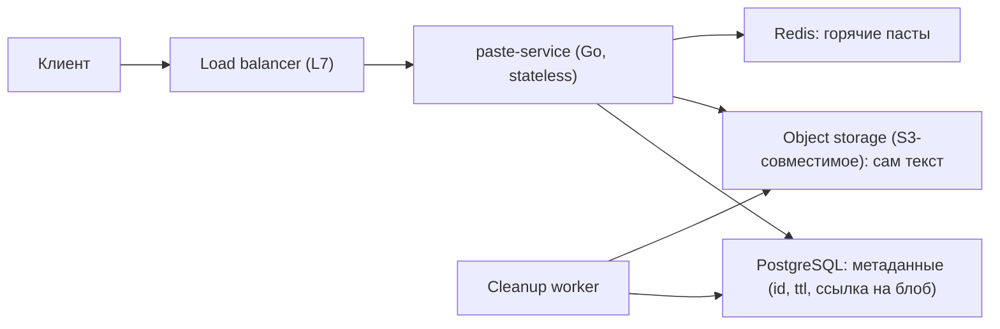

# Урок 01 — Каркас целиком: «спроектируйте сервис для пасты текста»

Задача нарочно простая (аналог Pastebin): вставил текст → получил ссылку → по ссылке текст
читается. Цель урока — не решить её красиво, а **прогнать каркас от начала до конца** и
почувствовать, сколько времени занимает каждый шаг.

## Разогрев

- Назови восемь шагов каркаса, не подглядывая.
- Сколько секунд в сутках и зачем это число?
- Чем функциональное требование отличается от нефункционального?

## Шаг 1–2. Вопросы и требования (цель — 6 минут)

Вопросы, которые задаёт сильный кандидат:

1. Только текст или файлы тоже? → **только текст**, до 1 МБ.
2. Паста приватная/публичная? Нужна ли авторизация? → публичная по ссылке, авторизации нет.
3. Срок жизни? → опциональный TTL (час / день / навсегда).
4. Масштаб? → предположим **1 млн новых паст в сутки**, чтений в **10 раз** больше.
5. Кастомные ссылки? → нет, генерируем сами.
6. Что вне области? → редактирование, синтаксическая подсветка, аналитика.

Фиксируем на доске:

| Тип | Требование |
|---|---|
| Функциональное | создать пасту (текст + TTL) → вернуть URL |
| Функциональное | прочитать пасту по URL |
| Функциональное | автоудаление по TTL |
| Нефункциональное | 1 млн записей/сутки, 10 млн чтений/сутки |
| Нефункциональное | p99 чтения ≤ 200 мс, записи ≤ 500 мс |
| Нефункциональное | чтение доступно 99.99 %, запись 99.9 % |
| Нефункциональное | ссылка не должна угадываться перебором |
| Нефункциональное | текст неизменяем после создания (упрощает кэш) |

Последняя строка — подарок себе: **неизменяемые данные не нужно инвалидировать**. Скажи это
вслух, интервьюер оценит.

## Шаг 3. Оценки (цель — 3 минуты)

- write QPS = 10^6 / 10^5 = **~12**, пик ×3 ≈ **35**. Это смешно, одна машина.
- read QPS = 10^7 / 10^5 = **~120**, пик ≈ **350**. Тоже смешно.
- Средний размер пасты возьмём 10 KB (люди редко вставляют мегабайт).
- В сутки: 10^6 × 10 KB = **10 GB/день** → 3.6 TB/год → за 5 лет ≈ **18 TB**.
- Трафик на чтение: 120 × 10 KB = 1.2 MB/s ≈ **10 Mbps**. Ничто.

Вывод вслух: «нагрузка по QPS мизерная, узкое место — **объём хранения**, 18 ТБ текста.
Значит главный разговор не про масштабирование сервиса, а про то, **где хранить блобы**».
Это и есть настоящее умение оценивать: числа сами показали, куда копать.

## Шаг 4–5. API и high-level (цель — 8 минут)

```text
POST /pastes           {text, ttl}          -> 201 {id, url}
GET  /pastes/{id}                           -> 200 {text, created_at, expires_at}
GET  /{id}                                  -> 200 text/plain (человеческий доступ)
```



Проговариваем решения:

- **Метаданные и текст разделены.** В PostgreSQL — маленькие строки (id, размер, TTL,
  ключ блоба), в объектное хранилище — сам текст. Почему: 18 ТБ текста в реляционной базе
  раздувают бэкапы и кэш страниц, а объектное хранилище стоит в разы дешевле за терабайт и
  масштабируется само. Цена — два обращения вместо одного и отсутствие транзакции между
  ними (лечится порядком операций: сначала блоб, потом метаданные).
- **ID.** 10^6 паст/сутки за 5 лет ≈ 1.8×10^9 записей. base62 из 7 символов даёт 62^7 ≈
  3.5×10^12 — с запасом. Генерируем **случайные** 7 символов (требование «не угадывается»),
  коллизию ловим уникальным индексом и повторяем.
- **Кэш.** Данные неизменяемы → кэшируем агрессивно, TTL можно ставить длинный, инвалидация
  нужна только на удаление.
- **TTL.** Не полагаться только на воркер: при чтении проверять `expires_at` и отдавать 404,
  даже если физически данные ещё не удалены.

```drill
type: multiple-choice
prompt: "Почему в этой задаче текст пасты кладут в объектное хранилище, а не в PostgreSQL?"
options: ["PostgreSQL не умеет хранить текст больше 1 KB", "18 ТБ блобов раздувают бэкапы и кэш страниц БД, а объектное хранилище дешевле за терабайт и масштабируется само", "Так требует REST", "Объектное хранилище быстрее по задержке"]
answer: "18 ТБ блобов раздувают бэкапы и кэш страниц БД, а объектное хранилище дешевле за терабайт и масштабируется само"
check: exact
hint: Смотри, какое число оказалось узким местом.
```

## Шаг 6. Deep dive: удаление по TTL (цель — 10 минут)

Наивный вариант: `DELETE FROM pastes WHERE expires_at < now()` раз в минуту. Что не так:
на 1.8 млрд строк это тяжёлый скан, длинная транзакция и раздувание таблицы. Варианты:

1. **Партиционирование по дате истечения** — удаление превращается в `DROP` партиции,
   мгновенно и без вакуума. Цена: сложнее схема, партиции надо создавать заранее.
2. **Удаление батчами** с `LIMIT 1000` в цикле и паузами — просто, не блокирует, но
   работает вечно на больших объёмах.
3. **Lifecycle policy в объектном хранилище** для блобов + батчи для метаданных — самое
   дешёвое: физическое удаление 18 ТБ делает не твой код.

Выбор: (3) + (1). Проговариваем цену: удаление становится **eventual** — паста может ещё
пару часов лежать на диске, поэтому проверка `expires_at` на чтении обязательна.

## Шаг 7. Отказы

- **Redis умер** → все чтения идут в объектное хранилище + БД; 350 QPS они выдержат,
  деградация по задержке, не отказ. Это надо сказать вслух: «кэш здесь не для выживания, а
  для задержки и денег».
- **Объектное хранилище недоступно** → чтение отдаёт 503, метаданные не помогают. Смягчение:
  кэш на краю, репликация в другой регион (дорого, вряд ли нужно).
- **БД на запись недоступна** → создание паст 503, чтение работает. Разные SLO на чтение и
  запись — оправданы.

```drill
type: free-form
prompt: "Проговори вслух wrap-up этой задачи за 45 секунд: что построили, три главных решения, что упрётся при росте в 100 раз."
answer: "Построили: stateless Go-сервис за L7-балансировщиком, метаданные в PostgreSQL, текст в объектном хранилище, Redis для горячих чтений, воркер и lifecycle-политика для TTL. Главные решения: разделение метаданных и блобов (дешёвое хранение 18 ТБ), случайный base62-ID из 7 символов (неугадываемость + запас на 3.5×10^12), проверка expires_at на чтении (удаление eventual). При росте в 100 раз: 1.2 PB хранения и 35k read QPS — упрётся PostgreSQL с метаданными, шардирую по хэшу id; кэш выносим в шардированный кластер с consistent hashing; чтение уводим на CDN, так как пасты неизменяемы."
check: manual
```

## Итог

Каркас работает даже там, где задача «слишком простая»: вопросы вырезали лишнее, оценки
сами нашли узкое место (объём, а не QPS), схема получилась в пять боксов, а deep dive нашёлся
в самом скучном месте — в удалении по TTL. Запомни главный ход урока: **числа определяют, о
чём разговор**. Если бы чтений было 300 000 в секунду, мы бы говорили про CDN и кэш, а не
про партиции.
