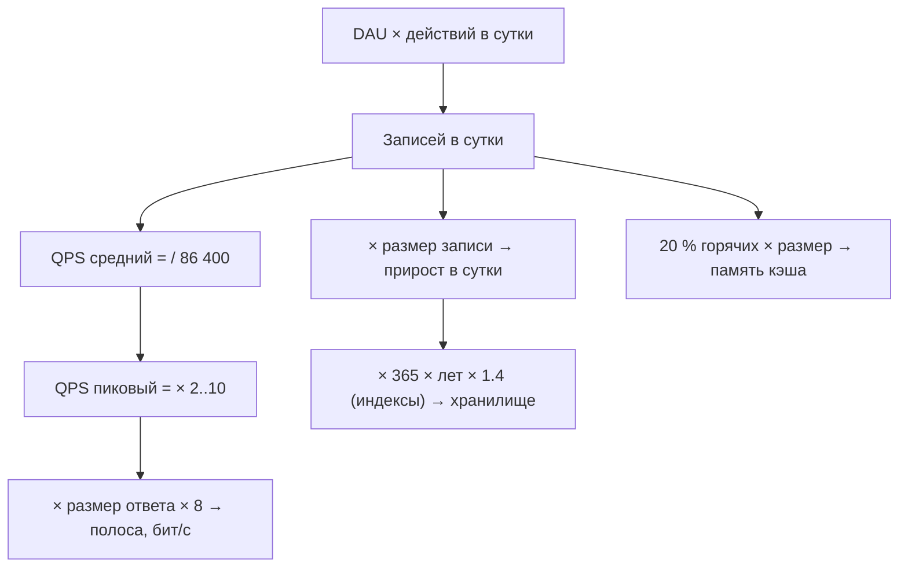

# Урок 02 — Тренировка оценок на салфетке

Цель: довести до автоматизма четыре расчёта — **QPS, объём хранения, полоса, память** — и
привычку сразу делать из числа архитектурный вывод. Держи под рукой бумагу; считать в
голове не обязательно, но каждый шаг проговаривай с единицами.

## Разогрев

- 10^5 — что это за число в оценках?
- Байты в биты — во сколько раз и когда это важно?
- Коэффициент пика: когда 3, когда 10?

## Порядок расчёта — всегда один



Ключ к скорости — **сначала «в сутки», потом всё остальное**. Не пытайся считать QPS
напрямую из DAU, это лишний шаг в голове.

## Задача A. Соцсеть: лента

Дано: 100 млн DAU; каждый пишет 0.2 поста в сутки; каждый открывает ленту 10 раз в сутки, в
ленте 20 постов; пост ≈ 1 KB текста + метаданные.

**Записи.** 100e6 × 0.2 = 2×10^7 постов/сутки → 2×10^7 / 10^5 = **200 write QPS**, пик ×3 ≈
**600**. Вывод: запись — не проблема, одна база это выдержит.

**Чтения.** 100e6 × 10 = 10^9 открытий ленты/сутки → **10 000 QPS**, пик ≈ **30 000**. Но
каждое открытие — это 20 постов, то есть до **600 000 чтений постов/с** в пике, если собирать
ленту наивно. Вот здесь и рождается разговор про fan-out и кэш: read/write ratio получился
не 50:1, а фактически 3000:1.

**Хранение.** 2×10^7 × 1 KB = 20 GB/сутки → 7.3 TB/год → за 5 лет ≈ 36 TB, ×1.4 на индексы ≈
**50 TB**. Вывод: шардировать придётся, но не завтра.

**Кэш.** Люди читают свежее: горячий набор — посты за последние 2 суток = 4×10^7 × 1 KB =
**40 GB**. Плюс собранные ленты для активных пользователей. Вывод: кластер Redis на
несколько нод, не одна.

```drill
type: fill-in
prompt: "В задаче A read/write ratio по постам получился ≈ ____ : 1 (учитывая 20 постов на одно открытие ленты)."
answer: 3000 | ~3000 | 3000:1
check: fuzzy
hint: 600 000 чтений постов/с против 200 записей/с.
```

## Задача B. Видеосервис: считаем полосу, а не QPS

Дано: 10 млн просмотров/сутки; средний просмотр 8 минут; битрейт 4 Mbps; загрузок 50 тыс./сутки
по 500 MB исходника.

**Раздача.** Один просмотр = 4 Mbps × 480 с = 1 920 Mb = **240 MB**. В сутки: 10^7 × 240 MB =
2.4×10^15 B = **2.4 PB/день**. Полоса: 2.4×10^15 × 8 / 86 400 ≈ **220 Gbps** средняя, пик ×3 ≈
**660 Gbps**.

**Вывод, который делает интервью.** 660 Gbps своими серверами — это десятки машин только на
раздачу и счёт за трафик размером с зарплатный фонд. Значит: CDN обязателен, и обсуждать
надо не «какую БД», а долю попаданий в кэш CDN, размер чанка и несколько качеств
(транскодирование).

**Хранение.** 50 000 × 500 MB = 25 TB/сутки исходников; плюс транскодированные версии
(обычно суммарно ×1.5 от исходника) ≈ 62 TB/сутки → **22 PB/год**. Вывод: холодное хранение
и удаление исходников после транскода — не «оптимизация», а необходимость.

**QPS.** 10^7 / 10^5 = 120 запросов «начать просмотр» в секунду. Смешно. Именно поэтому в
таких задачах бессмысленно долго считать QPS: узкое место в другой размерности.

```drill
type: multiple-choice
prompt: "В задаче B главный архитектурный вывод из чисел — какой?"
options: ["Нужен шардинг PostgreSQL по user_id", "Нужен CDN и транскодирование: узкое место — полоса (сотни Gbps) и объём (PB), а не QPS", "Нужна Kafka для 120 QPS", "Нужен Redis для метаданных видео"]
answer: "Нужен CDN и транскодирование: узкое место — полоса (сотни Gbps) и объём (PB), а не QPS"
check: exact
```

## Задача C. Сколько инстансов сервиса

Дано: пик 30 000 QPS; хендлер — 1 запрос в кэш и 1 в БД, CPU-работа ~1 мс; целевой p99 —
100 мс; инстанс — 4 ядра.

Грубая модель: один Go-инстанс на 4 ядрах при 1 мс CPU на запрос теоретически даёт
4 000 RPS, но на практике планируй загрузку ядер не выше 50–60 % (иначе очередь и хвост
задержки взлетают) → **~2 000 RPS на инстанс**.

30 000 / 2 000 = **15 инстансов**. Прибавь запас на отказ зоны: если зон три и одна может
выпасть, нужно, чтобы 2/3 мощности хватало → 15 × 1.5 ≈ **23**, округляем до **24** (по 8 на
зону). Проговори вслух и это, и допущение про 50 % загрузки — интервьюер ищет именно такие
поправки.

Полезная привычка: сразу назвать, чем ограничен инстанс. Здесь — CPU. Если бы хендлер ждал
БД 20 мс, ограничением стал бы **пул соединений к базе**, а не ядра (см.
[`../../03-databases-replication-sharding/theory.md`](../../03-databases-replication-sharding/theory.md)).

```drill
type: free-form
prompt: "Сервис нотификаций: 200 млн уведомлений в сутки, полезная нагрузка 500 байт, пик ×5, хранить доставленные 30 дней. Посчитай вслух QPS, хранение, размер очереди на 10 минут отставания."
answer: "200e6 / 10^5 = 2 000 QPS средний; пик ×5 = 10 000 QPS. Хранение: 2×10^8 × 500 B = 100 GB/сутки; за 30 дней = 3 TB (+индексы ×1.4 ≈ 4.2 TB) — влезает в один PostgreSQL с партиционированием по дням и DROP старых партиций. Очередь: при отставании 10 минут в пике накопится 10 000 × 600 = 6×10^6 сообщений × 500 B = 3 GB — спокойно держится на диске брокера, память не нужна. Вывод: узкое место — не хранение и не брокер, а исходящие интеграции (APNs/FCM/SMTP) с их лимитами; значит нужны воркеры с rate limiting и retry с backoff."
check: manual
hint: Размер очереди = пиковый QPS × время отставания × размер сообщения.
```

## Итог

Четыре расчёта, один порядок, и обязательный шаг после каждого числа — **«и что из этого
следует»**. Задача A показала, что реальный read/write ratio может быть в 60 раз больше
наивного; B — что бывают задачи, где QPS вообще не важен; C — что число инстансов считается
через загрузку ядер и запас на отказ зоны. Ошибка в 2 раза здесь никого не смущает; ошибка в
единицах (байты вместо бит) или отсутствие чисел — смущает сильно.
