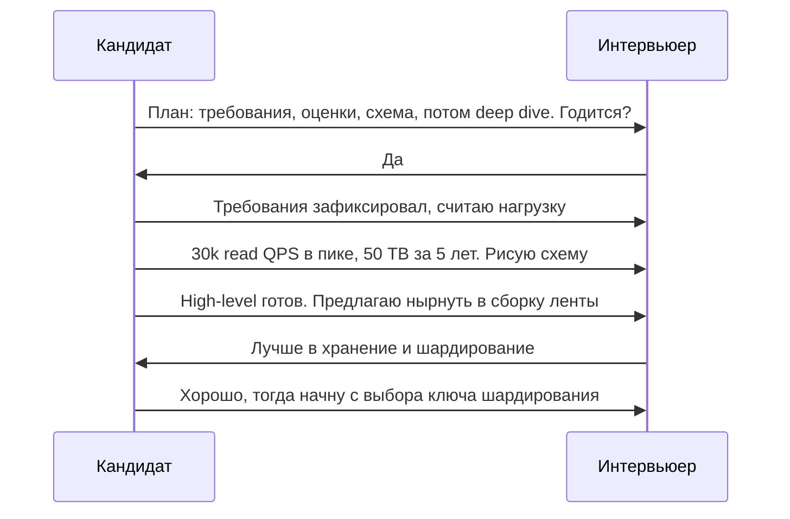

# Урок 03 — Как говорить и чего не делать

Технически сильные инженеры проваливают system design интервью в основном не из-за
незнания, а из-за **речи**: молчат, прыгают, спорят, забывают вслух объяснить очевидное для
себя. Этот урок — про то, как звучать.

## Разогрев

- Формула сильного trade-off ответа — какая?
- Как правильно сказать «это зависит»?
- Зачем каждые 5–10 минут проверять направление разговора?

## Правило первое: интервьюер не читает мысли

Всё, что ты не сказал, не существует. Ты можешь мысленно отвергнуть три варианта и выбрать
четвёртый — оценят только четвёртый, а отвергнутые три (то есть вся твоя эрудиция) пропадут.
Поэтому проговаривай **и отброшенные варианты**: «можно было бы взять long polling, но при
10 млн одновременных клиентов это лишние соединения на каждый цикл, поэтому беру WebSocket».

Форма, к которой стоит привыкнуть: **«вижу проблему → вижу варианты → выбираю по критерию →
называю цену»**. Четыре такта, 15–20 секунд речи. Прогони её как мантру десять раз на любом
своём рабочем решении.

## Правило второе: веди, а не следуй



Заметь: кандидат трижды **предложил** следующий шаг и один раз спокойно принял коррекцию.
Это не подчинение и не борьба — это ведение встречи. Интервьюер, которому не приходится
вытягивать ответ вопросами, ставит галочку «senior communication» почти автоматически.

## Правило третье: не молчи, но и не болтай

Пауза дольше 10 секунд читается как «завис». Если нужно подумать — озвучь, о чём думаешь:
«секунду, взвешиваю, читать ленту с реплики или из кэша; критерий — допустимое отставание».
Это одновременно даёт время и показывает мышление.

Обратная крайность — поток сознания без структуры. Лечится каркасом: всегда знай, на каком
из восьми шагов ты находишься, и объявляй переходы: «с требованиями закончил, перехожу к
оценкам».

```drill
type: multiple-choice
prompt: "Ты не знаешь, как устроен консенсус в etcd, а вопрос про него. Лучшая реакция?"
options: ["Придумать правдоподобное объяснение", "Молча думать минуту", "Честно назвать границу знания и рассуждать от свойств: «детали Raft помню поверхностно; мне важно, что etcd даёт линеаризуемое чтение и выбор лидера, значит я могу опереться на него для распределённой блокировки, а цена — запись через кворум и чувствительность к сетевым разделениям»", "Сменить тему на то, что знаешь"]
answer: "Честно назвать границу знания и рассуждать от свойств: «детали Raft помню поверхностно; мне важно, что etcd даёт линеаризуемое чтение и выбор лидера, значит я могу опереться на него для распределённой блокировки, а цена — запись через кворум и чувствительность к сетевым разделениям»"
check: exact
hint: Честность + рассуждение от свойств компонента сильнее вранья и сильнее молчания.
```

## Анти-паттерны: галерея

| Анти-паттерн | Как звучит | Почему минус | Как исправить |
|---|---|---|---|
| Buzzword-дизайн | «Поставим Kafka и Cassandra» | нет причин, нет цены | назвать проблему, которую решает компонент |
| Прыжок в схему таблиц | `CREATE TABLE users (...)` на 3-й минуте | требования не собраны | сначала вопросы и числа |
| Гигантизм | шардинг и мультирегион для 100 QPS | не умеет считать | назвать порог усложнения |
| Молчаливый художник | рисует 10 минут без слов | нечего оценивать | проговаривать каждую стрелку |
| Идеальный high-level | 30 минут на боксы | нет глубины | таймбокс и переход к deep dive |
| Спор до конца | «нет, мой вариант лучше» | плохой командный сигнал | «интересно, давайте посмотрим, где мой ломается» |
| Ноль отказов | ни слова про «а если умрёт» | не production-мышление | по каждому боксу: умер / тормозит / перегружен |
| Средние вместо перцентилей | «в среднем 50 мс» | скрывает хвост | p95/p99 и причины хвоста |
| Забыть про деньги | решение втрое дороже нужного | не инженерный, а академический ответ | одна фраза про стоимость и что покупаем |

Отдельно про **«зависит»**. Это лучший ответ и худший одновременно — вопрос в форме.
Сравни:

- ❌ «Ну, тут зависит от требований».
- ✅ «Зависит от того, можем ли мы терпеть отставание чтения. Если да — читаем с
  асинхронных реплик, это дёшево и масштабируется линейно. Если нужен read-your-writes —
  свои записи читаем с лидера или ставим sticky-сессию на несколько секунд. Я бы взял
  первое, потому что в требованиях мы разрешили лаг в секунды».

Разница — в наличии **критерия** и **обеих ветвей**.

```drill
type: free-form
prompt: "Перепиши вслух в сильную форму: «Здесь нужен Redis, он быстрый». Уложись в 20 секунд."
answer: "«В пике 30 000 чтений в секунду по узкому набору ключей, а данные допускают отставание в секунды. Варианты: read-реплики PostgreSQL или кэш в памяти. Реплики дают ту же модель данных, но каждая стоит как база и всё равно упрётся в диск; кэш в памяти даёт задержку ~0.5 мс вместо ~5 мс и дешевле по железу. Беру Redis, платим сложностью инвалидации и риском cache stampede при промахе — закрою singleflight и джиттером TTL.»"
check: manual
hint: Проблема → варианты → критерий → выбор → цена.
```

```drill
type: free-form
prompt: "Интервьюер молчит и просто кивает 10 минут. Что делать и почему это нормально?"
answer: "Это частая тактика: проверяют, способен ли кандидат вести разговор без подпорок. Что делать: продолжать по каркасу, объявляя переходы («перехожу к оценкам», «high-level готов»); самому задавать вопросы-развилки («интереснее хранение или доставка?»); самому вводить failure-режимы и trade-off'ы; следить за таймбоксом. Не делать: замолкать в ожидании подсказки, спрашивать «всё правильно?» — вместо этого «вот моё допущение, если оно неверно, скажите»."
check: manual
```

## Скрипт первых трёх минут (выучить наизусть)

Начало — единственное место, где заготовка полезна: она снимает стартовую панику и сразу
задаёт тон.

1. «Давайте я сначала уточню требования, потом посчитаю нагрузку, потом нарисую high-level,
   и дальше нырнём туда, куда вам интереснее. Хорошо?»
2. «Главные сценарии, которые я обязан поддержать, — вот эти два. Всё остальное я вынесу за
   область, если вы не против».
3. «По масштабу предположу вот такие числа; поправьте, если у вас другие».
4. «Фиксирую: <читает список требований с доски>. Дальше все решения буду сверять с этим
   списком».

Дальше заготовки заканчиваются — начинается настоящая работа. Но эти четыре реплики уже
дают интервьюеру три галочки: структура, инициатива, работа с неопределённостью.

## Правило четвёртое: озвучивай допущения как допущения

Есть большая разница между «у нас 10 миллионов пользователей» и «предположу 10 миллионов
пользователей — это моё допущение, поправьте». Первое звучит как выдумка, второе — как
инженерная работа. То же самое с числами внутри дизайна: «беру hit rate кэша 90 %, потому что
данные горячие и почти не меняются; если он окажется 50 %, нагрузка на базу вырастет в пять
раз, и тогда я добавлю второй слой кэша». Ты одновременно даёшь оценку, честно помечаешь
неуверенность и показываешь план на случай, если ошибся. Это ровно то поведение, которого от
тебя ждут в реальном проекте, и интервьюер это считывает мгновенно.

## Как это тренировать

Речь не улучшается от чтения. Рабочий режим: берёшь задачу из
[`../../10-classic-interview-problems/index.md`](../../10-classic-interview-problems/index.md),
ставишь таймер на 45 минут, **говоришь вслух** и записываешь себя на диктофон. Потом
слушаешь и считаешь: сколько раз возникла пауза дольше 10 секунд; сколько чисел прозвучало;
сколько раз назвал цену решения; сколько компонентов проверил на отказ. Четыре счётчика —
это и есть рубрика, по которой тебя оценят. Три-четыре записанных прогона обычно убирают
самое неприятное — привычку молчать в момент размышления.

## Итог

Сильный ответ звучит одинаково у всех сильных кандидатов: короткие такты «проблема →
варианты → критерий → цена», объявленные переходы между шагами каркаса, числа в каждом
утверждении про масштаб, честно названные границы знания и постоянный вопрос «а что, если
это упадёт». Всё остальное — техническая начинка, которую дают модули 02–10. Речь тренируется
только вслух и только с таймером: пять разобранных задач, проговорённых в голос, дают больше,
чем пятьдесят прочитанных.
