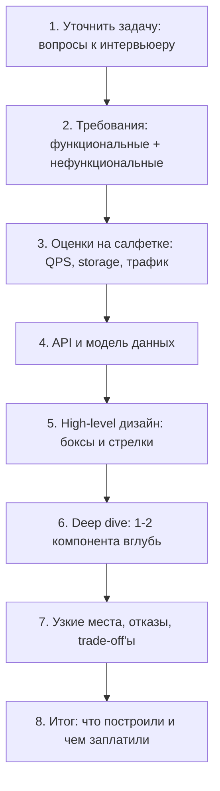
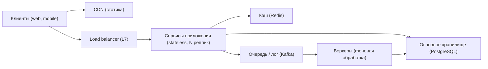
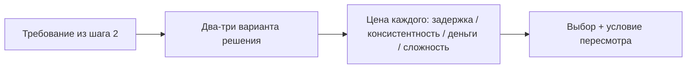
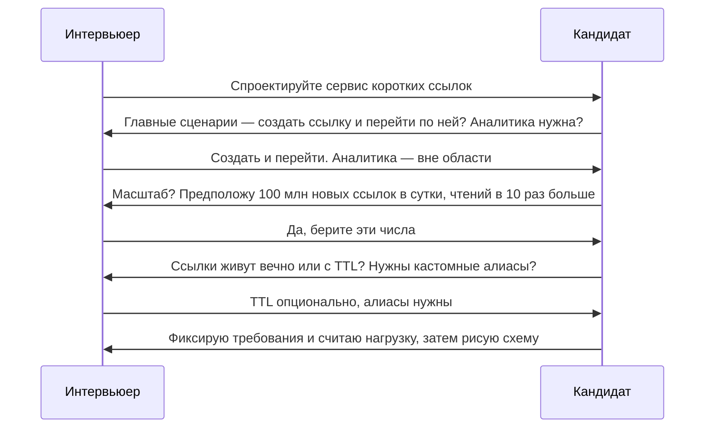

# Каркас интервью и оценки на салфетке

## Простыми словами: что такое system design

**System design** — это проектирование системы «сверху»: какие есть компоненты, кто с кем
разговаривает, где лежат данные, что произойдёт, когда пользователей станет в сто раз
больше, и что случится, когда одна из железок умрёт в три часа ночи.

Простая аналогия. Ты умеешь класть кирпичи — писать хендлеры, SQL-запросы, горутины. System
design — это работа архитектора дома: сколько этажей, где несущие стены, где водопровод,
что делать при пожаре. Архитектор не кладёт кирпичи, но если он ошибётся, дом сложится
независимо от качества кладки.

Ключевое отличие от алгоритмической задачи: **правильного ответа нет**. Есть набор решений,
у каждого своя цена. Задача — выбрать осознанно и объяснить, что ты купил и чем заплатил.

Ещё одно отличие, которое сбивает с толку именно опытных инженеров: в обычной работе ты
проектируешь **внутри известного контекста** — знаешь нагрузку, знаешь стек, знаешь, что
терпит бизнес. На интервью контекста нет, и половина работы — его создать самому: задать
вопросы, а на что не ответили — предположить вслух и пометить как предположение. Инженер,
который ждёт полного ТЗ, на этом интервью выглядит беспомощным, хотя в жизни может быть
отличным. Это тренируемый навык, и именно ради него существует этот модуль.

## Зачем это вообще спрашивают

Компания хочет узнать не «знает ли кандидат про Kafka», а другое: можно ли отдать ему
незнакомую расплывчатую задачу и получить работающий план вместо паники. Проверяют пять вещей:

| Что оценивают | Как это выглядит в ответе |
|---|---|
| Работа с неопределённостью | уточняющие вопросы вместо мгновенного кода |
| Структурность | каркас, движение сверху вниз, а не хаотичные прыжки |
| Технический багаж | знает компоненты (кэш, очередь, репликация) и их цену |
| Числа | оценивает нагрузку, а не говорит «ну, много» |
| Коммуникация | думает вслух, слышит подсказки, не спорит до посинения |

Полезная переформулировка: интервьюер представляет, как ты будешь вести проектное обсуждение
в его команде. Он оценивает **процесс**, а схема на доске — побочный продукт.

### Рубрика по грейдам

Полезно понимать, чем middle отличается от senior в глазах интервьюера — это буквально
разные строки в оценочной форме:

| Сигнал | Middle | Senior |
|---|---|---|
| Требования | уточняет по подсказке | уточняет сам, вырезает лишнее из области |
| Компоненты | знает, что такое кэш и очередь | знает, чем они ломаются и что делать |
| Числа | считает, если попросят | считает сам и делает из чисел выводы |
| Глубина | описывает решение | сравнивает 2–3 варианта и защищает выбор |
| Отказы | вспоминает по вопросу | сам гоняет систему по failure-режимам |
| Разговор | отвечает | ведёт: предлагает план, следит за временем |

Из таблицы видно главное: senior-уровень — это не знание большего количества технологий, а
**инициатива и цена решений**. Кандидат, который сам сказал «а вот здесь у нас горячий ключ,
и вот что я с ним сделаю», уже показал больше, чем тот, кого об этом спросили.

## Формат: 45–60 минут, и они пролетают

Типичная структура (интервьюеры редко проговаривают её вслух, но держат в голове):

| Минуты | Этап | Доля времени |
|---|---|---|
| 0–2 | постановка задачи интервьюером | — |
| 2–10 | уточнение требований, функциональные и нефункциональные | ~15 % |
| 10–15 | оценки на салфетке (QPS, объём, трафик) | ~10 % |
| 15–25 | high-level дизайн: боксы и стрелки | ~20 % |
| 25–45 | deep dive в 1–2 компонента по выбору интервьюера | ~35 % |
| 45–55 | узкие места, отказы, trade-off'ы | ~15 % |
| 55–60 | итог и вопросы кандидата | ~5 % |

Главный вывод из таблицы: **на всю схему у тебя ~10 минут**, и это нормально. Схема должна
быть грубой. Глубина приходит на deep dive, и то только в одном-двух местах. Кандидаты,
которые 30 минут рисуют идеальный high-level, до deep dive просто не доходят — и получают
«не показал глубины».

## Каркас ответа



Это не ритуал ради ритуала. Каждый шаг снимает часть неопределённости, чтобы следующий был
осмысленным: без требований непонятно, что оценивать; без оценок непонятно, нужен ли шардинг;
без high-level непонятно, куда копать.

### Шаг 1–2. Требования: функциональные vs нефункциональные

**Простыми словами.** Функциональные требования — *что система делает* («пользователь
загружает видео», «подписчик видит ленту»). Нефункциональные — *насколько хорошо она это
делает*: сколько пользователей, какая задержка, какая доступность, насколько свежие данные,
сколько это стоит.

Аналогия: функциональное требование к машине — «едет и тормозит». Нефункциональное —
«разгон до 100 за 6 секунд, ломается раз в 5 лет, жрёт 7 литров». Заказывать машину, не
сказав второе, бессмысленно.

Чеклист вопросов, который стоит выучить как стихотворение:

- **Кто пользователь и какой главный сценарий?** Один-два, не десять. «Что важнее: писать
  или читать?»
- **Масштаб.** Сколько DAU (daily active users)? Сколько действий на пользователя в день?
  Рост?
- **Read/write ratio.** Соцсеть — 100:1 в пользу чтения; система метрик — наоборот.
- **Размер объекта.** Твит 300 байт или видео 100 МБ — это разные системы.
- **Задержка.** Что должно быть быстрым: чтение или запись? p99 — 100 мс или 2 с?
- **Консистентность.** Можно ли показать данные с задержкой в секунду? В минуту?
- **Доступность.** 99.9 % или 99.99 %? Что происходит при отказе целого дата-центра?
- **Что вне области.** Регистрация, оплата, аналитика, мобильные клиенты — вырезай явно.

Важный приём: **зафиксируй ответы вслух и на доске**. «Итак: 10 миллионов DAU, чтения к
записям 100 к 1, лента может отставать на секунды, запись должна быть подтверждена сразу.
Я строю под это». Дальше этот список — твоя защита: любое решение сверяется с ним.

### Шаг 3. Оценки на салфетке (back-of-envelope)

**Простыми словами.** Это грубая арифметика, чтобы понять порядок величины: влезет ли всё в
одну машину, нужна ли БД на 10 ТБ, нужен ли CDN. Точность не нужна, нужен **порядок**:
100 QPS, 10 000 QPS и 1 000 000 QPS — это три принципиально разные архитектуры.

Единицы. Округляем «по-программистски»:

| Степень двойки | Приблизительно | Единица данных |
|---|---|---|
| 2^10 | 1 тысяча | 1 KB |
| 2^20 | 1 миллион | 1 MB |
| 2^30 | 1 миллиард | 1 GB |
| 2^40 | 1 триллион | 1 TB |
| 2^50 | 1 квадриллион | 1 PB |

Время. Одно число экономит половину арифметики: **в сутках ≈ 86 400 секунд ≈ 10^5 секунд**.
Отсюда:

- 1 млн запросов в сутки ≈ **12 QPS** (10^6 / 10^5 = 10, с поправкой на 86 400 → ~12).
- 100 млн в сутки ≈ **1 200 QPS**.
- 1 млрд в сутки ≈ **12 000 QPS**.
- В году ≈ 3 × 10^7 секунд (удобно для «сколько накопится за 5 лет»).

**Пиковая нагрузка.** Средняя QPS — это фикция: люди не пользуются сервисом ночью.
Умножай средний на 2–3 (спокойный сервис) или на 5–10 (события, распродажи, утренний пик).
На интервью честно скажи коэффициент и почему: «беру пик = 3× средний, потому что трафик
привязан к рабочему дню одного часового пояса».

Шаблон расчёта, который работает почти для любой задачи:

```text
DAU × действий на пользователя в день = записей в сутки
записей в сутки / 86 400            = write QPS (средний)
write QPS × коэффициент пика         = write QPS (пик)
write QPS × read/write ratio         = read QPS
записей в сутки × размер записи      = прирост данных в сутки
прирост × 365 × лет × (1 + индексы/репликация) = объём хранилища
QPS × размер ответа                  = исходящий трафик (байт/с → бит/с ×8)
```

Пример за 60 секунд. Сервис коротких ссылок: 100 млн новых ссылок в сутки, чтения к записям
10:1, запись ~500 байт.

- write QPS ≈ 100 × 10^6 / 10^5 ≈ **1 000**, пик ×3 ≈ **3 000**.
- read QPS ≈ 10 × 1 000 = **10 000**, пик ≈ 30 000.
- в сутки данных: 10^8 × 500 B = 5 × 10^10 B = **50 GB/день**.
- за 5 лет: 50 GB × 365 × 5 ≈ **90 TB** (плюс индексы — считай ×1.5, ≈ 135 TB).
- исходящий трафик: 10 000 × 500 B = 5 MB/s = **40 Mbps** — смешно, канал не проблема.

Выводы делаются сразу и это самое ценное: 90 ТБ на одну PostgreSQL не влезает комфортно →
нужен шардинг или KV-хранилище; 30 000 read QPS → нужен кэш; трафик крошечный → CDN не про
пропускную способность, а про задержку.

**Память для кэша.** Правило 80/20: 20 % ключей дают 80 % обращений. Кэшируем горячие 20 %.
В примере: 10 000 read QPS × 500 B × 20 % горячих за сутки… проще так: суточные чтения =
10^9, уникальных объектов в горячем наборе возьмём 20 % от суточных записей = 2 × 10^7 ×
500 B = **10 GB** — одна нода Redis. Такой прикидки достаточно.

### Шаг 4–5. API, модель данных, high-level дизайн

Сначала 3–5 эндпоинтов (или gRPC-методов) — они фиксируют контракт и показывают, что ты
понял задачу. Потом схема. Минимальный скелет, который подходит 80 % задач:



Рисуй по потоку данных и **проговаривай каждую стрелку**: «запрос приходит на балансировщик,
он выбирает живую реплику сервиса; сервис сначала смотрит в кэш, при промахе идёт в БД;
тяжёлое — генерацию превью — не делаем в запросе, кладём событие в очередь». Так проверяется
не память, а понимание.

Детали каждого блока — в следующих модулях: сеть и балансировщики в
[`../02-networking-and-apis/theory.md`](../02-networking-and-apis/theory.md), хранилища в
[`../03-databases-replication-sharding/theory.md`](../03-databases-replication-sharding/theory.md),
кэш в [`../04-caching/index.md`](../04-caching/index.md), очереди в
[`../05-queues-and-async/index.md`](../05-queues-and-async/index.md).

### Шаг 6–8. Deep dive, узкие места, итог

Deep dive обычно выбирает интервьюер («расскажи подробнее, как устроена лента»). Если выбор
за тобой — копай туда, где самое интересное напряжение: горячие ключи, консистентность,
шардирование, доставка realtime.

На узких местах прогони систему через три вопроса — по каждому компоненту:

1. **Он умер.** Что видит пользователь? Есть ли деградация вместо отказа?
2. **Он тормозит.** Не сложится ли всё в каскад из-за таймаутов и очередей?
3. **Он перегружен.** Где backpressure, где rate limiting, где load shedding?

Хорошие места для добровольного deep dive, если выбор оставили тебе (все они гарантированно
содержат trade-off, а значит дают материал для разговора):

- **чтение против записи**: fan-out на запись или на чтение (лента, нотификации);
- **горячий ключ**: знаменитость с 50 млн подписчиков, популярный товар в распродаже;
- **консистентность**: что читаем с лидера, что можно с реплики;
- **идемпотентность**: повторная доставка при retry, ключи дедупликации;
- **выбор ключа шардирования** и что сломается при кросс-шардовом запросе.

Итог — 3–4 предложения: что построили, какие два-три решения были главными, что бы поменяли
при росте в 10 раз. Звучит примерно так: «Итого: stateless API за L7-балансировщиком,
PostgreSQL с шардированием по `user_id`, Redis для горячих чтений, Kafka для фоновой
обработки. Главные решения — fan-out на чтение для знаменитостей и cursor-пагинация вместо
offset. При росте в 10 раз первым упрётся кэш: добавлю consistent hashing и вынесу горячие
ключи в отдельный слой». Это последнее, что услышит интервьюер, — не заканчивай на
полуслове и не жди, пока время кончится само.

## Latency numbers: цифры, которые дают интуицию

Классический список Джеффа Дина (порядки, не точные значения; интерактивная версия — у
Colin Scott):

| Операция | Время | Во «человеческом» масштабе (×10^9) |
|---|---|---|
| L1 cache | 0.5 нс | 0.5 с |
| Промах предсказания ветвления | 5 нс | 5 с |
| L2 cache | 7 нс | 7 с |
| Mutex lock/unlock | 25 нс | 25 с |
| Обращение к RAM | 100 нс | 1.5 минуты |
| Сжать 1 KB | ~3 мкс | 50 минут |
| Передать 1 KB по 1 Gbps сети | ~10 мкс | 3 часа |
| Случайное чтение 4 KB с SSD | ~150 мкс | 2 дня |
| Прочитать 1 MB последовательно из RAM | ~250 мкс | 3 дня |
| Round trip внутри дата-центра | ~500 мкс | 6 дней |
| Прочитать 1 MB последовательно с SSD | ~1 мс | 12 дней |
| Seek на HDD | ~10 мс | 4 месяца |
| Прочитать 1 MB с HDD | ~20 мс | 8 месяцев |
| Round trip Калифорния → Нидерланды → Калифорния | ~150 мс | 5 лет |

Что из этого следует — это и есть «интуиция»:

- **RAM в ~1500 раз быстрее случайного чтения SSD.** Поэтому кэш в памяти — самый дешёвый
  способ ускорить чтение.
- **Один межконтинентальный round trip ≈ 150 мс.** Бюджет «ответ за 200 мс» съедается
  одним походом через океан. Отсюда CDN и региональные развёртывания.
- **Последовательное чтение быстрее случайного в разы** (1 MB подряд ≈ 1 мс на SSD против
  150 мкс за 4 KB случайно = ~37 мс на мегабайт вразнобой). Отсюда любовь баз данных к
  последовательной записи и LSM-деревьям.
- **Сеть внутри ДЦ (0.5 мс) в ~5000 раз дороже RAM.** Поэтому «просто ещё один
  микросервисный вызов» не бесплатен, а десять последовательных — уже 5 мс только на сеть.

Простой способ проверить бюджет: сложи задержки по пути запроса. LB (1 мс) + сервис
(2 мс CPU) + промах кэша (0.5 мс) + два запроса в БД (по 5 мс) + сериализация (1 мс) ≈
15 мс на бэкенде. Всё остальное в SLA «200 мс» — это интернет до пользователя.

## Доступность: «девятки»

**Простыми словами.** Доступность — доля времени, когда сервис отвечает нормально.
Считается как `uptime / (uptime + downtime)`, и обещается в «девятках».

| Доступность | В год | В месяц | В неделю | В сутки |
|---|---|---|---|---|
| 99 % («две девятки») | 3.65 дня | 7.3 ч | 1.68 ч | 14.4 мин |
| 99.9 % | 8.77 ч | 43.8 мин | 10.1 мин | 1.44 мин |
| 99.95 % | 4.38 ч | 21.9 мин | 5.04 мин | 43.2 с |
| 99.99 % («четыре девятки») | 52.6 мин | 4.38 мин | 1.01 мин | 8.64 с |
| 99.999 % («пять девяток») | 5.26 мин | 26.3 с | 6.05 с | 864 мс |

Три вывода, которые звучат сильно на интервью:

1. **Девятки перемножаются.** Если запрос обязательно проходит через три компонента с
   99.9 % каждый, итог ≈ 99.7 % — почти сутки простоя в год. Последовательная цепочка
   зависимостей *снижает* доступность; независимое резервирование — повышает.
2. **99.999 % несовместимы с ручными операциями.** 5 минут в год — это меньше, чем время
   реакции дежурного. Такие цифры достигаются только автоматическим failover, а значит
   стоят дорого. Спроси: а нужно ли?
3. **Availability ≠ correctness.** Сервис, который на всё отвечает `200 OK` с пустым телом,
   формально доступен. Поэтому в SLO входят и ошибки, и задержка (подробнее в
   [`../06-scalability-and-reliability/index.md`](../06-scalability-and-reliability/index.md)).

## Trade-off'ы: как звучит осознанный выбор

Любое решение на интервью — это сделка. Полезно держать в голове «валюты», которыми
платишь: **задержка, консистентность, стоимость, сложность эксплуатации, скорость
разработки**. Формула сильного ответа: *«я выбираю X, потому что <требование>; платим
<цена>; если <условие изменится>, я бы взял Y»*.



Про «зависит от…». Это правильный ответ, но только в полной форме. Плохо: «зависит».
Хорошо: «зависит от того, сколько мы готовы терпеть отставание чтения. Если лента может
отставать на 5 секунд — читаем с реплик и живём дешево. Если нужно read-your-writes —
свои записи читаем с лидера, остальное с реплик».

## Как вести разговор

**Простыми словами.** Интервью — это не экзамен, где тебя слушают молча, а парное
проектирование, где второй участник почему-то знает ответ. Значит, твоя задача — сделать
своё мышление видимым и дать интервьюеру возможность подталкивать.

Четыре техники, которые работают:

1. **Думай вслух в форме «вариант — критерий — выбор».** Не «я поставлю Redis», а «здесь
   30 000 чтений в пике по одному и тому же ключу; либо реплики БД, либо кэш в памяти;
   кэш дешевле и на два порядка быстрее, беру Redis, ценой — инвалидация».
2. **Проверяй направление.** Каждые 5–10 минут: «я собираюсь нырнуть в шардирование
   сообщений — или вам интереснее доставка realtime?» Это не слабость, это экономия времени
   вам обоим. Интервьюер почти всегда скажет, куда копать, потому что у него есть рубрика.
3. **Держи требования на виду.** Возвращайся к списку с шага 2: «требование было
   read-your-writes, поэтому здесь я не могу читать с асинхронной реплики».
4. **Управляй временем сам.** Скажи вслух: «сейчас 20-я минута, high-level готов, предлагаю
   30 минут на deep dive и 5 на отказоустойчивость». Кандидат, который держит таймбокс,
   выглядит как человек, который водил проектные встречи.

Как выглядит хороший обмен репликами в первые минуты:



Обрати внимание: кандидат не ждёт, пока ему выдадут цифры, а **предлагает свои** и просит
подтвердить. Это ключевой приём: он снимает тупик «а сколько у нас пользователей?» и
показывает, что ты умеешь работать по предположениям, помечая их как предположения.

## Ещё два шаблона оценки: трафик и «влезет ли в память»

Задачи делятся на два типа, и считать их надо по-разному.

**Тип «много мелких записей»** (твиты, сообщения, события) — узкое место в **QPS и IOPS**,
трафик крошечный. Считаем QPS, объём за годы, размер горячего набора для кэша.

**Тип «мало больших объектов»** (видео, фото, бэкапы) — узкое место в **трафике и деньгах
за него**, а QPS смешной. Считаем полосу.

Пример на видео. 5 млн просмотров в сутки, средний просмотр — 10 минут при битрейте
5 Mbps.

- один просмотр = 5 Mbps × 600 с = 3 000 Mb = **375 MB**;
- в сутки: 5 × 10^6 × 375 MB ≈ 1.9 × 10^15 B ≈ **1.9 PB/день** исходящего трафика;
- средняя полоса: 1.9 × 10^15 × 8 бит / 86 400 с ≈ **170 Gbps**, в пике ×3 ≈ **0.5 Tbps**.

Вывод получается сам: раздавать это из своих серверов — безумие, 95 % трафика уходит в CDN,
и главный разговор в такой задаче не про базу, а про кодеки, чанки и кэш на краю сети.

**«Влезет ли в память».** Полезный отдельный расчёт: пользовательская сессия ~200 байт ×
10 млн активных = 2 GB → в Redis влезает с запасом. Индекс «короткий код → длинный URL»:
10^9 записей × (8 + 100) байт ≈ 108 GB → в память одной машины уже не влезает, нужен
диск или шардированный кэш. Такие прикидки решают спор «кэшируем всё» за десять секунд.

## Как это спрашивают на собеседовании

**«Спроектируйте Twitter / Instagram / Uber».** Проверяют каркас. Сильный ответ начинается
с 4–6 уточняющих вопросов и фиксации требований, потом оценки, потом схема. Слабый — сразу
`CREATE TABLE tweets`.

**«Сколько серверов вам нужно?»** Проверяют арифметику и единицы. Сильный: «пик 30 000
read QPS; один Go-сервис на 4 ядрах на такой ручке держит ~2 000 RPS при p99 20 мс, значит
~15 инстансов, округляю до 20 с запасом на отказ зоны». Слабый: «штук десять, наверное».

**«У нас 200 мс на p99. Ваш дизайн проходит?»** Проверяют, умеешь ли ты складывать
задержки. Сильный ответ раскладывает бюджет по хопам и говорит, что вырежет (лишний
сетевой вызов, синхронную генерацию превью).

**«Какую доступность вы обещаете?»** Сильный: «99.9 % на запись, 99.99 % на чтение, потому
что чтение можно отдавать из кэша и реплик при недоступности лидера; это 43 минуты
простоя записи в месяц, что для нашего сценария приемлемо». Слабый: «пять девяток» без
понимания цены.

**Признаки слабого ответа в целом:** молчание больше 10 секунд; ни одного числа за час;
названия технологий вместо причин («поставим Kafka» — зачем?); идеальный high-level и ноль
глубины; спор с интервьюером вместо «интересно, давайте посмотрим».

## Типичные ошибки и заблуждения

- **«Надо угадать правильный дизайн».** Его нет. Оценивают процесс, аргументы и trade-off'ы.
- **Прыжок в детали.** Схема таблиц на пятой минуте — самая частая ошибка сильных
  инженеров. Сначала требования и числа.
- **Оценки «на глаз».** «Много пользователей» — не оценка. Числа с единицами и шагами, даже
  грубые, дают +1 к грейду.
- **Проектирование под нагрузку, которой нет.** Шардинг и Kafka для 100 QPS — красный флаг:
  ты не умеешь считать. Один PostgreSQL спокойно тянет тысячи TPS.
- **Молчаливое рисование.** Интервьюер не читает мысли. Если думаешь — говори, что
  взвешиваешь и какие варианты сравниваешь.
- **Игнорирование пиков.** Средний QPS без коэффициента пика — недооценка в 3–10 раз.
- **Забыть про отказы.** Дизайн без ответа «а если БД недоступна?» не дотягивает до senior.
- **Перечисление технологий как аргумент.** «Возьмём Cassandra» без объяснения профиля
  нагрузки — минус, даже если Cassandra была бы верным выбором.
- **Не следить за временем.** Нормально сказать: «на схему у нас минут десять, потом
  предлагаю нырнуть в ленту».
- **Спор ради спора.** Если интервьюер говорит «а что если данных станет 100 ТБ», он не
  ловит тебя на ошибке — он открывает следующую тему. Правильная реакция: «отличный
  вопрос, тогда моё решение с одной базой ломается вот здесь, и я бы сделал так».
- **Средняя задержка вместо перцентилей.** «В среднем 50 мс» ничего не говорит о том, что
  видит каждый сотый пользователь. Говори про p95/p99 — это язык, на котором пишут SLO.
- **Забыть про деньги.** Дизайн, который в три раза дороже нужного, — плохой дизайн.
  Достаточно одной фразы: «это решение стоит примерно вдвое дороже по железу, но экономит
  нам недели разработки — на нашем этапе я готов платить».

## Глоссарий

- **System design интервью** — 45–60 минут проектирования системы по расплывчатому условию;
  оценивается процесс, а не «правильный ответ».
- **Функциональные требования** — что система делает (сценарии, API).
- **Нефункциональные требования (NFR)** — насколько хорошо: масштаб, задержка, доступность,
  консистентность, стоимость.
- **DAU / MAU** — daily / monthly active users, ежедневные / ежемесячные активные
  пользователи; база для всех оценок.
- **QPS (RPS)** — запросов в секунду. Средний и пиковый — разные числа.
- **Read/write ratio** — отношение чтений к записям; определяет, где кэш и реплики.
- **Back-of-envelope estimation** — оценка «на салфетке»: порядок величины, не точность.
- **p50 / p95 / p99** — перцентили задержки: p99 = 1 % запросов медленнее этого значения.
  Средняя задержка почти всегда врёт, перцентили — нет.
- **SLA / SLO / SLI** — внешнее обещание / внутренняя цель / измеряемый показатель
  (подробно в модуле 06).
- **Доступность («девятки»)** — доля времени работоспособности; 99.9 % ≈ 43 минуты простоя
  в месяц.
- **Deep dive** — фаза интервью, где один компонент разбирается подробно.
- **Trade-off** — сделка: что получаем и чем платим (задержка, консистентность, деньги,
  сложность).
- **Bottleneck (узкое место)** — компонент, который упрётся первым при росте нагрузки.
- **Fan-out** — размножение одного действия во множество: одна запись → доставка тысячам
  подписчиков (fan-out на запись) или сборка при чтении (fan-out на чтение).
- **Hot key (горячий ключ)** — один ключ или один пользователь, на которого приходится
  непропорциональная доля нагрузки; ломает любое равномерное шардирование.
- **Load shedding** — осознанный отказ части запросов при перегрузке, чтобы остальные
  обслуживались нормально; лучше, чем «медленно умереть целиком».
- **Backpressure** — сигнал «мне плохо, тормози» вверх по цепочке вместо накопления
  бесконечной очереди.

## См. также

- Martin Kleppmann, *Designing Data-Intensive Applications* (O'Reilly, 2017), гл. 1 —
  reliability / scalability / maintainability, перцентили задержки.
- Alex Xu, *System Design Interview: An Insider's Guide*, vol. 1 (2020) — гл. 2
  «Back-of-the-envelope estimation» и гл. 3 «A framework for system design interviews»;
  bytebytego.com.
- Google, *Site Reliability Engineering* — sre.google/books: главы про SLO/SLI и
  error budget.
- «Latency Numbers Every Programmer Should Know» (числа Jeff Dean), интерактивная версия
  Colin Scott:
  https://colin-scott.github.io/personal_website/research/interactive_latency.html
- Уроки: [`lessons/01-framework-on-paste-service.md`](./lessons/01-framework-on-paste-service.md),
  [`lessons/02-estimation-practice.md`](./lessons/02-estimation-practice.md),
  [`lessons/03-how-to-speak.md`](./lessons/03-how-to-speak.md).
- Дальше — сеть и API: [`../02-networking-and-apis/index.md`](../02-networking-and-apis/index.md).
