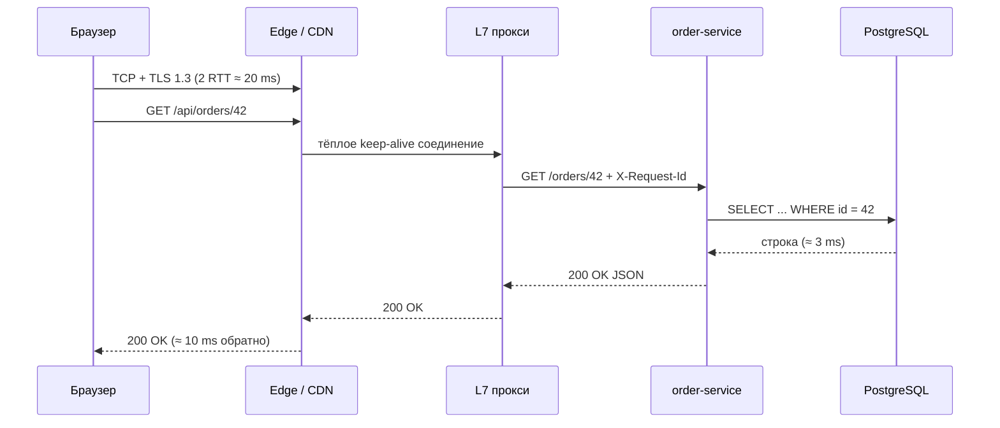

# Урок 01 — Путь запроса end-to-end

Цель: научиться рассказывать путь запроса **связно, с числами и с выводами**. Это самый
частый вопрос-разогрев на интервью, и по нему сразу видно уровень: junior перечисляет слова,
senior показывает, где теряется время и где стоят точки отказа.

## Разогрев

- Сколько RTT стоит установка HTTPS-соединения с TLS 1.3?
- Что такое slow start и почему новое соединение медленнее старого?
- Чем L4-балансировщик отличается от L7?

## Полная картинка

Возьмём конкретный случай: пользователь в Берлине, сервис в eu-central, RTT до края сети
10 мс, до origin — 30 мс.



## Разбор по шагам с бюджетом

| Шаг | Что происходит | Время | Точка отказа |
|---|---|---|---|
| DNS | имя → IP, кэш браузера / ОС / резолвера | 0–100 мс | истёк TTL и резолвер недоступен |
| TCP | 3-way handshake до edge | ~10 мс | SYN-флуд, исчерпание портов |
| TLS 1.3 | 1 RTT, сертификат, ключи | ~10 мс | просроченный сертификат — полный отказ |
| HTTP-запрос | заголовки + тело | ~5 мс | слишком большие заголовки, 431 |
| Edge/CDN | попадание в кэш или проксирование | 1–2 мс | неверный `Vary` → чужой ответ |
| L7 прокси | роутинг, rate limit, `X-Request-Id` | <1 мс | нет живых upstream → 502/503 |
| Сервис | логика, кэш, БД | 5–20 мс | таймауты, пул соединений исчерпан |
| БД | запрос по индексу | 1–10 мс | блокировки, медленный план |
| Ответ | сериализация и путь обратно | ~10 мс | большой JSON = CPU и полоса |

Итого ≈ 50–60 мс при тёплом соединении и ≈ 80 мс при холодном. Из этого только 5–20 мс —
«твой код». Вывод, который надо произнести: **основную часть латентности определяет не
алгоритм в хендлере, а количество round trip'ов**.

```drill
type: multiple-choice
prompt: "Где в этом пути самая большая экономия для пользователя из Азии (RTT до origin 250 мс)?"
options: ["Оптимизировать SQL-запрос", "Убрать RTT с критического пути: edge-терминация TLS + кэшируемые GET на CDN", "Перейти с JSON на protobuf", "Увеличить размер пула соединений к БД"]
answer: "Убрать RTT с критического пути: edge-терминация TLS + кэшируемые GET на CDN"
check: exact
hint: Сравни 250 мс с 10 мс работы кода.
```

## Что ломается на каждом шаге (и что сказать про это)

- **DNS.** Кэш на всех уровнях; TTL — компромисс между гибкостью и нагрузкой. Инцидент
  «протух сертификат» и инцидент «сломался DNS» — два самых частых полных отказа в индустрии,
  и оба не имеют отношения к коду.
- **TCP.** Каждое соединение — дескриптор и буферы. Отсюда keep-alive, пул на клиенте и
  лимиты на инстанс.
- **TLS.** Терминация на краю экономит RTT; внутрь ДЦ идёт отдельное тёплое соединение (часто
  mTLS).
- **Балансировщик.** Health checks решают, кто в ротации; readiness отделяет «прогреваюсь» от
  «умер».
- **Сервис.** Здесь начинаются таймауты и `context`: если общий дедлайн 300 мс, то на вызов
  соседа нельзя давать 5 секунд.
- **БД.** Пул соединений — очередь: когда все соединения заняты, запросы **ждут**, и p99
  улетает, хотя CPU простаивает (детали в
  [`../../03-databases-replication-sharding/theory.md`](../../03-databases-replication-sharding/theory.md)).

## Холодный путь против тёплого

Разница между первым запросом и сотым — это половина всех «у нас иногда тормозит».
На **холодном** пути пользователь платит DNS, TCP-handshake, TLS-handshake и slow start:
несколько лишних round trip'ов и медленный старт передачи. На **тёплом** — ничего из этого:
соединение уже открыто, ключи согласованы, окно раскачано. Отсюда практические следствия,
которые стоит назвать: keep-alive на клиенте и на сервере (`IdleTimeout` больше, чем интервал
между запросами), настроенный пул `http.Transport` для сервис-сервис вызовов, session
resumption в TLS, HTTP/2 или HTTP/3 вместо шести параллельных соединений. И отдельно —
мониторинг: если строить графики только по средней задержке, холодный путь в них не виден,
он живёт в p99.

## Практика: считаем бюджет

Требование: p99 = 150 мс для пользователя с RTT 40 мс до края сети.

- Путь до края и обратно: 40 мс (тёплое соединение, handshake амортизирован).
- Край → origin и обратно: 30 мс.
- Остаётся на бэкенд: 150 − 70 = **80 мс**.
- В эти 80 мс должны влезть: L7 (1 мс), сервис (?), кэш (1 мс), БД (10 мс), плюс запас на
  хвост — оставим 30 % → реально планируем **~55 мс**.
- Значит: не более 2–3 последовательных внутренних вызовов, независимые — параллельно,
  тяжёлое — в асинхрон.

```drill
type: free-form
prompt: "Хендлер делает 4 последовательных вызова к соседним сервисам по 15 мс каждый. Дедлайн 150 мс, RTT пользователя 40 мс. Проходит? Что сделать?"
answer: "Не проходит: 4 × 15 = 60 мс только на соседей, плюс 40 мс пользовательский RTT, плюс 30 мс край→origin, плюс своя работа и БД — уже ~140–150 мс без запаса на хвост, а p99 каждого соседа заметно хуже 15 мс. Что сделать: распараллелить независимые вызовы через errgroup (60 мс → ~20 мс по самому медленному); поставить индивидуальные таймауты и общий дедлайн в context; необязательные данные (например, рекомендации) делать деградируемыми — по таймауту 20 мс отдавать ответ без них; часть данных денормализовать или закэшировать, чтобы вызовов стало меньше; тяжёлые побочные эффекты вынести в очередь."
check: manual
hint: Последовательные вызовы складывают и задержки, и вероятности отказа.
```

```drill
type: fill-in
prompt: "Основную часть задержки в распределённой системе обычно определяет не CPU-время кода, а количество ____ по сети."
answer: round trip | round trips | RTT | round-trip
check: fuzzy
```

## Итог

Путь запроса — это цепочка RTT, и каждое звено добавляет и время, и способ упасть. Рассказывая
его на интервью, двигайся по шагам, называй числа (DNS 0–100 мс, handshake 1 RTT, TLS 1.3
1 RTT, внутри ДЦ 0.5 мс) и после каждого шага делай вывод для дизайна: keep-alive, edge-TLS,
CDN для кэшируемых GET, readiness-проверки, таймауты с общим дедлайном. Тогда разогревочный
вопрос превращается в демонстрацию инженерного мышления.
