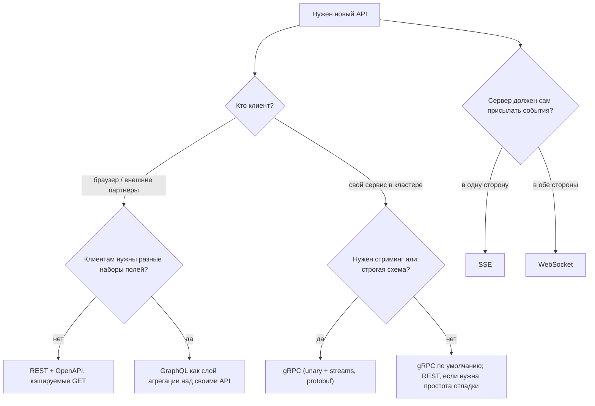

# Урок 02 — Выбираем стиль API: REST, gRPC, GraphQL, realtime

Цель: перестать выбирать стиль API по привычке и научиться выводить его из **трёх вопросов**:
кто клиент, нужен ли поток данных, сколько стоит контракт. На интервью это звучит как
готовый trade-off и занимает 30 секунд.

## Разогрев

- Почему gRPC не работает в браузере напрямую?
- Что такое over-fetching и чем он лечится?
- Чем SSE отличается от WebSocket одной фразой?

## Дерево решений



Обрати внимание: дерево не спрашивает «что быстрее». Разница в сериализации начинает
что-то значить на десятках тысяч RPS; до этого решают эргономика, совместимость и
возможность отладить в консоли.

## Сценарий 1. Публичное API маркетплейса для партнёров

Клиенты — чужие бэкенды на разных языках, интеграции живут годами, нужна документация и
песочница.

**Выбор: REST + OpenAPI.** Почему: партнёру не нужно ставить protoc и генерировать код;
`curl` и Postman работают из коробки; `GET`-ручки кэшируются на CDN; статусы HTTP понятны
всем. Цена: болтливый JSON, отсутствие строгой схемы «на компиляции», риск over-fetching.
Смягчаем: OpenAPI-контракт в CI, поля-проекции (`?fields=id,status`), курсорная пагинация,
жёсткие правила совместимости.

## Сценарий 2. Внутренний вызов order-service → payment-service

Клиент — свой сервис, вызовов десятки тысяч в секунду, нужны дедлайны и понятные коды ошибок.

**Выбор: gRPC.** Почему: `.proto` — единственный источник правды, кодогенерация в Go
бесплатна, дедлайн клиента доезжает до сервера и маппится на `context.Context` (то есть
сервер реально прекращает работу, а не считает в пустоту), protobuf компактнее JSON в 3–5 раз.
Цена: бинарь в логах, нужен инструментарий (`grpcurl`), версионирование proto по правилам.

```protobuf
service Payments {
  // Идемпотентность контрактом: клиент передаёт ключ попытки.
  rpc Charge(ChargeRequest) returns (ChargeResponse);
}
message ChargeRequest {
  string order_id        = 1;
  int64  amount_minor    = 2;  // деньги — целые в минорных единицах, никогда float
  string idempotency_key = 3;
}
```

```drill
type: multiple-choice
prompt: "Почему в ChargeRequest сумма — int64 в минорных единицах, а не double?"
options: ["Так короче в protobuf", "Плавающая точка даёт ошибки округления в деньгах; целые копейки точны и сравнимы", "double не поддерживается в proto3", "Чтобы влезли большие суммы"]
answer: "Плавающая точка даёт ошибки округления в деньгах; целые копейки точны и сравнимы"
check: exact
```

## Сценарий 3. Мобильное приложение, экран «профиль + заказы + рекомендации»

Одному экрану нужны данные трёх сервисов, у Android и iOS немного разные требования, сеть
мобильная (каждый RTT дорог).

**Выбор: GraphQL (или BFF-эндпоинт).** Почему: один запрос вместо трёх, клиент берёт только
нужные поля, разные версии приложения просят разное без новых ручек. Цена: нет
HTTP-кэширования по URL, надо ограничивать сложность запроса, N+1 на бэкенде лечится
дата-лоадерами, мониторинг переезжает с «ручек» на «поля».

Честная альтернатива, которую стоит назвать: **BFF** (backend for frontend) — обычная
REST-ручка `GET /mobile/home`, которая внутри параллельно собирает три вызова. Проще,
кэшируется, но каждый новый экран требует новой ручки. Правило: один-два клиента — BFF; много
разных клиентов и быстро меняющиеся экраны — GraphQL.

## Сценарий 4. Дашборд с живыми метриками

Сервер раз в секунду присылает обновления, клиент ничего не отправляет.

**Выбор: SSE.** Почему: обычный HTTP (проходит прокси), авто-reconnect с `Last-Event-ID`
встроен в браузер, не нужно держать состояние двустороннего протокола. Цена: только текст,
только одна сторона, в HTTP/1.1 — занятое соединение (в HTTP/2 это просто ещё один stream).

Если бы клиент отправлял команды в реальном времени (совместное редактирование, игра) —
WebSocket, и вместе с ним весь груз состояния: реестр соединений, маршрутизация между
инстансами, sticky-балансировка, переподключение с джиттером.

```drill
type: multiple-choice
prompt: "Дашборд на 50 000 одновременных пользователей, только чтение обновлений. Что выбрать и почему?"
options: ["WebSocket — он современнее", "SSE — односторонний поток по обычному HTTP с встроенным reconnect, без состояния двустороннего канала", "Long polling каждые 200 мс", "gRPC server streaming прямо в браузер"]
answer: "SSE — односторонний поток по обычному HTTP с встроенным reconnect, без состояния двустороннего канала"
check: exact
hint: Не платить за то, что не используешь.
```

```drill
type: free-form
prompt: "Тебе говорят: «давайте всё внутреннее переведём на GraphQL, будет единый API». Возрази аргументированно."
answer: "Аргументы против: (1) GraphQL решает проблему клиента с разными наборами полей — между сервисами такой проблемы нет, контракты там узкие и стабильные; (2) теряются дедлайны и коды ошибок gRPC, а также кодогенерация и проверка совместимости на компиляции; (3) стоимость запроса становится непредсказуемой — один сервис может случайно попросить дерево на пол-базы; (4) кэширование и трассировка усложняются: вместо «медленной ручки» получаем «медленное поле»; (5) N+1 внутри резолверов надо чинить дата-лоадерами в каждом сервисе. Компромисс, который я бы предложил: gRPC между сервисами, GraphQL/BFF только на границе с клиентами, где он реально нужен."
check: manual
```

## Сценарий 5. Загрузка файлов

Отдельный случай, который часто забывают. Файл на 2 ГБ не надо гонять через свой сервис: это
занятая горутина, занятое соединение, память и трафик, который ты оплачиваешь дважды.
Правильный контракт: клиент просит **presigned URL** (`POST /v1/uploads` → ссылка с подписью и
сроком жизни), грузит напрямую в объектное хранилище, затем сообщает сервису
`POST /v1/uploads/{id}/complete`. Сервис видит только метаданные. Для больших файлов —
multipart-загрузка по частям с возможностью продолжить после обрыва. Цена: два-три обращения
вместо одного и необходимость проверять, что загруженное действительно соответствует
заявленному (размер, тип, антивирус) — уже асинхронно, воркером.

## Итог

Стиль API выводится из трёх вопросов, а не из моды: **кто клиент** (браузер и партнёры → REST;
свой сервис → gRPC), **нужен ли поток** (в одну сторону → SSE; в обе → WebSocket; внутри
кластера → gRPC streams), **сколько стоит контракт** (много команд и жёсткая совместимость →
protobuf с кодогенерацией). GraphQL — это про разнообразие клиентов, а не про
производительность, и живёт он на границе системы. Любой ответ на интервью заканчивай ценой
выбора: у REST — болтливость и слабый контракт, у gRPC — браузер и отладка, у GraphQL —
кэширование и стоимость запросов, у WebSocket — состояние на сервере.
