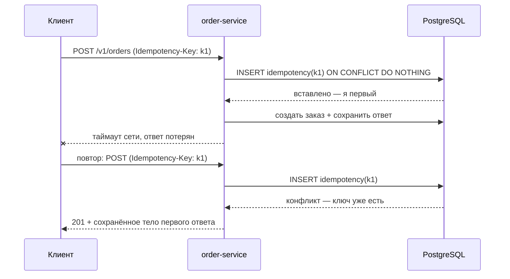

# Урок 03 — API сервиса заказов: идемпотентность, пагинация, ошибки

Цель: пройти дизайн API целиком на задаче, которую любят давать на интервью. Здесь всё
сходится: ретраи и дубли заказов, длинные списки, версии, коды ошибок, лимиты.

## Разогрев

- Какие HTTP-методы идемпотентны и почему это важно для ретраев?
- Чем курсорная пагинация лучше `OFFSET` на глубине 100 000?
- Что вернуть на повтор с тем же `Idempotency-Key`, но другим телом?

## Шаг 1. Ресурсы и методы

```text
POST   /v1/orders                 создать заказ            201 + Location
GET    /v1/orders/{id}            получить заказ           200
GET    /v1/orders?cursor=&limit=  список заказов клиента   200
POST   /v1/orders/{id}/cancel     отменить                 200 | 409
GET    /v1/orders/{id}/events     история статусов (SSE)   200 text/event-stream
```

Почему отмена — это `POST /cancel`, а не `PATCH {status: "cancelled"}`: отмена — **действие**
с побочными эффектами (возврат денег, освобождение резерва), а не редактирование поля.
Действие проще ограничить правами, залогировать и сделать идемпотентным. Ставить статус
напрямую опасно: клиент однажды пришлёт `{status: "paid"}`.

## Шаг 2. Создание заказа и идемпотентность

Клиент **обязан** ретраить при таймауте: он не знает, дошёл ли запрос. Без защиты два
одинаковых `POST` = два заказа и два списания.



Правила, которые надо назвать вслух:

- ключ генерирует **клиент**, на попытку операции (UUID v4), и переиспользует при ретраях;
- сервер хранит `key → (хэш запроса, статус, тело ответа)` с TTL 24–72 часа;
- **атомарность** обеспечивает уникальный индекс, а не `SELECT` + `IF`, иначе два
  параллельных ретрая пройдут проверку одновременно;
- тот же ключ + другое тело = `409 Conflict`, это ошибка клиента;
- если первый запрос ещё выполняется, повтор получает `409` с `Retry-After: 1`.

```drill
type: multiple-choice
prompt: "Почему проверка «SELECT по ключу, если нет — INSERT» недостаточна для идемпотентности?"
options: ["Слишком медленно", "Два параллельных ретрая пройдут SELECT одновременно и создадут два заказа — нужна атомарная вставка с уникальным индексом", "SELECT не работает в транзакции", "Нужен Redis, БД не подходит"]
answer: "Два параллельных ретрая пройдут SELECT одновременно и создадут два заказа — нужна атомарная вставка с уникальным индексом"
check: exact
hint: Гонка между проверкой и действием.
```

## Шаг 3. Список заказов: курсор вместо offset

У активного клиента 50 000 заказов, у маркетплейса — миллиарды строк.

```sql
-- Индекс: (customer_id, created_at DESC, id DESC)
SELECT id, status, total_minor, created_at
FROM orders
WHERE customer_id = $1
  AND (created_at, id) < ($2, $3)   -- курсор
ORDER BY created_at DESC, id DESC
LIMIT 20;
```

Курсор отдаём клиенту **непрозрачным**: base64 от `created_at|id`. Почему непрозрачным — чтобы
позже поменять внутреннюю схему (например, добавить шардовый префикс), не ломая клиентов.
Ответ: `{"items": [...], "next_cursor": "eyJ0..."}`; отсутствие `next_cursor` = конец.

Цена решения, которую надо озвучить: нельзя прыгнуть на «страницу 57» и дорого показать общее
число страниц. Для админки с нумерацией оставляем `offset`, но ограничиваем глубину (например,
до 10 000) и говорим об этом честно.

## Шаг 4. Ошибки, лимиты, версии

Единое тело ошибки — чтобы клиент мог обрабатывать программно, а поддержка — искать по
`trace_id`:

```json
{"error": {"code": "insufficient_stock", "message": "Товар закончился",
           "details": {"sku": "A-42"}, "trace_id": "01J8..."}}
```

| Ситуация | Статус | Ретраить клиенту? |
|---|---|---|
| Невалидный JSON | 400 | нет |
| Нет токена / протух | 401 | нет (обновить токен) |
| Чужой заказ | 403 | нет |
| Заказ не найден | 404 | нет |
| Тот же ключ, другое тело | 409 | нет |
| Не прошла валидация полей | 422 | нет |
| Превышен лимит | 429 + `Retry-After` | да, после паузы |
| Внутренняя ошибка | 500 | да, с backoff |
| Перегрузка / деплой | 503 + `Retry-After` | да, с backoff |

Лимиты отдаём заголовками `RateLimit-Limit`, `RateLimit-Remaining`, `RateLimit-Reset` — иначе
клиент узнаёт о лимите только из `429`, то есть уже наступив на него.

Версия в пути (`/v1`): видна в логах, легко роутится на L7. Правило совместимости: поля
добавляем, старые не удаляем и не меняем смысл; клиент игнорирует незнакомое. `/v2` заводим
только при ломающем изменении и держим `/v1` до конца жизни интеграций.

```drill
type: free-form
prompt: "Проговори вслух за 2 минуты дизайн POST /v1/orders: контракт, идемпотентность, что происходит при таймауте, при дубле, при нехватке товара, при падении payment-service."
answer: "Контракт: POST /v1/orders с заголовком Idempotency-Key (UUID клиента), тело — customer_id из токена, список позиций (sku, qty), адрес; ответ 201 + Location: /v1/orders/{id} и тело заказа со статусом pending. Идемпотентность: атомарная вставка ключа с уникальным индексом, хранение ответа 72 часа, повтор с тем же телом отдаёт тот же 201, с другим телом — 409. Таймаут: клиент ретраит с тем же ключом — второй заказ не создаётся. Нехватка товара: 422 с кодом insufficient_stock и деталями по sku — ретраить бессмысленно. Падение payment-service: заказ создаём в статусе pending и не блокируем ответ синхронной оплатой — событие уходит в очередь, оплата подтверждается асинхронно, клиент следит по GET /orders/{id} или SSE; если оплата не прошла за N минут, заказ отменяется компенсацией. Так HTTP-ручка не зависит от доступности платежей, а ретраи безопасны."
check: manual
hint: Разнеси «принять заказ» и «оплатить» — это разные failure-домены.
```

```drill
type: fill-in
prompt: "Курсор в ответе отдаём клиенту ____ (непрозрачным / читаемым), чтобы можно было менять внутреннюю схему пагинации, не ломая клиентов."
answer: непрозрачным | opaque
check: fuzzy
```

## Шаг 5. Что не должно быть в API

Три вещи, которые интервьюер проверяет косвенно:

- **Внутренние идентификаторы и детали реализации наружу.** Автоинкрементный `id` в публичном
  API — это утечка объёма бизнеса и удобная мишень для перебора; отдавай UUID или
  непрозрачный публичный ключ, а числовой `id` оставь внутри.
- **Синхронные побочные эффекты.** Отправка письма, генерация PDF, обновление аналитики не
  должны жить в критическом пути `POST /orders` — иначе доступность заказа становится
  произведением доступностей почтового шлюза и всего остального.
- **Клиент как источник правды.** Цену, скидку и итоговую сумму считает сервер по своим
  данным; из тела запроса берутся только `sku` и количество. Присланная клиентом цена — это
  не поле, а приглашение к мошенничеству.

## Итог

Хороший API отвечает не на вопрос «как красиво назвать ручки», а на вопрос **«что будет при
повторе, при глубине и при отказе»**. Три опоры: `Idempotency-Key` с атомарной вставкой —
против дублей; курсорная пагинация по индексу — против деградации на глубине; единый формат
ошибок со статусами, разделяющими «ретраить» и «не ретраить», — против штормов повторов.
Плюс версия в пути и правило совместимости, чтобы завтра можно было что-то изменить.
