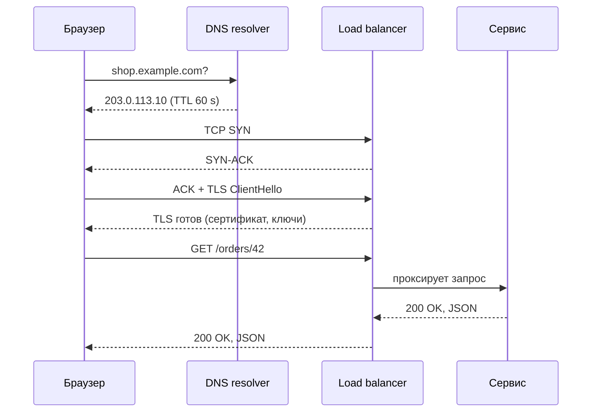
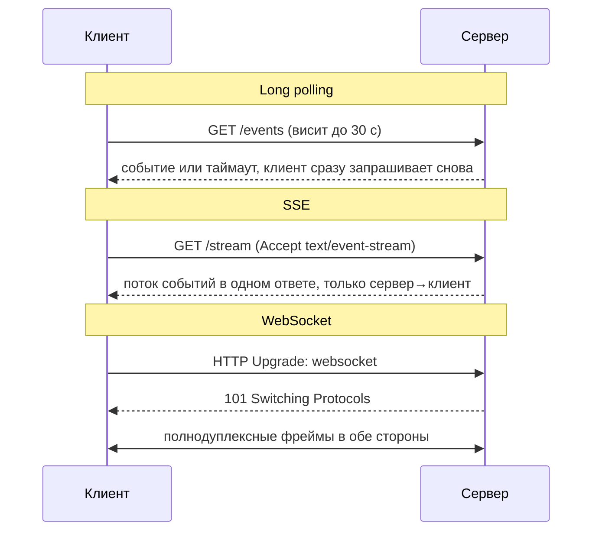
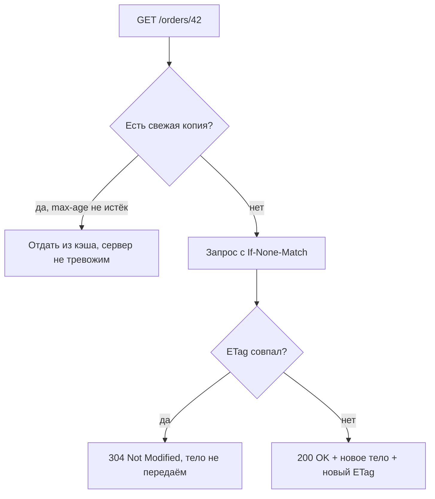
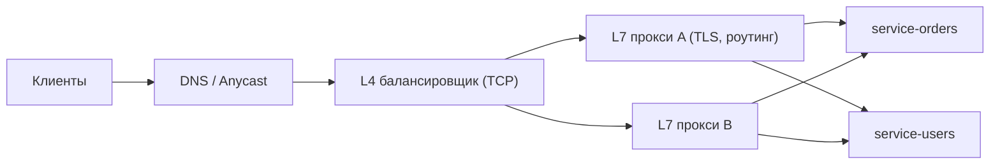

# Сеть и API

## Простыми словами: что происходит после Enter

Ты набрал `https://shop.example.com/orders/42` и нажал Enter. Дальше происходит семь вещей,
и каждая стоит времени:

1. **DNS** — превратить имя в IP-адрес. Это как узнать номер телефона по имени в справочнике.
2. **TCP** — установить соединение (три пакета туда-обратно, «рукопожатие»).
3. **TLS** — договориться о шифровании (ещё один-два обмена).
4. **HTTP-запрос** — наконец отправить «дай мне заказ 42».
5. **Балансировщик** — выбрать, какой из живых серверов будет отвечать.
6. **Сервис** — посчитать ответ (кэш, база, другие сервисы).
7. **Ответ обратно** тем же путём.



Полезная арифметика (числа из модуля 01): DNS без кэша — 20–120 мс, TCP-handshake — 1 RTT,
TLS 1.3 — ещё 1 RTT. Если RTT до сервера 100 мс, то **до первого байта запроса уходит
~300 мс, и всё это ещё до того, как твой Go-код проснулся**. Отсюда — keep-alive, CDN, TLS
session resumption и HTTP/3. Вот и весь смысл этого модуля.

## DNS

**Простыми словами.** DNS — телефонная книга интернета: отдаёт по имени набор IP-адресов.
Иерархическая, кэшируемая, работает поверх UDP (быстро, без соединения), а при больших
ответах — по TCP.

Что важно для дизайна:

- **TTL** — сколько секунд ответ можно кэшировать. Короткий TTL (30–60 с) позволяет быстро
  переключить трафик при аварии; длинный (часы) снижает нагрузку и задержку. Ловушка: многие
  клиенты и JVM игнорируют TTL и кэшируют «навсегда», поэтому DNS — **плохой механизм
  быстрого failover**.
- **DNS как балансировка.** Отдать несколько A-записей — самый дешёвый способ размазать
  трафик, но без health checks: мёртвый адрес продолжат получать. Годится как грубый
  географический выбор (GeoDNS), не как основной балансировщик.
- **Anycast** — один IP объявлен из десятков локаций; сеть сама отдаёт ближайшую. Так работают
  публичные DNS и точки входа CDN.

## TCP vs UDP

**Простыми словами.** TCP — заказное письмо с уведомлением: доставка гарантирована, порядок
сохранён, потери восстанавливаются; за это платишь временем. UDP — открытка: бросил в ящик
и всё, может не дойти, может прийти второй, порядок не гарантирован; зато без задержек на
установку и подтверждения.

TCP даёт: установку соединения (3-way handshake), упорядоченный поток байт, повторную передачу
потерянных сегментов, контроль потока и **congestion control** (медленный старт: соединение
разгоняется, а не сразу шлёт на полную).

Практические следствия:

- **Новое соединение всегда медленное.** Не только из-за handshake, но и из-за slow start:
  первые пакеты идут маленьким окном. Поэтому переиспользование соединений (keep-alive,
  connection pool) — не микрооптимизация, а необходимость.
- **UDP для видео и игр.** Потерянный кадр не нужно перепередавать: пока он дойдёт, он уже
  устарел. Лучше показать артефакт, чем заморозить картинку. Ретрансмиты TCP тут вредны.
- **Соединения — конечный ресурс.** Каждое TCP-соединение — это запись в таблице ядра,
  буферы приёма и передачи и файловый дескриптор. Миллион одновременных WebSocket-соединений
  — это уже разговор про лимиты `ulimit`, размеры буферов и память на соединение, а не про
  бизнес-логику. В Go на соединение приходится минимум одна горутина на чтение, и это первый
  вопрос, который задаст интервьюер про чат: «сколько соединений держит один инстанс?»
- **Клиентский пул соединений.** `http.Transport` в Go по умолчанию держит всего
  `MaxIdleConnsPerHost = 2` простаивающих соединения на хост; при активном общении сервис-сервис
  это приводит к постоянному пересозданию TCP (handshake + slow start на каждый запрос).
  Настройка пула — стандартная «а почему у нас p99 такой странный» история (детали в
  [`../09-go-in-system-design/index.md`](../09-go-in-system-design/index.md)).
- **QUIC** (основа HTTP/3) построен на UDP и реализует надёжность сам, в userspace. Зачем:
  чтобы избавиться от TCP head-of-line blocking (см. ниже), объединить handshake транспорта
  и TLS в 1 RTT (а при повторном подключении — 0 RTT) и уметь переезжать между сетями
  (Wi-Fi → LTE) без разрыва соединения.

## TLS на одну страницу

**Простыми словами.** TLS решает три задачи: **шифрование** (никто по пути не прочитает),
**аутентификация сервера** (ты правда говоришь с `shop.example.com`, это подтверждает
сертификат, подписанный доверенным центром), **целостность** (данные не подменили).

Как это работает, без криптографии: клиент и сервер обмениваются публичной информацией
(ClientHello/ServerHello + ключевые доли), из неё **асимметрично** выводят общий секрет, и
дальше всё общение идёт быстрым **симметричным** шифром (AES/ChaCha20). Асимметрия дорога,
поэтому её используют только для установки ключа.

Числа: TLS 1.2 — 2 RTT на handshake, **TLS 1.3 — 1 RTT**, а при возобновлении сессии
(session resumption / PSK) — 0 RTT. Именно поэтому TLS терминируют **на краю сети** (CDN,
edge-балансировщик): пользователь платит RTT до близкого узла, а не до дальнего ДЦ.

Внутри дата-центра TLS тоже нужен (zero trust), а взаимная проверка сертификатов
(**mTLS**) — стандарт для сервис-сервис аутентификации; детали в
[`../08-architecture-microservices-security/index.md`](../08-architecture-microservices-security/index.md).

## HTTP/1.1 vs HTTP/2 vs HTTP/3

**HTTP/1.1.** Один запрос за раз в одном соединении. Ответы обязаны идти в порядке запросов
— это **head-of-line blocking на уровне приложения**: медленный первый ответ держит
остальные. Обходной путь браузеров — открывать 6 соединений на домен. `Connection:
keep-alive` (по умолчанию в 1.1) хотя бы позволяет не пересоздавать TCP на каждый запрос.

**HTTP/2.** Одно TCP-соединение, внутри — **мультиплексирование**: много независимых
потоков (streams) одновременно, с приоритетами и бинарным фреймингом; заголовки сжимаются
(HPACK), что заметно на API с длинными токенами. Но остаётся **TCP head-of-line blocking**:
потерялся один сегмент — TCP тормозит доставку данных *всех* потоков, потому что для TCP это
единый поток байт.

**HTTP/3 (QUIC поверх UDP).** Потоки независимы на транспортном уровне: потеря в одном не
блокирует другие. Плюс 1-RTT (0-RTT при возобновлении) установка и миграция соединений между
сетями.

| Свойство | HTTP/1.1 | HTTP/2 | HTTP/3 |
|---|---|---|---|
| Транспорт | TCP | TCP | QUIC (UDP) |
| Параллельные запросы в соединении | нет | да (streams) | да (streams) |
| HOL blocking | на уровне HTTP | на уровне TCP | практически нет |
| Сжатие заголовков | нет | HPACK | QPACK |
| Установка + TLS | 2–3 RTT | 2–3 RTT | 1 RTT (0 при resumption) |
| Где особенно выигрывает | — | много мелких запросов | мобильные, потери в сети |

```text
HTTP/1.1: [req1][resp1][req2][resp2]      — строго по очереди
HTTP/2  : [s1 s3 s5 ...] в одном TCP      — параллельно, но потеря тормозит всех
HTTP/3  : [s1][s3][s5] независимо в QUIC   — потеря тормозит только свой поток
```

## Стили API: REST vs gRPC vs GraphQL

**REST** — ресурсы и HTTP-глаголы поверх JSON. Плюсы: всё умеет его читать, кэшируется
прокси и CDN (`GET` + `Cache-Control`), отлаживается через `curl`. Минусы: нет строгого
контракта (OpenAPI — по договорённости), болтливый JSON, over-fetching (получил объект целиком,
нужно было два поля) и N+1 запросов с клиента.

**gRPC** — RPC-вызовы поверх HTTP/2 с контрактом в `.proto` и бинарным protobuf. Плюсы:
строгая схема и кодогенерация (в Go — родная), компактность и скорость, **четыре вида
стримов** (unary, server-stream, client-stream, bidirectional), встроенные дедлайны, которые
маппятся на `context.Context`. Минусы: в браузере напрямую не работает (нужен gRPC-Web или
прокси), сложнее отладка (бинарь), нет HTTP-кэширования.

```protobuf
service Orders {
  rpc Get(GetOrderRequest) returns (Order);
  rpc Watch(WatchRequest) returns (stream OrderEvent); // server streaming
}
```

**GraphQL** — клиент сам описывает, какие поля хочет, одним запросом к одному эндпоинту.
Плюсы: нет over/under-fetching, удобно для мобильных и для агрегации данных нескольких
сервисов. Минусы: кэширование по URL не работает; тяжело ограничить стоимость запроса
(нужны depth/complexity limits); N+1 на бэкенде лечится дата-лоадерами; мониторинг «медленных
эндпоинтов» превращается в мониторинг медленных полей.

Правило выбора, которое можно сказать вслух: **между своими сервисами — gRPC; для публичного
API и браузера — REST; когда клиентов много и им нужны разные наборы полей — GraphQL как
слой агрегации, а не как замена внутренним API**.

Что решает выбор на самом деле — три вопроса. **Кто клиент?** Браузер и внешние партнёры
тянут к REST: его умеют все, он отлаживается в консоли и кэшируется по дороге. **Нужен ли
стриминг?** Двусторонний поток внутри инфраструктуры — сильный аргумент за gRPC, потому что
он там встроен, а не приделан сбоку. **Сколько стоит контракт?** Если сервисы пишут разные
команды и ломать друг друга нельзя, `.proto` с кодогенерацией и правилами совместимости
дешевле, чем «OpenAPI, который кто-то иногда обновляет». Заметь: в списке нет пункта «что
быстрее» — разница в сериализации важна на десятках тысяч RPS, а до этого решают эргономика
и совместимость.

## Realtime: long polling, SSE, WebSocket

**Простыми словами.** Проблема одна: HTTP придумали так, что говорит клиент, а сервер только
отвечает. А нам надо, чтобы сервер сам присылал новости.



| Транспорт | Направление | Цена | Когда брать |
|---|---|---|---|
| Long polling | клиент спрашивает | много запросов, задержка до цикла | легаси-клиенты, простота, редкие события |
| SSE | сервер → клиент | одно HTTP-соединение, авто-reconnect, только текст | лента уведомлений, прогресс, тикер цен |
| WebSocket | обе стороны | своё соединение и состояние на сервере | чат, игры, коллаборативное редактирование |

Главный подвох WebSocket на интервью — **состояние**: соединение живёт на конкретном
инстансе, поэтому сервис перестаёт быть stateless. Нужны: реестр «пользователь → инстанс»
(Redis), маршрутизация сообщений между инстансами (pub/sub или брокер), sticky-балансировка,
план на деплой (при рестарте разрываются все соединения — клиент должен переподключаться с
джиттером, иначе получишь thundering herd).

## Дизайн API: что спрашивают почти всегда

**Ресурсы и глаголы.** Существительные во множественном числе (`/orders`, `/orders/42/items`),
глаголы — методы HTTP. `GET` безопасен и кэшируем, `PUT` и `DELETE` идемпотентны по
определению, `POST` — нет. Это не эстетика: на этом различии держатся ретраи прокси.

**Идемпотентность.** Простыми словами: операцию можно повторить, и результат не изменится.
Критично, потому что клиент **обязан** ретраить при таймауте, но не знает, дошёл ли первый
запрос. Стандартное решение для `POST` — заголовок `Idempotency-Key`: клиент генерирует
уникальный ключ на попытку операции, сервер сохраняет `(key → результат)` и на повтор
возвращает **тот же** ответ, не создавая второй заказ.

```go
// Ключ идемпотентности: вставка с ON CONFLICT — атомарная проверка «первый ли я».
// Уникальный индекс в БД, а не проверка «SELECT потом INSERT»: иначе гонка двух ретраев.
res, err := tx.ExecContext(ctx, `
    INSERT INTO idempotency (key, request_hash, status)
    VALUES ($1, $2, 'in_progress')
    ON CONFLICT (key) DO NOTHING`, key, hash)
if err != nil {
    return err
}
if n, _ := res.RowsAffected(); n == 0 {
    // Повтор: отдаём сохранённый ответ или 409, если тело запроса отличается.
    return replayStoredResponse(ctx, tx, key, hash)
}
```

**Пагинация.** `offset/limit` прост, но: `OFFSET 100000` заставляет БД пролистать сто тысяч
строк (медленно), а вставки между запросами сдвигают окно — увидишь дубли и пропуски.
**Cursor (keyset)**: `WHERE (created_at, id) < ($1, $2) ORDER BY created_at DESC, id DESC
LIMIT 20` — использует индекс, стабилен при вставках, работает бесконечно. Цена: нельзя
прыгнуть на «страницу 57». Правило: списки в UI — курсор; админка с номерами страниц —
offset, но с ограничением глубины.

**Версионирование.** Варианты: в пути (`/v1/orders`) — просто и видно в логах; в заголовке
(`Accept: application/vnd.shop.v2+json`) — «чище», но неудобно отлаживать. Главное —
**правило совместимости**: добавлять поля можно, удалять и менять смысл — нельзя; клиент
обязан игнорировать незнакомые поля. В protobuf это выражено явно: номера полей неизменны,
удалённые — `reserved`.

**Ошибки.** Единый формат тела (код, человеко-читаемое сообщение, `trace_id`), осмысленные
статусы: `400` — синтаксис, `401`/`403` — кто ты / можно ли тебе, `404`, `409` — конфликт
состояния, `422` — валидация, `429` — превысил лимит, `503` — сервис недоступен (+ `Retry-After`).
Разделение `4xx`/`5xx` важно и для клиента (ретраить или нет), и для мониторинга.

**Rate limiting.** Отдавай клиенту не только `429`, но и заголовки: `RateLimit-Limit`,
`RateLimit-Remaining`, `RateLimit-Reset` (или `X-RateLimit-*` — исторический вариант),
плюс `Retry-After`. Алгоритмы (token bucket, sliding window) — в
[`../06-scalability-and-reliability/index.md`](../06-scalability-and-reliability/index.md).

**Долгие операции.** Если операция занимает больше пары секунд (транскодирование видео,
формирование отчёта, массовый импорт), не держи HTTP-соединение открытым: клиент отвалится по
таймауту, а прокси между вами — и подавно. Правильный контракт: `POST /reports` возвращает
`202 Accepted` и `Location: /reports/{id}`, клиент опрашивает статус (`pending / running /
done / failed`) или получает webhook. Плюсом это делает ретраи безопасными и даёт место для
прогресса и отмены.

**Массовые операции и частичные отказы.** Эндпоинт «создай сразу 500 объектов» экономит RTT,
но ставит вопрос: что вернуть, если 480 создались, а 20 нет? Варианты: всё в одной транзакции
(всё или ничего, просто для клиента, тяжело для базы) либо `207`-подобный ответ с массивом
результатов по каждому элементу. Главное — **сказать это явно в контракте**, потому что
самая дорогая ошибка здесь — клиент, который на `500` повторяет весь батч и создаёт дубли.
Идемпотентность в такой ручке нужна на каждый элемент, а не на батч целиком.

**Таймауты — часть контракта API.** Сервер без таймаутов держит зависшие соединения до
исчерпания файловых дескрипторов:

```go
srv := &http.Server{
    Addr:              ":8080",
    Handler:           mux,
    ReadHeaderTimeout: 5 * time.Second,  // защита от Slowloris: заголовки должны прийти быстро
    ReadTimeout:       15 * time.Second,
    WriteTimeout:      30 * time.Second, // не держим клиентов, которые не читают ответ
    IdleTimeout:       60 * time.Second, // keep-alive не вечен: освобождаем сокеты
}
```

## HTTP-кэширование: то, что уже встроено и бесплатно

**Простыми словами.** Прежде чем ставить Redis, вспомни, что в HTTP уже есть кэш — и им
пользуются браузер, корпоративный прокси и CDN, ничего не зная про твой код. Достаточно
правильных заголовков.

Два механизма:

1. **Freshness (свежесть)** — `Cache-Control: max-age=300` значит «пять минут можешь не
   спрашивать». Самый дешёвый выигрыш: запрос вообще не доходит до сервера.
2. **Validation (проверка)** — сервер отдаёт `ETag: "a1b2"` (отпечаток содержимого) или
   `Last-Modified`. Клиент при следующем запросе присылает `If-None-Match: "a1b2"`, и если
   ничего не изменилось, сервер отвечает **`304 Not Modified`** без тела. Тело не передаётся —
   экономия полосы, хотя RTT остаётся.



Что важно знать про заголовки на интервью:

- `Cache-Control: private` — можно кэшировать только в браузере (персональные данные),
  `public` — можно и в CDN. Ошибка «отдали `public` на ответ с чужими данными» — это утечка
  через CDN, реальный класс инцидентов.
- `no-store` — не кэшировать вообще; `no-cache` — кэшировать, но **всегда** проверять
  валидность. Названия обманчивы, их путают постоянно.
- `Vary: Accept-Encoding, Authorization` — говорит кэшу, что ответ зависит от этих заголовков.
  Забыть `Vary` — второй способ отдать одному пользователю ответ другого.
- `ETag` + `If-Match` работают и на запись: это **оптимистичная блокировка** по HTTP
  («обнови, только если версия та же»), и она отвечает на вопрос «как избежать потери
  обновлений при параллельном редактировании» (подробнее в
  [`../03-databases-replication-sharding/theory.md`](../03-databases-replication-sharding/theory.md)).

Прикладное следствие: `GET`-эндпоинты стоит проектировать кэшируемыми (стабильный URL, ETag,
разумный `max-age`), потому что тогда часть нагрузки снимается **без единой строчки кода** —
на CDN и в браузере. Слой кэша в приложении (Redis) добавляют уже после этого; он про другое
и разбирается в [`../04-caching/index.md`](../04-caching/index.md).

## Балансировщики, reverse proxy, CDN

**Простыми словами.** Балансировщик — швейцар у входа: перед ним один адрес, за ним десяток
одинаковых серверов, он решает, к какому направить, и не пускает трафик к тем, кто «болеет».
Именно он делает возможным горизонтальное масштабирование stateless-сервисов.



**L4 vs L7.** L4 работает на уровне TCP/UDP: видит только адреса и порты, просто раскидывает
соединения — очень быстро, дешево, но ничего не знает про HTTP. L7 разбирает HTTP: может
роутить по пути и заголовкам, терминировать TLS, ретраить идемпотентные запросы, добавлять
`X-Request-Id`, ограничивать скорость, склеивать HTTP/2 и HTTP/1.1. Цена — CPU и задержка
(доли миллисекунды) плюс он видит содержимое (значит, отвечает за безопасность).

**Алгоритмы.**

| Алгоритм | Как работает | Когда хорош | Подвох |
|---|---|---|---|
| Round-robin | по кругу | одинаковые запросы и серверы | «тяжёлый» запрос перекосит нагрузку |
| Weighted RR | по кругу с весами | разные по мощности инстансы | веса надо поддерживать |
| Least connections | к самому свободному | разная длительность запросов | нужен учёт состояния |
| Least response time | к самому быстрому | разнородная нагрузка | реагирует на шум |
| IP hash / sticky | один клиент → один сервер | сессии в памяти, WebSocket | перекос и потеря при рестарте |
| Consistent hashing | ключ → сервер по кольцу | кэш-слой, шардированное состояние | сложнее, нужны виртуальные ноды |

**Health checks.** Пассивные (заметил ошибки — вывел из ротации) и активные (сам стучится в
`/healthz`). Разделяй **liveness** («я жив, не убивай меня») и **readiness** («я готов
принимать трафик»): сервис, который прогревает кэш или потерял доступ к БД, должен временно
отвечать «не готов», но не перезапускаться. Ловушка: если healthcheck проверяет БД, то падение
базы выведет из ротации **все** инстансы сразу — и вместо деградации получишь полный отказ.

**Reverse proxy** (nginx, Envoy, Traefik) — то же самое, что L7-балансировщик, плюс
терминация TLS, сжатие, кэш статики, буферизация медленных клиентов. **API gateway** — reverse
proxy с продуктовыми функциями: аутентификация, rate limiting, роутинг на разные сервисы,
трансформация протоколов (обзорно — в
[`../08-architecture-microservices-security/index.md`](../08-architecture-microservices-security/index.md)).

**CDN** — распределённая сеть кэширующих узлов близко к пользователям. Отдаёт статику и
кэшируемые `GET` из ближайшей точки: экономит и полосу origin-сервера, и главное — RTT
(вместо 150 мс через океан 10–20 мс до города). Управляется заголовками `Cache-Control`,
`ETag`, `Vary`; инвалидация — через версионирование URL (`app.9f3c1.js`) вместо purge, потому
что purge по всей сети медленный и ненадёжный.

## Как это спрашивают на собеседовании

**«Что происходит, когда я ввожу URL и жму Enter?»** Ждут связный рассказ DNS → TCP → TLS →
HTTP → LB → сервис → БД/кэш → ответ, с пониманием, где RTT. Сильный ответ добавляет числа
(«DNS 20–100 мс, handshake 1 RTT, TLS 1.3 ещё 1 RTT») и вывод («поэтому TLS терминируем на
краю»). Слабый — «браузер отправляет запрос на сервер, сервер отвечает».

**«HTTP/2 решил head-of-line blocking?»** Сильный: «на уровне HTTP — да, мультиплексирование;
на уровне TCP — нет, потеря сегмента тормозит все streams; это решает HTTP/3 на QUIC». Это
любимый вопрос-развилка: половина кандидатов отвечает просто «да».

**«REST или gRPC для этого сервиса?»** Ждут критерий, а не предпочтение: кто клиент (браузер
или сервис), нужен ли стриминг, нужно ли HTTP-кэширование, важна ли строгая схема.

**«Клиент получил таймаут на создании заказа и повторил запрос. Сколько заказов создано?»**
Проверка идемпотентности. Сильный ответ: `Idempotency-Key` + уникальный индекс, повтор
возвращает тот же результат; и обязательно — что делать, если тело второго запроса отличается
(`409`).

**«Как пагинировать список из 10 млн записей?»** Сильный: курсорная пагинация по индексу,
объяснение, почему `OFFSET 1000000` — это seq scan по индексу и почему окно «плывёт» при
вставках.

**«Как вы сделаете чат: WebSocket, SSE или long polling?»** Сильный ответ начинается с
вопроса «нужен ли канал от клиента к серверу в реальном времени»: для чата — да, значит
WebSocket; для ленты уведомлений хватило бы SSE. Дальше обязательно — про состояние: реестр
«пользователь → инстанс» в Redis, доставка между инстансами через pub/sub, sticky-балансировка,
переподключение с экспоненциальным backoff и джиттером после деплоя. Слабый ответ
останавливается на слове «вебсокеты».

**«Ваш сервис зовёт три чужих API подряд. Что не так?»** Ждут: последовательные вызовы
складывают задержки и перемножают вероятности отказа; надо распараллелить независимые
(`errgroup`), поставить таймаут на каждый и общий дедлайн через `context`, добавить circuit
breaker, а необязательные данные отдавать деградированно, а не падать целиком.

**«Балансировщик — L4 или L7 и почему?»** Ждут понимание, что L7 нужен для роутинга по пути,
терминации TLS и ретраев, а L4 — когда нужна скорость и всё равно, что внутри.

## Типичные ошибки и заблуждения

- **«Балансировщик = round-robin».** Алгоритм — деталь; главное, что он даёт единую точку
  входа, health checks и возможность добавлять/убирать инстансы без изменения клиентов.
- **«DNS переключит трафик за минуту».** Клиенты кэшируют дольше TTL. DNS — для
  географического распределения, failover — для балансировщика/anycast.
- **«HTTP/2 быстрее всегда».** Для одного большого файла разницы нет; выигрыш — на многих
  мелких запросах и на сжатии заголовков. При потерях в сети HTTP/2 может быть *хуже* 1.1 с
  шестью соединениями.
- **«gRPC работает в браузере».** Напрямую — нет; нужен gRPC-Web и прокси.
- **«PUT и POST — почти одно и то же».** `PUT` идемпотентен (положить по известному
  идентификатору), `POST` — нет (создать новое). От этого зависят ретраи.
- **«Идемпотентность = дедупликация по телу запроса».** Хэш тела не различает два законных
  одинаковых заказа. Нужен ключ, сгенерированный клиентом на *попытку операции*.
- **«WebSocket — просто быстрый HTTP».** Это состояние на сервере: реестр соединений,
  маршрутизация между инстансами, боль при деплое.
- **«CDN — это про экономию трафика».** Прежде всего это про RTT и про то, что origin не
  ложится под пиком.
- **Забыть таймауты.** Клиент без таймаута и сервер без `ReadHeaderTimeout` — два способа
  положить систему без атаки.
- **Healthcheck, зависящий от БД.** Падение общей зависимости выводит из ротации все
  инстансы одновременно.
- **Ретраить всё подряд.** Ретрай небезопасного `POST` без ключа идемпотентности создаёт
  дубли, а ретрай на `4xx` бессмысленен: клиент ошибся, повтор ничего не изменит. Ретраить
  стоит только идемпотентные операции, только на `5xx`/таймаут и только с экспоненциальным
  backoff и джиттером — иначе синхронный шторм ретраев добьёт уже больной сервис.
- **`no-cache` значит «не кэшировать».** Нет: `no-cache` — «кэшируй, но всегда проверяй»,
  а «не кэшировать вообще» — это `no-store`.
- **Считать, что JSON бесплатен.** Сериализация и парсинг больших ответов — это CPU и
  аллокации; на десятках тысяч RPS разница между JSON и protobuf видна и в процессорах, и в
  счёте за трафик.

## Глоссарий

- **RTT (round trip time)** — время «туда и обратно» до узла; базовая единица сетевых оценок.
- **DNS TTL** — время кэширования DNS-ответа.
- **Anycast** — один IP-адрес, объявленный из многих локаций; трафик идёт в ближайшую.
- **3-way handshake** — SYN / SYN-ACK / ACK, установка TCP-соединения.
- **Slow start** — начальная фаза congestion control: соединение разгоняется постепенно.
- **Keep-alive** — переиспользование TCP-соединения для нескольких HTTP-запросов.
- **Head-of-line blocking** — первый в очереди блокирует остальных (в HTTP/1.1 — ответы, в
  TCP — потерянный сегмент для всех streams HTTP/2).
- **Мультиплексирование** — много независимых потоков в одном соединении (HTTP/2, HTTP/3).
- **QUIC** — транспорт поверх UDP с надёжностью и шифрованием, основа HTTP/3.
- **TLS termination** — расшифровка TLS на границе (LB/CDN), дальше внутрь — своё соединение.
- **mTLS** — взаимная аутентификация клиента и сервера по сертификатам.
- **gRPC** — RPC поверх HTTP/2 с protobuf-контрактом и четырьмя видами стримов.
- **Over-fetching / under-fetching** — получил больше, чем нужно / пришлось делать
  дополнительные запросы.
- **SSE (Server-Sent Events)** — односторонний поток событий сервер → клиент по HTTP.
- **Идемпотентность** — повторное выполнение не меняет результат.
- **`Idempotency-Key`** — клиентский ключ попытки операции, по которому сервер дедуплицирует.
- **Cursor (keyset) pagination** — пагинация «после этого ключа» вместо `OFFSET`.
- **L4 / L7 балансировка** — по TCP/UDP (адреса и порты) / по HTTP (пути, заголовки).
- **Liveness / readiness** — «жив» / «готов принимать трафик».
- **Reverse proxy** — прокси перед сервисами: TLS, роутинг, кэш, буферизация.
- **CDN** — сеть кэширующих узлов близко к пользователю.

## См. также

- Официальные RFC и спецификации: HTTP/1.1 — RFC 9110–9112; HTTP/2 — RFC 9113;
  HTTP/3 — RFC 9114; QUIC — RFC 9000; TLS 1.3 — RFC 8446.
- MDN Web Docs: HTTP, Server-Sent Events, WebSockets — developer.mozilla.org.
- grpc.io — документация и concepts (streaming, deadlines); pkg.go.dev/net/http,
  pkg.go.dev/google.golang.org/grpc.
- Alex Xu, *System Design Interview*, vol. 1 (2020), гл. 1–2 (балансировщики, CDN) и vol. 2
  (2022) — realtime-транспорты.
- Michael Nygard, *Release It!* (2nd ed., 2018) — таймауты, интеграционные точки.
- Google SRE book — sre.google/books, глава про load balancing.
- Уроки: [`lessons/01-request-path-end-to-end.md`](./lessons/01-request-path-end-to-end.md),
  [`lessons/02-choosing-api-style.md`](./lessons/02-choosing-api-style.md),
  [`lessons/03-designing-order-api.md`](./lessons/03-designing-order-api.md).
- Дальше — хранилища: [`../03-databases-replication-sharding/index.md`](../03-databases-replication-sharding/index.md).
