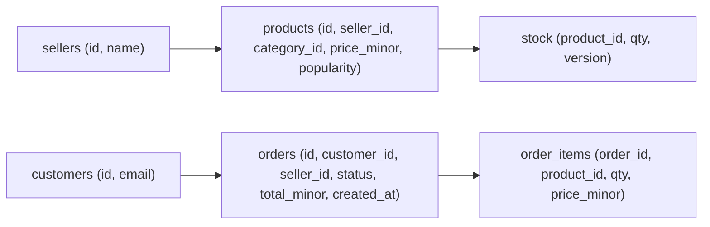

# Урок 01 — Моделируем маркетплейс и выбираем индексы

Цель: пройти путь «требования → таблицы → запросы → индексы» на живом примере и научиться
защищать каждый индекс числом. На интервью это происходит в момент «покажите модель данных»,
и слабый кандидат рисует таблицы, а сильный — рисует **запросы**.

## Разогрев

- Для чего нужен левый префикс составного индекса?
- Почему пять индексов на таблицу с высокой записью — плохо?
- Что покажет `EXPLAIN (ANALYZE, BUFFERS)`, чего не покажет `EXPLAIN`?

## Условие

Маркетплейс: 10 млн товаров, 500 тыс. продавцов, 2 млн заказов в сутки. Пиковые чтения —
30k QPS (каталог), записи — 100 QPS (заказы) плюс 2k QPS обновлений остатков.

## Шаг 1. Сначала запросы, потом таблицы

Выписываем реальные сценарии — это и есть спецификация индексов:

1. Карточка товара по `id` — 20k QPS.
2. Список товаров категории с фильтром по цене и сортировкой по популярности — 8k QPS.
3. Мои заказы (последние 20, потом ещё 20) — 500 QPS.
4. Заказы продавца в статусе `pending` — 200 QPS.
5. Поиск по названию товара — 2k QPS.
6. Отчёт «выручка продавца за месяц» — 1 QPS, но тяжёлый.

## Шаг 2. Схема



Несколько решений, которые стоит проговорить:

- **Цена копируется в `order_items`.** Это осознанная денормализация: цена в заказе —
  историческая, она не должна меняться, когда продавец переставит ценник. Не «дублирование»,
  а другое по смыслу поле.
- **Остатки в отдельной таблице.** `stock` обновляется в 20 раз чаще, чем `products`, а
  строки `products` большие. Разделение даёт короткие блокировки и меньше мусора от MVCC.
- **Деньги — `price_minor bigint`** (копейки), никогда `float`.

## Шаг 3. Индексы под каждый запрос

| Запрос | Индекс | Почему |
|---|---|---|
| Товар по id | PK `products(id)` | есть по умолчанию |
| Каталог категории | `products(category_id, popularity DESC) INCLUDE (price_minor)` | равенство → сортировка; покрывающий даёт index-only scan |
| Мои заказы | `orders(customer_id, created_at DESC, id DESC)` | курсорная пагинация без сортировки |
| Заказы продавца в pending | частичный `orders(seller_id, created_at) WHERE status = 'pending'` | «очередь» — маленькая часть таблицы |
| Поиск по названию | GIN по `to_tsvector(name)` или `pg_trgm` | B-tree не умеет `LIKE '%x%'` |
| Отчёт за месяц | не индекс: агрегаты в отдельное хранилище | 1 QPS, но полное сканирование месяца |

Проверка на «а не много ли»: у `orders` получилось три индекса при 100 write QPS — это
безопасно. У `stock` при 2k write QPS оставляем только PK: любой лишний индекс здесь стоит
пропускной способности.

```drill
type: multiple-choice
prompt: "Почему для «заказов продавца в статусе pending» выбран частичный индекс, а не обычный по (seller_id, status)?"
options: ["Частичный индекс работает быстрее на любых запросах", "pending — малая доля строк: индекс получается в десятки раз меньше, дешевле в обслуживании и всегда горячий в памяти", "Обычный индекс по двум колонкам вообще не сработает", "Так требует PostgreSQL"]
answer: "pending — малая доля строк: индекс получается в десятки раз меньше, дешевле в обслуживании и всегда горячий в памяти"
check: exact
hint: "Заказ живёт в pending минуты, а в completed — годы."
```

## Шаг 4. Ловушки, которые проверяют на интервью

**Сортировка по популярности, которая постоянно меняется.** Если `popularity` обновляется
каждую минуту, индекс `(category_id, popularity DESC)` будет непрерывно перестраиваться.
Решение: пересчитывать популярность раз в N минут батчем, а не по каждому просмотру, — и
сразу сказать это вслух как trade-off «свежесть против стоимости записи».

**Пагинация каталога.** `OFFSET 20000` на 8k QPS убьёт базу. Курсор по
`(popularity, id)` — и честное признание, что «перейти на страницу 500» мы не поддерживаем.

**Списание остатка.** Классический lost update:

```sql
-- Атомарно и без блокировок приложения: проверка и списание в одном UPDATE.
UPDATE stock SET qty = qty - $2
WHERE product_id = $1 AND qty >= $2;
-- 0 затронутых строк = не хватило остатка, отдаём 409 клиенту
```

**Отчёты.** Аналитические запросы по той же базе съедают буферный кэш и мешают OLTP.
Правильный ответ: отчёты — на реплику, а лучше в ClickHouse через CDC
([`../../05-queues-and-async/index.md`](../../05-queues-and-async/index.md)).

```drill
type: free-form
prompt: "Продакт просит фильтр «товары с бесплатной доставкой, дешевле 1000, в наличии, отсортированные по рейтингу». Проговори, как ты к этому подойдёшь и почему не станешь плодить индексы под каждую комбинацию."
answer: "Комбинаторный взрыв: N фильтров дают 2^N комбинаций, индексов под все не построить, а каждый индекс — минус к записи. Подход: 1) посмотреть реальную статистику — обычно 3–5 комбинаций дают 90 % трафика, под них и делать составные индексы, начиная с колонки равенства (category_id) и заканчивая сортировкой; 2) низкоселективные булевы флаги (free_shipping, in_stock) в индекс не тащить — они почти ничего не отсекают, лучше частичный индекс WHERE in_stock; 3) если фасетных фильтров реально много и они меняются — это профиль поисковой системы: Elasticsearch с инвертированным индексом рядом с PostgreSQL, где PostgreSQL остаётся источником правды, а индексация асинхронная с лагом в секунды; 4) обязательно назвать цену: рассинхрон между БД и поиском и необходимость переиндексации."
check: manual
hint: "Много фасетных фильтров — это сигнал «нужен поиск», а не «нужно ещё десять индексов»."
```

```drill
type: fill-in
prompt: "В составном индексе первой ставят колонку, по которой идёт ____, а сортировку и диапазон — последними."
answer: "равенство | равенство (=) | сравнение на равенство"
check: fuzzy
```

## Шаг 5. Прикидка объёма

Строка `orders` ≈ 200 байт: 2 млн × 200 B = 400 MB/сутки → 146 GB/год; `order_items` в
среднем 3 строки по 80 байт → 480 MB/сутки → 175 GB/год. С индексами ×1.5 — около
**500 GB за год**. Вывод, который делаем вслух: одна PostgreSQL спокойно живёт с таким
объёмом года три; шардинг не нужен, но **партиционирование `orders` по месяцам** стоит
заложить сразу — оно дешёвое и делает архивацию и `VACUUM` предсказуемыми.

## Итог

Модель данных проектируется от запросов, а не от сущностей: сначала список сценариев с QPS,
потом таблицы, потом индексы — каждый под конкретный запрос и с оглядкой на стоимость записи.
Три вещи, которые надо произносить вслух: денормализация бывает осмысленной (историческая
цена), горячие по записи данные лучше держать отдельно (остатки), а фасетный поиск — это
сигнал не про индексы, а про поисковую систему. И `EXPLAIN ANALYZE` вместо догадок.
