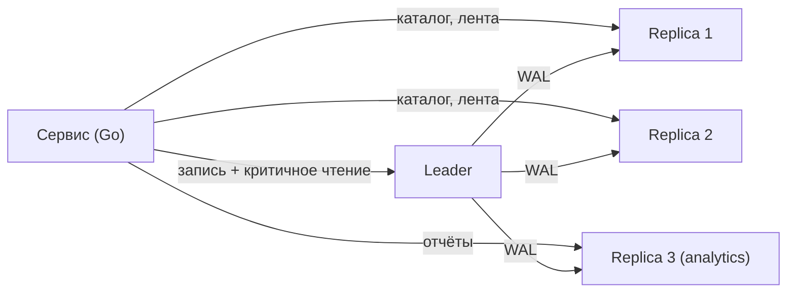

# Урок 02 — Реплики, лаг и отказы

Цель: пройти сценарий «чтений стало слишком много» до конца — с распределением запросов по
лидеру и репликам, с решением проблемы лага и с честным разбором того, что происходит, когда
что-нибудь умирает. Это один из самых частых deep dive на интервью.

## Разогрев

- Что репликация масштабирует, а что — нет?
- Что такое read-your-writes и зачем оно нужно?
- Чем semi-sync лучше и хуже full-sync?

## Условие

Соцсеть-магазин: 12k read QPS, 800 write QPS, одна PostgreSQL на 32 ядрах загружена на 85 %
по CPU. Продукт требует: заказ после оплаты виден сразу, лента может отставать на секунды.

## Шаг 1. Куда пойдут чтения

Не «добавим реплики», а **классификация операций** — это ровно то, что оценивается:

| Операция | Куда | Почему |
|---|---|---|
| Проверка баланса и лимитов | лидер | решение о деньгах по устаревшим данным недопустимо |
| Экран заказа сразу после оплаты | лидер (или по LSN) | read-your-writes |
| Каталог, категории, карточка товара | реплика | меняется редко, лаг незаметен |
| Лента, рекомендации | реплика | продукт явно разрешил секунды лага |
| Отчёты и выгрузки | выделенная реплика | тяжёлые запросы не должны мешать OLTP |



Считаем эффект: с лидера уходит примерно 9k из 12k чтений. Загрузка лидера падает с 85 % до
~35 %, три реплики берут по 3k QPS. Числа надо называть — это отличает «добавим реплик» от
инженерного решения.

## Шаг 2. Как реализовать read-your-writes

Три варианта по возрастанию точности:

1. **Липкость по времени.** После записи пользователя помечаем в Redis
   `user:42:wrote_at` и 5 секунд отправляем его чтения на лидера. Просто, грубо, работает.
2. **По позиции WAL (LSN).** После коммита узнаём `pg_current_wal_lsn()`, кладём в сессию
   или отдаём клиенту; при чтении выбираем реплику, у которой `pg_last_wal_replay_lsn()` уже
   не меньше. Точно, но требует учёта позиций реплик.
3. **Только критичные экраны с лидера.** Самое дешёвое: список «страниц после действия»
   фиксируется в коде.

```go
// Роутинг чтений: критичные — на лидера, остальные — на реплику.
// Признак «недавно писал» живёт в кэше, а не в БД: это решение маршрутизации, не данные.
func (r *Repo) readDB(ctx context.Context, userID int64, needsFresh bool) *sql.DB {
    if needsFresh || r.recentlyWrote(ctx, userID) {
        return r.leader
    }
    return r.replicas.Next() // round-robin по живым репликам
}
```

```drill
type: multiple-choice
prompt: "Реплика отстала на 40 секунд из-за долгой транзакции на лидере. Что должно произойти с трафиком?"
options: ["Ничего, лаг — это нормально", "Балансировщик читающих запросов должен вывести отставшую реплику из ротации по порогу лага", "Надо переключиться на неё как на нового лидера", "Надо увеличить пул соединений"]
answer: "Балансировщик читающих запросов должен вывести отставшую реплику из ротации по порогу лага"
check: exact
hint: "Лаг — это метрика readiness для читающего трафика."
```

## Шаг 3. Разбираем отказы

**Умерла одна реплика.** Оставшиеся берут её трафик: было 3k QPS на каждой из трёх, стало
4.5k на двух. Это надо было заложить заранее — планируй реплики с запасом N+1, иначе смерть
одной ронит остальные каскадом.

**Умер лидер.** Failover: детекция кворумом наблюдателей, выбор самой свежей реплики,
**fencing** старого лидера, промоушен, переключение приложений. Что говорить про потери: при
асинхронной репликации теряется хвост коммитов — поэтому для денежных операций держим одну
синхронную реплику рядом (semi-sync), а остальные асинхронные, в том числе в другом ДЦ.

**Split brain.** Старый лидер ожил и продолжает принимать запись. Два набора данных, которые
придётся сводить вручную. Единственная защита — огораживание и кворум, а не «мы быстро
заметим».

**Реплики отстают из-за самой нагрузки.** Ловушка: чем больше читающих запросов на реплике,
тем медленнее она применяет WAL (в PostgreSQL длинные запросы могут конфликтовать с
применением изменений). То есть перегруженная реплика начинает отставать — и лаг растёт
именно тогда, когда он опаснее всего.

```drill
type: free-form
prompt: "Проговори вслух: что именно вы теряете при failover с асинхронной репликацией и как это смягчить, если речь о платежах."
answer: "Теряется хвост коммитов, которые лидер подтвердил клиенту, но не успел передать реплике: клиент видел «оплачено», а в новой базе транзакции нет. Смягчение: (1) semi-sync — минимум одна синхронная реплика в той же зоне, коммит подтверждаем только после её ответа: платим RTT (доли миллисекунды внутри зоны), зато хвост не теряется; (2) идемпотентные операции и внешний журнал — платёжный провайдер знает состояние, мы можем сверить и восстановить; (3) transactional outbox: событие об оплате пишется в той же транзакции, что и заказ, поэтому либо есть оба, либо нет обоих; (4) не подтверждать пользователю больше, чем реально зафиксировано — статус «обрабатывается» вместо «оплачено» до подтверждения. И явно сказать цену semi-sync: если синхронная реплика недоступна, запись останавливается — нужен режим деградации и алерт."
check: manual
```

## Шаг 4. Когда реплик уже не хватает

Реплики упираются в два предела: (1) они не масштабируют **запись** — каждая применяет весь
поток лидера; (2) при 10+ репликах лидер тратит заметную долю ресурсов на рассылку WAL
(лечится каскадной репликацией: реплика реплики). Дальше по лестнице: кэш перед базой,
партиционирование, вынос аналитики, и только потом шардирование
([`theory-2-replication-sharding.md`](../theory-2-replication-sharding.md)).

```drill
type: fill-in
prompt: "Чтобы лидер не рассылал WAL десяти репликам напрямую, используют ____ репликацию, когда реплика получает поток от другой реплики."
answer: "каскадную | cascading"
check: fuzzy
```

## Итог

Масштабирование чтения — это не «поставить реплики», а три решения: **классифицировать
операции** (что терпит лаг, а что нет), **закрыть read-your-writes** (липкость, LSN или
список критичных экранов) и **спланировать отказы** (запас N+1, semi-sync для денег, fencing
при failover, вывод отставшей реплики из ротации). И помнить границу: репликация лечит
чтение, запись лечит только шардирование.
