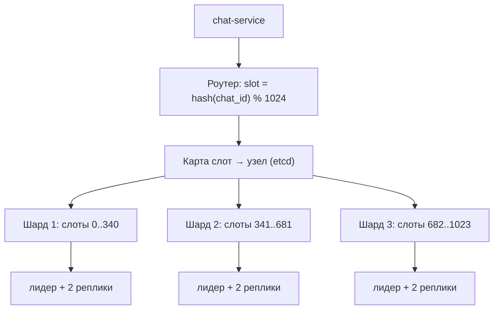

# Урок 03 — Выбор ключа, горячие ключи и кросс-шардовые запросы

Цель: пройти шардирование на конкретных таблицах и научиться отвечать на три вопроса, которые
интервьюер задаёт всегда: **по какому ключу, что сломается, как расширяться**.

## Разогрев

- Три свойства хорошего ключа шардирования?
- Почему `hash(key) mod N` плох при добавлении узла?
- Чем локальный вторичный индекс отличается от глобального?

## Условие

Мессенджер: 200 млн пользователей, 2 млрд сообщений в сутки, средний размер 300 байт.
Оценка (модуль 01): 2×10^9 / 10^5 = **20k write QPS**, пик ×3 = 60k; данных 600 GB/сутки,
за 2 года ≈ 440 TB. Одна база исключена — шардируем.

## Шаг 1. Выбираем ключ для сообщений

Кандидаты и что с ними не так:

| Ключ | Равномерность | Запросы попадают в один шард? | Вердикт |
|---|---|---|---|
| `message_id` (Snowflake) | отличная | нет: «сообщения чата» разлетятся по всем | плохо |
| `created_at` | ужасная | нет | худший вариант: горячий шард «сегодня» |
| `sender_id` | хорошая | нет: диалог разорван между двумя шардами | плохо |
| `chat_id` | приемлемая | да: «сообщения чата за период» — один шард | **выбираем** |

Внутри шарда — первичный ключ `(chat_id, created_at DESC, message_id)`: чтение последних
сообщений диалога становится последовательным сканом по индексу, ровно тем запросом, который
делает клиент при открытии чата.



Почему 1024 слота, а не `mod N` по числу узлов: добавление узла = перенос части **слотов**,
а не пересчёт хэшей всех ключей. Это дешёвая замена consistent hashing, и её проще
объяснить и отладить.

```drill
type: multiple-choice
prompt: "Почему шардирование сообщений по sender_id — плохая идея?"
options: ["sender_id распределён неравномерно", "Диалог двух людей окажется разорван между двумя шардами: чтение переписки станет кросс-шардовым", "sender_id меняется со временем", "Так нельзя построить индекс"]
answer: "Диалог двух людей окажется разорван между двумя шардами: чтение переписки станет кросс-шардовым"
check: exact
hint: "Ключ должен держать вместе то, что читается вместе."
```

## Шаг 2. Пользователи — отдельная история

`users` шардируем по `user_id`, и почти сразу упираемся в вопрос: **вход по email**. Запрос
«найди пользователя по email» не содержит ключа шардирования, а scatter-gather по всем шардам
на каждый логин — недопустимо.

Решение: **глобальный индекс** `email → user_id` как отдельная маленькая таблица (или
хранилище KV), шардированная по хэшу email. Логин = два обращения вместо одного, зато оба
точечные. Цена, которую надо назвать: индекс обновляется вне транзакции с пользователем,
значит нужен порядок операций (сначала занять email, потом создать пользователя) и уборка
«осиротевших» записей.

## Шаг 3. Горячие ключи

Публичный канал на 5 млн подписчиков ломает равномерность: один `chat_id` даёт больше
трафика, чем весь шард.

Что делаем:

- **Разбиение по времени.** Ключ становится `(chat_id, bucket)`, где `bucket` — номер дня или
  часа. Записи разъезжаются, чтение последних сообщений всё ещё попадает в один-два бакета.
- **Отдельный класс хранения.** Каналы-вещания — это не диалоги: у них другой профиль
  (один пишет, миллионы читают), их логично вынести в отдельный кластер и раздавать через
  кэш и CDN.
- **Кэш на чтение** — горячий ключ по определению кэшируется идеально
  ([`../../04-caching/index.md`](../../04-caching/index.md)).
- **Мониторинг перекоса.** Метрика «QPS по шардам» и алерт на дисбаланс, иначе о горячем
  ключе узнаёшь от пользователей.

```drill
type: free-form
prompt: "Проговори вслух: как вы обнаружите и потушите горячий шард в проде?"
answer: "Обнаружение: метрики по шардам (QPS, p99, CPU, размер данных) и алерт на дисбаланс — например, шард даёт больше 2× медианы; плюс топ ключей по обращениям (семплирование в приложении или slowlog/hotkey-инструменты хранилища). Тушение по нарастающей: (1) немедленно — кэш перед шардом и rate limiting на конкретный ключ, чтобы не деградировали соседи; (2) перенос части слотов с горячего узла на свободные — это дёшево, если карта слотов вынесена в etcd; (3) если горячий именно один ключ, а не шард — салтинг: писать в chat_id:bucket и читать со всех бакетов, либо выделить этому ключу отдельный узел; (4) архитектурно — отделить профиль «вещание» от профиля «диалог». И обязательно постмортем: почему мониторинг перекоса не сработал раньше."
check: manual
hint: "Сначала защитить соседей, потом двигать данные, потом менять модель."
```

## Шаг 4. Что ломается после шардирования

- **Кросс-шардовые запросы.** «Все чаты пользователя» — это уже не запрос к сообщениям, а
  отдельная таблица `user_chats`, шардированная по `user_id`. Классический приём: одну сущность
  хранят дважды, под каждый паттерн доступа.
- **Транзакции между шардами исчезают.** Сценарий «перевести и списать в разных шардах»
  требует saga или 2PC ([`../../07-distributed-systems/index.md`](../../07-distributed-systems/index.md)).
- **Аналитика.** `SELECT count(*)` по всем шардам — это scatter-gather с p99 худшего шарда.
  Отчёты уезжают в ClickHouse через CDC.
- **Уникальность.** Глобальный `UNIQUE` невозможен: уникальность гарантирует либо ключ
  шардирования, либо отдельный сервис (как с email).
- **Миграции схемы** превращаются в оркестрацию по N узлам, с частично применённым состоянием
  как нормой.

## Шаг 5. Переезд без простоя

Порядок, который надо уметь назвать: **двойная запись** (пишем и в старое, и в новое место) →
**фоновое копирование** истории → **сверка** (счётчики и выборочные хэши) → **переключение
чтения** сначала на 1 % трафика, потом на 100 % → **выключение двойной записи** → удаление
старых данных **не раньше**, чем пройдёт срок отката. На каждом шаге — метрика расхождений и
кнопка отката.

```drill
type: fill-in
prompt: "Чтобы «все чаты пользователя» читались за одно обращение, заводят отдельную таблицу user_chats, шардированную по ____."
answer: "user_id | по user_id"
check: fuzzy
```

## Итог

Шардирование — это выбор одного ключа и честный список того, что за него заплачено. Для
сообщений это `chat_id`: он есть в запросах, держит диалог вместе и достаточно равномерен;
для пользователей — `user_id` плюс глобальный индекс на email. Слоты вместо `mod N` делают
расширение переносом данных, а не переездом всего. И три вещи, которые надо сказать до того,
как спросят: горячие ключи (каналы-вещания), кросс-шардовые запросы (дублируем сущность под
паттерн доступа) и план переезда с двойной записью и сверкой.
