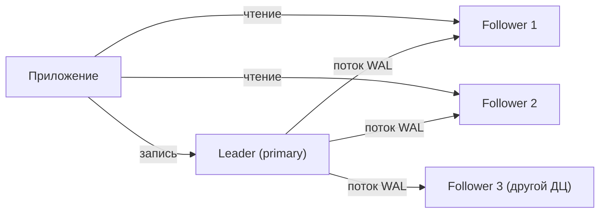
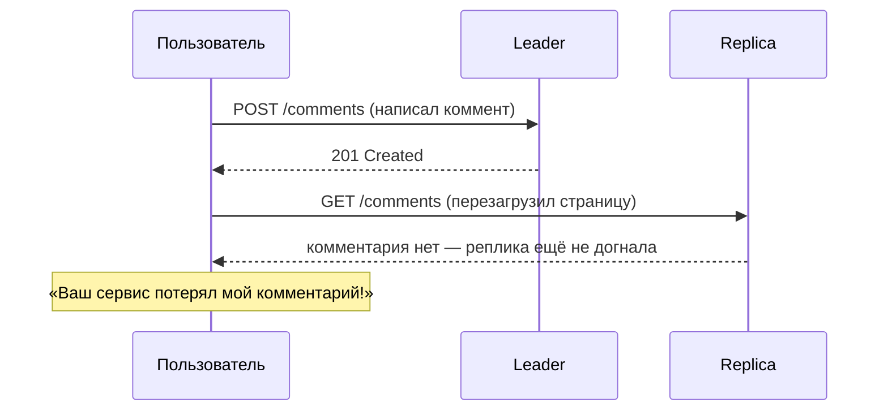
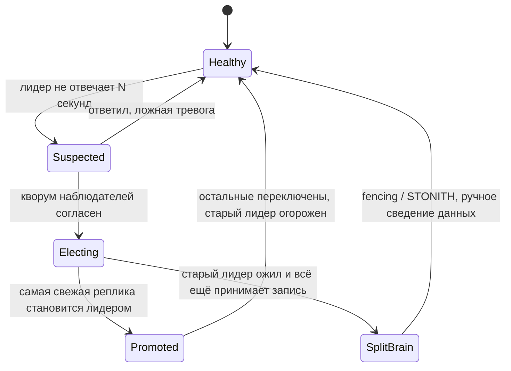
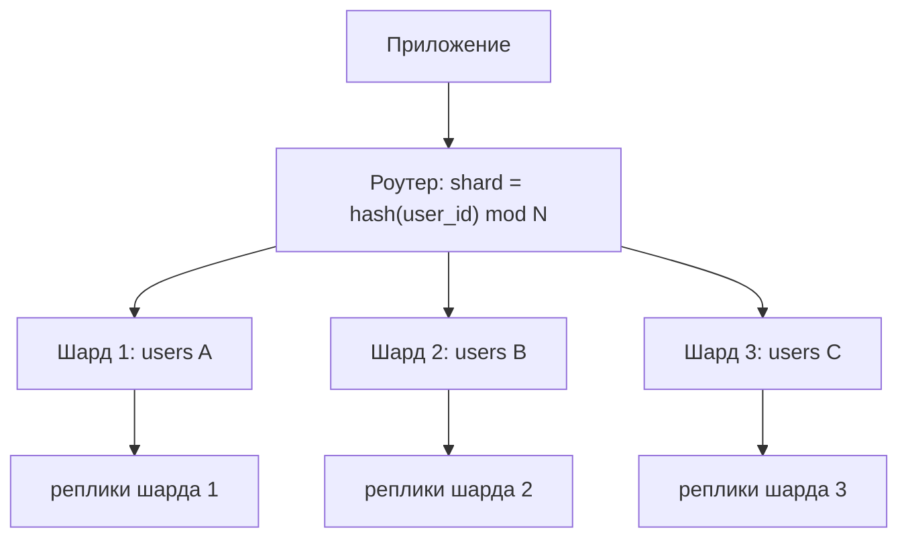

# Репликация, шардирование и консистентность

Вторая половина модуля. Первая — про одну базу:
[`theory.md`](./theory.md). Здесь баз становится много, и вместе с ними появляются лаг,
разделение сети, выбор ключа, горячие шарды и слово «консистентность», которое все понимают
по-разному.

## Простыми словами: зачем копии и куски

Есть ровно две причины разложить данные по нескольким машинам:

1. **Копии одних и тех же данных** (**репликация**) — чтобы пережить смерть машины и чтобы
   читать с нескольких серверов сразу. Данные целиком есть на каждом узле.
2. **Разные куски данных** (**шардирование / партиционирование**) — чтобы данные и запись
   не влезающие в одну машину, разложить по многим. На каждом узле только своя часть.

Аналогия: репликация — это ксерокопии документа в трёх сейфах, шардирование — это когда
архив разложен по буквам: А–И в одном шкафу, К–П в другом. Их **комбинируют**: каждый шард
обычно имеет свои реплики.

> **Терминология.** «Партиционирование» — общее слово про разрезание данных на части. В
> PostgreSQL так называют разрезание таблицы внутри одного сервера (по датам, например).
> «Шардирование» — то же разрезание, но по разным серверам. В Kafka «партиция» — кусок лога.
> Смысл один: часть данных, которую можно обрабатывать независимо.

## Репликация: leader–follower

**Простыми словами.** Один узел — **лидер** (primary, master): только он принимает запись.
Остальные — **реплики** (followers, standby): они получают поток изменений и применяют его у
себя, обслуживая чтение.



Что именно передаётся: обычно **физический WAL** (PostgreSQL) или **row-based binlog**
(MySQL) — то есть готовые изменения строк. Альтернатива, statement-based (передавать сам SQL),
опасна недетерминизмом: `now()`, `random()`, триггеры дадут на реплике другой результат.

Три режима подтверждения:

| Режим | Когда клиент получает «ок» | Риск потери | Задержка записи |
|---|---|---|---|
| Асинхронный | как только записал лидер | при падении лидера теряем «хвост» | минимальная |
| Синхронный | когда подтвердила реплика | нет (если реплика жива) | +RTT до реплики, и запись зависит от её доступности |
| Полусинхронный | подтвердила хотя бы одна из N | компромисс | +RTT до ближайшей |

Практика: полностью синхронная репликация на все реплики опасна — падение одной реплики
останавливает запись. Обычно делают semi-sync: одна синхронная реплика рядом, остальные —
асинхронные, в том числе в другом дата-центре.

## Лаг репликации и что он ломает

**Простыми словами.** Реплика отстаёт: миллисекунды в норме, секунды под нагрузкой, минуты и
часы — при длинной транзакции или тяжёлой миграции. Пока она отстаёт, чтение с неё возвращает
прошлое.



Три гарантии, которые придумали ровно против этого:

- **Read-your-writes** (чтение своих записей): пользователь всегда видит собственные
  изменения. Реализации: читать с лидера в течение N секунд после записи этого пользователя;
  или запомнить LSN/позицию записи и читать с реплики, которая уже её применила; или
  sticky-роутинг на лидера для «своих» страниц.
- **Monotonic reads** (монотонное чтение): пользователь не должен видеть, как данные «едут
  назад» (прочитал с догнавшей реплики, потом с отстающей). Лечится привязкой пользователя к
  одной реплике.
- **Consistent prefix reads**: причина не должна приходить позже следствия (увидел ответ
  раньше вопроса). Актуально для шардированных систем с независимыми потоками репликации.

Правило для интервью: **«читаем с реплик» — это не бесплатно; сначала скажи, какие чтения
терпят лаг, а какие нет**. Обычно: списки, ленты, поиск, аналитика — терпят; баланс,
проверка прав, экраны сразу после записи — нет.

## Failover и split brain

**Простыми словами.** Лидер умер — надо выбрать нового. Это самая опасная операция в
эксплуатации базы, потому что ошибиться можно очень дорого.



Что может пойти не так:

- **Split brain** — два узла считают себя лидером и оба принимают запись. Расхождение данных
  придётся сводить руками. Защита: **fencing** (старому лидеру физически запрещают писать),
  кворум наблюдателей, а не один «мониторинг».
- **Потерянный хвост.** При асинхронной репликации новый лидер не имеет последних коммитов.
  Их либо теряют (и тогда «оплаченный заказ» исчез), либо аккуратно применяют вручную.
- **Неверная детекция.** Таймаут слишком мал — переключаемся из-за паузы GC или всплеска
  нагрузки; слишком велик — долгий простой. Идеального значения нет, это trade-off.
- **Автоинкременты и ID.** После failover могут выдаться уже использованные идентификаторы —
  ещё один аргумент за UUID/Snowflake (модуль 07).

## Multi-leader и leaderless

**Multi-leader** — несколько узлов принимают запись (например, по одному лидеру на регион).
Плюсы: локальная задержка записи, работа при разрыве между ДЦ. Минус один, но огромный:
**конфликты**. Один и тот же объект изменён в двух регионах — кто прав? Стратегии: LWW
(last write wins — теряет данные и зависит от часов), CRDT (структуры, которые сливаются без
конфликтов — счётчики, множества), ручное разрешение, «конфликт как значение» (как в старом
CouchDB). Правило: multi-leader берут, когда конфликтов почти не бывает по природе данных
(редактирует только владелец) или когда данные CRDT-совместимы.

**Leaderless (Dynamo-стиль)** — лидера нет вообще: клиент (или координатор) пишет сразу в
несколько узлов и читает из нескольких. Из этого вырастают **кворумы**:

- `N` — сколько всего копий,
- `W` — сколько должны подтвердить запись,
- `R` — из скольких читаем.
- Если **W + R > N**, множества пересекаются, и чтение гарантированно увидит хотя бы одну
  свежую копию — это «строгий кворум».

Классика: `N=3, W=2, R=2`. Компромиссы понятные: `W=1, R=1` — быстро, но можно прочитать
устаревшее; `W=3` — надёжно, но любая недоступная нода останавливает запись. Расхождения
чинят **read repair** (при чтении заметили расхождение — починили) и **anti-entropy**
(фоновая сверка). Так устроены Cassandra и DynamoDB.

## Шардирование: как резать данные

**Простыми словами.** Данные не влезают в одну машину (по объёму, по записи или по IOPS) —
режем на куски по ключу и раскладываем по серверам.



Два основных способа выбрать шард:

| Способ | Как | Плюс | Минус |
|---|---|---|---|
| По диапазону (range) | `id 1..1M` → шард 1 и т. д. | эффективные диапазонные запросы, легко досыпать шарды | горячий «последний» шард при монотонном ключе (время, автоинкремент) |
| По хэшу (hash) | `hash(key) mod N` или кольцо | равномерность | диапазонные запросы разлетаются по всем шардам |

Выбор **ключа шардирования** — главное решение модуля. Хороший ключ: (1) присутствует почти
в каждом запросе, (2) даёт равномерное распределение, (3) держит вместе данные, которые
читаются вместе. Для мессенджера это `chat_id` (все сообщения чата рядом), для магазина —
`customer_id`, для аналитики — `(tenant_id, дата)`.

## Горячие ключи и celebrity problem

**Простыми словами.** Даже идеальный хэш не спасает, если 30 % трафика приходится на одного
пользователя: его шард перегружен, остальные скучают. Классика — пост знаменитости с 50 млн
подписчиков или популярный товар в чёрную пятницу.

Что делают:

- **Разбиение ключа (key salting)**: вместо `celebrity_id` пишем в
  `celebrity_id:0..99`, читаем со всех сотни подключей и склеиваем. Запись размазалась,
  чтение подорожало.
- **Отдельный путь для горячих**: у обычных пользователей fan-out на запись (разложили пост
  по лентам подписчиков), у знаменитостей — fan-out на чтение (собираем при запросе). Именно
  так устроены реальные ленты.
- **Кэш перед шардом** — горячий ключ по определению отлично кэшируется
  ([`../04-caching/index.md`](../04-caching/index.md)).
- **Ограничение и очередь** — rate limiting на уровень ключа, чтобы один клиент не съел шард.

## Вторичные индексы на шардах

Проблема, которую забывают: шардировали по `user_id`, а теперь нужен поиск «по email» или
«все заказы со статусом pending».

- **Локальный индекс** (document-partitioned): каждый шард индексирует только свои данные.
  Запись дешёвая, но запрос без ключа шардирования идёт **во все шарды** (scatter-gather) и
  ждёт самый медленный — а p99 такого запроса равен p99 худшего шарда.
- **Глобальный индекс** (term-partitioned): отдельная структура, шардированная по значению
  индексируемого поля. Чтение быстрое (один шард), но запись становится распределённой и
  обычно асинхронной, то есть индекс отстаёт.

Практический ответ: держать один-два глобальных индекса (email → user_id) как отдельную
таблицу/хранилище, а остальное — либо через основной ключ, либо через отдельную поисковую
систему (Elasticsearch), либо через аналитическое хранилище.

## Решардинг и consistent hashing

`hash(key) mod N` идеален ровно до момента, когда `N` меняется: при добавлении одного узла
переезжает почти **всё**. Это неприемлемо.

**Consistent hashing**: узлы и ключи отображаются на кольцо 0..2^32; ключ принадлежит первому
узлу по часовой стрелке. Добавили узел — переезжают только ключи между ним и его соседом,
то есть в среднем `1/N` данных. Чтобы распределение было ровным, каждый физический узел
представляют десятками-сотнями **виртуальных узлов** на кольце.

```text
        [vn A1]      [vn B1]
   0 ---------------------------- 2^32
        ^ключ k идёт по часовой стрелке до ближайшего vn
        [vn C1]      [vn A2]  ...
```

Альтернатива, которую часто выбирают на практике: **много логических шардов сразу** (например,
1024 «слота»), которые мапятся на физические узлы таблицей. Расширение — это перенос части
слотов, без пересчёта хэшей. Так устроены Redis Cluster (16384 слота) и множество внутренних
решений.

Отдельный вопрос — **как переехать без простоя**: двойная запись (пишем в старое и новое
место), фоновая копия, сверка, переключение чтения, удаление старого. И на каждом шаге
нужен план отката.

## Когда шардировать, а когда просто вырасти

Шардирование — это дорого: кросс-шардовые джойны и транзакции исчезают, миграции усложняются,
появляется роутер, отладка становится археологией. Порядок действий честнее такой:

1. **Индексы и запросы** — половина «нам нужен шардинг» лечится одним индексом.
2. **Вертикальный рост** — современный сервер это 128 ядер и терабайты RAM; PostgreSQL на
   таком держит десятки тысяч TPS.
3. **Реплики для чтения** — если проблема в чтении, а не в записи.
4. **Партиционирование внутри одного сервера** — по дате: старые партиции отцепляются и
   архивируются, индекс остаётся маленьким.
5. **Архивация и TTL** — данные старше года почти всегда не нужны в оперативной базе.
6. **И только потом — шардирование.**

На интервью эта лестница звучит очень сильно: она показывает, что ты знаешь цену сложности.

## CAP и почему это упрощение

**Простыми словами.** CAP-теорема говорит: при **сетевом разделении** (P — partition,
узлы не видят друг друга) система должна выбрать между **C** (консистентность: все видят
одно и то же) и **A** (доступность: каждый запрос получает ответ).

Почему формулировка «выбери два из трёх» вводит в заблуждение:

- **P нельзя не выбрать.** Сети рвутся, это не опция. Реальный выбор — только CP или AP, и
  только **во время** разделения.
- **C в CAP — это линеаризуемость**, очень сильное свойство, а не «данные не противоречивы».
- **A в CAP — это «любой живой узел отвечает»**, а не «99.99 % аптайма».
- Разделение — редкое событие; а как система ведёт себя **в обычное время**, CAP вообще не
  описывает.

Поэтому полезнее **PACELC** (Abadi): *если Partition — выбирай между A и C; **иначе (Else)**
— выбирай между Latency (L) и Consistency (C)*. Это точнее описывает жизнь: синхронная
репликация даёт консистентность ценой задержки каждый день, а не только в аварию.

Примеры формулировок: PostgreSQL с синхронной репликацией — PC/EC (жертвует доступностью и
задержкой ради консистентности); Cassandra с `W=1,R=1` — PA/EL; DynamoDB даёт выбор на уровне
запроса (eventually consistent read дешевле и быстрее, strongly consistent — дороже).

## Модели консистентности человеческим языком

От сильной к слабой:

| Модель | Простыми словами | Цена |
|---|---|---|
| Линеаризуемость (strong) | система ведёт себя как одна машина: увидел запись — все увидели | координация, RTT, недоступность при разделении |
| Sequential | все видят операции в одном порядке, но не обязательно «свежими» | дешевле линеаризуемости |
| Causal | причина всегда раньше следствия; несвязанное может расходиться | нужны версии/векторные часы |
| Read-your-writes | свои изменения видишь всегда | роутинг на лидера/по LSN |
| Monotonic reads | данные не «едут назад» | липкость к реплике |
| Eventual | если перестать писать, когда-нибудь все сойдутся | почти бесплатно, но UI должен это терпеть |

Ключевая мысль для интервью: **консистентность выбирается по операциям, а не по системе
целиком**. Баланс кошелька — линеаризуемо; счётчик лайков — eventual; лента — causal или
eventual с read-your-writes для собственных постов. Ответ «у нас strong consistency» без
уточнения «где именно» звучит слабо.

## Какое хранилище под какую нагрузку

| Профиль нагрузки | Что брать | Почему |
|---|---|---|
| Транзакции, связи, отчёты, объём до единиц ТБ | PostgreSQL | ACID, JOIN, индексы, зрелость |
| Тот же профиль, но 50+ ТБ и высокая запись | PostgreSQL + шардинг (Citus/своё) или NewSQL (CockroachDB, YDB) | сохраняем SQL, платим сложностью |
| Огромный поток записи, запросы по одному ключу | Cassandra / ScyllaDB | LSM, линейная запись, нет единой точки |
| Ключ → значение, миллисекунды, объём в памяти | Redis | скорость, простые структуры |
| Документы-агрегаты, гибкая схема | MongoDB | документ целиком, нет JOIN'ов |
| Метрики и события, агрегаты по времени | ClickHouse / TimescaleDB / Prometheus | колоночное хранение и сжатие |
| Полнотекстовый поиск и фасеты | Elasticsearch рядом с основной БД | инвертированный индекс, ранжирование |
| Глубокие связи (граф) | Neo4j или обход в приложении | обход рёбер без JOIN-взрыва |
| Файлы и медиа | объектное хранилище (S3-совместимое) | цена за ТБ, отдача через CDN |

## Как это спрашивают на собеседовании

**«Как масштабировать чтение?»** Ожидают: реплики → но сразу назвать лаг и что с ним делать
(read-your-writes), потом кэш, потом денормализация. Слабый ответ — «добавим реплик» без
единого слова про лаг.

**«Лидер умер. Что происходит?»** Ждут: детекция по таймауту, выбор самой свежей реплики,
переключение клиентов, огораживание старого лидера, риск потери хвоста при async и риск split
brain. Это любимая проверка «понимает ли человек эксплуатацию».

**«Как вы выберете ключ шардирования для мессенджера?»** Сильный ответ: `chat_id` — почти все
запросы «сообщения чата за период», они попадают в один шард; равномерность приемлемая;
проблема — гигантские публичные чаты, для них отдельная стратегия. И обязательно: что
сломается — поиск по всем чатам пользователя (нужен отдельный индекс `user_id → chat_id`).

**«CAP: что выберете?»** Сильный ответ начинается с «P не выбирают» и переходит на PACELC и
на «по операциям»: платежи — CP, лента — AP.

**«Что такое eventual consistency и как объяснить это продукту?»** Проверяют язык: «данные
сойдутся за секунды; пользователь может увидеть свой лайк не сразу на другом устройстве; для
денег так нельзя, для счётчика просмотров — нормально».

**«W + R > N — что это даёт и чего не даёт?»** Даёт пересечение множеств, то есть чтение
увидит свежую копию. Не даёт линеаризуемости в общем случае: параллельные операции, сбои во
время записи и read repair оставляют окна для странностей.

## Типичные ошибки и заблуждения

- **«Реплика — это бэкап».** Нет: `DELETE` реплицируется мгновенно. Бэкап — отдельная
  сущность, и он не проверен, пока не восстановлен.
- **«Реплики масштабируют запись».** Не масштабируют: каждая реплика применяет **весь** поток
  записи лидера. Запись масштабирует только шардирование.
- **«Синхронная репликация = нет потерь и без последствий».** Последствие — запись зависит от
  доступности реплики и её RTT.
- **«Шардируем по автоинкременту / по дате».** Монотонный ключ = все новые записи в один
  шард; получаем горячий шард и простаивающие остальные.
- **«Consistent hashing нужен только для кэша».** Он нужен везде, где множество узлов
  меняется: шарды, кэш, брокеры.
- **«CAP — выбери два из трёх».** P не выбирается; выбор возникает только во время
  разделения; вне разделения работает PACELC (задержка vs консистентность).
- **«Eventual consistency = данные когда-нибудь потеряются».** Нет: они сойдутся; вопрос в
  окне расхождения и в том, терпит ли его продукт.
- **«Мы шардируем, значит транзакции всё ещё работают».** Кросс-шардовые транзакции — это
  2PC или saga (модуль 07), то есть другой уровень сложности и отказов.
- **«Добавим шард — и всё разложится само».** Без consistent hashing или слотов почти все
  ключи переедут; переезд без плана двойной записи и сверки — это простой.
- **Забыть про кросс-шардовые запросы.** Аналитика и админка после шардирования обычно
  переезжают в отдельное аналитическое хранилище — скажи это заранее, не жди вопроса.

## Глоссарий

- **Репликация** — копии одних и тех же данных на нескольких узлах.
- **Leader / follower (primary / replica)** — узел, принимающий запись, и узлы-копии.
- **Semi-sync** — подтверждение записи хотя бы одной репликой из N.
- **Лаг репликации** — отставание реплики от лидера.
- **Read-your-writes / monotonic reads / consistent prefix** — гарантии, скрывающие лаг от
  пользователя.
- **Failover** — переключение на новый лидер; **fencing** — запрет записи старому лидеру.
- **Split brain** — два лидера одновременно принимают запись.
- **Multi-leader** — запись в нескольких узлах; порождает конфликты (LWW, CRDT).
- **Leaderless / кворум (N, W, R)** — запись и чтение по нескольким узлам; `W + R > N`.
- **Read repair / anti-entropy** — починка расхождений при чтении / фоновой сверкой.
- **Шардирование / партиционирование** — разрезание данных на независимые части.
- **Ключ шардирования** — поле, по которому определяется шард.
- **Hot key / celebrity problem** — непропорциональная нагрузка на один ключ или шард.
- **Scatter-gather** — запрос во все шарды с последующей склейкой результатов.
- **Consistent hashing** — кольцо хэшей и виртуальные узлы; при изменении числа узлов
  переезжает ~1/N данных.
- **Решардинг** — изменение числа шардов и перенос данных.
- **CAP / PACELC** — модели выбора: C vs A при разделении; L vs C в обычное время.
- **Линеаризуемость** — система ведёт себя как одна машина с одним порядком операций.
- **Eventual consistency** — копии сойдутся, если прекратить запись.

## См. также

- Martin Kleppmann, *Designing Data-Intensive Applications* (O'Reilly, 2017): гл. 5
  (репликация), гл. 6 (партиционирование), гл. 9 (консистентность и консенсус).
- DeCandia et al., «Dynamo: Amazon's Highly Available Key-value Store», SOSP 2007 — кворумы,
  consistent hashing, read repair.
- Daniel Abadi, «Consistency Tradeoffs in Modern Distributed Database System Design» (PACELC).
- Jepsen — jepsen.io/consistency: карта моделей консистентности и что реально гарантируют БД.
- Документация: postgresql.org/docs (репликация, партиционирование),
  cassandra.apache.org/doc (кворумы), redis.io/docs (Redis Cluster, 16384 слота).
- Начало модуля: [`theory.md`](./theory.md).
- Уроки: [`lessons/02-replication-and-read-scaling.md`](./lessons/02-replication-and-read-scaling.md),
  [`lessons/03-sharding-users-and-messages.md`](./lessons/03-sharding-users-and-messages.md).
- Дальше — распределённые системы вглубь:
  [`../07-distributed-systems/index.md`](../07-distributed-systems/index.md).
