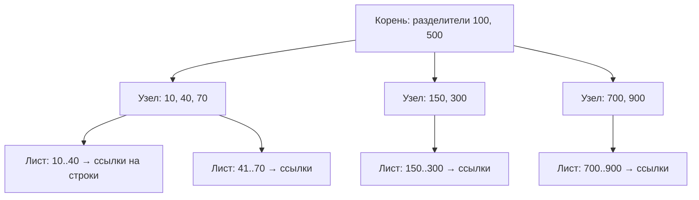
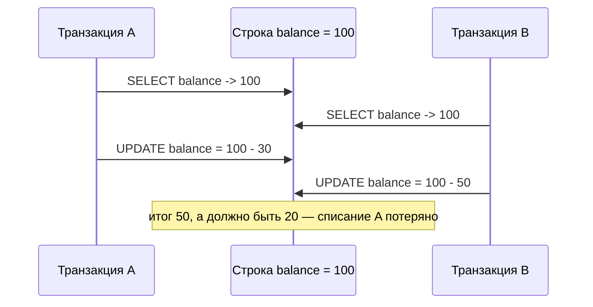
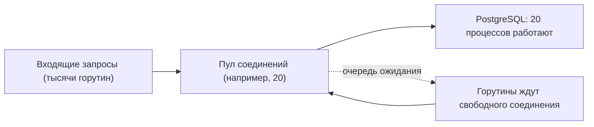

# Базы данных: одна база и всё, что в ней болит

Это первая половина модуля. Здесь — **одна** база: как она хранит, как ищет, как не даёт
двум пользователям испортить друг другу данные и почему она внезапно становится узким местом.
Вторая половина — про то, что происходит, когда баз становится много:
[`theory-2-replication-sharding.md`](./theory-2-replication-sharding.md).

## Простыми словами: что вообще делает база данных

База данных решает четыре задачи, которые ты не хочешь решать сам:

1. **Хранит данные так, чтобы они пережили выключение питания** (долговечность).
2. **Быстро находит нужное** среди миллиардов записей (индексы).
3. **Разруливает одновременный доступ**: сто пользователей меняют одно и то же, и никто не
   получает мусор (транзакции и блокировки).
4. **Не теряет полдела при сбое**: либо всё применилось, либо ничего (атомарность).

Аналогия: база — это библиотека. Стеллажи — хранение, каталог — индекс, библиотекарь,
который не даёт двум людям одновременно уносить одну книгу, — блокировки. И правило «либо
выдаём все пять томов сразу, либо ни одного» — это транзакция.

## Семейства хранилищ

**Простыми словами.** «SQL vs NoSQL» — плохая рамка: NoSQL это не один тип, а пять разных
инструментов, объединённых только тем, что они не реляционные. Выбирают не по названию, а по
**профилю запросов**: что ты спрашиваешь у данных и как часто.

| Семейство | Модель данных | Типичные представители | Сильная сторона | Слабое место |
|---|---|---|---|---|
| Реляционные | таблицы, строки, схема, JOIN | PostgreSQL, MySQL | связи, транзакции, гибкие запросы | горизонтальная запись, схема на лету |
| Key-value | ключ → значение | Redis, etcd, DynamoDB | скорость, простота, масштабирование | нет запросов «по содержимому» |
| Документные | JSON-документы | MongoDB, Couchbase | агрегат целиком, гибкая схема | связи, транзакции между документами |
| Wide-column | ключ строки + семейства колонок | Cassandra, ScyllaDB, HBase | огромные объёмы записи, линейный рост | запросы только по заранее выбранному ключу |
| Графовые | вершины и рёбра | Neo4j, JanusGraph | обход связей на глубину | объём, шардирование графа |
| Time-series | метрика + время + теги | TimescaleDB, ClickHouse, Prometheus | сжатие, агрегации по времени | точечные обновления |
| Поисковые | инвертированный индекс | Elasticsearch, OpenSearch | полнотекст, фасеты, ранжирование | не источник правды, лаг индексации |

Конкретика вместо абстракций:

- **Лента заказов интернет-магазина** — PostgreSQL: связи (заказ → позиции → товары),
  транзакции, отчёты произвольной формы.
- **Сессии и rate-limit счётчики** — Redis: миллион операций в секунду, данные переживут
  потерю без катастрофы.
- **Профиль пользователя целиком одним документом** — MongoDB, если запросов «найди всех, у
  кого X» почти нет.
- **Сообщения мессенджера, 2 млрд в сутки** — Cassandra: запись линейно масштабируется,
  запросы всегда «по чату за период» — идеально ложится на ключ `(chat_id, ts)`.
- **Рекомендации «друзья друзей»** — графовая БД или обход в приложении; в SQL это JOIN на
  JOIN'е, и на глубине 4 всё умирает.
- **Метрики сервисов** — ClickHouse/Prometheus: колоночное хранение сжимает данные в десятки
  раз и считает агрегаты за секунды.
- **Поиск товаров по тексту с фильтрами** — Elasticsearch рядом с PostgreSQL, где PostgreSQL
  остаётся источником правды.

Правило, которое стоит произнести на интервью: **начинай с PostgreSQL, пока числа не докажут
обратное**. Он умеет JSONB (документы), полнотекстовый поиск, партиционирование, а его
транзакции экономят месяцы разработки. Специализированное хранилище добавляют, когда
конкретный профиль нагрузки перестал влезать, — и добавляют **рядом**, а не вместо.

## Индексы

**Простыми словами.** Индекс — это оглавление. Без него база читает всю таблицу подряд
(sequential scan) и сравнивает каждую строку. С ним — идёт по «алфавитному указателю» и
попадает в нужное место за несколько шагов.

**B-tree** (точнее B+tree) — структура по умолчанию почти везде. Это сбалансированное дерево,
где ключи отсортированы, а в листьях лежат ссылки на строки:



Что из этого следует:

- **Глубина логарифмическая.** Дерево широкое: один узел — целая страница (8 КБ), в неё
  влезают сотни ключей. Поэтому для миллиарда строк глубина ~4 уровня: 3–4 обращения к
  диску вместо миллиарда сравнений.
- **Листья связаны в список** — поэтому индекс отлично обслуживает не только `=`, но и
  диапазоны (`BETWEEN`, `>`), и `ORDER BY` без отдельной сортировки.
- **Префикс важен.** Индекс `(a, b, c)` работает для условий по `a`, по `a, b` и по
  `a, b, c`, но **не** для запроса только по `b`. Это как искать в телефонной книге по
  имени, когда она отсортирована по фамилии.
- **`LIKE 'abc%'` индексируется, `LIKE '%abc'` — нет**: у второго нет начала строки, идти по
  отсортированному дереву некуда. Для «содержит» нужен полнотекстовый индекс или триграммы.

**Covering index (покрывающий).** Если все нужные запросу колонки лежат в самом индексе, база
не ходит в таблицу вообще — это index-only scan. Пример: индекс
`(customer_id, created_at) INCLUDE (status, total)` полностью обслуживает список заказов
клиента. Цена — индекс толще и запись дороже.

**Цена записи.** Каждый индекс — это отдельная структура, которую надо обновить при
`INSERT`/`UPDATE`/`DELETE`. Пять индексов = пять дополнительных записей на одну строку, плюс
расщепление страниц, плюс место (индексы часто занимают больше самой таблицы). Отсюда
формулировка для интервью: **индексы ускоряют чтение за счёт записи и диска**; на таблице с
интенсивной записью лишний индекс — реальная потеря пропускной способности.

Полезные тонкости, которые отличают сильный ответ:

- **Селективность.** Индекс по колонке `is_active` (два значения) почти бесполезен: планировщик
  выберет seq scan, потому что читать половину таблицы по индексу дороже, чем подряд.
- **Частичный индекс** — `WHERE status = 'pending'`: маленький, дешёвый, идеален для очередей
  внутри таблицы.
- **Порядок колонок** в составном индексе: сначала то, по чему идёт равенство, потом — по чему
  диапазон и сортировка.
- **LSM-деревья** (Cassandra, RocksDB, LevelDB) — альтернатива B-tree: запись идёт в память и
  последовательно на диск, потом фоново сливается (compaction). Запись очень быстрая, чтение
  и место — платят за это. Именно поэтому wide-column базы так хороши в приёме потока записи.
- `EXPLAIN (ANALYZE, BUFFERS)` — единственный честный ответ на вопрос «а индекс используется?».

## Транзакции и ACID

**Простыми словами.** Транзакция — «всё или ничего»: группа изменений, которая применяется
целиком либо не применяется вовсе. Классика — перевод денег: списать у одного и зачислить
другому должно случиться вместе.

- **A — Atomicity.** Либо все изменения, либо ни одного. Сбой посередине → откат.
- **C — Consistency.** Инварианты БД (ограничения, внешние ключи, чек-констрейнты) не
  нарушаются. Строго говоря, это свойство приложения, а не движка.
- **I — Isolation.** Параллельные транзакции не видят «полуфабрикаты» друг друга — точнее,
  видят ровно столько, сколько разрешает уровень изоляции.
- **D — Durability.** После `COMMIT` данные переживут падение процесса и питания. Реализуется
  **WAL** (write-ahead log): сначала последовательно пишем журнал и делаем `fsync`, потом
  лениво — сами страницы.

Именно из-за WAL «запись в БД» стоит не миллисекунды случайного доступа, а один
последовательный `fsync` — и именно поэтому групповой коммит и батчинг вставок так сильно
помогают.

## Уровни изоляции и аномалии

**Простыми словами.** Полная изоляция (как будто транзакции выполняются по очереди) стоит
дорого, поэтому базы предлагают уровни: чем слабее, тем быстрее и тем больше странностей ты
можешь увидеть.

Четыре классические аномалии:

- **Dirty read** — прочитал то, что другая транзакция ещё не закоммитила (и может откатить).
- **Non-repeatable read** — прочитал строку дважды в одной транзакции и получил разное.
- **Phantom read** — повторил запрос по условию, и появились новые строки.
- **Lost update** — двое прочитали одно значение, оба посчитали и записали; одно изменение
  потерялось.



| Уровень | Dirty read | Non-repeatable | Phantom | Lost update |
|---|---|---|---|---|
| Read Uncommitted | возможен | возможен | возможен | возможен |
| Read Committed | нет | возможен | возможен | возможен |
| Repeatable Read | нет | нет | по стандарту возможен | зависит |
| Serializable | нет | нет | нет | нет |

**Что важно знать про PostgreSQL:**

- Уровень по умолчанию — **Read Committed**. Dirty read невозможен вообще ни на одном уровне
  (реализация через MVCC — многоверсионность: каждая транзакция видит снимок данных).
- **Repeatable Read в PostgreSQL сильнее стандарта**: это snapshot isolation, фантомов в
  привычном виде нет, зато возможна ошибка `could not serialize access` — транзакцию надо
  **повторить** (в коде обязательно нужен retry).
- **Serializable** реализован как SSI (serializable snapshot isolation): не блокирует, а
  отслеживает конфликты и откатывает одну из транзакций. Дорого при высокой конкуренции, зато
  корректно.
- **MVCC имеет цену**: старые версии строк остаются, пока их не уберёт `VACUUM`; отсюда
  «раздувание» (bloat) и известная проблема долгих транзакций, которые держат снимок и мешают
  очистке.

Практический вывод: `SELECT`, потом расчёт в Go, потом `UPDATE` — это **готовый lost update**
на Read Committed. Лечится тремя способами:

1. **Атомарно в SQL**: `UPDATE accounts SET balance = balance - 30 WHERE id = $1 AND balance >= 30`.
2. **Пессимистичная блокировка**: `SELECT ... FOR UPDATE` — строка блокируется до конца
   транзакции, второй читатель ждёт.
3. **Оптимистичная блокировка**: колонка `version`, обновление
   `... WHERE id = $1 AND version = $2`; если затронуто 0 строк — кто-то опередил, читаем
   заново и повторяем.

Когда что: пессимистичная — когда конфликты частые и короткие (списание с одного счёта);
оптимистичная — когда конфликты редкие, а транзакции длинные (редактирование карточки
товара человеком). Пессимистичная блокировка на популярной строке превращается в очередь и
убивает пропускную способность; оптимистичная в тех же условиях даёт шторм повторов.

```go
// Пессимистично: блокируем строку до конца транзакции.
// FOR UPDATE нужен именно потому, что между чтением и записью есть логика на стороне Go.
var balance int64
err := tx.QueryRowContext(ctx,
    `SELECT balance FROM accounts WHERE id = $1 FOR UPDATE`, id).Scan(&balance)
if err != nil {
    return err
}
if balance < amount {
    return ErrInsufficientFunds
}
_, err = tx.ExecContext(ctx,
    `UPDATE accounts SET balance = balance - $1 WHERE id = $2`, amount, id)
```

Отдельно: **порядок блокировок**. Две транзакции, берущие строки A и B в разном порядке,
дают классический deadlock. PostgreSQL его обнаружит и откатит одну — но лучше договориться
всегда брать блокировки в одном порядке (например, по возрастанию `id`).

## N+1: тихий убийца

**Простыми словами.** Запросили список из 100 заказов (1 запрос), а потом в цикле для каждого
заказа запросили клиента (ещё 100 запросов). Итого 101 обращение вместо двух.

Почему это страшнее, чем кажется: каждый запрос — это round trip к базе (0.3–1 мс внутри ДЦ),
и на 100 итерациях получается 100 мс чистого ожидания, при том что база не загружена. На
графиках всё «здорово», а p99 у ручки ужасный.

Лечится: `JOIN`, либо второй запрос `WHERE customer_id = ANY($1)` с последующей склейкой в
памяти, либо `IN`-батч. В ORM — явный eager loading. Признак на интервью: если кандидат сам
вспомнил про N+1, обсуждая список с вложенными данными, — это плюс.

## Пул соединений и почему он маленький

**Простыми словами.** Каждое соединение к PostgreSQL — это **отдельный процесс на сервере
БД** со своей памятью (work_mem на сортировку, буферы). Тысяча соединений — тысяча процессов,
которые конкурируют за CPU и переключаются контекстом; база начинает тратить силы на
менеджмент вместо работы.



Контринтуитивный факт: **уменьшение пула часто увеличивает пропускную способность**. Если
база упирается в диск и CPU, 200 параллельных запросов просто делят те же ресурсы, добавляя
накладные расходы и блокировки. Практическое правило для старта: пул ≈ 2–4 × число ядер БД,
и обязательно суммарно по всем инстансам сервиса меньше, чем `max_connections`. Если инстансов
много — ставят внешний пулер (PgBouncer) в режиме transaction pooling.

```go
db.SetMaxOpenConns(20)                  // жёсткий потолок: столько процессов увидит база
db.SetMaxIdleConns(20)                  // не даём пулу схлопываться и пересоздавать TCP
db.SetConnMaxLifetime(30 * time.Minute) // ротация: помогает при failover и смене DNS
db.SetConnMaxIdleTime(5 * time.Minute)
```

Важная деталь для Go: ожидание свободного соединения **уважает `context`** — если контекст
запроса отменён или истёк дедлайн, `QueryContext` вернёт ошибку, не занимая соединение. Без
дедлайнов очередь к пулу растёт молча, и «медленная база» на деле оказывается «медленной
очередью к базе».

## Как это спрашивают на собеседовании

**«SQL или NoSQL для этой задачи?»** Ждут профиль запросов, а не предпочтение. Сильный ответ:
«запросы всегда по одному ключу, объём 500 ТБ, запись 100k/с, связей нет — беру wide-column;
если бы понадобились отчёты произвольной формы и транзакции, взял бы PostgreSQL и шардировал».

**«У вас медленный запрос. Ваши действия?»** Ожидаемая последовательность: посмотреть
`EXPLAIN ANALYZE` → понять, seq scan или index scan → проверить селективность и порядок
колонок в индексе → посмотреть, не N+1 ли это на уровне приложения → и только потом думать
про кэш и денормализацию. Слабый ответ начинается со слов «поставим Redis».

**«Что такое уровни изоляции и какой в PostgreSQL по умолчанию?»** Read Committed. Дальше —
любимый добивающий вопрос: «а какие аномалии он допускает?» (non-repeatable read, phantom,
lost update) и «как вы защитите списание с баланса?».

**«Два запроса одновременно списывают с одного счёта. Что произойдёт?»** Проверяют, знаешь ли
ты про lost update. Сильный ответ содержит три варианта решения и критерий выбора между
пессимистичной и оптимистичной блокировкой.

**«Почему пул соединений на 500 — плохая идея?»** Проверяют понимание, что соединение в
PostgreSQL — это процесс, и что параллелизм ограничен ресурсами, а не желанием.

**«Сколько индексов повесить на таблицу?»** Ждут trade-off: каждый индекс — плюс к чтению и
минус к записи и месту; на таблицу с высокой записью — минимум, и только под реальные запросы.

## Типичные ошибки и заблуждения

- **«NoSQL быстрее SQL».** Быстрее — только для своего профиля запросов. PostgreSQL с
  правильным индексом отдаёт строку по ключу за доли миллисекунды; Cassandra проиграет ему на
  запросе «сумма по клиентам за месяц» просто потому, что не для этого сделана.
- **«NoSQL — потому что схема не нужна».** Схема никуда не девается, она просто переезжает в
  код, где её никто не проверяет. Через год у тебя пять форматов одного документа.
- **«Индексы всегда ускоряют».** На маленькой или низкоселективной колонке планировщик их
  проигнорирует, а запись подорожает.
- **«Транзакция гарантирует, что мой `SELECT` + `UPDATE` корректен».** Нет: на Read Committed
  между чтением и записью влезет кто угодно. Нужен `FOR UPDATE`, атомарный `UPDATE` или версия.
- **«ACID и консистентность в CAP — одно и то же».** Разные вещи: `C` в ACID — про инварианты
  внутри одной базы, `C` в CAP — про то, видят ли все узлы одно и то же значение.
- **«Больше соединений — больше пропускной способности».** Обычно наоборот.
- **«ORM сам разберётся».** N+1 и ленивые загрузки — самая частая причина «непонятных»
  тормозов.
- **«Денормализуем сразу, JOIN'ы медленные».** JOIN по индексу на разумных объёмах дешёв;
  денормализация — это дублирование и вечная задача синхронизации.
- **Долгие транзакции.** Открыть транзакцию, сходить в HTTP-API соседа и потом закоммитить —
  это удержание блокировок и снимка на секунды: bloat, deadlock'и, каскад таймаутов.
- **Деньги в `float`.** Только целые в минорных единицах или `numeric`.

## Глоссарий

- **Sequential scan / index scan** — чтение всей таблицы подряд / поиск через индекс.
- **B-tree** — сбалансированное дерево, стандартный индекс; глубина логарифмическая.
- **LSM-дерево** — структура с записью в память и последовательным сбросом на диск
  (Cassandra, RocksDB): быстрая запись, дороже чтение, нужен compaction.
- **Covering index (index-only scan)** — индекс, содержащий все нужные запросу колонки.
- **Селективность** — доля строк, отсекаемых условием; чем выше, тем полезнее индекс.
- **Частичный индекс** — индекс с `WHERE`, покрывающий подмножество строк.
- **ACID** — атомарность, консистентность, изоляция, долговечность.
- **WAL (write-ahead log)** — журнал упреждающей записи; основа долговечности и репликации.
- **MVCC** — многоверсионное управление конкурентным доступом: читатели не блокируют
  писателей и наоборот.
- **VACUUM** — уборка старых версий строк в PostgreSQL.
- **Уровни изоляции** — Read Uncommitted / Read Committed / Repeatable Read / Serializable.
- **Dirty / non-repeatable / phantom read, lost update** — аномалии параллельного доступа.
- **Snapshot isolation** — транзакция видит согласованный снимок данных на момент старта.
- **Пессимистичная блокировка** — `SELECT ... FOR UPDATE`: сначала заблокируй, потом меняй.
- **Оптимистичная блокировка** — версия строки и проверка при `UPDATE`; конфликт → повтор.
- **Deadlock** — взаимная блокировка; лечится единым порядком захвата.
- **N+1** — один запрос списка плюс по запросу на каждый элемент.
- **Пул соединений** — ограниченный набор переиспользуемых соединений к БД.
- **PgBouncer** — внешний пулер соединений для PostgreSQL.

## См. также

- Martin Kleppmann, *Designing Data-Intensive Applications* (O'Reilly, 2017): гл. 2 (модели
  данных), гл. 3 (storage engines, B-tree vs LSM), гл. 7 (транзакции и уровни изоляции).
- Документация PostgreSQL: «Transaction Isolation», «Indexes», «Explicit Locking», «Routine
  Vacuuming» — postgresql.org/docs.
- `database/sql` и настройки пула — pkg.go.dev/database/sql; PgBouncer — pgbouncer.org.
- Alex Xu, *System Design Interview*, vol. 1 (2020) — главы про выбор хранилища.
- Продолжение: [`theory-2-replication-sharding.md`](./theory-2-replication-sharding.md).
- Уроки: [`lessons/01-modeling-and-indexes-marketplace.md`](./lessons/01-modeling-and-indexes-marketplace.md),
  [`lessons/02-replication-and-read-scaling.md`](./lessons/02-replication-and-read-scaling.md),
  [`lessons/03-sharding-users-and-messages.md`](./lessons/03-sharding-users-and-messages.md).
- Дальше — кэш: [`../04-caching/index.md`](../04-caching/index.md).
