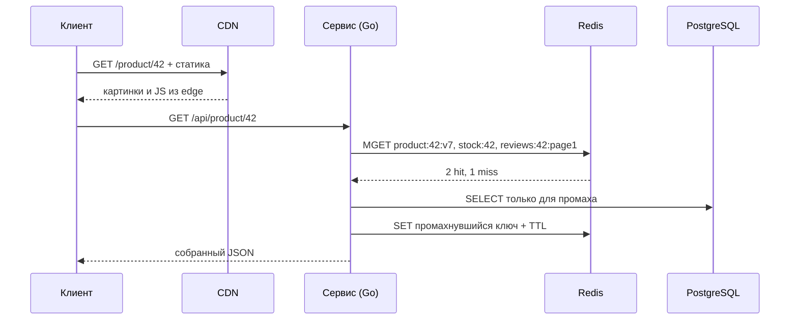

# Урок 01 — Кэшируем страницу товара

Цель: пройти путь от «страница тормозит» до конкретного решения — уровень, стратегия, ключ,
TTL, инвалидация, метрики — и научиться произносить это связно за две минуты.

## Разогрев

- Почему кэш нельзя считать источником правды?
- Что даёт TTL, если есть явная инвалидация?
- Что быстрее и на сколько: Redis в том же ДЦ или индексный `SELECT` в PostgreSQL?

## Задача

Интернет-магазин. Страница товара собирается из: карточки (название, описание, цена),
остатка на складе, рейтинга и последних 5 отзывов, блока «похожие товары», картинок.
Пиковая нагрузка — 7000 RPS на чтение, записи (обновление цены/остатка) — 200/с.
Сейчас каждый запрос — 6 обращений в PostgreSQL, p50 = 90 мс, p99 = 800 мс, БД на 80 % CPU.

## Шаг 1. Разложить по свежести, а не по «всё закэшируем»

Первый ход, который отличает сильный ответ: **разные части страницы имеют разные требования
к свежести**. Никогда не кэшируй страницу одним куском, пока не проверил, нет ли внутри
куска, которому нельзя врать.

| Часть | Читают | Меняется | Допустимая несвежесть | Решение |
|---|---|---|---|---|
| Карточка (название, описание, цена) | очень часто | редко | 1–5 мин | Redis, cache-aside |
| Остаток на складе | часто | часто | 5–30 с (но не в момент оплаты) | Redis, TTL 10 с; при checkout — из БД |
| Рейтинг + 5 отзывов | часто | редко | 5–15 мин | Redis, отдельный ключ |
| «Похожие товары» | часто | очень редко | часы | Redis, TTL 6 ч + пересчёт по расписанию |
| Картинки, CSS/JS | всегда | по релизу | вечность | CDN, иммутабельные URL |

Обрати внимание на строку про остаток: **несвежесть допустима на витрине и недопустима в
момент списания**. Это универсальный приём: показываем из кэша, подтверждаем из источника
правды (в транзакции, с проверкой `quantity >= n`).

## Шаг 2. Ключи

Правило: ключ должен содержать **всё, что влияет на ответ**, и ничего лишнего.

```text
product:{id}:v{ver}        — карточка, ver из updated_at или счётчика версий
stock:{id}                 — остаток, TTL 10 с
reviews:{id}:page1         — первая страница отзывов (страницы 2+ почти не читают)
similar:{id}               — «похожие», TTL 6 ч
```

Что часто забывают включить в ключ: локаль (`:ru`), валюту/регион, версию API, роль
пользователя (если ответ различается), A/B-группу. Забыл — получишь чужую цену в чужой
валюте, а это уже не «медленно», а «неверно».

## Шаг 3. Поток запроса



Два практических следствия: используй **`MGET`/pipeline** вместо трёх round-trip'ов (три
раза по 0.5 мс — это уже 1.5 мс на пустом месте), и **в БД идёт только промах**, а не вся
страница.

## Шаг 4. TTL и инвалидация

- Карточка: TTL 300 с + jitter до 60 с. Инвалидация — при `UPDATE products` **после
  commit**: либо `DEL product:{id}:v*` не делаем вовсе, а поднимаем `ver` (тогда старый ключ
  умрёт сам), либо `DEL product:{id}:v{old}`.
- Остаток: только TTL 10 с — явная инвалидация на каждое списание не нужна, счётчик и так
  меняется каждую секунду.
- Отзывы: `DEL reviews:{id}:page1` при появлении отзыва.
- «Похожие»: пересчёт фоновым джобом, запись прямо в кэш (write-through) — читатель никогда
  не платит за расчёт.

## Шаг 5. Что померять после внедрения

Hit ratio по каждому префиксу ключей отдельно (агрегат по всем ключам врёт), p50/p99 ручки,
RPS в БД, `evicted_keys`. Ожидание для нашей задачи: hit ratio 95 %, БД получает
7000 × 0.05 ≈ 350 RPS вместо 7000 × 6 обращений, p50 падает до ~5 мс, p99 остаётся
десятками миллисекунд — потому что промахи никуда не делись.

## Mini-drill

```drill
type: multiple-choice
prompt: "Почему остаток на складе показываем из кэша, а списываем из БД?"
options: ["Потому что Redis не умеет INCR/DECR", "На витрине секундная несвежесть безвредна, а при списании нужна транзакционная проверка в источнике правды", "Потому что в кэше нет транзакций вообще", "Потому что TTL нельзя сделать короче минуты"]
answer: "На витрине секундная несвежесть безвредна, а при списании нужна транзакционная проверка в источнике правды"
check: exact
```

```drill
type: fill-in
prompt: "Три обращения в Redis подряд стоят ~1.5 мс. Правильный способ — собрать их в один round-trip через ___ или pipeline."
answer: "MGET"
check: fuzzy
```

```drill
type: free-form
prompt: "Тебя просят закэшировать страницу товара целиком одним HTML-ключом на 10 минут. Возрази аргументированно."
answer: "Внутри страницы есть части с разными требованиями к свежести: остаток на складе устареет на 10 минут и мы будем продавать то, чего нет; цена может измениться и это уже юридический риск. Плюс страница персонализируется (регион, валюта, «вы смотрели»), значит один общий ключ либо отдаст чужие данные, либо hit ratio будет низким из-за размножения ключей. Предлагаю фрагментное кэширование: карточка на 5 минут, остаток на 10 секунд, отзывы на 15 минут, статика в CDN навсегда с версией в имени. Тогда каждая часть живёт со своим TTL, а инвалидация точечная."
check: manual
```

## Итог

Кэширование страницы — это не «Redis перед базой», а таблица «часть → частота чтений →
частота изменений → допустимая несвежесть → уровень и TTL». Ключ включает всё, что влияет
на ответ. Инвалидация — после commit, дешевле всего через версию в ключе. Показывать можно
из кэша, списывать — только из источника правды. И считай числа: hit ratio 95 % превращает
7000 RPS в 350 RPS к БД.
