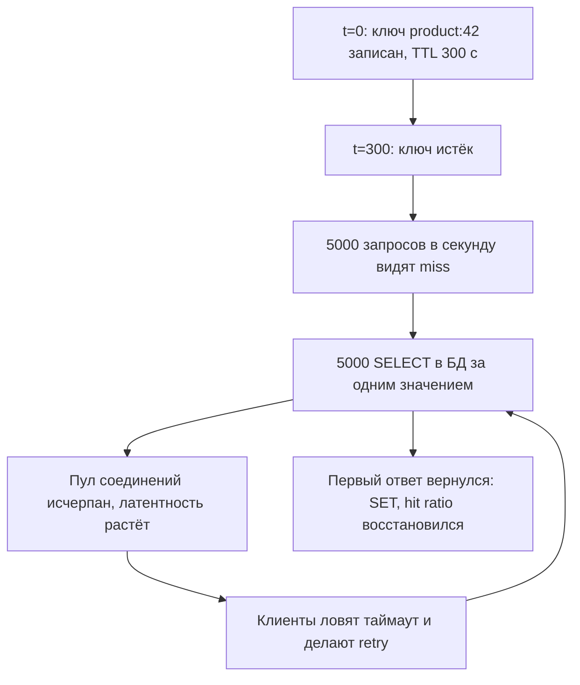

# Урок 02 — Лаборатория stampede: `singleflight` и друзья

Цель: научиться узнавать cache stampede по симптомам за 10 секунд и уметь назвать четыре
средства защиты в правильном порядке — от самого дешёвого к самому сложному.

## Разогрев

- Что такое hit ratio и как он влияет на нагрузку на БД?
- Чем expiration отличается от eviction?
- Что делает `singleflight.Group.Do`?

## Сцена преступления

Продакшн. Графики: p99 ручки `/product/{id}` каждые пять минут прыгает с 20 мс до 3 секунд,
CPU PostgreSQL пилой уходит в 100 %, в логах — `context deadline exceeded` и «pool exhausted».
Между всплесками всё идеально. TTL кэша карточки — 300 секунд.

Совпадение периода всплеска с TTL — это подпись. Что происходит по шагам:



Обрати внимание на цикл `f → d`: retry клиентов **усиливает** стадо. Именно поэтому
stampede часто перерастает в каскадный отказ, а не просто в «скачок графика».

## Средство 1. `singleflight` — дешёвое и обязательное

Внутри одного процесса тысяча горутин, промахнувшихся по одному ключу, должна сделать
**один** запрос в БД.

```go
var g singleflight.Group

func (s *Service) Product(ctx context.Context, id int64) (*Product, error) {
    key := fmt.Sprintf("product:%d", id)
    if p, ok := s.cache.Get(ctx, key); ok {
        return p, nil
    }
    // g.Do дедуплицирует одинаковые ключи: лидер грузит, остальные ждут его результат.
    // Третье возвращаемое значение shared == true, если результат был переиспользован —
    // хорошая метрика «сколько stampede мы съели».
    v, err, shared := g.Do(key, func() (any, error) {
        p, err := s.db.LoadProduct(ctx, id)
        if err != nil {
            return nil, err
        }
        s.cache.Set(ctx, key, p, jitter(5*time.Minute))
        return p, nil
    })
    if err != nil {
        return nil, err
    }
    s.metrics.SharedLoads.Add(boolToInt(shared))
    return v.(*Product), nil
}
```

Важные тонкости, которые спрашивают:

- `Do` **не** отменяется по `ctx` вызывающего: если лидер завис, ждут все. Поэтому таймаут
  внутри загрузчика обязателен, а лучше — `DoChan` + `select` с `ctx.Done()`.
- Ошибка лидера отдаётся **всем** ждущим. Один плохой запрос — тысяча одинаковых ошибок.
  Значит `Forget(key)` или короткий negative-cache, чтобы не залипнуть.
- Дедупликация работает только **внутри процесса**. Двадцать подов = двадцать запросов в БД
  вместо 5000. Обычно этого уже достаточно.

## Средство 2. Jitter в TTL — одна строка кода

Если все ключи записаны в одну секунду (прогрев, деплой, массовая инвалидация), они и
истекут в одну секунду. Разброс убирает синхронность:

```go
// Разброс ±20 % не даёт ключам истечь одновременно после массового прогрева.
func jitter(d time.Duration) time.Duration {
    delta := time.Duration(rand.Int64N(int64(d) / 5))
    return d - d/10 + delta
}
```

## Средство 3. Early refresh — «отдай старое, обнови в фоне»

Храним значение с двумя сроками: «свежо до» (soft TTL) и «годно до» (hard TTL). Если
запрос попал в промежуток — отдаём stale-значение мгновенно, а обновление запускаем в фоне
(через тот же `singleflight`, чтобы фоновых обновлений было не тысяча). Пользователь вообще
не видит промаха. В CDN это ровно `stale-while-revalidate`.

## Средство 4. Распределённый лок — когда подов много

Первый промахнувшийся ставит `SET lock:product:42 <token> NX PX 3000`. Кто поставил — грузит;
кто не смог — либо ждёт 50 мс и повторяет чтение кэша, либо отдаёт stale. Это уже
распределённая примитивная блокировка со всеми её проблемами (истёк лок раньше, чем
закончилась работа) — подробнее в модуле
[`07-distributed-systems`](../../07-distributed-systems/index.md).
Порядок применения: сначала `singleflight` + jitter (бесплатно), потом early refresh, и
только потом лок.

## Порядок внедрения и цена

| Средство | Сложность | Что убирает | Побочный эффект |
|---|---|---|---|
| `singleflight` | 10 строк | стадо внутри процесса | ошибка лидера у всех ждущих |
| jitter TTL | 1 строка | синхронное истечение | разброс возраста данных |
| early refresh | ~50 строк | видимые промахи на горячем | сознательная отдача stale |
| распределённый лок | ~80 строк + Redis | стадо между подами | лок может истечь/зависнуть |
| negative caching | 5 строк | стадо по несуществующим id | 404 живёт до TTL |

## Mini-drill

```drill
type: multiple-choice
prompt: "20 подов, у каждого singleflight, горячий ключ истёк при 5000 RPS. Сколько запросов уйдёт в БД?"
options: ["1", "около 20", "5000", "непредсказуемо много"]
answer: "около 20"
check: exact
hint: "Дедупликация действует в границах процесса."
```

```drill
type: fill-in
prompt: "Если лидер singleflight вернул ошибку, её получат ___ ждущие вызовы, поэтому нужен Forget или короткий negative-cache."
answer: "все"
check: fuzzy
```

```drill
type: free-form
prompt: "Объясни вслух схему early refresh (soft/hard TTL) и почему она лучше просто длинного TTL."
answer: "Кладём значение с двумя порогами: soft TTL — «свежо», hard TTL — «дальше нельзя». До soft отдаём как есть. Между soft и hard отдаём старое значение сразу, а обновление запускаем в фоне через singleflight — пользователь не ждёт БД и вообще не видит промаха. После hard TTL — честный синхронный промах. Длинный TTL просто разрешает данным быть старыми и всё равно однажды даёт лавину при истечении; early refresh держит данные почти свежими и убирает видимый промах, платя фоновой работой и сознательной отдачей stale на короткое окно."
check: manual
```

```drill
type: free-form
prompt: "Интервьюер даёт симптом: «после каждого деплоя первые 30 секунд БД в потолке». Диагноз и лечение?"
answer: "Новые поды поднялись с пустыми in-process кэшами, и весь трафик пошёл мимо локального уровня. Плюс, если инстансы прогрелись одновременно, ключи потом истекут одновременно — вторая волна. Лечение: не включать под в балансировку до прогрева (readiness probe становится «я прогрелся»), раскатывать постепенно, а не все поды сразу; общий Redis как второй эшелон переживает деплой и берёт удар; jitter в TTL, чтобы не получить синхронное истечение; singleflight внутри пода. Плюс проверить, что таймауты и rate limiting не дают этой волне превратиться в каскад."
check: manual
```

## Итог

Stampede — это не экзотика, а прямое следствие «горячий ключ + TTL». Порядок защиты:
`singleflight` (внутри процесса, почти бесплатно) → jitter в TTL (одна строка) → early
refresh (пользователь не видит промахов) → распределённый лок (когда подов много) →
negative caching (от несуществующих ключей). И помни главную опасность: retry клиентов
усиливает стадо, поэтому stampede лечится вместе с таймаутами и лимитами.
