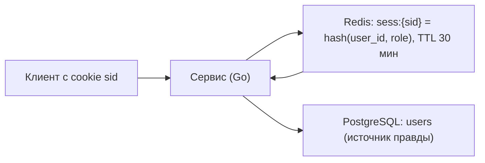

# Урок 03 — Redis на практике: сессии, лидерборд, счётчики

Цель: перестать думать про Redis как про «кэш» и научиться выбирать под задачу нужную
структуру данных, а заодно честно называть, что в каждом сценарии можно потерять.

## Разогрев

- Чем ZSET отличается от Set и когда нужен именно ZSET?
- Почему pub/sub нельзя использовать как очередь задач?
- Что теряется при `appendfsync everysec`?

## Сценарий 1. Сессии

Задача: пользователь логинится, дальше на каждый запрос надо узнать, кто он.



Устройство: `HSET sess:{sid} user_id 42 role admin` + `EXPIRE sess:{sid} 1800`. Продление —
`EXPIRE` на каждом запросе (sliding session). Logout — `DEL sess:{sid}`, и это главное
преимущество серверных сессий: **их можно отозвать мгновенно**, в отличие от stateless JWT,
который живёт до истечения (подробно про auth — в модуле 08 про архитектуру и безопасность).

Что можно потерять: если Redis умер, все разлогинились. Это не «данные пропали», но
неприятно, поэтому здесь персистентность (AOF everysec) и репликацию обычно **включают** —
редкий случай, когда Redis не чистый кэш. Альтернатива — принимать разлогин как штатную
деградацию.

Оценка памяти: 1 млн активных сессий × ~200 байт ≈ 200 МБ. Дешево.

## Сценарий 2. Лидерборд

Задача: топ-100 игроков по очкам, плюс «моё место» — в реальном времени, 50k обновлений в
минуту. В SQL это `ORDER BY score DESC LIMIT 100` с пересчётом ранга — на миллионе игроков
и постоянных апдейтах больно.

ZSET решает это тремя командами:

```text
ZADD leaderboard 15300 user:42        # обновить очки (O(log N))
ZREVRANGE leaderboard 0 99 WITHSCORES # топ-100 (O(log N + 100))
ZREVRANK leaderboard user:42          # моё место (O(log N))
```

Память: 1 млн элементов ZSET ≈ 80–100 МБ. Сложность — логарифмическая, то есть «быстро» и
на миллионе, и на десяти.

Trade-off и подводные камни:

- ZSET — это **производная** от данных, а источник правды — БД. Redis потеряли — пересобрали
  из БД фоновым джобом. Обязательно имей такой джоб, иначе лидерборд станет источником
  правды по недоразумению.
- Один ключ `leaderboard` = **hot key**. Лечится: локальный кэш топ-100 на 1–5 с (топ читают
  все, а «моё место» — только я), шардирование по регионам/сезонам (`lb:eu:2026-09`).
- Ничьи и стабильный порядок: одинаковый score → сортировка лексикографически по member.
  Хотите «кто раньше набрал — тот выше» — кодируйте время в score (например,
  `score * 1e6 - timestamp_норм`).

## Сценарий 3. Счётчики для rate limiting

Задача: не более 100 запросов в минуту на пользователя. Фиксированное окно — две команды:

```text
INCR   rl:{user}:{minute}      # атомарный инкремент, ответ = текущее значение
EXPIRE rl:{user}:{minute} 120  # только при первом инкременте
```

Атомарность `INCR` — это то, за что здесь любят Redis: без гонок, без транзакций.
`INCR` + `EXPIRE` двумя командами — уже гонка (упали между ними → ключ без TTL живёт вечно),
поэтому в бою это Lua-скрипт или `SET key 0 EX 120 NX` перед `INCR`.

Sliding window точнее и делается через ZSET: `ZADD rl:{user} <now> <uuid>`,
`ZREMRANGEBYSCORE rl:{user} 0 <now-60s>`, `ZCARD rl:{user}`. Дороже по памяти (запись на
каждый запрос), зато нет «двойного лимита на границе окна». Алгоритмы лимитирования целиком
разбираются в модуле [`06-scalability-and-reliability`](../../06-scalability-and-reliability/index.md).

## Сценарий 4. Инвалидация локальных кэшей через pub/sub

У десяти подов есть in-process кэш конфигурации. Админ поменял конфиг — надо сбросить у всех.

```text
PUBLISH cache:invalidate  config:global      # издатель — сервис, обработавший запись
SUBSCRIBE cache:invalidate                   # каждый под держит подписку и чистит свою map
```

Честное ограничение: pub/sub — **at-most-once**. Под перезапускался в момент рассылки —
он сообщение не получил и будет жить со старым конфигом до истечения локального TTL. Именно
поэтому локальный TTL всегда короткий (1–10 с): pub/sub ускоряет сброс, а гарантирует его
TTL, а не сообщение.

## Что важно не забыть про Redis в бою

- **Никаких `KEYS *`** на живом сервере: команда блокирующая и линейная по числу ключей.
  Только `SCAN` с курсором.
- Redis выполняет команды **в одном потоке**: одна тяжёлая команда (`ZRANGE` на миллион
  элементов, большой Lua-скрипт) блокирует всех. Тяжёлое — разбивай.
- Таймауты на клиенте (50–200 мс) и ограничение пула соединений: без них падение Redis
  превращается в подвисание всех горутин.
- Большие значения (> 100 КБ) в Redis — плохая идея: сеть и сериализация съедают выигрыш.

## Mini-drill

```drill
type: multiple-choice
prompt: "Нужен топ-100 и «моё место» в реальном времени на 1 млн игроков. Что выбрать?"
options: ["String с JSON топа и пересчётом раз в минуту", "ZSET: ZADD + ZREVRANGE + ZREVRANK", "Hash с очками и сортировкой на стороне сервиса", "SQL ORDER BY score LIMIT 100 на каждый запрос"]
answer: "ZSET: ZADD + ZREVRANGE + ZREVRANK"
check: exact
hint: "Нужен и порядок, и ранг конкретного элемента — за O(log N)."
```

```drill
type: fill-in
prompt: "Пара команд INCR + EXPIRE неатомарна: если процесс упал между ними, ключ останется ___. Решение — Lua-скрипт."
answer: "без TTL | навсегда"
check: fuzzy
```

```drill
type: free-form
prompt: "Объясни вслух, почему для сессий персистентность Redis обычно включают, а для кэша карточек — выключают."
answer: "Для карточек Redis — производная от БД: потеряли — прогрелись заново, единственная плата это минута повышенной нагрузки, и поднимать старый дамп даже вреднее, чем читать свежее из БД. Для сессий Redis фактически хранит состояние, которого больше нигде нет: потеря = все разлогинились, то есть видимый инцидент. Поэтому здесь включают AOF everysec (теряем до секунды) и репликацию, а иногда добавляют дублирование сессии в подписанную cookie как деградацию. Общий принцип: персистентность нужна там, где потеря данных кэша означает не «медленно», а «сломалось»."
check: manual
```

```drill
type: free-form
prompt: "Набросай (5–8 строк, псевдокод) sliding-window rate limiter на ZSET и назови его цену по памяти."
answer: "now := time.Now().UnixMilli(); key := \"rl:\"+userID; в одном Lua/pipeline: ZREMRANGEBYSCORE key 0 now-60000 (выкидываем всё старше окна); ZCARD key -> n; if n >= 100 { return 429 }; ZADD key now uuid; PEXPIRE key 60000; return allow. Цена: одна запись на каждый запрос внутри окна, ~50–70 байт на элемент, то есть 100 запросов/мин на пользователя ≈ 7 КБ, на 1 млн активных пользователей ≈ 7 ГБ — дорого, поэтому в бою окно короче, лимит меньше, либо используется приближение (token bucket на счётчике) вместо честного sliding log."
check: manual
```

## Итог

Redis — не «кэш», а конструктор: string для кэша ответов, hash для сессий, ZSET для рангов
и sliding-окон, `INCR` для лимитов, streams для очередей, pub/sub для сигналов. Под каждый
сценарий отвечай на два вопроса: **какая структура** и **что произойдёт, если этот Redis
потерять**. Если ответ на второй вопрос страшнее «станет медленно» — включай персистентность
и репликацию либо переноси данные в БД.
