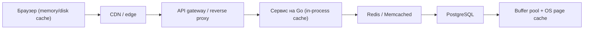
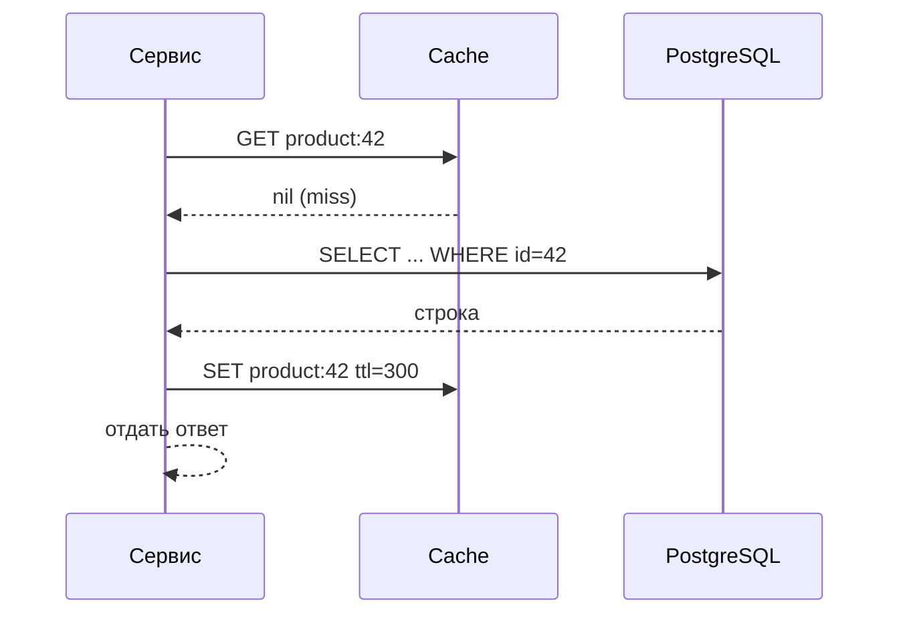
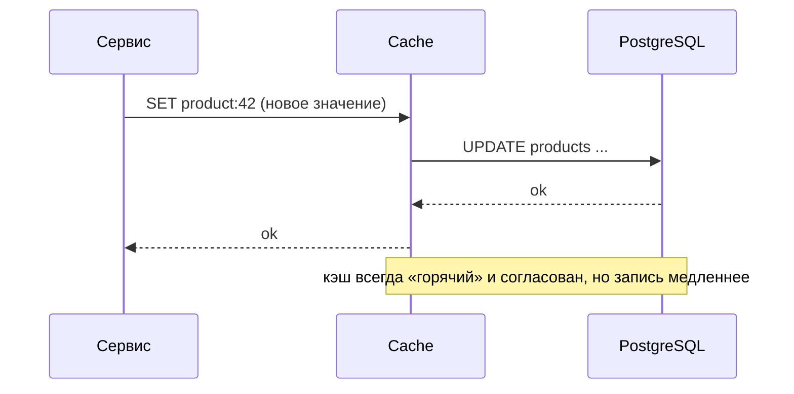
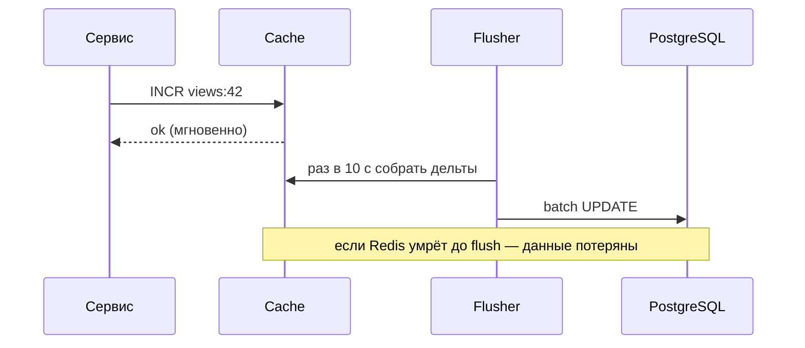
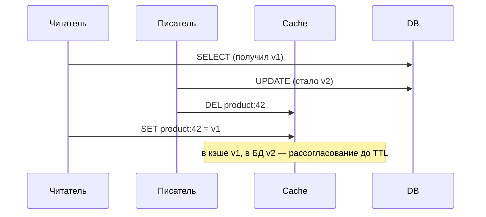
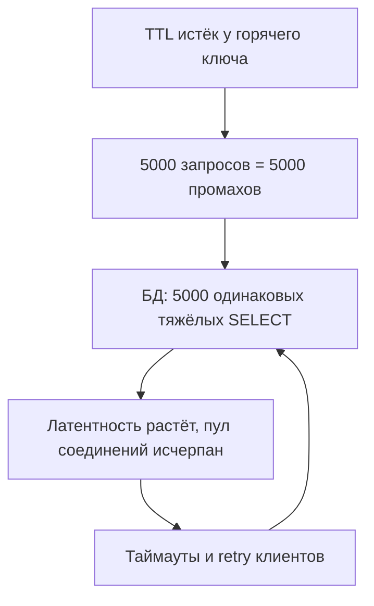
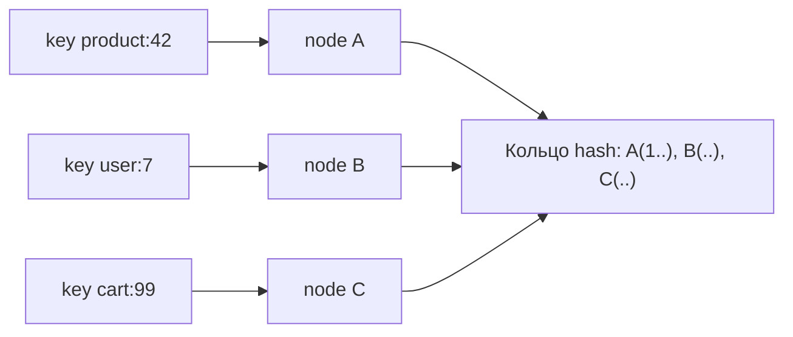

# Кэширование

## Простыми словами

**Кэш** — это маленькое быстрое хранилище рядом с потребителем, куда мы складываем копию
данных, которые дорого достать заново.

Аналогия: на холодильнике висит стикер с кодом от подъезда. Настоящий источник правды —
договор с УК где-то в папке (медленно, надо идти искать), но код записан на стикере, и ты
читаешь его за полсекунды. Проблемы стикера — это ровно все проблемы кэша:

- код могли **сменить**, а стикер устарел (инвалидация, stale data);
- стикер можно **потерять** — не страшно, сходишь в папку (кэш не источник правды);
- стикеров можно наклеить сто, но холодильник **не бесконечный** (eviction);
- если стикер сорвали, и **вся семья одновременно** побежала искать папку — в коридоре
  давка (cache stampede).

Ключевое свойство: **кэш никогда не является источником правды**. Его всегда можно
потерять без последствий: потеря кэша означает «медленно», а не «данные пропали». Если потеря кэша означает
потерю данных, это не кэш, а плохая база.

## Зачем кэшировать: три причины и числа

1. **Латентность.** Сделать ответ быстрее — не на проценты, а в разы.
2. **Снять нагрузку** с дорогого компонента (БД, внешний API, тяжёлый расчёт).
3. **Деньги.** Реплика PostgreSQL с диском стоит намного дороже, чем гигабайт памяти
   в Redis, а вызов платного внешнего API — вообще прямая строка в счёте.

Порядки величин, которые надо помнить (это классические «latency numbers», их спрашивают):

| Операция | Порядок | Как думать |
|---|---|---|
| L1/L2 кэш CPU | 1–10 нс | «мгновенно» |
| Обращение в RAM | ~100 нс | 0.0001 мс |
| Локальный in-process кэш (Go map) | 0.1–1 мкс | почти RAM + чуть-чуть кода |
| Redis в том же ДЦ (round-trip) | 0.2–1 мс | сеть внутри ДЦ ≈ 0.5 мс |
| SSD random read | 100–200 мкс | 0.1–0.2 мс |
| Запрос в PostgreSQL по индексу | 1–10 мс | пул, парсинг, план, диск/буфер |
| Тяжёлый агрегирующий SQL | 50–2000 мс | вот это и кэшируем |
| Round-trip между ДЦ / континентами | 10–150 мс | CDN существует ради этого |

Простая арифметика эффекта. Пусть чтение из БД — 20 мс, из Redis — 1 мс, hit ratio 90 %:

```text
среднее время = 0.9 * 1 мс + 0.1 * (1 мс + 20 мс) = 0.9 + 2.1 = 3.0 мс
нагрузка на БД падает с 100 % запросов до 10 %
```

Обрати внимание на два вывода. Первый: **среднее упало в ~7 раз**, но p99 почти не
изменился — «хвост» определяют промахи, и на интервью это сильный ход: сказать, что кэш
улучшает медиану сильнее, чем p99. Второй: hit ratio входит в формулу линейно, поэтому
разница между 90 % и 99 % — это не «чуть-чуть», а падение нагрузки на БД в 10 раз.

## Где живут кэши

Кэш — не одна коробка, а целая цепочка на пути запроса. На интервью полезно проговорить
её сверху вниз: часто самый дешёвый кэш — самый близкий к пользователю.



- **Браузер / клиент.** Управляется заголовками `Cache-Control`, `ETag`, `Last-Modified`.
  Бесплатный и самый быстрый уровень: запрос вообще не выходит из устройства.
- **CDN / edge.** Копии статики (и иногда API-ответов) рядом с пользователем. Убирает
  межконтинентальные 100 мс. Подробнее — модуль [`02-networking-and-apis`](../02-networking-and-apis/index.md).
- **Gateway / reverse proxy** (nginx, Varnish). Кэш на границе: один ответ отдаётся тысяче
  клиентов, приложение не просыпается.
- **In-process кэш** внутри Go-сервиса: обычная `map` под `sync.RWMutex` или LRU-библиотека.
  Самый быстрый (наносекунды, без сети), но **у каждого пода свой** — значит N копий, N
  разных состояний и N промахов после деплоя.
- **Распределённый кэш**: Redis / Memcached. Общий для всех подов, переживает деплой,
  масштабируется отдельно. Цена — сетевой hop и ещё один компонент, который может упасть.
- **Кэши внутри БД**: buffer pool PostgreSQL (`shared_buffers`), page cache ОС, план-кэш.
  Они работают всегда, и о них полезно упомянуть: «часть работы уже кэширована самой БД».

## Redis vs Memcached

Простыми словами: Memcached — это гигантская потокобезопасная `map` в памяти и больше
ничего. Redis — сервер структур данных, который умеет ещё сохраняться на диск,
репликацию, скрипты и pub/sub.

| Критерий | Redis | Memcached |
|---|---|---|
| Типы данных | strings, hashes, lists, sets, sorted sets, streams, bitmaps, HLL | только строки/байты |
| Персистентность | RDB (снапшот) + AOF (журнал команд) | нет |
| Репликация / HA | да (replica, Sentinel, Cluster) | нет из коробки |
| Модель исполнения | одно ядро на команды (плюс IO-треды) | многопоточный |
| Атомарные операции | `INCR`, `SETNX`, Lua-скрипты, транзакции | `incr`, `add`, CAS |
| Pub/Sub, стримы, скрипты | да | нет |
| Типичный выбор | «кэш + немного логики»: сессии, счётчики, лидерборды, локи | чистый «горячий кэш» огромного объёма |

Практический вывод для интервью: **по умолчанию Redis** — он покрывает и кэш, и счётчики
для rate limiting, и сессии, и очередь бедняка. Memcached выбирают, когда нужен только
простой key-value на десятки гигабайт с многопоточной раздачей и не нужны структуры.

### Структуры Redis, которые реально всплывают в дизайне

- **String** — самый частый кэш: JSON-ответ или сериализованный объект. `SET key val EX 300`.
- **Hash** — объект по полям: `HSET user:42 name Ann city Berlin`. Удобно обновлять одно
  поле, не перезаписывая весь объект.
- **Sorted set (ZSET)** — элементы со `score`, отсортированные. Лидерборды (`ZREVRANGE`),
  «последние N», отложенные задачи (score = timestamp), sliding-window счётчики.
- **Set** — уникальные значения: «кто онлайн», дедупликация id.
- **Stream** — append-only лог с consumer groups: очередь внутри Redis, когда Kafka
  ставить не хочется (см. [`05-queues-and-async`](../05-queues-and-async/index.md)).
- **Pub/Sub** — рассылка сообщений подписчикам **без хранения**: подписчик офлайн — сообщение
  потеряно. Отлично для «сбрось локальный кэш», плохо для задач.
- **Bitmap / HyperLogLog** — экономные счётчики: «сколько уникальных посетителей» в
  килобайтах вместо гигабайтов (HLL, ошибка ~0.8 %).

Персистентность и кластер — кратко, но знать надо. **RDB** — периодический снапшот
(быстрый рестарт, теряем последние минуты), **AOF** — журнал команд (`appendfsync
everysec` — теряем до секунды). Для чистого кэша персистентность часто **выключают**: после
рестарта проще прогреться, чем тащить старьё. **Redis Cluster** шардирует ключи по 16384
хеш-слотам, ключ → слот → узел; репликация асинхронная, поэтому Redis не даёт строгих
гарантий «не потерять подтверждённую запись» — ещё одна причина не делать его источником
правды.

## Четыре стратегии работы с кэшем

### Cache-aside (lazy loading) — дефолт

Приложение само управляет кэшем: посмотрел в кэш, не нашёл — сходил в БД, положил в кэш.



Плюсы: простота, кэш опционален (упал — просто медленно), кэшируется только то, что реально
просят. Минусы: код кэширования расползается по сервисам, каждый первый запрос — промах,
и есть окно рассогласования между `SET` и записью в БД.

### Read-through

То же чтение, но за кэшем стоит библиотека/прокси, которая сама умеет ходить в БД.
Приложение видит только «дай ключ». Плюс: логика в одном месте. Минус: нужен слой,
который это умеет, и он же становится точкой отказа.

### Write-through

Запись идёт **через** кэш: сначала кэш, потом синхронно БД, и только затем ответ клиенту.



Плюс: кэш никогда не устаревает, чтения всегда попадают. Минус: каждая запись платит за
два хранилища, и мы кэшируем данные, которые, возможно, никто не прочитает.

### Write-behind (write-back)

Запись попадает в кэш, клиенту сразу «ок», а в БД данные уходят асинхронно (пачками).



Плюс: огромная скорость записи, склейка тысяч инкрементов в один `UPDATE`. Минус: **риск
потери данных** и сложность. Годится для счётчиков просмотров и «последний раз видели», не
годится для денег.

| Стратегия | Чтение | Запись | Риск | Когда |
|---|---|---|---|---|
| cache-aside | быстрое после прогрева | в БД, кэш инвалидируется | stale-окно | 90 % задач, дефолт |
| read-through | быстрое | как в cache-aside | зависимость от слоя | много сервисов, одна логика |
| write-through | всегда hit | 2 записи, медленнее | нет потери, есть latency | чтений много, записи важны и редки |
| write-behind | быстрое | мгновенное | потеря при падении кэша | счётчики, метрики, «лайки» |

## TTL и вытеснение

**TTL (time to live)** — срок жизни ключа. Простыми словами: «стикер сам отклеится через
5 минут». Это самый честный механизм инвалидации: он не гарантирует свежесть, но
**ограничивает возраст лжи**. Всегда ставь TTL, даже если есть явная инвалидация — как
страховку от забытого сброса.

Redis удаляет просроченное **лениво** (при обращении к ключу) и **активно** (фоновый
сэмплинг). Отсюда: «истёкшие» ключи могут ещё занимать память какое-то время.

**Eviction** — что делать, когда память кончилась (а она кончится). Политика задаётся
`maxmemory-policy`:

| Политика | Что делает | Когда выбирать |
|---|---|---|
| `noeviction` | ошибка на запись | Redis как БД/очередь, не кэш |
| `allkeys-lru` | выкидывает давно не используемые | дефолт для кэша |
| `allkeys-lfu` | выкидывает редко используемые (частота) | стабильное горячее ядро, защита от «скана» |
| `volatile-lru` / `volatile-ttl` | только ключи с TTL, по LRU / по ближайшему TTL | смешанная нагрузка: кэш + постоянные ключи |
| `allkeys-random` | случайный ключ | когда все ключи равноценны, дешевле по CPU |

Разница LRU и LFU на пальцах: LRU смотрит «когда трогали последний раз», LFU — «как часто
трогают». Если ночью пробежал аналитический скрипт и прочитал миллион холодных ключей, LRU
вытеснит твоё горячее ядро (cache pollution), а LFU — устоит. У Redis обе политики
приближённые (сэмплинг), не идеальные — это нормально и достаточно.

## Инвалидация: почему это трудно

Знаменитое: «в информатике две сложные задачи — инвалидация кэша и выбор имён». Сложность
не в вызове `DEL`, а в вопросах: **кто** знает, что данные изменились, и **все ли копии**
он найдёт? Данные о товаре живут в: браузере, CDN, кэше gateway, in-process кэше десяти
подов, Redis, и ещё в кэше «списка товаров категории», который агрегирует этот товар.
Изменение цены должно пройти по всей цепочке — а часть уровней ты вообще не контролируешь
(браузер).

Три подхода:

1. **TTL-only.** Ничего не сбрасываем, просто короткий TTL. Дёшево, просто, данные stale до
   TTL. Годится для 90 % контента.
2. **Явная инвалидация** при записи: `DEL product:42`. Свежо, но нужно найти все ключи,
   которые зависят от записи (списки, счётчики, агрегаты) — легко забыть.
3. **Версионирование ключа.** Кладём в ключ версию/`updated_at`: `product:42:v7`. Запись
   поднимает версию — старые ключи никто не читает, они умрут по TTL сами. Плюс: не нужно
   удалять, не бывает «удалил не то». Минус: мусор в памяти до истечения TTL.

### Консистентность кэша и БД

Классическая гонка при cache-aside: читатель промахнулся и «догоняет» писателя.



Правила, которые снижают риск (и которые ждут услышать на интервью):

- **Порядок**: сначала пишем в БД, потом инвалидируем кэш. Наоборот — почти гарантированный
  stale, потому что между `DEL` и `COMMIT` кто-то прочитает старое значение из БД и вернёт
  его в кэш.
- **Delete, а не update** кэша при записи: два конкурирующих `SET` могут лечь в «неправильном»
  порядке, а `DEL` идемпотентен.
- **Double delete (delayed double delete)**: `UPDATE` → `DEL` → через ~0.5–1 с ещё раз `DEL`.
  Второе удаление подчищает значение, которое успел записать «опоздавший» читатель. Хак, но
  рабочий и известный.
- **TTL как нижняя граница правды**: даже если всё сломалось, рассогласование живёт не
  дольше TTL.
- Хочешь строгих гарантий — не кэшируй это. Баланс счёта читают из БД, а не из Redis.

Полностью гонку убирает только смена подхода: инвалидация из журнала БД (CDC/логическая
репликация) — тогда источником события «данные изменились» становится сама БД, а не код
сервиса. Про CDC — в модуле [`05-queues-and-async`](../05-queues-and-async/index.md).

## Cache stampede (thundering herd, dogpile)

Простыми словами: у популярного ключа истёк TTL, и в ту же миллисекунду 5000 запросов
обнаружили промах и **все вместе** пошли в БД за одним и тем же значением. БД, которая
спокойно жила на 10 % загрузки, получает 5000 одновременных тяжёлых запросов и умирает —
а вместе с ней и сервис. Отдельно противное: когда БД тормозит, промахи растут, и стадо
только увеличивается.



Лечится комбинацией из четырёх приёмов:

1. **Дедупликация в процессе** — `golang.org/x/sync/singleflight`: сколько бы горутин ни
   спросили один ключ, в БД уйдёт один запрос, остальные подождут его результат.
2. **Распределённый лок**: первый промахнувшийся ставит `SET lock:key val NX PX 3000` и идёт
   в БД, остальные ждут/отдают stale. Нужен, когда подов много и `singleflight` спасает
   только внутри одного процесса.
3. **Jitter в TTL**: вместо ровных 300 с — `300 + rand(0..60)` с. Тогда ключи не истекают
   синхронно (иначе после деплоя/прогрева всё «выстреливает» одновременно).
4. **Early / probabilistic refresh**: обновлять значение **до** истечения — по фоновому
   таймеру или вероятностно, когда ключ близок к смерти. Пользователь получает stale-но-живое
   значение, а обновление идёт в фоне.

```go
var g singleflight.Group

// Все параллельные вызовы для одного key схлопываются в один поход в БД:
// остальные горутины ждут результат лидера. Это защита от stampede внутри процесса.
func (s *Service) Product(ctx context.Context, id int64) (*Product, error) {
    key := fmt.Sprintf("product:%d", id)
    if p, ok := s.cache.Get(ctx, key); ok {
        return p, nil
    }
    v, err, _ := g.Do(key, func() (any, error) {
        p, err := s.db.LoadProduct(ctx, id)
        if err != nil {
            return nil, err
        }
        s.cache.Set(ctx, key, p, ttlWithJitter(5*time.Minute))
        return p, nil
    })
    if err != nil {
        return nil, err
    }
    return v.(*Product), nil
}
```

Полезный сосед: **negative caching** — кэшировать и «нет такого товара» (короткий TTL,
10–60 с). Иначе поток запросов к несуществующим id (сканер, битая ссылка) идёт в БД мимо
кэша целиком. Крайний случай защиты от такого — Bloom filter перед кэшем.

## Hot keys и локальные кэши

**Hot key** — один ключ, на который приходится непропорциональная доля трафика: товар с
главной страницы, пост знаменитости, `config:global`. Проблема в том, что в шардированном
Redis этот ключ живёт на **одном** узле, и никакое добавление узлов не помогает: горячий
шард упирается в своё ядро.

Что делать:

- **Локальный in-process кэш** перед Redis на 1–5 секунд. 5000 RPS на ключ превращаются в
  ~1 запрос в секунду с пода. Цена — рассогласование на длину локального TTL.
- **Размножить ключ**: `config:global:0..9`, читатель берёт случайный. Нагрузка расходится
  по слотам/узлам.
- **Реплики для чтения** горячего шарда.
- Инвалидация локальных кэшей — через Redis **pub/sub**: «ключ X изменился, сбросьте у себя».

## Consistent hashing для распределённого кэша

Если кэш размазан по N узлам, надо решить, какой узел держит ключ. Наивно: `hash(key) % N`.
Катастрофа при изменении N: добавили узел — почти **все** ключи меняют владельца, кэш
пустой, стадо идёт в БД.

**Consistent hashing**: узлы и ключи отображаются на одно кольцо `[0, 2^32)`; ключ
обслуживает первый узел по часовой стрелке. При добавлении/удалении узла переезжает
только ~1/N ключей. Чтобы нагрузка была ровной, каждый физический узел представлен
множеством **виртуальных** точек (100–200 vnode).



Где это встречается: Memcached-клиенты (ketama), Cassandra/DynamoDB (партиционирование),
Redis Cluster использует другой механизм — фиксированные 16384 хеш-слота, что по эффекту
похоже: при решардинге переезжают слоты, а не всё. Подробнее про партиционирование — в
модуле [`03-databases-replication-sharding`](../03-databases-replication-sharding/index.md).

## Что кэшировать, а что нет

Кэшировать стоит, когда данные: **читают намного чаще, чем пишут** (read-heavy), **дорого
получить** (агрегаты, внешние API, рендеринг), и **допускают небольшую несвежесть**.

Плохие кандидаты: данные с требованием строгой свежести (баланс, остаток на складе в момент
покупки), персональные данные без изоляции по пользователю (иначе утечка чужого профиля —
классический баг «закэшировали ответ с `Authorization`»), данные с записью на каждое чтение,
и всё, что уникально для каждого запроса (hit ratio ≈ 0, кэш только вредит).

Прикидка размера кэша: 1 млн товаров × 2 КБ JSON = 2 ГБ, плюс ~30–80 байт оверхеда Redis на
ключ. Но кэшировать миллион не нужно: по правилу «20 % контента даёт 80 % трафика» хватит
200 тыс. горячих × 2 КБ ≈ 400 МБ. Такой ход на интервью ценится: не «возьмём Redis на 64 ГБ»,
а «посчитаем горячий набор».

**Hit ratio** = hits / (hits + misses). Ориентиры: < 80 % — кэш почти не работает, стоит
пересмотреть ключи и TTL; 90–95 % — норма для продуктового кэша; 99 %+ — либо очень
стабильные данные, либо ты кэшируешь то, что и так дешёвое. Метрики, которые надо снимать:
hit ratio, latency кэша, evictions/s (растут — мало памяти), expired keys, размер горячего
набора.

## HTTP-кэш: самый дешёвый уровень

Про него забывают, а он бесплатный: браузер и CDN кэшируют по заголовкам ответа. Минимум,
который надо уметь произнести:

- `Cache-Control: max-age=60, public` — «можно держать 60 секунд, кэшировать всем, включая
  CDN»; `private` — только браузеру (персональные ответы); `no-store` — не хранить нигде.
- `ETag: "v7"` + `If-None-Match` — валидация: клиент спрашивает «изменилось?», сервер
  отвечает `304 Not Modified` без тела. Трафик экономится даже при нулевом `max-age`.
- `stale-while-revalidate=30` — «отдай устаревшее и обнови в фоне»: тот же early refresh,
  только руками CDN.
- Иммутабельные URL: `app.7f3a91.js` с `max-age=31536000, immutable`. Инвалидация не нужна
  вовсе — меняется имя файла. Это самый надёжный вид инвалидации: **её нет**.

Приём «поменяй ключ вместо того, чтобы его чистить» универсален и работает и в Redis
(`product:42:v7`), и в CDN (версия в пути), и в локальных кэшах.

## Прогрев, деплой и что смотреть в метриках

Свежеподнятый под с пустым in-process кэшем сначала промахивается по всему. Если под
раскатили сразу на 100 % трафика, БД получает всплеск. Отсюда практики: **прогрев**
(предзаполнить самые горячие ключи до включения в балансировку — как раз для этого нужен
readiness probe), постепенная раскатка, и распределённый Redis как «второй эшелон», который
деплой переживает.

Разберём прикидку целиком, как на интервью. Дано: 10 млн активных пользователей в сутки,
каждый смотрит 20 карточек товара, всплеск ×3 к среднему.

```text
чтений в сутки   = 10e6 * 20 = 200 млн
средний RPS      = 200e6 / 86400 ≈ 2300 RPS
пиковый RPS      ≈ 2300 * 3 ≈ 7000 RPS
при hit ratio 95 %: в БД уходит 7000 * 0.05 = 350 RPS  (посильно одной реплике)
при hit ratio 80 %: в БД уходит 1400 RPS               (нужен и пул, и реплики)
объём горячего набора: 200 тыс. карточек * 2 КБ ≈ 400 МБ (+ оверхед ключей ≈ 20 МБ)
трафик кэша: 7000 * 2 КБ ≈ 14 МБ/с ≈ 112 Мбит/с — нормально для одного узла
```

Видно, ради чего вся возня с TTL и stampede: между 95 % и 80 % попаданий — разница в
четыре раза по нагрузке на БД. И видно, что памяти нужно 0.5 ГБ, а не 64 ГБ.

## Как это спрашивают на собеседовании

**«Куда бы вы добавили кэш в этой системе?»**
Слабый ответ: «поставим Redis перед базой». Сильный: «Судя по оценке, 95 % запросов —
чтение карточки товара, это 30k RPS против 200 записей в секунду. Значит cache-aside в
Redis на карточку, ключ `product:{id}:v{ver}`, TTL 5 минут с jitter, инвалидация при
`UPDATE`. Ожидаю hit ratio ~95 %, БД получит ~1.5k RPS вместо 30k. Статику и картинки —
в CDN, там ещё дешевле».

**«Как вы инвалидируете кэш?»** — главный вопрос модуля. Сильный ответ содержит три вещи:
TTL как страховку, явную инвалидацию (`DEL` **после** commit в БД), и признание, что
окно рассогласования существует и оно ограничено TTL. Если требуется строгость — не кэшируем.

**«Что будет, если Redis упадёт?»**
Слабый: «сервис ляжет». Сильный: «Кэш не источник правды: при ошибке Redis идём в БД
напрямую. Но 30k RPS в БД её убьют, поэтому нужны предохранители: `singleflight`, короткие
таймауты на Redis (50 мс), circuit breaker и rate limiting/load shedding на входе,
локальный кэш как второй эшелон. Деградируем в 'медленно и частично', а не в 'лежим'» —
подробнее в модуле [`06-scalability-and-reliability`](../06-scalability-and-reliability/index.md).

**«У вас популярный ключ и всплеск нагрузки на БД каждые 5 минут. Что это?»**
Ожидают слова **cache stampede** и починку: `singleflight` / лок / early refresh / jitter.

**«Redis или Memcached?»** — не «Redis круче», а «Redis, потому что нужны ZSET для
лидерборда и `INCR` для лимитов; Memcached хватило бы, если бы нужен был только KV».

**«Где ещё есть кэш, о котором вы не подумали?»** — браузер, CDN, DNS, пул соединений,
buffer pool БД, кэш плана запроса. Умение назвать всю цепочку показывает системное мышление.

## Типичные ошибки и заблуждения

- **«Добавим кэш» вместо диагноза.** Кэш маскирует проблему: если запрос тормозит из-за
  отсутствия индекса или N+1, сначала чини запрос. Кэш поверх плохого запроса = плохой
  запрос при каждом промахе.
- **Кэш без TTL.** Ключ живёт до перезапуска Redis и врёт бесконечно.
- **Инвалидация до записи в БД.** `DEL` → `UPDATE` даёт окно, в котором читатель заполнит
  кэш старым значением. Сначала БД, потом кэш.
- **`SET` вместо `DEL` при обновлении.** Два конкурирующих писателя могут оставить в кэше
  значение проигравшего.
- **Одинаковый TTL у всех ключей.** После рестарта/прогрева они истекут синхронно — стадо.
  Всегда jitter.
- **Кэш считают источником правды.** «Если Redis потеряет корзину, корзина пропала» — значит
  корзина должна лежать в БД, а Redis только ускорять.
- **Кэширование персонализированных ответов под общим ключом.** Утечка данных другого
  пользователя. Ключ должен включать всё, что влияет на ответ (user id, роль, локаль, версия API).
- **Забыли про промахи.** Несуществующие id, идущие мимо кэша, легко валят БД. Negative caching.
- **Кэшируют всё «на всякий случай».** Память тратится, evictions растут, горячее ядро
  вытесняется холодным мусором.
- **Путают expiration и eviction.** Первое — по времени, второе — из-за нехватки памяти.

## Глоссарий

- **Кэш** — быстрое хранилище копии данных; не источник правды.
- **Hit / miss** — попадание / промах. **Hit ratio** — доля попаданий.
- **Stale data** — устаревшие данные в кэше.
- **TTL** — время жизни ключа.
- **Expiration** — удаление по истечении TTL. **Eviction** — вытеснение из-за нехватки памяти.
- **LRU / LFU** — вытеснять давно не использованное / редко используемое.
- **Cache-aside** — приложение само читает и наполняет кэш.
- **Read-through / write-through / write-behind** — чтение и запись через кэш; последняя —
  асинхронно в БД.
- **Инвалидация** — принудительное удаление/обновление устаревшего значения.
- **Cache stampede / thundering herd / dogpile** — лавина одинаковых промахов после
  истечения горячего ключа.
- **`singleflight`** — дедупликация одинаковых параллельных вызовов внутри процесса.
- **Negative caching** — кэширование отрицательного результата («не найдено»).
- **Hot key** — ключ с непропорционально большой долей трафика.
- **Consistent hashing** — распределение ключей по кольцу так, что при изменении числа
  узлов переезжает ~1/N ключей.
- **Cache warming (прогрев)** — предзаполнение кэша до реального трафика.
- **Cache pollution** — вытеснение горячих данных холодным разовым сканом.

## См. также

- Martin Kleppmann, «Designing Data-Intensive Applications» (O'Reilly, 2017) — гл. 1 (задержки
  и хвосты), гл. 6 (партиционирование, consistent hashing).
- Alex Xu, «System Design Interview: An Insider's Guide» vol. 1 — гл. 3–4 (кэш, CDN, hot keys).
- Google SRE book, гл. 22 «Addressing Cascading Failures» — sre.google/books (стадо, load
  shedding, «медленно» вместо «лежим»).
- Redis docs: redis.io/docs — «Key eviction» (`maxmemory-policy`), «Expiration», «Redis Cluster
  specification», «Data types».
- Memcached wiki: github.com/memcached/memcached/wiki.
- pkg.go.dev/golang.org/x/sync/singleflight — дедупликация вызовов.
- «Latency Numbers Every Programmer Should Know» — интерактивная версия Colin Scott:
  colin-scott.github.io/personal_website/research/interactive_latency.html
- Уроки: [`lessons/01-cache-a-product-page.md`](./lessons/01-cache-a-product-page.md),
  [`lessons/02-stampede-lab.md`](./lessons/02-stampede-lab.md),
  [`lessons/03-redis-in-practice.md`](./lessons/03-redis-in-practice.md).
- Дальше — асинхронность и брокеры: [`../05-queues-and-async/index.md`](../05-queues-and-async/index.md).
