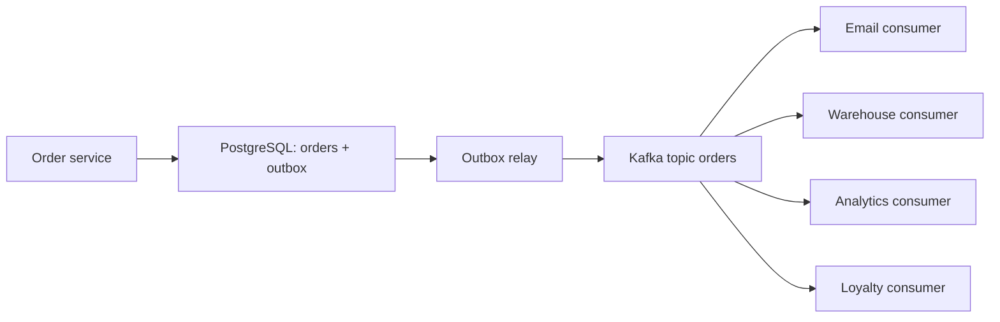

# Урок 01 — «Заказ создан»: письмо и склад через события

Цель: пройти путь от синхронного монолитного хендлера до событийной схемы, выбрать брокер
аргументированно и — главное — проговорить, что происходит при каждом отказе.

## Разогрев

- Что делаем синхронно, а что асинхронно, и по какому правилу?
- Чем очередь отличается от лога?
- Почему `commit` + `publish` — ошибка?

## Исходное состояние

Хендлер `POST /orders` делает всё подряд:

```text
1. BEGIN; INSERT order; UPDATE stock; COMMIT      (30 мс)
2. SMTP: письмо «заказ принят»                    (200–2000 мс, внешний сервис)
3. HTTP в warehouse-api: создать задание на сборку (50–5000 мс, чужая команда)
4. HTTP в analytics: событие для отчётов           (20–500 мс)
5. HTTP в loyalty: начислить бонусы                (30–800 мс)
```

Итог: p99 ручки — сумма p99 всех шагов, около 8 секунд. Любой из четырёх внешних сервисов
лежит — заказы не оформляются. Это не «медленно», это «мы теряем деньги, когда чихнул
почтовый сервер».

## Шаг 1. Что оставить синхронным

Единственное, без чего ответ клиенту был бы неправдой: заказ создан и товар зарезервирован.
Шаг 1 остаётся. Всё остальное — следствия факта «заказ создан», а не условия его создания.

## Шаг 2. Один факт вместо четырёх вызовов

Публикуем **одно событие** `OrderPlaced` — и пусть каждый заинтересованный сервис сам его
прочитает. Producer перестаёт знать про почту, склад, аналитику и бонусы.



Содержимое события — бизнес-факт, а не дамп таблицы:

```text
event_id:    01J9F... (UUID v7, он же ключ идемпотентности)
type:        OrderPlaced
version:     1
occurred_at: 2026-09-08T10:15:00Z
order_id:    77123
user_id:     42
total:       {amount: 349900, currency: "RUB"}   // копейки, целым числом
items:       [{sku: "A-1", qty: 2}, ...]
trace_id:    из HTTP-запроса — чтобы связать заказ и обработку
```

Почему не «просто `order_id`, остальное consumer'ы сами достанут из API»? Оба варианта живут.
«Тонкое» событие (только id) экономит трафик и не устаревает, но создаёт обратный синхронный
вызов — падение Order service ломает всех потребителей. «Толстое» событие самодостаточно и
переживает падение источника, но фиксирует данные на момент публикации. Для писем и аналитики
берут толстое, для процессов, которым нужна самая свежая картина — тонкое.

## Шаг 3. Выбор брокера

| Требование | Что диктует |
|---|---|
| Один факт — четыре независимых потребителя | fan-out: лог с consumer groups |
| Через год подключим сервис отчётов и пересчитаем месяц | replay → **лог** |
| Порядок событий одного заказа важен | ключ партиции `order_id` |
| Письма нужны с приоритетом и отложенной отправкой «через 30 мин» | это уже **задача** → очередь |

Решение, которое звучит по-инженерному: **Kafka для событий** (`orders`, ключ `order_id`,
retention 7–30 дней) и, если понадобятся приоритеты/отложенность для писем, — маленькая
**очередь задач** после email-consumer'а. Не «Kafka потому что модно», а «лог, потому что
нужен fan-out и replay».

## Шаг 4. Разбор отказов (самая ценная часть)

| Что упало | Что видит пользователь | Что происходит | Что нужно заранее |
|---|---|---|---|
| Email consumer лежит 2 ч | ничего | лаг растёт, offset стоит | алерт на возраст сообщения, retention > 2 ч |
| Kafka недоступна при публикации | ничего | outbox копится в БД | relay с retry, алерт на размер outbox |
| Процесс умер между `commit` и `publish` | ничего | без outbox — событие потеряно навсегда | **outbox** |
| Письмо ушло, consumer упал до `ack` | письмо придёт дважды | повторная доставка | ключ идемпотентности `event_id` |
| Warehouse-consumer падает на битом событии | заказ не собирается | poison message блокирует партицию | лимит попыток + DLQ + алерт |
| Всплеск ×10 | заказы оформляются нормально | лаг растёт, потом разгребается | считать пропускную способность consumer'ов |

Обрати внимание: почти все строки таблицы — «пользователь ничего не видит». Именно это и
покупает асинхронность. Взамен появляется невидимая деградация, которую **обязательно**
надо мониторить, иначе о четырёхчасовой задержке писем расскажут пользователи.

## Шаг 5. Оценка

При 5 млн заказов в сутки и 4 событиях на заказ — 20 млн событий, ≈ 230 msg/s в среднем,
≈ 1200 msg/s в пике. Для Kafka это ничто; узкое место — consumer'ы. Email-consumer со SMTP
по 200 мс на письмо и пулом 50 горутин даёт ~250 писем/с — достаточно, но без запаса, значит
партиций берём минимум 12, а лучше 24.

## Mini-drill

```drill
type: multiple-choice
prompt: "Почему шаг «зарезервировать товар» оставили синхронным, а «создать задание складу» вынесли в событие?"
options: ["Резерв быстрее по времени", "Без резерва ответ «заказ оформлен» был бы ложью, а задание складу — следствие факта, его можно выполнить через секунду", "Склад не умеет читать Kafka", "Так требует Kafka"]
answer: "Без резерва ответ «заказ оформлен» был бы ложью, а задание складу — следствие факта, его можно выполнить через секунду"
check: exact
```

```drill
type: fill-in
prompt: "Чтобы события одного заказа не перемешались, в качестве ключа партиции берём ___."
answer: "order_id"
check: fuzzy
```

```drill
type: free-form
prompt: "Тебя спрашивают: «толстое» событие со всеми данными или «тонкое» с одним order_id? Ответь вслух."
answer: "Зависит от потребителя. Толстое событие самодостаточно: email-сервис и аналитика не делают обратных вызовов, значит падение Order service их не ломает, и данные соответствуют моменту события — для писем и отчётов это даже правильнее. Цена: событие больше, а если потребителю нужно поле, которого нет, придётся менять схему и версионировать. Тонкое событие (order_id + тип) маленькое и не устаревает, но создаёт обратный синхронный вызов к Order service: появляется связность, дополнительный трафик и риск, что при пересчёте истории мы прочитаем уже изменившиеся данные. Практика: толстое для интеграций и аналитики, тонкое для процессов, которым нужна самая свежая картина. Плюс правило: в событии всегда event_id, версия, occurred_at и trace_id — иначе ни идемпотентности, ни отладки."
check: manual
```

## Итог

Асинхронный дизайн начинается с вопроса «без чего ответ клиенту будет ложью» — это и есть
синхронная часть. Дальше публикуется **один факт**, а не четыре команды, и подключение
пятого потребителя не трогает producer'а. Брокер выбирается по свойствам (fan-out и replay →
лог; приоритеты и отложенность → очередь). И половина ценности ответа на интервью — таблица
отказов: кто что видит, когда каждая из частей лежит.
