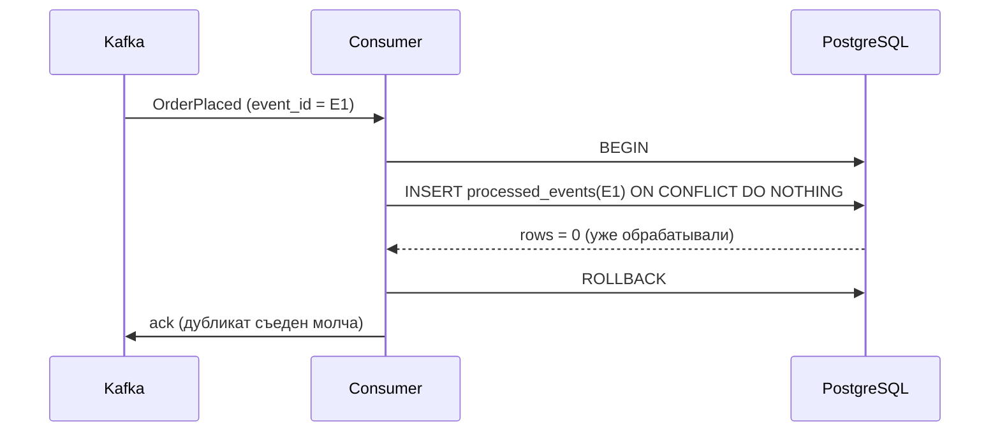
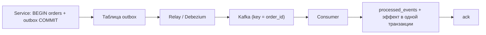

# Урок 02 — Идемпотентный consumer и transactional outbox

Цель: собрать своими руками две обязательные детали любой асинхронной системы — надёжную
публикацию (outbox) и защиту от дублей (идемпотентность) — и понимать, почему нужны обе.

## Разогрев

- Почему at-least-once гарантирует дубликаты?
- Что такое dual write и чем он опасен?
- Какая операция идемпотентна: `SET status='paid'` или `balance = balance + 100`?

## Часть 1. Outbox: публикация, которая не теряется

Таблица (упрощённо):

```sql
CREATE TABLE outbox (
  id           BIGSERIAL PRIMARY KEY,
  aggregate_id TEXT        NOT NULL,          -- станет ключом партиции
  event_id     UUID        NOT NULL UNIQUE,   -- ключ идемпотентности для потребителей
  type         TEXT        NOT NULL,
  payload      JSONB       NOT NULL,
  created_at   TIMESTAMPTZ NOT NULL DEFAULT now(),
  sent_at      TIMESTAMPTZ                     -- NULL = ещё не отправлено
);
CREATE INDEX outbox_unsent ON outbox (id) WHERE sent_at IS NULL;
```

Частичный индекс по неотправленным — важная деталь: relay сканирует «хвост», а не всю
таблицу, которая может быть огромной.

Запись — в одной транзакции с бизнес-данными:

```go
// Один COMMIT на данные и на событие: атомарность даёт БД, а не наша аккуратность.
func (r *Repo) PlaceOrder(ctx context.Context, o Order, ev Event) error {
    tx, err := r.db.BeginTx(ctx, nil)
    if err != nil {
        return err
    }
    defer tx.Rollback() // no-op после успешного Commit
    if _, err = tx.ExecContext(ctx, insertOrder, o.ID, o.UserID, o.Total); err != nil {
        return err
    }
    if _, err = tx.ExecContext(ctx, insertOutbox, ev.ID, o.ID, ev.Type, ev.Payload); err != nil {
        return err
    }
    return tx.Commit()
}
```

Relay — отдельный процесс (или горутина с лидер-выбором, чтобы не публиковать в несколько
копий):

```text
loop:
  BEGIN
  SELECT id, event_id, aggregate_id, type, payload FROM outbox
    WHERE sent_at IS NULL ORDER BY id LIMIT 100
    FOR UPDATE SKIP LOCKED          -- несколько relay-воркеров не мешают друг другу
  publish в Kafka (key = aggregate_id)
  UPDATE outbox SET sent_at = now() WHERE id = ANY(...)
  COMMIT
```

Где здесь остаётся риск дубля: publish прошёл, а `UPDATE`/`COMMIT` не успел — на следующем
круге событие уйдёт снова. Это и есть встроенная at-least-once, и убрать её нельзя. Отсюда
вторая часть урока.

Альтернатива своему relay — **Debezium** с outbox event router: он читает WAL PostgreSQL и
публикует строки `outbox` в Kafka, без опроса таблицы и без вашего кода. Trade-off: минус
свой процесс, плюс Kafka Connect в инфраструктуре.

## Часть 2. Идемпотентный consumer



Ключевые правила:

1. **Ключ идемпотентности приходит извне** (`event_id` от producer'а), а не генерируется
   consumer'ом. Иначе повтор получит новый ключ и пройдёт как «новое».
2. **Проверка и эффект — в одной транзакции.** Если сначала `INSERT processed_events`
   отдельным коммитом, а потом эффект, падение между ними означает «отметили, но не сделали»
   — и сообщение будет потеряно навсегда, что хуже дубля.
3. **`ack` — после `commit`.** Иначе получаем at-most-once с молчаливой потерей.
4. Таблицу `processed_events` надо чистить: `event_id` + `created_at`, удаление старше 7–30
   дней (партиционирование по дате упрощает). Иначе она станет крупнее основной таблицы.
5. Если эффект **внешний** (письмо, платёж), одной транзакции недостаточно: передаём свой
   ключ идемпотентности во внешний API (`Idempotency-Key`) и полагаемся на него. Если API
   такого не умеет — фиксируем «попытка началась» до вызова и «завершилась» после, а
   расхождения разбираем вручную/сверкой. Честный ответ на интервью: полностью исключить
   двойное письмо без поддержки со стороны получателя нельзя.

## Часть 3. Собираем вместе



Формула, которую стоит запомнить дословно: **outbox защищает от потери, идемпотентность — от
дублей. Нужно и то и другое; одно другое не заменяет.**

## Mini-drill

```drill
type: multiple-choice
prompt: "Consumer сначала отдельным коммитом пишет event_id в processed_events, потом применяет эффект. Что плохо?"
options: ["Ничего, это правильный порядок", "Падение между коммитами даёт «отметили, но не сделали» — потерю сообщения навсегда", "Будет двойной эффект", "Нарушится порядок партиции"]
answer: "Падение между коммитами даёт «отметили, но не сделали» — потерю сообщения навсегда"
check: exact
```

```drill
type: fill-in
prompt: "Чтобы несколько relay-воркеров читали outbox без конфликтов, используют SELECT ... FOR UPDATE ___."
answer: "SKIP LOCKED"
check: fuzzy
```

```drill
type: free-form
prompt: "Интервьюер: «Зачем outbox, если consumer всё равно идемпотентный? Пусть publish просто ретраится в коде.» Ответь."
answer: "Идемпотентность решает другую задачу — дубли. Она никак не помогает, если событие вообще не было опубликовано: процесс упал сразу после commit, retry в памяти умер вместе с процессом, и никто никогда не узнает, что письмо надо отправить. Потеря тише и хуже дубля: её не видно ни в логах, ни в метриках. Outbox переводит публикацию в ту же транзакцию, что и данные, значит инвариант «есть заказ — есть событие» гарантирует БД, а не наша аккуратность. И наоборот: outbox не спасает от дублей, потому что relay может упасть между publish и отметкой sent_at. Поэтому оба механизма обязательны, они закрывают разные концы одной проблемы."
check: manual
```

```drill
type: free-form
prompt: "Напиши набросок (5–10 строк) обработчика, который начисляет бонусы по событию OrderPlaced и устойчив к повторной доставке."
answer: "Строки: (1) tx, _ := db.BeginTx(ctx, nil); (2) defer tx.Rollback(); (3) res, err := tx.ExecContext(ctx, \"INSERT INTO processed_events(event_id, created_at) VALUES ($1, now()) ON CONFLICT DO NOTHING\", ev.ID); (4) if n, _ := res.RowsAffected(); n == 0 { msg.Ack(); return nil } — дубликат, молча подтверждаем; (5) _, err = tx.ExecContext(ctx, \"UPDATE loyalty SET points = points + $1 WHERE user_id = $2\", pts(ev.Total), ev.UserID); (6) if err != nil { return err } — временная ошибка уйдёт на retry с backoff; (7) if err := tx.Commit(); err != nil { return err }; (8) msg.Ack(). Комментарии вслух: неидемпотентное «прибавить баллы» стало идемпотентным за счёт внешнего event_id в той же транзакции; ack строго после commit; постоянные ошибки (нет такого user_id) отправляем в DLQ, а не ретраим вечно; таблицу processed_events чистим по created_at."
check: manual
```

## Итог

Две детали, без которых асинхронный дизайн на интервью считается неполным. **Outbox**:
событие пишется в одной транзакции с данными, отдельный relay (свой или Debezium) публикует
его в брокер — потеря невозможна. **Идемпотентность**: внешний `event_id`, вставка в
`processed_events` с `ON CONFLICT DO NOTHING` **в той же транзакции**, что и эффект, `ack`
после `commit`, чистка таблицы по времени. Для внешних эффектов — свой `Idempotency-Key` и
честное признание границ.
