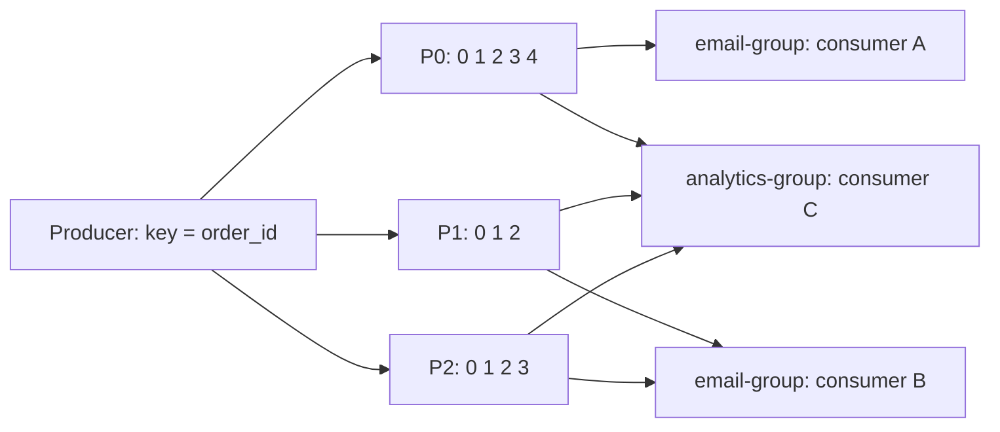

# Урок 03 — Kafka по шагам: партиции, ключи, consumer groups

Цель: перестать говорить «Kafka» абстрактно. К концу урока ты умеешь на салфетке нарисовать
топик с партициями, объяснить, кто что читает, посчитать число партиций и назвать, что
сломается при rebalance.

## Разогрев

- Что такое offset и кто его хранит?
- Сколько consumer'ов одной группы могут читать одну партицию?
- Какую гарантию порядка даёт Kafka?

## Шаг 1. Картинка, которую надо уметь рисовать

Топик `orders` с 3 партициями, две независимые группы читателей.



Что читается с картинки:

- **Партиция — единица параллелизма и порядка.** Внутри P0 порядок строгий; между P0 и P1
  порядка нет вообще.
- Внутри группы `email-group` партиции **поделены**: A читает P0, B читает P1 и P2. Ни одна
  партиция не читается двумя участниками одной группы.
- Группа `analytics-group` читает **те же** сообщения независимо, со своим offset. Это и есть
  fan-out в логе: добавить потребителя — значит добавить группу, producer'а не трогаем.
- Consumer C один тянет все 3 партиции — это законно, просто параллелизма нет.

## Шаг 2. Куда попадёт сообщение

`partition = hash(key) % partitions_count`. Отсюда три практических следствия:

1. Одинаковый ключ → всегда одна партиция → **порядок для этой сущности сохранён**.
2. `key = nil` → round-robin / sticky-батчинг, порядок отсутствует. Это нормально для
   независимых событий (метрики), катастрофа для «создан/оплачен/отменён».
3. **Изменение числа партиций перетасовывает соответствие**: старые сообщения ключа лежат в
   P1, новые поедут в P4. Порядок между «до» и «после» решардинга не гарантирован. Поэтому
   партиции добавляют осознанно и редко, а уменьшить их нельзя вовсе.

## Шаг 3. Сколько партиций брать

Считаем от обработки, а не от «пусть будет 100».

```text
пиковый поток               = 1200 msg/s
один consumer обрабатывает  = 100 msg/s (упирается в БД и внешний API)
нужный параллелизм          = 1200 / 100 = 12
берём с запасом на рост     = 24 партиции
```

Почему не 1000 партиций «на всякий случай»: каждая партиция — это файлы, открытые дескрипторы,
метаданные в контроллере, память под буферы у продюсера и время rebalance. Тысячи партиций
на топик замедляют кластер и делают rebalance болезненным. Практический ориентир — десятки, у
крупных — сотни на топик.

Отдельно: партиций должно быть **не меньше** желаемого числа воркеров в самой «жадной»
группе. Если email-группе нужно 20 подов, а партиций 12, восемь подов будут простаивать.

## Шаг 4. Rebalance и как его не провоцировать

Rebalance — перераспределение партиций внутри группы. Происходит, когда участник вошёл,
вышел или **не прислал heartbeat вовремя**. На время rebalance группа не обрабатывает
сообщения (в классическом протоколе — «stop the world»).

Типичная ловушка: обработка одного сообщения занимает 6 минут (тяжёлый расчёт), а
`max.poll.interval.ms` = 5 минут. Брокер решает, что consumer умер, отдаёт его партиции
другому, тот начинает с последнего закоммиченного offset — и то же тяжёлое сообщение
обрабатывается снова. И снова. Получаем бесконечный цикл rebalance плюс дубли.

Что делать: держать обработку короткой (тяжёлое — в отдельную очередь задач), не забывать
про таймаут на сообщение, а долгие операции разбивать на шаги. Плюс `ctx` с таймаутом в
хендлере, чтобы зависший вызов не съедал весь интервал.

## Шаг 5. Порядок против параллелизма

Внутри одной партиции сообщения строго упорядочены, но если consumer раздаёт их в пул из
10 горутин, порядок исчезнет: «оплачен» может примениться раньше «создан». Два выхода:

- **Параллелить по ключу**: хеш ключа → номер горутины. Один ключ всегда обрабатывается
  одной горутиной, порядок внутри ключа сохранён, параллелизм есть.
- **Сделать обработчик коммутативным**: применять по версии/`occurred_at` и игнорировать
  устаревшее (`WHERE version < $1`). Тогда порядок не нужен вообще — обычно самый дешёвый и
  надёжный путь.

## Шаг 6. Что смотреть в метриках

`consumer_lag` по каждой партиции (не только суммарный: одна перегретая партиция видна только
в разбивке), возраст старейшего необработанного сообщения, частота rebalance, время обработки
p99, размер DLQ. Резкий рост лага **одной** партиции — почти всегда hot key.

## Mini-drill

```drill
type: multiple-choice
prompt: "Лаг растёт только у одной партиции из 24, остальные пустые. Диагноз?"
options: ["Не хватает реплик", "Hot key: непропорционально много сообщений с одним ключом", "Слишком маленький retention", "Consumer'ов больше, чем партиций"]
answer: "Hot key: непропорционально много сообщений с одним ключом"
check: exact
```

```drill
type: fill-in
prompt: "Обработка сообщения занимает 6 минут, max.poll.interval.ms = 5 минут. Группа попадёт в бесконечный ___ и будет обрабатывать одно и то же сообщение повторно."
answer: "rebalance"
check: fuzzy
```

```drill
type: multiple-choice
prompt: "Нужен параллелизм 10 воркеров И порядок событий внутри заказа. Как правильно?"
options: ["10 горутин берут сообщения из партиции по мере готовности", "Хешировать order_id на 10 горутин: один ключ — всегда одна горутина", "Читать партицию одной горутиной, параллелизма не будет", "Отключить ключ партиции"]
answer: "Хешировать order_id на 10 горутин: один ключ — всегда одна горутина"
check: exact
```

```drill
type: free-form
prompt: "Объясни вслух, как выбрать число партиций для топика, и что мешает поставить 1000 «с запасом»."
answer: "Считаю от пропускной способности одного consumer'а: если он делает 100 msg/s, упираясь в БД и внешний API, а пик потока 1200 msg/s, нужен параллелизм 12, значит партиций минимум 12, беру 24 с запасом на рост — потому что уменьшить число партиций нельзя, а увеличение перетасовывает распределение ключей и рвёт порядок между «до» и «после». Также партиций должно быть не меньше числа воркеров в самой большой consumer group, иначе лишние поды простаивают. Тысячу ставить плохо: каждая партиция — это файлы и дескрипторы на брокере, метаданные в контроллере, буферы в продюсере и лишнее время на rebalance; при тысячах партиций кластер начинает тормозить, а rebalance становится заметной паузой. Плюс мелкие партиции хуже батчатся, растёт оверхед на сообщение."
check: manual
```

## Итог

Kafka на салфетке — это топик, разрезанный на партиции; порядок только внутри партиции;
ключ решает, куда попадёт сообщение; consumer group делит партиции между участниками, а
разные группы читают одно и то же независимо. Число партиций считается от нужного
параллелизма обработки (и его нельзя уменьшить). Rebalance провоцируется долгой обработкой —
держи хендлер быстрым и с таймаутом. А если хочется параллелизма без потери порядка —
параллель по ключу или сделай обработчик коммутативным.
