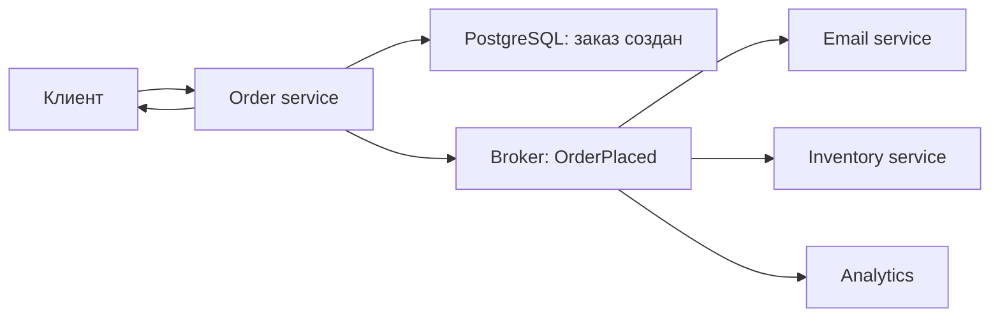
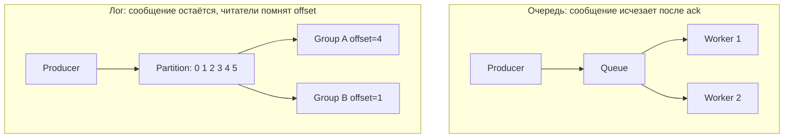
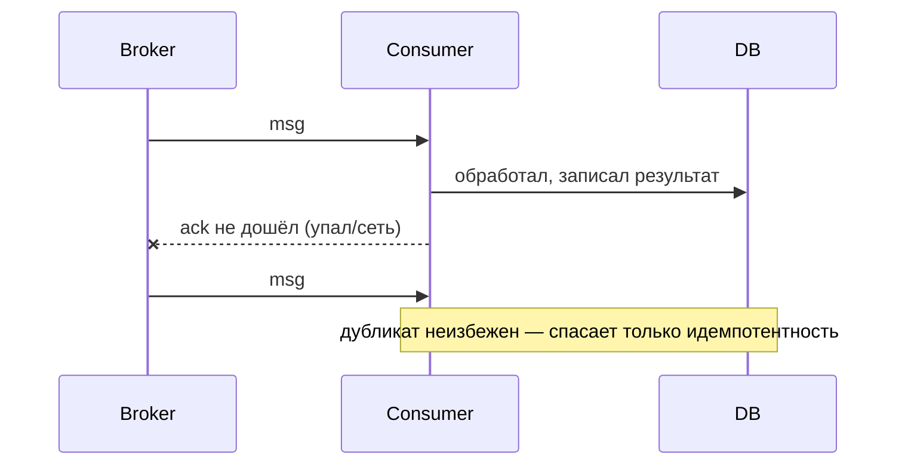
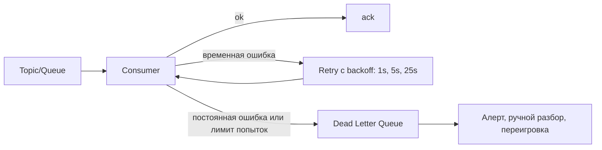

# Очереди и асинхронность

## Простыми словами

**Синхронный вызов** — это телефонный звонок: ты набираешь номер и стоишь с трубкой, пока
на том конце не ответят. Если абонент занят или спит, ты стоишь и ждёшь.

**Асинхронное сообщение** — это письмо в почтовый ящик: бросил и пошёл дальше. Почта
(брокер) хранит письмо, пока адресат не заберёт. Адресат может быть в отпуске, может читать
медленно, может вообще перезапуститься — письмо дождётся.

**Брокер сообщений** — та самая почта: отдельный сервис, который принимает сообщения от
producer'ов (отправителей), хранит их и отдаёт consumer'ам (получателям).

Асинхронность покупает три вещи: **быстрый ответ клиенту** (не ждём медленных шагов),
**устойчивость** (получатель может лежать, работа не потеряется) и **сглаживание пиков**
(очередь принимает всплеск, обработчики разгребают в своём темпе — это буфер). Платим
**сложностью**: появляется eventual consistency, дубликаты, порядок, мониторинг лага,
и отладка «где моё сообщение» вместо простого стектрейса.

## Sync vs async: как выбирать

Правило: **синхронно — то, без чего ответ клиенту неверен. Асинхронно — всё остальное.**

Пример: оформление заказа. Списать товар со склада и создать заказ — синхронно (иначе мы
соврём пользователю). Отправить письмо, посчитать аналитику, начислить бонусы, обновить
рекомендации, дёрнуть склад для отгрузки — асинхронно.



Что тут важно: ответ клиенту уходит после записи в БД, **не дожидаясь** письма и аналитики.
Если Email service лежит два часа — заказ всё равно создан, письма уйдут позже. Это и есть
**decoupling**: сервисы не знают друг о друге и не падают вместе.

Цена, которую надо назвать вслух: пользователь получил «заказ оформлен», но письма ещё нет
и в аналитике его пока не видно. Это **eventual consistency** — согласованность «в конце
концов». Если продукт этого не терпит («пользователь сразу видит бонусы»), значит шаг
переезжает в синхронную часть или вам нужна честная индикация «обрабатывается».

## Очередь vs лог — главное различие модуля

Есть два семейства, и на интервью их путают чаще всего.

**Очередь задач** (RabbitMQ, NATS, SQS, Redis Streams в простом режиме). Простыми словами:
ведро с заданиями. Сообщение забрал один consumer, обработал, подтвердил (`ack`) — сообщение
**исчезло**. Смысл в том, чтобы работа была сделана один раз.

**Распределённый лог** (Kafka, NATS JetStream, Redpanda, Pulsar). Простыми словами: журнал,
куда дописывают в конец, и он **никого не удаляет** по факту чтения. Consumer читает
последовательно и помнит своё место — **offset**. Сообщения живут по retention (7 дней,
30 дней, «навсегда»), и любой новый читатель может начать с начала — это **replay**.



| Критерий | Очередь (RabbitMQ/NATS core) | Лог (Kafka/JetStream) |
|---|---|---|
| Судьба сообщения | удаляется после `ack` | живёт по retention (время/размер) |
| Модель доставки | брокер **push**ит воркерам | consumer **pull**ит по offset |
| Много независимых читателей | нужен fan-out через exchange/тему | естественно: разные consumer groups |
| Replay/пересчёт истории | нет | да, сбросить offset на начало |
| Порядок | в пределах очереди, ломается при N воркерах | строго в пределах партиции |
| Пропускная способность | десятки–сотни тыс. msg/s | сотни тыс.–млн msg/s |
| Роутинг | богатый (topic/exchange, headers, priority) | простой (topic + partition) |
| Отложенные/приоритетные задачи | из коробки/плагинами | неудобно |
| Типичное применение | «сделай работу»: письма, картинки, задачи | «расскажи о факте»: события, стримы, аналитика, CDC |

Практический выбор для интервью: **задачи → очередь, события → лог**. Нужно, чтобы новый
сервис через год пересчитал историю? Только лог. Нужны приоритеты и отложенная доставка на
30 минут? Проще очередь. Нужно и то и другое — так и бывает: Kafka для событий, RabbitMQ/NATS
для задач.

Про NATS полезно знать, что это два разных зверя: **NATS core** — молниеносный fire-and-forget
pub/sub без хранения (at-most-once), а **NATS JetStream** — persistence-слой поверх, со
стримами, `ack` и retention, то есть уже ближе к логу.

## Kafka в терминах, которые надо произносить правильно

- **Topic** — именованный поток («orders»).
- **Partition** — часть топика, независимый упорядоченный лог. Параллелизм топика = число
  партиций.
- **Offset** — номер сообщения внутри партиции. Consumer хранит свою позицию (в Kafka —
  в служебном топике), поэтому чтение не мешает другим.
- **Consumer group** — группа читателей одного топика; партиции **делятся** между её
  участниками, каждая партиция достаётся ровно одному участнику группы. Значит: воркеров
  больше, чем партиций → лишние простаивают.
- **Rebalance** — перераспределение партиций при входе/выходе участника (или при таймауте
  heartbeat). На время rebalance обработка приостанавливается — вот почему долгая обработка
  без heartbeat вредна.
- **Replication factor** — сколько копий партиции; `acks=all` + `min.insync.replicas=2`
  означает «подтверждаем запись, только когда её приняли лидер и минимум одна реплика».
- **Consumer lag** — насколько читатель отстал от конца партиции. Это **главная метрика**
  асинхронной системы: растёт лаг — растёт задержка бизнес-процесса.

## Семантики доставки

Три уровня, и первый вопрос интервьюера обычно «какая у вас семантика?».

- **At-most-once** («максимум один раз»): подтверждаем сообщение до обработки. Дубликатов
  нет, но при падении сообщение теряется. Годится для метрик и телеметрии, где потеря
  одного значения незаметна.
- **At-least-once** («минимум один раз»): подтверждаем **после** успешной обработки. Ничего
  не теряется, но при падении между обработкой и `ack` сообщение придёт снова — **дубликаты
  гарантированы**. Это дефолт всех нормальных систем.
- **Exactly-once** («ровно один раз»): звучит как то, что все хотят. В распределённой
  системе с внешними побочными эффектами (отправить письмо, списать деньги через платёжный
  API) этого **нельзя** добиться доставкой. Kafka даёт транзакции и exactly-once *внутри*
  «читать из Kafka → обработать → записать в Kafka», но как только эффект уходит наружу,
  единственный рабочий рецепт — **at-least-once + идемпотентность**.



**Идемпотентность** простыми словами: повторное выполнение операции не меняет результат.
«Установить статус = paid» идемпотентно. «Прибавить 100 рублей» — нет. Как делают:

1. **Ключ идемпотентности** в сообщении (`event_id`, `payment_id`, `order_id + шаг`).
2. **Таблица обработанных**: `INSERT INTO processed(event_id) ... ON CONFLICT DO NOTHING` —
   если вставка не удалась, сообщение уже обработано, просто `ack`.
3. **Одна транзакция** на «проверить event_id + применить эффект». Если это две транзакции,
   между ними можно упасть и получить двойной эффект.
4. Для внешних API — передавать свой ключ идемпотентности (так работают платёжные шлюзы:
   `Idempotency-Key` в заголовке).

Дедупликация по `event_id` в Redis с TTL — популярный, но **приблизительный** вариант: Redis
может потерять ключ (eviction, рестарт), и дубликат пройдёт. Для денег — только БД в той же
транзакции, что и эффект.

## Порядок и выбор ключа

Гарантия Kafka: порядок **только внутри партиции**. Глобального порядка в топике нет и быть
не может — партиции независимы. Значит порядок проектируется выбором **ключа партиции**:
сообщения с одинаковым ключом всегда идут в одну партицию (`partition = hash(key) % N`).

- Нужно, чтобы события одного заказа шли по порядку → ключ `order_id`.
- Нужно, чтобы события одного пользователя не перемешались → ключ `user_id`.
- Ключ `null` → round-robin, порядка нет вообще.

Две ловушки. Первая: **hot partition** — если 30 % трафика с одним ключом (магазин-гигант,
знаменитость), одна партиция перегружена, а остальные скучают; лечится составным ключом
(`shop_id:bucket`) или отдельным топиком. Вторая: **порядок ломается воркерами** — даже в
одной партиции, если consumer раздаёт сообщения в пул из 10 горутин, они обработаются
параллельно и в произвольном порядке. Тогда параллелить надо **по ключу** (одна горутина
на ключ), а не по сообщениям.

Здесь же полезно вспомнить: если обработчик идемпотентен и **коммутативен** (результат не
зависит от порядка) — порядок вам, возможно, вообще не нужен, и это самое дешёвое решение.

## Retry, poison messages и DLQ

Сообщение не обработалось. Причины делятся на два класса, и путать их дорого:

- **Временные** (transient): БД недоступна, таймаут внешнего API, сетевая ошибка. Нужен
  **retry**.
- **Постоянные** (permanent): битый JSON, неизвестный тип, нарушение бизнес-правила. Retry
  бесполезен — это **poison message**, и он будет отравлять очередь бесконечно, блокируя
  партицию и сжигая CPU.

Схема, которая считается правильным ответом:



- **Backoff** — экспоненциальные задержки (1 с, 2 с, 4 с …) **с jitter**, чтобы тысяча
  consumer'ов не ретраила синхронно.
- **Лимит попыток** (обычно 3–5), потом — в **DLQ** (dead-letter queue): отдельная
  очередь/топик «сюда складываем то, что не смогли». Обязательно: алерт на непустую DLQ,
  сохранение исходного сообщения и причины, инструмент для переигровки после фикса.
- В Kafka нет встроенного «отложить сообщение»: retry делают через **отдельные retry-топики**
  (`orders.retry.5s`, `orders.retry.1m`) или переотправкой в тот же топик со счётчиком
  попыток в заголовке. Важно: нельзя просто «не коммитить offset» и ждать — партиция
  встанет.
- В RabbitMQ есть DLX (dead-letter exchange) и TTL сообщений — retry делается штатно.

Пустая DLQ — не повод её не делать. DLQ, о которой никто не знает и на которую нет алерта, —
это молчаливая потеря данных, а такое на интервью замечают.

## Transactional outbox и CDC

Вот самая частая скрытая ошибка в асинхронном дизайне:

```go
tx.Commit()                       // заказ записан в БД
broker.Publish(ctx, orderPlaced)  // а тут процесс умер — событие не ушло НИКОГДА
```

Это **dual write** — две записи в два разных хранилища без общей транзакции. Любой порядок
плох: сначала брокер, потом БД — получим событие о заказе, которого нет; сначала БД, потом
брокер — потеряем событие. Атомарности между PostgreSQL и Kafka не существует.

**Transactional outbox** решает это так: событие записывается **в ту же БД, в той же
транзакции**, в таблицу `outbox`. Отдельный процесс (relay) читает `outbox` и публикует в
брокер, помечая отправленные.

```mermaid
sequenceDiagram
  participant S as Order service
  participant DB as PostgreSQL
  participant R as Relay / Debezium
  participant K as Kafka
  S->>DB: BEGIN; INSERT orders; INSERT outbox; COMMIT
  Note over S,DB: одна транзакция — либо всё, либо ничего
  R->>DB: читает новые строки outbox (или WAL)
  R->>K: publish OrderPlaced
  R->>DB: пометить sent (или сдвинуть позицию в WAL)
```

Свойства: событие не теряется никогда; но доставка — **at-least-once** (relay может упасть
после публикации до отметки), поэтому consumer обязан быть идемпотентным. Никакой outbox не
отменяет идемпотентность — это тоже частый вопрос-ловушка.

**CDC (change data capture)** — способ получить события прямо из журнала БД, без кода
приложения. Реальный пример — **Debezium**: он читает WAL PostgreSQL через логическую
репликацию (или binlog MySQL) и пишет изменения в Kafka. Годится и как транспорт для outbox
(читаем таблицу `outbox` из WAL), и как «события из таблиц» напрямую.

Trade-off CDC: приложению не нужно ничего делать (плюс), но события получаются в терминах
**строк таблиц**, а не бизнес-фактов, и схема БД становится публичным контрактом — поменял
колонку, сломал потребителей. Поэтому для интеграций между сервисами предпочитают outbox с
явно спроектированным событием, а «сырой» CDC — для аналитики, поисковых индексов, кэшей.

## Event-driven: событие или команда

Различие, за которое дают плюс:

- **Событие** — факт в прошлом: `OrderPlaced`, `PaymentCaptured`. Отправитель не знает и не
  хочет знать, кто его обработает. Один → многим (fan-out), связность низкая.
- **Команда** — просьба сделать: `SendEmail`, `ReserveStock`. Есть конкретный адресат и
  ожидание выполнения. Обычно в очередь задач, а не в лог.

**Fan-out** — одно событие, много независимых потребителей. В логе это разные consumer
groups, в RabbitMQ — fanout/topic exchange. Сила: новый сервис подключается, не меняя
producer'а. Опасность: у одного события пятнадцать читателей, и никто не знает всей картины —
отладка становится археологией. Отсюда практики: каталог событий, версионирование, трассировка
(`trace_id` в заголовках сообщения).

## Backpressure и Go-consumer

**Backpressure** («противодавление») — сигнал «мне слишком быстро, притормози». В синхронном
HTTP это `429`/таймаут. В брокере роль буфера играет очередь: producer не тормозит, зато
растёт **лаг**. Поэтому в асинхронной системе backpressure — это не «producer остановился»,
а осознанный ответ на вопрос: что делать, когда лаг растёт?

- Ограничить параллелизм consumer'а (иначе он убьёт БД, ту самую, которую мы разгружали).
- Масштабировать consumer'ов — но в Kafka не больше числа партиций.
- Prefetch/`max.poll.records` — сколько сообщений забирать за раз.
- Алерт на лаг и на возраст самого старого необработанного сообщения.
- Приоритеты: отдельный топик для срочного, чтобы «важное» не стояло за миллионом «неважного».

Скелет consumer'а на Go с worker pool и корректной остановкой:

```go
func run(ctx context.Context, src <-chan Msg, workers int, h Handler) error {
    g, ctx := errgroup.WithContext(ctx)
    for i := 0; i < workers; i++ { // фиксированный пул: ограничивает нагрузку на БД ниже по стеку
        g.Go(func() error {
            for {
                select {
                case <-ctx.Done():
                    return ctx.Err() // graceful stop: новые сообщения не берём
                case m, ok := <-src:
                    if !ok {
                        return nil
                    }
                    // таймаут на сообщение: висящий обработчик держит партицию и ломает rebalance
                    mctx, cancel := context.WithTimeout(ctx, 30*time.Second)
                    err := h.Handle(mctx, m)
                    cancel()
                    if err != nil {
                        m.Nack(err) // retry/DLQ решает политика, не воркер
                        continue
                    }
                    m.Ack() // ack ПОСЛЕ успеха — это и есть at-least-once
                }
            }
        })
    }
    return g.Wait()
}
```

Три момента, за которые цепляются на интервью: `ack` после обработки (иначе at-most-once),
таймаут на сообщение (иначе один зависший обработчик останавливает партицию), фиксированный
пул (иначе consumer «разгружает» БД, добивая её тысячей параллельных запросов).

## Числа: сколько партиций, сколько диска, за сколько разгребём

Асинхронный дизайн обязательно проверяется арифметикой — иначе «поставим Kafka» остаётся
словами. Считаем на примере: 5 млн заказов в сутки, на каждый — 4 события, средний размер
события 1 КБ, retention 7 дней, всплеск ×5 к среднему.

```text
события в сутки  = 5e6 * 4 = 20 млн
средний RPS      = 20e6 / 86400 ≈ 230 msg/s
пиковый RPS      ≈ 230 * 5 ≈ 1200 msg/s
трафик           ≈ 1200 * 1 КБ ≈ 1.2 МБ/с  (мелочь для Kafka)
диск на 7 дней   = 20e6 * 1 КБ * 7 ≈ 140 ГБ на одну копию
с replication=3  ≈ 420 ГБ на кластер
```

Сколько партиций? Отталкиваемся от **параллелизма обработки**, а не от красивого числа.
Если один consumer обрабатывает 100 msg/s (упирается в БД и внешний API), для пика 1200 msg/s
нужно ≥ 12 воркеров, значит **≥ 12 партиций** (воркеров больше партиций не бывает
полезно). Берут с запасом — 24, потому что уменьшить число партиций в Kafka нельзя, а
увеличение перетасовывает распределение ключей.

Сколько времени разгребать лаг после трёхчасового простоя?

```text
накопилось    = 230 msg/s * 3 ч * 3600 ≈ 2.5 млн сообщений
пропускная    = 24 воркера * 100 msg/s = 2400 msg/s
время разгона = 2.5e6 / (2400 - 230) ≈ 1150 с ≈ 19 минут
```

И сразу важный вопрос: выдержит ли БД 2400 запросов в секунду от разгоняющихся воркеров?
Часто ответ «нет», и тогда параллелизм сознательно ограничивают — лучше разгребать час, чем
уронить основной сервис. Это то самое место, где backpressure становится проектным решением.

## Мониторинг: что смотреть в асинхронной системе

Асинхронная система умеет **тихо** отставать: все ручки отвечают 200 OK, а письма уходят с
задержкой в четыре часа. Поэтому набор метрик фиксированный:

- **Consumer lag** (в сообщениях) и **возраст самого старого необработанного сообщения**
  (в секундах) — второе понятнее для бизнеса: «письма опаздывают на 40 минут».
- Скорость публикации и скорость обработки — их разница показывает, догоняем или тонем.
- Размер и рост **DLQ** — алерт на любую непустую DLQ.
- Число ретраев и распределение попыток (много вторых попыток — где-то флапает зависимость).
- Время обработки одного сообщения (p50/p99) и таймауты.
- `trace_id`, проброшенный из HTTP-запроса в заголовки сообщения — иначе связать «заказ
  пользователя» и «зависшее сообщение» будет нечем.

Полезная привычка формулировать SLO не на брокер, а на бизнес-процесс: «99 % писем о заказе
уходят в течение 60 секунд». Тогда лаг перестаёт быть абстрактным графиком.

## Эволюция схем сообщений

Сообщение — это контракт между сервисами, которые деплоятся **независимо**. Значит нужны
правила совместимости:

- **Backward compatible** (новый читатель понимает старые сообщения) — добавляй поля
  **опциональными** с дефолтом, никогда не переиспользуй номера полей, не меняй тип и
  смысл поля.
- Удаление обязательного поля или переименование — **ломающее** изменение: делают через
  новую версию события (`OrderPlacedV2`, отдельный топик или поле `version`) и период, когда
  публикуются обе.
- Форматы: JSON (просто, читаемо, дорого и без проверки схемы), Protobuf/Avro (компактно,
  схема обязательна, есть schema registry с проверкой совместимости при публикации).
- Дисциплина деплоя: сначала раскатать **читателей**, умеющих новое, потом писателей.

## Как это спрашивают на собеседовании

**«Зачем здесь очередь?»** Слабый ответ: «чтобы было асинхронно». Сильный: «Отправка письма
и пересчёт рекомендаций занимают до 2 секунд и зависят от внешних сервисов. Если делать
синхронно, p99 оформления заказа = сумма p99 всех шагов, и падение SMTP уронит оформление.
Через брокер ответ клиенту — 50 мс, письмо уйдёт с задержкой в секунды, а падение почтового
сервиса даст только рост лага».

**«Kafka или RabbitMQ?»** Сильный ответ через свойства, а не бренды: «Нужен replay истории
и несколько независимых потребителей одного факта — беру лог, Kafka. Нужны задачи с
приоритетами, отложенной доставкой и сложным роутингом — беру очередь, RabbitMQ или NATS
JetStream. Здесь замешаны и события, и задачи, поэтому...».

**«Какая у вас семантика доставки?»** Ожидают: at-least-once + идемпотентный consumer с
ключом идемпотентности, а на слово «exactly-once» — объяснение, что это дедупликация, а не
магия доставки.

**«Как обеспечите порядок?»** Ожидают: порядок в пределах партиции, ключ = `order_id`,
и признание, что глобального порядка нет; а также что параллельный пул воркеров внутри
партиции порядок сломает.

**«Записали в БД и отправили в Kafka — что не так?»** Ключевые слова: dual write, потеря
события при падении, transactional outbox, CDC/Debezium.

**«Consumer лежал 3 часа. Что произойдёт?»** Сильный ответ: в логе ничего не потеряется (если
retention > 3 ч), после подъёма читатель разгребёт лаг — но надо посчитать, за какое время
и не убьёт ли он при этом БД; в очереди сообщения накопятся до лимита, дальше поведение
зависит от политики (отказ producer'у или сброс старых). И обязательно: алерт на лаг.

**«Сообщение пришло дважды и списало деньги дважды. Кто виноват?»** Не брокер — дизайн:
не было ключа идемпотентности и проверки в той же транзакции, что и эффект.

## Типичные ошибки и заблуждения

- **«Exactly-once есть, я включил галочку».** Внутри Kafka-транзакций — да, для внешних
  эффектов — нет. Проектируй дубликаты как норму.
- **Dual write** (`commit` + `publish`) без outbox — тихая потеря событий.
- **`ack` до обработки** ради скорости — молчаливая потеря сообщений при рестарте.
- **Retry без лимита и без DLQ** — poison message крутится вечно, блокирует партицию, жжёт CPU.
- **Retry без jitter** — синхронные волны ретраев добивают тот сервис, который уже упал.
- **Ожидание глобального порядка** в топике с 12 партициями.
- **Порядок «сломан воркерами»**: параллельная обработка сообщений одной партиции.
- **Больше consumer'ов, чем партиций** — лишние простаивают, «масштабирования» не случилось.
- **Нет мониторинга лага.** Асинхронная система умеет тихо отставать на часы, отвечая при
  этом 200 OK на все синхронные ручки.
- **Очередь как база данных.** «Храним состояние в очереди» — состояние живёт в БД, брокер
  переносит факты.
- **Асинхронность там, где пользователь ждёт результата** — тогда придётся строить
  polling/WebSocket и объяснять «обрабатывается»; иногда честный синхронный вызов дешевле.
- **Забыли про сериализацию и схему** — первый же новый producer с другим JSON ломает
  consumer'ов.

## Глоссарий

- **Producer / consumer** — отправитель / получатель сообщений.
- **Брокер** — сервис, хранящий и раздающий сообщения.
- **Topic / partition / offset** — поток / его независимая упорядоченная часть / позиция в ней.
- **Consumer group** — группа читателей, делящая партиции между собой.
- **Rebalance** — перераспределение партиций между участниками группы.
- **Retention** — сколько лог хранит сообщения. **Replay** — повторное чтение истории.
- **Ack / nack** — подтверждение / отказ обработки.
- **At-most-once / at-least-once / exactly-once** — семантики доставки.
- **Идемпотентность** — повторное применение не меняет результат.
- **Ключ идемпотентности** — идентификатор операции, по которому распознают повтор.
- **Poison message** — сообщение, которое никогда не обработается успешно.
- **DLQ (dead-letter queue)** — очередь для неразобранных сообщений.
- **Backoff + jitter** — растущие задержки между попытками со случайным разбросом.
- **Dual write** — две записи в разные хранилища без общей транзакции (антипаттерн).
- **Transactional outbox** — таблица событий в той же транзакции, что и данные.
- **CDC** — захват изменений из журнала БД (например, Debezium).
- **Fan-out** — одно событие, много независимых потребителей.
- **Consumer lag** — отставание читателя от конца партиции.
- **Backpressure** — механизм «притормози, я не успеваю».

## См. также

- Martin Kleppmann, «Designing Data-Intensive Applications» (2017) — гл. 11 «Stream
  Processing» (логи, exactly-once, dual write), гл. 4 (эволюция схем, Avro/Protobuf).
- Alex Xu, «System Design Interview» vol. 2 — главы про нотификации и event-driven потоки.
- Chris Richardson, microservices.io — паттерны «Transactional Outbox», «Saga»,
  «Domain Event», «Polling Publisher».
- Kafka docs: kafka.apache.org/documentation — «Design», «Consumer Groups», «Transactions»,
  «Message Delivery Semantics».
- NATS docs: nats.io/docs (core NATS vs JetStream, `ack` policies).
- RabbitMQ docs: rabbitmq.com/docs (dead-letter exchanges, TTL, publisher confirms).
- Debezium docs: debezium.io/documentation (PostgreSQL connector, outbox event router).
- pkg.go.dev/golang.org/x/sync/errgroup — пул воркеров и корректная остановка.
- Уроки: [`lessons/01-order-placed-events.md`](./lessons/01-order-placed-events.md),
  [`lessons/02-idempotent-consumer-and-outbox.md`](./lessons/02-idempotent-consumer-and-outbox.md),
  [`lessons/03-kafka-partitions-walkthrough.md`](./lessons/03-kafka-partitions-walkthrough.md).
- Рядом: надёжность, таймауты и retry-политики — [`../06-scalability-and-reliability/index.md`](../06-scalability-and-reliability/index.md);
  saga и распределённые транзакции — [`../07-distributed-systems/index.md`](../07-distributed-systems/index.md).
