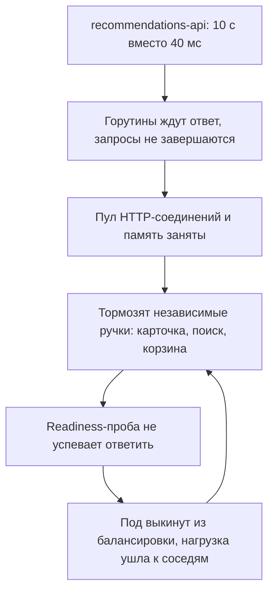
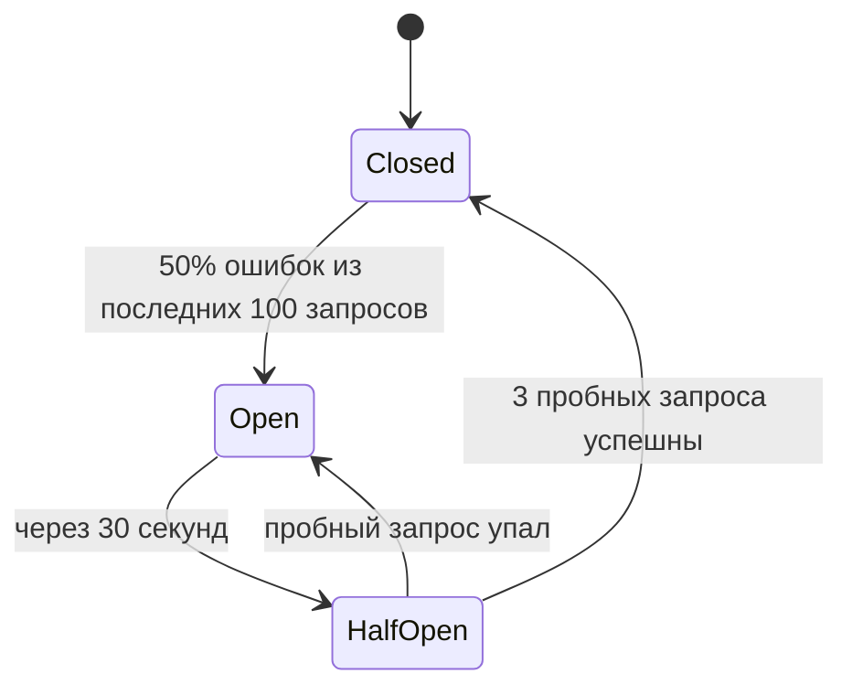

# Урок 01 — Приручаем «мигающую» зависимость

Цель: взять один конкретный вызов к нестабильному сервису и обвешать его предохранителями
в правильном порядке, проговаривая, что каждый из них лечит.

## Разогрев

- Почему медленная зависимость опаснее упавшей?
- Что делает `context.WithTimeout` и куда он должен доходить?
- Три состояния circuit breaker?

## Задача

Сервис карточки товара вызывает `recommendations-api` («с этим товаром покупают»). Обычно
он отвечает за 40 мс, но раз в неделю уходит в 8–15 секунд на полчаса. В эти полчаса
**весь** сервис карточки становится недоступным: p99 = 30 с, 502 от балансировщика,
дежурный перезапускает поды, помогает ненадолго.

Разберём, почему падает всё, а не только рекомендации.



Корень: **ожидание не ограничено**, и ресурс, который мы тратим на ожидание, общий.

## Шаг 1. Таймаут (обязательный минимум)

```go
// Бюджет ручки 800 мс; рекомендациям выделяем 250 мс — блок необязательный,
// он не имеет права съесть весь бюджет.
recCtx, cancel := context.WithTimeout(ctx, 250*time.Millisecond)
defer cancel()
recs, err := h.rec.Get(recCtx, productID)
```

Плюс `http.Client{Timeout: ...}` вместо `http.DefaultClient` — на случай, если `ctx` где-то
потерялся. Что это уже дало: худший случай ручки — 800 мс вместо 30 с, ресурсы освобождаются.
Чего не дало: мы всё равно делаем 7000 бесполезных вызовов в секунду и держим 7000 × 250 мс
ожидания.

## Шаг 2. Fallback вместо ошибки

Рекомендации — необязательная часть ответа. Значит ошибка вызова **не должна** превращаться в
5xx всей ручки:

```go
if err != nil {
    metrics.RecFailures.Inc()
    recs = h.cache.LastKnownRecs(productID) // stale-ответ лучше пустоты
}
```

Это и есть **graceful degradation**: страница живёт, блок беднеет.

## Шаг 3. Bulkhead: ограничить, сколько горутин может ждать

```go
// Максимум 20 одновременных вызовов к нестабильной зависимости.
// TryAcquire не ждёт: перегруз — сразу fallback, а не рост очереди.
if !h.recSem.TryAcquire(1) {
    return h.cache.LastKnownRecs(productID)
}
defer h.recSem.Release(1)
```

Теперь при зависании расходуется максимум 20 горутин и 20 соединений, а не все.

## Шаг 4. Circuit breaker: перестать звонить мертвецу

Если 50 % из последних 100 вызовов — таймауты, звонить дальше бессмысленно: мы просто жжём
250 мс на каждом запросе. Открываем предохранитель на 30 секунд, отдаём fallback мгновенно,
затем пробуем несколько запросов.



Важно решить, **что считать ошибкой**: таймаут и 5xx — да; 404 «нет рекомендаций для товара» —
нет, иначе нормальная работа откроет breaker.

## Шаг 5. Ретраи — осторожно

Соблазн: «добавим 3 ретрая, вдруг повезёт». В нашем случае это ошибка: зависимость лежит не
секунду, а полчаса, и ретраи только утроят нагрузку на неё и съедят бюджет ручки. Разумный
компромисс: **одна** дополнительная попытка, только если первая упала быстро (соединение
отвергнуто), с jitter, и только пока circuit breaker закрыт.

## Итоговый порядок и эффект

| Предохранитель | Что лечит | Худший случай после |
|---|---|---|
| Таймаут 250 мс | бесконечное ожидание | ручка ≤ 800 мс |
| Fallback | 5xx из-за необязательного блока | страница без рекомендаций |
| Bulkhead (20) | исчерпание горутин и пула | 20 «зависших» вызовов максимум |
| Circuit breaker | бесполезные вызовы, лишние 250 мс | мгновенный fallback в Open |
| 1 ретрай с jitter | разовые сетевые сбои | без шторма |

Проверка результата: во время следующего инцидента p99 карточки остаётся 120 мс, доля
запросов с рекомендациями падает до нуля, алерт срабатывает на метрике «breaker открыт», а не
на «сервис лежит».

## Mini-drill

```drill
type: multiple-choice
prompt: "Почему в этой ситуации 3 ретрая — плохая идея?"
options: ["Ретраи всегда вредны", "Зависимость лежит полчаса: ретраи утроят нагрузку на неё и съедят бюджет ручки, не увеличив шанс успеха", "Ретраи нарушают идемпотентность GET-запроса", "Ретраи не поддерживаются http.Client"]
answer: "Зависимость лежит полчаса: ретраи утроят нагрузку на неё и съедят бюджет ручки, не увеличив шанс успеха"
check: exact
```

```drill
type: fill-in
prompt: "Ограничение «не больше 20 одновременных вызовов к этой зависимости» — это паттерн ___."
answer: "bulkhead"
check: fuzzy
```

```drill
type: free-form
prompt: "Объясни вслух, в каком порядке ты добавляешь предохранители и почему именно в таком."
answer: "Первым — таймаут, потому что без ограничения ожидания все остальные меры бессмысленны: ресурсы всё равно утекут. Вторым — fallback и признание блока необязательным, потому что это решает продуктовую часть: пользователь получает страницу, а не 500. Третьим — bulkhead: даже с таймаутом 250 мс при 7000 RPS можно держать сотни ожидающих горутин, а семафор ставит жёсткий потолок и превращает перегрузку в мгновенный fallback. Четвёртым — circuit breaker: он убирает бесполезные вызовы и лишние 250 мс на каждом запросе, когда зависимость явно мертва, и заодно даёт ей отлежаться. Ретраи — последними и в минимальном объёме, потому что они усиливают нагрузку и опасны без идемпотентности. И к каждому пункту — метрика: доля fallback, состояние breaker, число отказов семафора, иначе я не узнаю, что деградация вообще произошла."
check: manual
```

## Итог

Нестабильная зависимость лечится не «перезапустить поды», а четырьмя предохранителями:
таймаут (ограничить ожидание), fallback (не превращать необязательное в фатальное), bulkhead
(изолировать ресурсы), circuit breaker (перестать звонить мертвецу). Ретраи — аккуратно и
поверх всего этого. Цель формулируется одной фразой: **отказ зависимости должен стоить
блока на странице, а не всего сервиса**.
