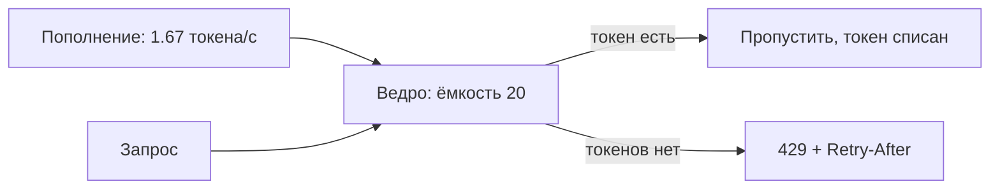
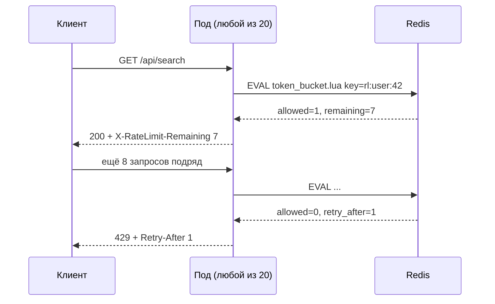

# Урок 02 — Проектируем rate limiter: от одного узла к распределённому

Цель: пройти классическую задачу интервью целиком — требования, алгоритм, хранилище,
поведение при отказе — и уметь рассказать это за 10 минут.

## Разогрев

- Чем token bucket отличается от leaky bucket?
- Почему fixed window пропускает двойной лимит?
- Что отдавать клиенту при срабатывании лимита?

## Шаг 1. Требования (не пропускать!)

Вопросы, которые задаёт сильный кандидат до всякого кода:

- **Кого ограничиваем**: пользователя, API-ключ, IP, или сервис целиком? (IP плохо работает
  за NAT и в мобильных сетях.)
- **Какой лимит**: 100 запросов в минуту? Разный для тарифов? Разный для ручек (поиск дороже,
  чем чтение профиля)?
- **Всплески разрешены?** «100 в минуту» — это 100 в первую секунду или строго 1.67 в
  секунду? От ответа зависит алгоритм.
- **Где считаем**: в API gateway (один раз для всех сервисов) или в каждом сервисе?
- **Что делаем при превышении**: 429 сразу или ставим в очередь (throttling)?
- **Точность против цены**: допустимо ли иногда пропустить 105 запросов вместо 100?

Функциональные требования на выходе: лимит на `user_id`, 100 req/min, всплеск до 20 подряд
допустим, ответ 429 + `Retry-After`, точность ±5 % приемлема, 20 подов за балансировщиком,
пик 12 000 RPS суммарно.

## Шаг 2. Алгоритм

| Алгоритм | Память на ключ | Всплеск | Точность | Вердикт для задачи |
|---|---|---|---|---|
| Fixed window | 1 число | резкий на стыке | до 2× лимита | нет |
| Sliding log | ~50 байт × лимит | нет | идеальная | дорого: 100 записей × млн юзеров |
| Sliding counter | 2 числа | сглажен | ±несколько % | **да** |
| Token bucket | 2 числа | контролируемый (размер ведра) | хорошая | **да**, если нужен явный burst |
| Leaky bucket | очередь | нет | хорошая | для исходящего трафика к внешним API |

Берём **token bucket**: он естественно выражает «100 в минуту со всплеском 20» — скорость
пополнения `100/60 ≈ 1.67` токена в секунду, ёмкость ведра 20.



## Шаг 3. Один узел

В Go готовый token bucket — `golang.org/x/time/rate`:

```go
// На каждого пользователя свой лимитер; сама мапа чистится по TTL,
// иначе она станет утечкой памяти на миллионе пользователей.
func (l *Limiters) Allow(userID string) bool {
    lim := l.getOrCreate(userID, rate.Limit(100.0/60.0), 20)
    return lim.Allow() // не блокирует: перегруз отсекаем сразу
}
```

Ограничение очевидно: лимитер живёт в памяти пода. При 20 подах пользователь получит до
20 × 100 запросов в минуту. Наивная починка «поделить лимит на 20» плоха: балансировка
неравномерна, число подов меняется при автоскейле, и при 2 подах из 20 пользователь получит
1/10 положенного.

## Шаг 4. Распределённый вариант на Redis

Общее состояние — в Redis, операция атомарна за счёт Lua (или `INCR`, если алгоритм — окно).



Скрипт хранит в хеше два поля: число токенов и время последнего пополнения; при вызове
досчитывает, сколько токенов накапало с прошлого раза, вычитает один, ставит TTL. Всё в одном
`EVAL` — значит без гонок между подами.

Цена решения:

- **+0.3–0.5 мс** на каждый запрос (round-trip в Redis). При бюджете 800 мс терпимо.
- **12 000 EVAL/с** в Redis — нормально для одного узла (он держит десятки тысяч операций),
  но это уже заметная нагрузка: стоит вынести лимиты в отдельный инстанс.
- **Память**: 1 млн активных пользователей × ~100 байт ≈ 100 МБ. Ключи с TTL — не растут вечно.
- **Зависимость от Redis.** Решение принимается заранее: **fail-open** (Redis недоступен →
  пропускаем всех, риск перегрузки) или **fail-closed** (→ всех отсекаем, риск полного
  отказа сервиса). Для клиентских лимитов почти всегда fail-open плюс грубый локальный
  лимитер как второй эшелон.

## Шаг 5. Ответ клиенту и наблюдаемость

Отдаём `429 Too Many Requests`, `Retry-After: 1`, `X-RateLimit-Limit/Remaining/Reset`.
Метрики: доля отклонённых по ключу и по ручке, топ ограничиваемых пользователей, латентность
проверки, ошибки Redis. Без метрик лимитер однажды тихо отсечёт нормальный трафик, и узнают
об этом из поддержки.

И граница ответственности: rate limiter защищает от **конкретного шумного клиента**. От
общей перегрузки защищает **load shedding**, который смотрит не на клиента, а на насыщение
самого сервиса. Это разные механизмы, и нужны оба.

## Mini-drill

```drill
type: multiple-choice
prompt: "«100 запросов в минуту, но пачка из 20 подряд допустима» — какой алгоритм выражает это напрямую?"
options: ["Fixed window 100/мин", "Token bucket: скорость 1.67 токена/с, ёмкость 20", "Sliding log на 100 записей", "Leaky bucket с очередью 100"]
answer: "Token bucket: скорость 1.67 токена/с, ёмкость 20"
check: exact
```

```drill
type: fill-in
prompt: "Чтобы проверка и списание токена были атомарны между 20 подами, в Redis используют ___-скрипт."
answer: "Lua"
check: fuzzy
```

```drill
type: free-form
prompt: "Redis с лимитами недоступен. Ты выберешь fail-open или fail-closed? Обоснуй вслух."
answer: "Для клиентских лимитов беру fail-open: цель лимитера — защита от отдельных шумных клиентов, а не от общей нагрузки, и превращать отказ вспомогательного компонента в полный отказ сервиса неправильно. Но fail-open голым не оставляю: включаю грубый локальный лимитер в каждом поде (например, лимит на пользователя, делённый на число подов, с запасом) и полагаюсь на load shedding по насыщению, который не зависит от Redis. Fail-closed выбираю там, где лимит — часть безопасности или денег: защита от перебора паролей, платный внешний API с жёсткой квотой, антифрод. То есть вопрос звучит так: что дороже — пропустить лишние запросы или отказать легитимным? И это решение принимается заранее и записывается, а не придумывается дежурным в три часа ночи."
check: manual
```

```drill
type: free-form
prompt: "Оцени вслух стоимость распределённого лимитера: 12 000 RPS, 1 млн активных пользователей."
answer: "На каждый запрос один EVAL в Redis, то есть 12 000 операций в секунду — для одного узла Redis это нормально (он держит десятки тысяч простых команд), но нагрузка заметная, поэтому лимиты выношу в отдельный инстанс, чтобы не конкурировать с кэшем. Латентность: +0.3–0.5 мс на запрос, при бюджете ручки 800 мс это меньше промилле, приемлемо. Память: ключ на пользователя, хеш из двух полей плюс оверхед — порядка 100 байт, на 1 млн активных ≈ 100 МБ, и ключи с TTL не копятся бесконечно. Сеть: 12 000 × ~200 байт ≈ 2.4 МБ/с — ничто. Узкое место, о котором стоит сказать: это единственный синхронный поход, который делает КАЖДЫЙ запрос, поэтому таймаут на него ставлю жёсткий (20–30 мс) и при ошибке иду по fail-open, иначе лимитер станет самым надёжным способом уронить сервис."
check: manual
```

## Итог

Rate limiter — это не «взять token bucket», а цепочка решений: кого и на каком уровне
ограничиваем → разрешены ли всплески (отсюда алгоритм) → где живёт состояние (в памяти
пода или в Redis) → что делаем при отказе хранилища (fail-open/fail-closed) → что отдаём
клиенту (429 + `Retry-After` + лимитные заголовки) → какие метрики. И финальная оговорка,
которую ценят: лимит защищает от шумного клиента, а от перегрузки защищает load shedding.
