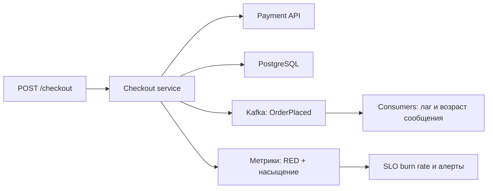

# Урок 03 — SLO и наблюдаемость для checkout-сервиса

Цель: научиться формулировать SLO так, чтобы его можно было измерить, и строить набор
метрик и алертов, который ловит проблему раньше пользователей.

## Разогрев

- Чем SLI отличается от SLO и SLA?
- Сколько минут в месяц даёт бюджет ошибок при SLO 99.9 %?
- Почему алертить на CPU — плохая идея?

## Шаг 1. Выбрать сценарий, а не компонент

Плохо: «SLO на сервис checkout — 99.9 % аптайма». Что такое «аптайм» — процесс жив? Отвечает
на `/health`? Пользователю от этого ни холодно ни жарко.

Хорошо: SLO ставится на **пользовательский путь**:

```text
Сценарий: «пользователь нажал Оплатить и получил подтверждение заказа»
SLI успеха:   доля запросов POST /checkout, завершившихся 2xx, среди всех валидных
SLI скорости: доля запросов POST /checkout быстрее 1 секунды
```

Определения нужно довести до занудства, иначе SLO нельзя посчитать:

- Что считаем **валидным** запросом: 4xx из-за кривого ввода клиента — не наша ошибка,
  из подсчёта исключаем (но 429 от нашего же лимитера — спорно, стоит учитывать).
- **Где меряем**: на балансировщике (ближе к пользователю, видит наши сетевые проблемы) или в
  приложении (проще, но не видит, что запрос не дошёл). Правильнее — на границе.
- **Окно**: скользящие 28–30 дней. Календарный месяц удобен для отчёта, скользящее окно —
  для оперативных решений.

## Шаг 2. Числа и бюджет

```text
SLO успеха:    99.9 % за 30 дней  → бюджет 0.1 %
трафик:        500 000 checkout в месяц
бюджет ошибок: 500 запросов в месяц (или 43.2 минуты полной недоступности)

SLO скорости:  99 % быстрее 1 с   → 5000 медленных запросов в месяц допустимо
```

Заметь удобство «бюджета в запросах»: инцидент на 12 минут в час пик — это, скажем, 180
неудачных оформлений, то есть 36 % месячного бюджета. Такой разговор понятен и продукту, и
менеджеру.

## Шаг 3. Метрики: что снимать



- **RED для ручки**: Rate (RPS), Errors (доля 5xx и таймаутов), Duration (гистограмма, из
  неё p50/p95/p99).
- **По зависимостям**: латентность и доля ошибок отдельно для Payment API, БД, брокера.
  Без разбивки инцидент «checkout медленный» превращается в гадание.
- **Насыщение**: занятые соединения пула БД (в процентах от максимума), число активных
  запросов, длина внутренних очередей, число открытых circuit breaker'ов, отказы семафоров.
- **Асинхронный хвост процесса**: лаг consumer'ов и возраст самого старого необработанного
  события — заказ считается «оформленным», но если письмо и резерв склада отстают на час,
  пользователь это заметит.
- **Бизнес-метрика как страховка**: число успешных оформлений в минуту. Она ловит то, что не
  ловят технические метрики (например, «всё зелёное, но фронт сломался и никто не платит»).

## Шаг 4. Алерты: два порога по burn rate

Наивный алерт «доля 5xx > 1 % за 5 минут» либо шумит, либо просыпает медленную деградацию.
Подход SRE — алертить на **скорость сжигания бюджета**:

| Алерт | Условие | Смысл | Куда |
|---|---|---|---|
| Быстрый | burn rate × 14 на окне 1 ч | бюджет месяца сгорит за ~2 дня | будим дежурного |
| Медленный | burn rate × 3 на окне 6 ч | тихая деградация, бюджет сгорит за ~10 дней | тикет в рабочее время |

Плюс несколько «симптомных» алертов, которые не выводятся из SLO: DLQ непуста, лаг обработки
заказов больше 15 минут, circuit breaker Payment API открыт дольше 5 минут, пул БД занят
больше 90 % пять минут подряд.

Чего в алертах быть **не должно**: CPU 80 %, память 70 %, «перезапустился под». Это дашборд и
контекст расследования, а не повод будить человека ночью. И у каждого алерта — runbook:
первые три шага, что проверить.

## Шаг 5. Логи и трейсы

- Логи структурные (`slog`, JSON), обязательные поля: `trace_id`, `user_id`, `order_id`,
  `route`, `status`, `duration_ms`. Уровень `error` — только для того, что требует внимания;
  «пользователь ввёл неверный купон» — это `info`.
- Сэмплирование: 100 % ошибок, 1–5 % успешных запросов, иначе счёт за логи превысит счёт за
  вычисления.
- Трейсы (OpenTelemetry) — на всю цепочку `checkout → payment → db → kafka → consumer`.
  `trace_id` кладём и в заголовки сообщений брокера, иначе асинхронный хвост выпадает из
  картины.
- Разбор инцидента должен начинаться так: алерт → дашборд SLO → трейс медленного запроса →
  логи этого `trace_id`. Если для этого приходится грепать шесть журналов по времени —
  наблюдаемости нет.

## Mini-drill

```drill
type: multiple-choice
prompt: "Какая формулировка SLI годится для checkout?"
options: ["Аптайм процесса 99.9 %", "Доля POST /checkout, завершившихся 2xx быстрее 1 секунды, измеренная на балансировщике", "Средняя латентность ручки", "Доступность PostgreSQL"]
answer: "Доля POST /checkout, завершившихся 2xx быстрее 1 секунды, измеренная на балансировщике"
check: exact
hint: "SLI ставится на пользовательский сценарий и должен быть измеримым."
```

```drill
type: fill-in
prompt: "Вместо порога «1 % ошибок за 5 минут» SRE рекомендуют алертить на скорость сжигания бюджета — ___ rate."
answer: "burn"
check: exact
```

```drill
type: free-form
prompt: "Объясни вслух, почему 4xx обычно исключают из SLI, и когда это решение неверно."
answer: "4xx — это ошибка клиента: неверный формат, отсутствующий параметр, неверный купон. Если включить их в SLI, наш показатель будет зависеть от качества чужих клиентов, а не от нашей работы, и мы будем сжигать бюджет из-за ботов и сканеров. Но есть исключения. Первое: 429 от нашего собственного лимитера — формально 4xx, но пользователь получил отказ по нашему решению, и если лимиты настроены слишком жёстко, это наша проблема, поэтому 429 стоит считать хотя бы отдельной метрикой. Второе: 400, вызванные нашим же кривым релизом контракта — клиент не менялся, а ошибки появились; такие всплески 4xx обязаны алертить, даже если они вне SLI. Третье: 404 на ресурс, который должен существовать, — это наша потеря данных, замаскированная под клиентскую ошибку. Поэтому правило: из SLI исключаем, но за динамикой 4xx следим отдельным алертом на резкий рост."
check: manual
```

```drill
type: free-form
prompt: "Набросай вслух набор дашборда и алертов для checkout так, чтобы дежурный за 5 минут понял, где проблема."
answer: "Верхний ряд дашборда — SLO: текущая доля успеха и скорости, остаток бюджета в процентах и в запросах, burn rate за час и за шесть часов. Второй ряд — RED по ручке: RPS, доля 5xx и таймаутов, гистограмма латентности с p50/p95/p99. Третий ряд — зависимости: латентность и ошибки отдельно для Payment API, PostgreSQL и Kafka, плюс состояние circuit breaker. Четвёртый — насыщение: занятость пула БД в процентах, активные запросы, отказы семафоров, длина очередей. Пятый — асинхронный хвост: лаг consumer'ов, возраст старейшего сообщения, размер DLQ. Шестой — бизнес: успешные оформления в минуту с сравнением с прошлой неделей. Алерты: быстрый burn rate ×14 за час — звонок дежурному; медленный ×3 за шесть часов — тикет; непустая DLQ; лаг заказов больше 15 минут; breaker Payment API открыт дольше 5 минут; пул БД выше 90 % пять минут. CPU и память — только на дашборде. У каждого алерта — runbook с первыми тремя шагами и ссылкой на дашборд с уже проставленным trace-фильтром."
check: manual
```

## Итог

SLO начинается с пользовательского сценария и занудных определений: что считаем успехом, где
меряем, на каком окне. Бюджет ошибок переводится в понятные единицы — минуты и запросы.
Метрики строятся по RED плюс насыщение плюс зависимости плюс асинхронный хвост плюс одна
бизнес-метрика. Алерты — на симптомы и burn rate, с runbook, а CPU и память живут на
дашборде. И связующее звено всей картины — сквозной `trace_id`, доходящий до консьюмеров.
