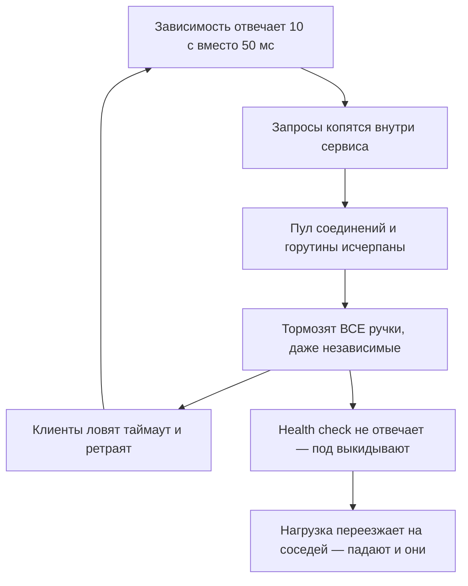
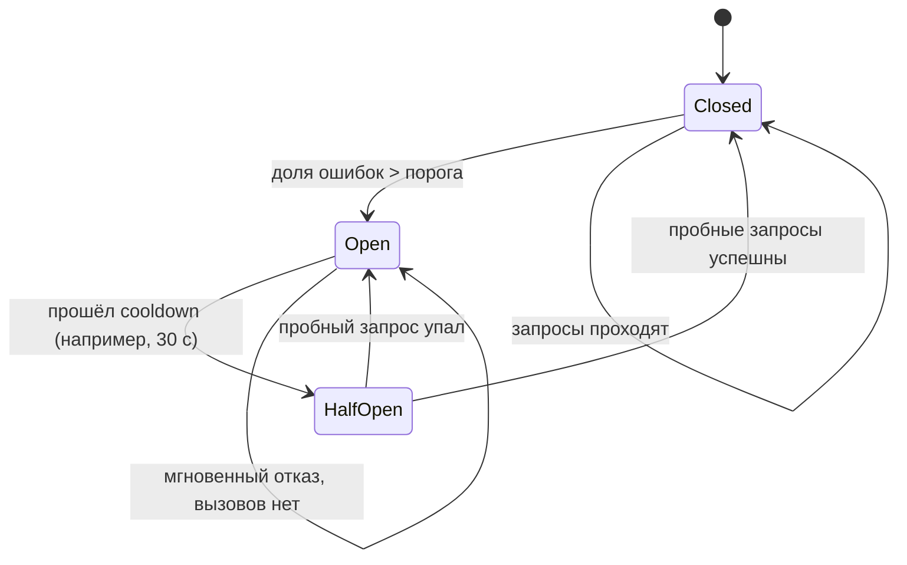
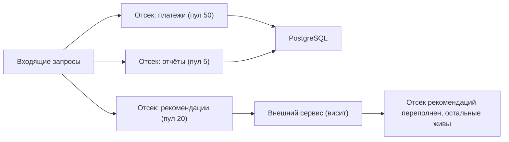

# Устойчивость и лимиты

Вторая часть модуля. Первая — масштабирование, девятки и SLO — в
[`theory.md`](./theory.md). Здесь: что делать, когда что-то уже сломалось или тормозит.

## Главный враг: не отказ, а медленный ответ

Простыми словами: если зависимость **упала**, это честно и легко — соединение отвергается,
ты сразу знаешь об этом. Если зависимость **тормозит** (10 секунд вместо 50 мс), твой сервис
продолжает исправно принимать запросы и копить их внутри себя: горутины, соединения в пуле,
память. Через минуту у тебя 50 000 висящих горутин, пул БД исчерпан, и ложится всё — включая
ручки, которым эта зависимость вообще не нужна.

Это называется **каскадный отказ**: один медленный компонент утягивает за собой всю цепочку.



Всё, что дальше, — это набор предохранителей против этой картинки: таймауты, retry с
головой, circuit breaker, bulkhead, лимиты, load shedding.

## Таймауты: везде и всегда

**Таймаут** — верхняя граница ожидания. Без него ожидание бесконечно, а бесконечное ожидание
— это утечка ресурсов.

В Go это `context` с дедлайном, который **пробрасывается насквозь**: HTTP-хендлер → сервис →
БД/HTTP-клиент. `database/sql` и `net/http` уважают `ctx`, поэтому отмена доходит до сокета.

```go
func (h *Handler) Get(w http.ResponseWriter, r *http.Request) {
    // Бюджет всего запроса: дальше по стеку никто не может ждать дольше.
    ctx, cancel := context.WithTimeout(r.Context(), 800*time.Millisecond)
    defer cancel()

    res, err := h.svc.Do(ctx) // ctx летит в БД, в HTTP-клиент, в брокер
    if errors.Is(err, context.DeadlineExceeded) {
        http.Error(w, "timeout", http.StatusGatewayTimeout)
        return
    }
    ...
}
```

Ключевые правила:

- **Бюджет времени убывает вниз по стеку.** Если ручке дано 800 мс, вызов к сервису A не
  может иметь таймаут 2 с — он бессмысленен, `ctx` всё равно отменится раньше. Осмысленно:
  800 мс на ручку → 300 мс на A → 100 мс на кэш.
- **У `http.Client` таймаут по умолчанию — ноль, то есть бесконечность.** Это классическая
  дыра: `http.DefaultClient` без таймаута может висеть вечно. Задавай `Timeout`, а лучше —
  ещё и `Transport` с `DialContext`, `TLSHandshakeTimeout`, `ResponseHeaderTimeout`.
- Таймаут должен быть **чуть больше** p99 нормального ответа, а не «на глаз». Слишком
  маленький — режем здоровые запросы, слишком большой — не защищает.
- На сервере: `http.Server{ReadHeaderTimeout, ReadTimeout, WriteTimeout, IdleTimeout}` —
  иначе медленный клиент удерживает соединение бесплатно.

## Retry: лекарство, которое легко превратить в яд

Retry имеет смысл **только для временных** ошибок (сетевой сбой, 503, таймаут) и **только
для идемпотентных** операций. Повторить `POST /payments` без ключа идемпотентности — способ
списать деньги дважды (см. модуль [`05-queues-and-async`](../05-queues-and-async/index.md)).

Три обязательных элемента:

1. **Экспоненциальный backoff**: 100 мс, 200 мс, 400 мс… Не «ретраим сразу три раза» — это
   просто утроение нагрузки на упавший сервис.
2. **Jitter** (случайный разброс): без него тысяча клиентов, стартовавших синхронно,
   ретраит синхронно и бьёт волнами. Полный jitter: `sleep = rand(0, base * 2^n)`.
3. **Лимит попыток** (2–3) и учёт дедлайна: не ретраить, если `ctx` уже почти истёк.

**Retry storm (ретрай-шторм)** — самое коварное: сервис тормозит, клиенты ретраят, нагрузка
растёт втрое, сервис тормозит сильнее. Retry **усиливает** аварию, вместо того чтобы её
пережить. Особенно опасны ретраи на нескольких уровнях: клиент 3 попытки × gateway 3 ×
сервис 3 = 27 запросов к умирающей БД.

Лечится **retry budget**: разрешать ретраи, только пока их доля не превышает, скажем, 10 % от
основного трафика; выше — не ретраим вовсе. Так делают gRPC (`retryThrottling`) и сервис-меши.
Правило: **ретраит только один уровень** — обычно самый близкий к вызову, и об этом
договариваются явно.

## Circuit breaker: предохранитель

**Circuit breaker (автоматический выключатель)** простыми словами — пробка в электрощитке:
когда сервис-зависимость явно нездоров, мы **перестаём его звать** и сразу возвращаем ошибку
или запасной ответ. Это спасает и нас (не копим висящие запросы), и его (даём отлежаться).



- **Closed** — нормальная работа, ошибки считаются.
- **Open** — вызовы не делаются вообще, сразу fail-fast (или fallback: отдать кэш, пустой
  список, «сервис рекомендаций временно недоступен»).
- **Half-open** — через таймаут пропускаем несколько пробных запросов: ожил — закрываемся,
  нет — снова открываемся.

Настройки, о которых спросят: порог по **доле** ошибок (не по абсолютному числу), минимальное
число запросов в окне (иначе 1 ошибка из 1 откроет breaker), длительность cooldown, и что
считать ошибкой (таймаут — да, бизнес-ошибка 404 — нет, иначе breaker откроется от нормальной
работы).

**Fail-fast** — общий принцип: если известно, что запрос не может быть выполнен, откажи
немедленно, не занимая ресурсы. Быстрый отказ лучше медленного успеха, потому что медленный
успех отравляет весь сервис.

## Bulkhead: переборки

**Bulkhead (переборка)** — из судостроения: корпус разделён на отсеки, пробоина затапливает
один отсек, а не весь корабль. В сервисе это изоляция ресурсов, чтобы одна зависимость не
могла съесть их все.

Практически:

- Отдельный **пул соединений/семафор на каждую внешнюю зависимость**: «к сервису
  рекомендаций максимум 20 одновременных вызовов». Даже если он висит, свободными остаются
  остальные горутины и соединения.
- Отдельные пулы БД под критичные и некритичные запросы; отдельные worker-пулы под
  разные типы задач.
- На уровне инфраструктуры — разные поды/ноды для разных классов трафика.



В Go bulkhead делается буферизированным каналом или `golang.org/x/sync/semaphore`:
`if !sem.TryAcquire(1) { return ErrBusy }` — и это уже fail-fast вместо накопления.

## Rate limiting: сколько можно

**Rate limiting** — ограничение частоты запросов: от клиента, от IP, на ключ API, на весь
сервис. Зачем: защита от злоупотребления и DoS, справедливое распределение между клиентами,
защита нижележащих компонентов (БД), контроль расходов.

| Алгоритм | Как работает | Память на ключ | Всплески | Точность на границе | Когда |
|---|---|---|---|---|---|
| **Fixed window** | счётчик на минуту, сброс в начале окна | 1 число | резкие | плохая: до 2× лимита на стыке окон | самый простой, `INCR` в Redis |
| **Sliding window log** | хранит timestamps всех запросов | O(лимит) | нет | идеальная | точные лимиты, малые объёмы |
| **Sliding window counter** | взвешенная сумма текущего и прошлого окна | 2 числа | сглажены | хорошая (приближение) | дефолт для API-лимитов |
| **Token bucket** | ведро токенов, пополняется с постоянной скоростью, запрос берёт токен | 2 числа | **разрешает burst** размером с ведро | хорошая | клиентские лимиты, `x/time/rate` |
| **Leaky bucket** | очередь, вытекающая с постоянной скоростью | очередь | сглаживает, не пропускает burst | хорошая | выравнивание трафика к внешнему API |

Ключевое различие, которое любят спрашивать: **token bucket разрешает всплеск** (накопил
токены — потратил разом), **leaky bucket — нет** (выпускает строго равномерно). Если тебе
нужно защитить внешний API с жёстким «10 запросов в секунду», нужен leaky bucket или token
bucket с ведром размера 1.

В Go стандартный инструмент — `golang.org/x/time/rate`, это token bucket:

```go
// 100 запросов в секунду в среднем, всплеск до 200 — под пиковую пачку, но не больше.
lim := rate.NewLimiter(rate.Limit(100), 200)

func (h *Handler) ServeHTTP(w http.ResponseWriter, r *http.Request) {
    if !lim.Allow() { // Allow не ждёт: лишний трафик отсекаем сразу (fail-fast)
        w.Header().Set("Retry-After", "1")
        http.Error(w, "rate limit exceeded", http.StatusTooManyRequests)
        return
    }
    ...
}
```

Локальный лимитер живёт в одном процессе. Для **распределённого** лимита (лимит на
пользователя, а подов двадцать) есть три пути: (1) общий счётчик в Redis — `INCR` + `EXPIRE`
в Lua-скрипте атомарно; (2) поделить лимит на число подов — просто, но неточно при
неравномерной балансировке и меняющемся числе подов; (3) лимит на входе, в API gateway —
часто самый честный ответ. Trade-off Redis-варианта: +1 сетевой вызов (0.5 мс) на каждый
запрос и зависимость от Redis (при его падении — решать заранее: fail-open, то есть пускать
всех, или fail-closed).

Отдавать нужно `429 Too Many Requests` с заголовками `Retry-After` и лимитными
(`X-RateLimit-Limit/Remaining/Reset`), чтобы клиент мог вести себя разумно.

## Load shedding и backpressure

**Load shedding (сброс нагрузки)** — сознательный отказ части запросов, чтобы остальные
обслуживались нормально. Разница с rate limiting: лимит — про **справедливость и контракт**
(«тебе положено 100 rps»), shedding — про **самосохранение** («у меня перегрузка, я отвечаю
503 части трафика»).

Как решать, что сбрасывать: по приоритету (оплата важнее рекомендаций), по возрасту запроса
(запрос, который ждал в очереди 5 секунд, клиенту уже не нужен — отбрасывай его первым), по
насыщению (длина очереди, число активных запросов).

**Backpressure** — сигнал вверх по потоку «мне слишком быстро». В HTTP это 429/503 и
уменьшение окна, в брокере — рост лага и ограничение `prefetch`, внутри Go-сервиса —
небуферизированные каналы и семафоры, которые не дают продюсеру бежать быстрее консьюмера.
Правило: **всегда должен быть предел** — неограниченная очередь означает неограниченную
задержку и OOM.

## Graceful shutdown и health checks

При деплое и автоскейле поды убивают постоянно. Корректная остановка — это не роскошь, а
условие «деплой без пятисоток».

```go
srv := &http.Server{Addr: ":8080", Handler: mux}
go func() { _ = srv.ListenAndServe() }()

<-stop                    // SIGTERM от Kubernetes
ready.Store(false)        // readiness=false: балансировщик перестаёт слать новые запросы
time.Sleep(5 * time.Second) // ждём, пока это увидят все прокси (сети нужно время)

ctx, cancel := context.WithTimeout(context.Background(), 25*time.Second)
defer cancel()
_ = srv.Shutdown(ctx)     // дорабатываем текущие запросы, новые не принимаем
consumers.StopAndWait(ctx) // затем — воркеры брокера: доработать сообщение и закоммитить offset
```

Порядок важен: сначала перестать **получать** новый трафик, потом дорабатывать текущий.
Если сразу закрыть сокет, часть запросов получит 502.

**Health checks** бывают двух видов, и их путают:

- **Liveness** — «процесс жив, его надо перезапустить, если нет». Должен быть тупым: не ходи
  в БД. Иначе кратковременная недоступность БД вызовет перезапуск **всех** подов сразу —
  классическая самодельная авария.
- **Readiness** — «готов принимать трафик». Здесь как раз уместны проверки зависимостей
  (пул БД, прогрев кэша) — под просто выводится из балансировки, не перезапускаясь.

Опасность: если readiness завязан на общую зависимость (одна БД), её деградация выведет из
ротации **все** поды одновременно, и вместо «медленно» получится «недоступно». Иногда лучше
отдавать деградированный ответ.

## Failover, избыточность, DR

- **Redundancy (избыточность)** — держать больше экземпляров, чем нужно: N+1, N+2. Без этого
  отказ одного узла означает перегрузку остальных (см. capacity planning в
  [`theory.md`](./theory.md)).
- **Failover** — переключение на резерв: реплика БД становится лидером, трафик уходит в
  другую зону. Бывает автоматическим (быстро, но риск split brain — см. модуль
  [`07-distributed-systems`](../07-distributed-systems/index.md)) и ручным (медленно, зато
  осознанно).
- **Multi-AZ** (несколько зон доступности в регионе) — дёшево и обязательно для 99.99 %:
  задержка между зонами 1–2 мс, синхронная репликация возможна.
- **Multi-region** — дорого и сложно: 30–150 мс между регионами делают синхронную репликацию
  невозможной, приходится выбирать между активным-активным (конфликты записи) и
  активным-пассивным (потеря данных при переключении).
- **DR (disaster recovery)** измеряется двумя числами: **RPO** (recovery point objective) —
  сколько данных допустимо потерять, и **RTO** (recovery time objective) — за сколько
  восстановимся.

| Стратегия | RPO | RTO | Стоимость |
|---|---|---|---|
| Только бэкапы раз в сутки | до 24 ч | часы | низкая |
| Бэкап + WAL-архив (PITR) | минуты | 1–3 ч | средняя |
| Асинхронная реплика в другом регионе | секунды | 5–30 мин | выше |
| Активный-активный multi-region | ~0 | секунды | очень высокая |

И главное правило про бэкапы: **бэкап, который ни разу не восстанавливали, не существует.**
Регулярная тренировка восстановления — часть ответа на интервью.

## Как это спрашивают на собеседовании

**«Внешний сервис стал отвечать за 10 секунд. Что будет с вашим сервисом?»** Главный вопрос
модуля. Сильный ответ: «Без предохранителей — каскадный отказ: запросы копятся, пул и горутины
кончаются, ложатся даже независимые ручки. Поэтому: таймаут 300 мс через `context`, bulkhead
(семафор на 20 одновременных вызовов к этой зависимости), circuit breaker с fallback на кэш
или деградированный ответ, ретраи максимум один раз с jitter и только на идемпотентных
вызовах, и load shedding на входе. Итог — рекомендации не показываем, оформление заказа
работает».

**«Зачем jitter в ретраях?»** Ожидают: без него ретраи синхронизируются в волны и добивают
сервис; с ним нагрузка размазывается.

**«Спроектируйте rate limiter»** — целый урок (см. `lessons/02`). Минимум: выбрать алгоритм и
обосновать (token bucket для клиентских лимитов, потому что нужен разумный burst), решить,
где считать (gateway/сервис), как сделать распределённым (Redis + Lua), что отдавать (429 +
`Retry-After`), и что делать при падении Redis (fail-open/fail-closed).

**«Чем liveness отличается от readiness?»** Ожидают понимания последствий: liveness
перезапускает, readiness выводит из балансировки; проверка БД в liveness — способ уронить
весь деплоймент.

**«Что такое RPO и RTO для вашей системы?»** Проверяют, умеешь ли ты говорить о потерях
данных числами, а не «у нас есть бэкапы».

## Типичные ошибки и заблуждения

- **Нет таймаута** (`http.DefaultClient`, запрос в БД без `ctx`) — главный источник каскадов.
- **Таймаут больше, чем у вызывающего**: бесполезен, `ctx` отменится раньше.
- **Ретраи на всех уровнях сразу** — 27 запросов вместо трёх; договаривайтесь, кто ретраит.
- **Ретрай неидемпотентной операции** — двойные списания.
- **Retry без jitter и без лимита** — шторм.
- **Circuit breaker по абсолютному числу ошибок** или без минимального объёма выборки —
  открывается на пустом месте.
- **Считать 4xx ошибками** для breaker — клиент шлёт мусор, а мы отключаем зависимость.
- **Один пул на всё** — медленная некритичная зависимость съедает ресурсы критичных.
- **Rate limiting без 429 и `Retry-After`** — клиент не понимает, что делать, и долбит дальше.
- **Проверка зависимостей в liveness** — синхронный перезапуск всех подов.
- **Закрыть сокет вместо `Shutdown`** — 502 на каждом деплое.
- **Неограниченные очереди и каналы** — задержка в минуты и OOM вместо честного отказа.
- **«У нас есть бэкапы»** без единой проверки восстановления и без чисел RPO/RTO.

## Глоссарий

- **Каскадный отказ** — распространение отказа по цепочке зависимостей.
- **Таймаут / дедлайн** — предел ожидания; в Go — `context.WithTimeout`.
- **Backoff, jitter** — растущая пауза между попытками и её случайный разброс.
- **Retry storm** — самоусиливающаяся лавина ретраев. **Retry budget** — лимит на долю ретраев.
- **Circuit breaker** — предохранитель, отключающий вызовы к нездоровой зависимости
  (Closed / Open / Half-open).
- **Fallback** — запасной ответ при отказе (кэш, пустой список, заглушка).
- **Bulkhead** — изоляция ресурсов по зависимостям/классам трафика.
- **Fail-fast** — быстрый отказ вместо долгого ожидания.
- **Rate limiting** — ограничение частоты; **token bucket** (разрешает burst),
  **leaky bucket** (сглаживает), **fixed/sliding window**, **sliding log**.
- **Load shedding** — сознательный сброс части нагрузки ради выживания.
- **Backpressure** — сигнал «притормози» вверх по потоку.
- **Graceful shutdown** — остановка без потери запросов.
- **Liveness / readiness** — «жив» / «готов принимать трафик».
- **RPO / RTO** — допустимая потеря данных / допустимое время восстановления.
- **Multi-AZ / multi-region** — избыточность по зонам / регионам.

## См. также

- Michael Nygard, «Release It!» (2nd ed., 2018) — стабилизирующие паттерны: Timeouts,
  Circuit Breaker, Bulkhead, Fail Fast, и антипаттерны каскадных отказов.
- Google SRE book (sre.google/books): гл. 21 «Handling Overload» (load shedding, graceful
  degradation), гл. 22 «Addressing Cascading Failures» (ретраи, таймауты, перегрузка).
- Amazon Builders' Library — «Timeouts, retries, and backoff with jitter» (aws.amazon.com/builders-library).
- pkg.go.dev/golang.org/x/time/rate — token bucket; pkg.go.dev/context — дедлайны;
  pkg.go.dev/net/http — `Server.Shutdown`, таймауты сервера и клиента;
  pkg.go.dev/golang.org/x/sync/semaphore — bulkhead.
- Kubernetes docs — liveness/readiness/startup probes (kubernetes.io/docs).
- Начало модуля: [`theory.md`](./theory.md).
- Уроки: [`lessons/01-taming-a-flaky-dependency.md`](./lessons/01-taming-a-flaky-dependency.md),
  [`lessons/02-design-a-rate-limiter.md`](./lessons/02-design-a-rate-limiter.md),
  [`lessons/03-slo-and-observability.md`](./lessons/03-slo-and-observability.md).
