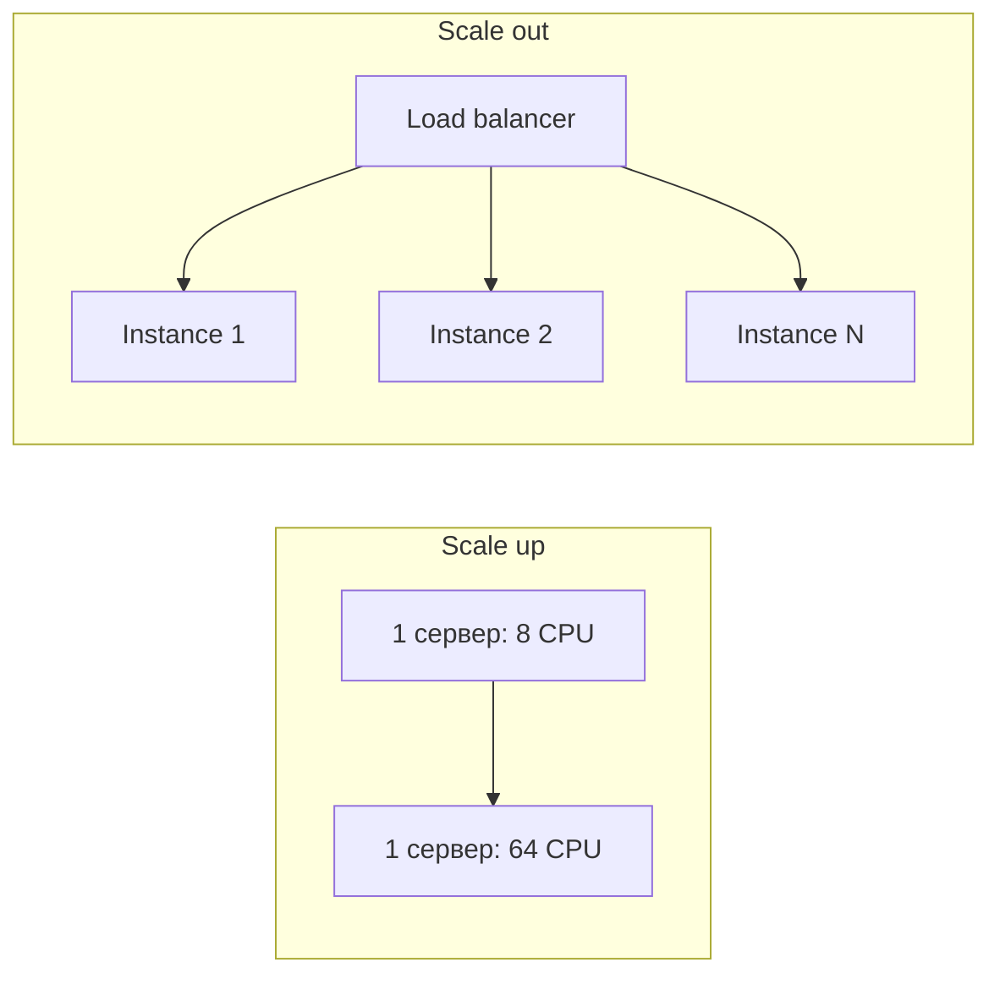
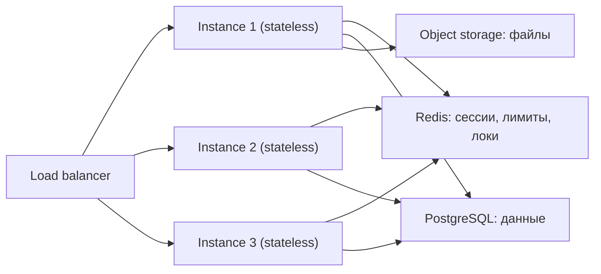
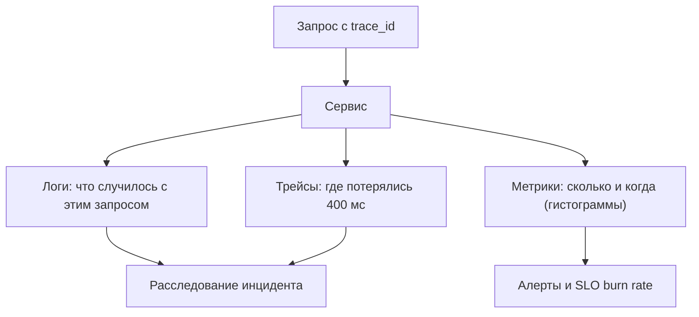

# Масштабирование, доступность и SLO

Первая половина модуля: как сервис растёт и как измеряется его надёжность. Вторая половина —
паттерны выживания под отказами — в файле
[`theory-2-resilience-and-limits.md`](./theory-2-resilience-and-limits.md).

## Простыми словами: два способа расти

**Вертикальное масштабирование (scale up)** — купить машину помощнее: больше ядер, больше
памяти. Аналогия: вместо одного повара нанять шеф-повара, который готовит быстрее.

**Горизонтальное масштабирование (scale out)** — поставить рядом ещё машины и раскидать
работу между ними. Аналогия: вместо одного шеф-повара — десять обычных поваров и человек,
который распределяет заказы (балансировщик).

| Критерий | Вертикальное | Горизонтальное |
|---|---|---|
| Сложность | почти нулевая: тот же код | нужен балансировщик, stateless, распределённые проблемы |
| Потолок | физический (самая большая машина) | практически нет |
| Отказоустойчивость | одна машина = SPOF | падение узла переживаем |
| Цена | растёт нелинейно (топовое железо дорого) | линейнее, обычное железо |
| Простой при апгрейде | обычно да (рестарт) | нет, катим по одному |



Правильный ответ на интервью почти всегда «сначала вертикально, потом горизонтально»:
удвоить память дешевле, чем городить шардирование, и один сервер в 2026 году — это десятки
ядер и сотни гигабайт. Но: вертикальное масштабирование не даёт отказоустойчивости.
Даже если нагрузка помещается в одну машину, экземпляров держат минимум два — ради переживания
отказа и деплоя без простоя.

**SPOF (single point of failure)** — компонент, отказ которого убивает всю систему. Поиск
SPOF'ов — обязательный вопрос к собственной схеме: единственный балансировщик, единственный
мастер БД, единственный Redis с сессиями, одна зона доступности.

## Stateless и куда девать состояние

**Stateless-сервис** простыми словами: любой экземпляр может обработать любой запрос, потому
что он не помнит ничего между запросами. Всё нужное либо приходит в запросе, либо лежит во
внешнем хранилище.

Что это даёт: можно поднимать и убивать поды в любой момент, автоскейлить, катить релизы,
переживать падение узла. Без этого горизонтальное масштабирование превращается в лотерею
(«мою сессию помнит под, который только что умер»).

Состояние никуда не исчезает — оно **переезжает**:



Типичные «прилипшие» состояния, которые ловят на интервью: файлы, загруженные на локальный
диск пода; сессии в памяти процесса; in-process кэш, который считают источником правды;
таймеры и cron внутри сервиса (при N подах задача выполнится N раз — нужен лидер или внешний
планировщик); долгие WebSocket-соединения (состояние есть всегда, вопрос — как переживается
переподключение).

### Сессии и sticky sessions

Три способа помнить пользователя:

1. **Серверная сессия во внешнем хранилище** (Redis): в cookie — только `sid`. Можно мгновенно
   отозвать, размер cookie крошечный. Цена — поход в Redis на каждый запрос и зависимость от него.
2. **Stateless-токен** (подписанный JWT/cookie): все данные внутри токена, проверяется
   подписью, хранилище не нужно. Цена — **нельзя отозвать** до истечения (частичное решение:
   короткий TTL + refresh-токен и список отозванных).
3. **Sticky sessions (session affinity)**: балансировщик привязывает пользователя к
   конкретному инстансу по cookie/IP. Работает, но это костыль: под умер — состояние
   потеряно, нагрузка размазывается неравномерно, автоскейл ломается, деплой болезненный.

Позиция, которую ждут: sticky sessions — не решение задачи масштабирования, а компромисс для
легаси и для соединений (WebSocket). Правильный путь — вынести состояние наружу.

## Доступность и «девятки»

**Availability (доступность)** — доля времени, когда система работает как ожидается.
Считается по-разному, и на интервью полезно уточнить: по времени простоя или по доле
успешных запросов (второе честнее для больших систем).

| Уровень | Простой в год | В месяц | В неделю | Что это на практике |
|---|---|---|---|---|
| 99 % («две девятки») | 3.65 дня | 7.2 ч | 1.7 ч | внутренний сервис, никто не умрёт |
| 99.9 % («три девятки») | 8.76 ч | 43.8 мин | 10.1 мин | типичный SLA SaaS |
| 99.95 % | 4.38 ч | 21.9 мин | 5 мин | платные тарифы |
| 99.99 % («четыре девятки») | 52.6 мин | 4.4 мин | 1 мин | требует multi-AZ, автоматики, дежурства |
| 99.999 % («пять девяток») | 5.26 мин | 26 с | 6 с | телеком-уровень, очень дорого |

Два вывода, которые стоит произносить вслух. Первый: **девятки перемножаются**. Сервис из
пяти последовательных зависимостей по 99.9 % каждая даёт 0.999^5 ≈ 99.5 % — это уже 43 часа
простоя в год, хотя «все компоненты надёжные». Отсюда любовь к graceful degradation: чтобы
падение одной зависимости не превращалось в падение ответа. Второй: **99.99 % невозможно без
автоматики** — 4.4 минуты в месяц меньше, чем время реакции человека на алерт.

## SLI, SLO, SLA и error budget

Термины из SRE-книги Google, и путать их — типичная ошибка.

- **SLI (indicator)** — измеряемая величина: доля успешных запросов, p99 латентности, свежесть
  данных. Это **число из мониторинга**.
- **SLO (objective)** — наша внутренняя цель по SLI: «99.9 % запросов успешны за скользящие
  30 дней», «p99 < 300 мс».
- **SLA (agreement)** — внешний договор с клиентом, где за нарушение платят деньгами/скидкой.
  SLA всегда слабее SLO: цель ставится строже обещания, чтобы был запас.

**Error budget (бюджет ошибок)** — то, что делает SLO рабочим инструментом: 100 % − SLO.
При SLO 99.9 % за 30 дней бюджет = 0.1 % — это 43.2 минуты недоступности в месяц. Логика:
если бюджет не израсходован, команда катит фичи и рискует. Если израсходован — фичи
замораживаются, ресурсы уходят в надёжность. Это превращает вечный спор «скорость против
стабильности» в арифметику.

```text
SLO 99.9 % за 30 дней → бюджет 43.2 минуты
инцидент на 12 минут   → потрачено 28 % бюджета
два таких инцидента    → ещё можно
пять                   → заморозка релизов
```

Сильный ход на интервью: не обещать «сделаем 99.99 %», а спросить, **что считать ошибкой**
(5xx? таймаут? медленный ответ?), на каком окне и по каким запросам. И помнить: SLO ставят
не на компонент, а на **пользовательский сценарий** («оформление заказа»).

## Перцентили: почему среднее врёт

**Перцентиль** простыми словами: p99 = 300 мс означает «99 % запросов быстрее 300 мс, 1 % —
медленнее». Среднее (mean) прячет хвост: тысяча запросов по 10 мс и десять по 5 секундам
дают среднее 60 мс — «отлично», хотя десять пользователей ждали пять секунд.

| Метрика | Что показывает | Ловушка |
|---|---|---|
| avg | среднее | одна аномалия размазывается, хвост невидим |
| p50 (медиана) | типичный пользователь | ничего не говорит о плохих случаях |
| p95 / p99 | хвост | зависит от окна усреднения; нельзя усреднять перцентили |
| p999 | худшие случаи | шумно, но именно там живут «зависшие» запросы |
| max | худший запрос | почти всегда мусор/выброс |

Три вещи, которые надо знать про хвосты:

1. **Хвост определяет впечатление.** Страница делает 20 запросов к бэкенду — вероятность, что
   хотя бы один попадёт в p99, равна 1 − 0.99^20 ≈ 18 %. То есть «одна сотая» превращается в
   каждую пятую страницу. Это называется **tail latency amplification**.
2. **Перцентили не складываются и не усредняются.** «Средний p99 по подам» — бессмысленное
   число; агрегировать надо по гистограммам (как это делают Prometheus histogram/summary).
3. **Хвост чаще про очереди, чем про код**: GC-пауза, ожидание соединения в пуле, блокировка,
   ретрай, холодный кэш. Поэтому первый вопрос при плохом p99 — «где мы стоим в очереди?».

## Capacity planning: считаем, сколько нужно

Простой рецепт, который работает на интервью:

```text
Дано: пик 7000 RPS, целевой p99 < 300 мс, один под держит 800 RPS
      при 60 % CPU (замерено нагрузочным тестом)

минимум подов        = 7000 / 800 ≈ 9
запас на отказ узла  = +1 под (N+1); на отказ зоны — +50 %
запас на всплеск     = ×1.5 → 9 * 1.5 ≈ 14
итог                 = 14–16 подов, HPA по CPU 60 % с потолком 24
```

Правила: считать по **пику**, а не по среднему; закладывать N+1 (или N+2) на отказ; не
планировать работу на 100 % — на 95 % загрузки очереди начинают расти нелинейно (теория
массового обслуживания: при загрузке ρ время ожидания растёт как 1/(1−ρ), на 90 % это уже
×10 к времени ожидания). И проверять числа нагрузочным тестом, а не верой.

## Наблюдаемость: три сигнала

**Observability** простыми словами: способность понять, что происходит внутри системы, не
подключаясь дебаггером к продакшену.

- **Логи** — дискретные события со структурой (`slog` с полями, JSON). Хороши для «что
  случилось с этим конкретным запросом». Дороги в объёме, поэтому нужны уровни и сэмплирование.
- **Метрики** — числа во времени (счётчики, гистограммы). Дёшевы, агрегируемы, идеальны для
  алертов и дашбордов. Не отвечают «почему», отвечают «сколько и когда».
- **Трейсы** — путь одного запроса через сервисы с таймингами каждого шага (OpenTelemetry).
  Незаменимы, когда «где-то в цепочке из шести сервисов теряется 400 мс».



Связывает их **`trace_id`**: он рождается на входе, летит в заголовках HTTP/gRPC и в
заголовках сообщений брокера, попадает в логи. Без сквозного `trace_id` расследование
инцидента превращается в чтение шести журналов по времени.

Что мониторить, если не знаешь, с чего начать, — **четыре золотых сигнала** (SRE book):
латентность, трафик, ошибки, насыщение (saturation — насколько заполнены пулы, CPU, диск).
Для очередей и воркеров вместо трафика смотрят лаг и глубину очереди.

### На что алертить

Правило: **алерт должен требовать действия человека прямо сейчас**. Всё остальное — дашборд.

- Алертить на **симптомы у пользователя** (растёт доля 5xx, p99 вылез за SLO, лаг обработки
  заказов больше 10 минут), а не на причины («CPU 80 %»).
- Алертить на **скорость сжигания error budget** (burn rate): «такими темпами месячный
  бюджет кончится за 6 часов» — это гораздо полезнее, чем «5 ошибок за минуту».
- Каждый алерт должен иметь runbook: что делать. Алерт без действия — шум, а шум приводит к
  тому, что настоящий алерт пропустят (alert fatigue).

## Как это спрашивают на собеседовании

**«Как будете масштабировать этот сервис?»** Слабо: «добавим инстансов». Сильно: «Сервис уже
stateless — сессии в Redis, файлы в объектном хранилище, cron вынесен. Значит горизонтально:
по нагрузочному тесту один под держит 800 RPS, при пике 7000 нужно 9, беру 14 с запасом и
N+1. Дальше узкое место — не приложение, а БД: 7000 RPS чтений закрываю кэшем и репликами,
записи 200/с одна БД держит. Если упрёмся — шардирование по user_id, но это следующий шаг».

**«Какая у вас доступность и как вы её обеспечите?»** Ожидают: SLO на пользовательский
сценарий, понимание, что девятки перемножаются, и конкретные меры — минимум две зоны,
N+1 инстансов, health checks, graceful degradation, отсутствие SPOF.

**«Чем SLO отличается от SLA?»** Классика. SLI — измерение, SLO — внутренняя цель, SLA —
внешнее обещание с деньгами; SLO строже SLA. Плюс error budget как инструмент принятия
решений.

**«Почему вы смотрите p99, а не среднее?»** Ожидают пример с хвостом и tail latency
amplification: 20 подзапросов на страницу превращают 1 % медленных ответов в 18 % медленных
страниц.

**«Сколько нужно серверов?»** Проверяют способность считать вслух: пик, производительность
одного инстанса, запас, отказ узла. Числа могут быть грубыми, шаги — обязаны быть внятными.

## Типичные ошибки и заблуждения

- **«Stateless — значит без БД».** Нет: состояние есть всегда, оно просто хранится не в
  процессе. Stateless — это про экземпляр, а не про систему.
- **Sticky sessions как «решение».** Маскирует состояние в памяти и ломается при падении пода
  и автоскейле.
- **«Добавим инстансов» без узкого места.** Если упирается БД или внешний API, десять новых
  подов только ускорят её смерть.
- **Путать SLA/SLO/SLI** или ставить SLO 100 %: тогда любой релиз — нарушение, а бюджет
  ошибок равен нулю.
- **Средние вместо перцентилей** и усреднение перцентилей между подами.
- **Планировать мощность по среднему трафику** и загружать железо на 95 %.
- **Алерты на причины** (CPU, память) вместо симптомов; алерты без runbook.
- **Забыть про N+1**: ровно столько инстансов, сколько нужно в пик — падение одного роняет всё.
- **Считать одну зону доступности достаточной** для 99.99 %.
- **Отсутствие `trace_id`** и структурированных логов: инцидент расследуется часами.

## Глоссарий

- **Scale up / scale out** — вертикальное / горизонтальное масштабирование.
- **SPOF** — единая точка отказа.
- **Stateless** — экземпляр не хранит состояния между запросами.
- **Sticky session (affinity)** — привязка пользователя к конкретному инстансу.
- **Availability** — доля времени/запросов, когда система работает.
- **SLI / SLO / SLA** — индикатор / внутренняя цель / внешний договор.
- **Error budget** — допустимая доля ошибок (100 % − SLO) за окно.
- **Burn rate** — скорость расходования бюджета ошибок.
- **Перцентиль (p50/p99)** — граница, ниже которой лежит соответствующая доля значений.
- **Tail latency amplification** — усиление хвоста при множестве подзапросов.
- **Capacity planning** — расчёт необходимых ресурсов под пик с запасом.
- **Четыре золотых сигнала** — латентность, трафик, ошибки, насыщение.
- **Observability** — логи, метрики, трейсы; способность объяснить поведение системы.

## См. также

- Google SRE book (sre.google/books): гл. 4 «Service Level Objectives», гл. 6 «Monitoring
  Distributed Systems» (золотые сигналы), гл. 3 «Embracing Risk» (error budget);
  «The Site Reliability Workbook» — практические примеры SLO и burn-rate алертов.
- Martin Kleppmann, «Designing Data-Intensive Applications» (2017) — гл. 1: перцентили,
  tail latency amplification, надёжность/масштабируемость/поддерживаемость.
- Alex Xu, «System Design Interview» vol. 1 — гл. 1: путь от одного сервера к горизонтальному
  масштабированию, stateless-архитектура.
- 12factor.net — процессы без состояния, конфигурация, disposability.
- opentelemetry.io/docs — трассировка и корреляция сигналов; pkg.go.dev/log/slog —
  структурированные логи.
- Продолжение: [`theory-2-resilience-and-limits.md`](./theory-2-resilience-and-limits.md).
- Уроки: [`lessons/01-taming-a-flaky-dependency.md`](./lessons/01-taming-a-flaky-dependency.md),
  [`lessons/02-design-a-rate-limiter.md`](./lessons/02-design-a-rate-limiter.md),
  [`lessons/03-slo-and-observability.md`](./lessons/03-slo-and-observability.md).
