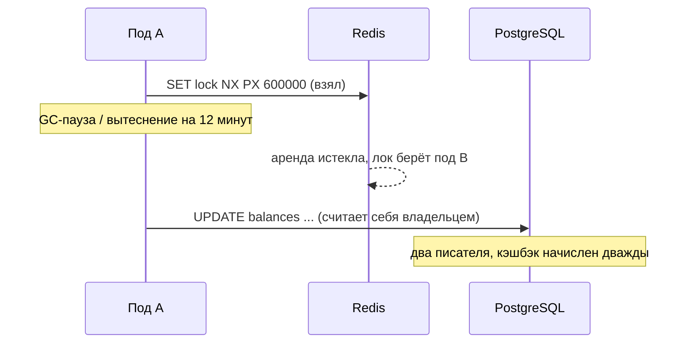
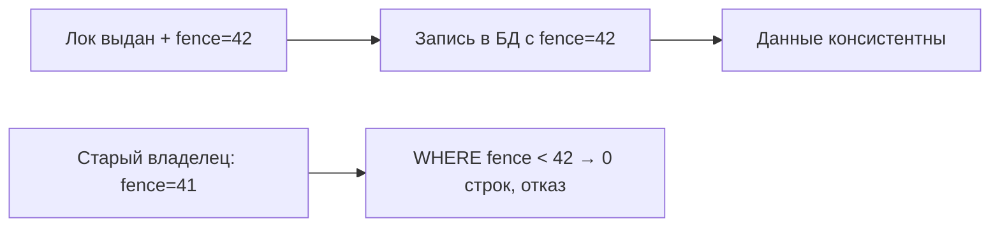

# Урок 01 — Распределённая блокировка, которая не врёт

Цель: пройти путь от наивного лока к честному ответу «взаимное исключение без fencing-токена
недоказуемо» — и научиться выбирать решение под цену ошибки.

## Разогрев

- Почему `DEL` при снятии лока — баг?
- Что не останавливает GC-пауза: процесс или TTL в Redis?
- Лок для эффективности и лок для корректности — в чём разница?

## Задача

Ночной джоб «начислить кэшбэк за месяц» запускается на 12 подах. Нужно, чтобы начисление
произошло **один раз**. Первая версия:

```text
if redis.SET("lock:cashback", "1", NX, EX=600) == OK {
    начислить кэшбэк всем пользователям   // 20 минут работы
    redis.DEL("lock:cashback")
}
```

Здесь три бага, и их надо уметь назвать сразу.

## Баг 1. Снятие чужого лока

Работа длится 20 минут, TTL — 10. Через 10 минут лок истекает, его берёт под B, а под A,
закончив, делает `DEL` — **снимает лок пода B**. Приходит под C, берёт лок и начисляет
кэшбэк третий раз.

Починка: случайный токен и атомарное снятие через Lua.

```text
token := uuid()
SET lock:cashback <token> NX PX 600000
# снятие:
if redis.call("GET", KEYS[1]) == ARGV[1] then return redis.call("DEL", KEYS[1]) end
```

## Баг 2. TTL меньше времени работы

Любой TTL — это ставка на то, что работа уложится. Не уложилась — лок уехал к другому.
Смягчение: **продление аренды** (watchdog): пока работа идёт, фоновая горутина каждые
`TTL/3` продлевает лок (`PEXPIRE` с проверкой токена). Если процесс умер — продлевать некому,
лок освободится сам.

```go
// Watchdog продлевает аренду, пока работа жива; ctx отменяется по завершении работы.
go func() {
    t := time.NewTicker(ttl / 3)
    defer t.Stop()
    for {
        select {
        case <-ctx.Done():
            return
        case <-t.C:
            if err := lock.Extend(ctx, ttl); err != nil {
                cancel() // не смогли продлить — обязаны прекратить работу, лок уже не наш
            }
        }
    }
}()
```

Ключевая строка — `cancel()`: не смог продлить, значит потерял право работать. Продолжать
«на всякий случай» — худшее, что можно сделать.

## Баг 3. Пауза процесса (неустранимый)

Даже с watchdog'ом остаётся сценарий:



Здесь никакой лок не спасёт: процесс не знает, что он «спал». Спасает только проверка на
стороне **данных** — fencing token.

## Решение: fencing token

Хранилище лока выдаёт монотонно растущий номер: в etcd это `revision` ключа, в Redis —
`INCR fence:cashback` при захвате. Номер передаётся в каждую запись, а получатель отвергает
устаревшее:

```sql
UPDATE cashback_runs
   SET fence = $1, status = 'running'
 WHERE period = $2
   AND fence < $1;     -- запись «проснувшегося» владельца с меньшим токеном не пройдёт
```

Проснувшийся под A придёт с токеном 41, а в строке уже 42 — его `UPDATE` затронет ноль строк,
и он обязан прекратить работу. Данные целы.



## А может, лок вообще не нужен?

Самый сильный ответ на интервью — переформулировать задачу так, чтобы взаимное исключение
обеспечивала **сама БД**:

```sql
-- Один запуск на период гарантирует уникальный индекс, а не лок.
INSERT INTO cashback_runs(period, started_at)
VALUES ('2026-09', now())
ON CONFLICT (period) DO NOTHING;   -- кто вставил строку, тот и работает
```

А для раздачи пользователей между подами — `SELECT ... FOR UPDATE SKIP LOCKED` пачками:
тогда 12 подов работают **параллельно**, не мешая друг другу, и никакой глобальный лок не
нужен вовсе. Плюс идемпотентность начисления (уникальный ключ `user_id + period`) делает
повтор безвредным по определению.

## Что выбрать: таблица решений

| Ситуация | Решение |
|---|---|
| Не хочется делать работу дважды, цена ошибки — CPU | Redis `SET NX PX` + токен + watchdog |
| Нельзя выполнить дважды, есть контроль над хранилищем | fencing token или уникальный ключ идемпотентности |
| Нужен настоящий лидер надолго (cron, компакция) | etcd lease + campaign, `revision` как fencing |
| Задачи можно раздать параллельно | `FOR UPDATE SKIP LOCKED`, лок не нужен |

## Mini-drill

```drill
type: multiple-choice
prompt: "Watchdog не смог продлить аренду лока. Что обязан сделать процесс?"
options: ["Продолжить работу: он уже почти закончил", "Немедленно прекратить работу — лок больше не его", "Взять лок заново и продолжить с того же места", "Проигнорировать: TTL всё равно большой"]
answer: "Немедленно прекратить работу — лок больше не его"
check: exact
```

```drill
type: fill-in
prompt: "Запись «проснувшегося» владельца отвергается условием WHERE fence ___ :token."
answer: "<"
check: exact
```

```drill
type: free-form
prompt: "Объясни вслух, почему уникальный индекс часто лучше распределённого лока."
answer: "Потому что лок — это внешнее соглашение, которое держится на предположениях: что TTL больше времени работы, что процесс не уснёт, что часы примерно совпадают. Уникальный индекс — это свойство самих данных, проверяемое атомарно в момент записи, и никакие паузы, разделения сети и рассинхроны часов его не обманут. Практически: вместо «взять лок и потом вставить» я делаю INSERT ... ON CONFLICT DO NOTHING по естественному ключу (период, user_id, event_id) — кто вставил, тот и выполняет, остальные видят конфликт и выходят. Меньше движущихся частей: нет Redis в критическом пути, нет watchdog'а, нет вопроса «а что если лок истёк». Лок остаётся полезен там, где нечего вставлять или где он нужен только для эффективности — например, чтобы двенадцать подов не считали один и тот же тяжёлый отчёт; там цена ошибки — лишний CPU, и TTL-лока достаточно."
check: manual
```

## Итог

Три бага наивного лока: снятие чужого (лечится токеном и Lua), TTL короче работы (лечится
watchdog'ом, который при неудаче **останавливает** работу) и пауза процесса (не лечится
локом вообще). Корректность даёт только проверка на стороне данных: fencing token или,
проще, уникальный ключ идемпотентности. И перед тем как брать лок, задай вопрос: можно ли
вместо взаимного исключения сделать операцию идемпотентной или раздать работу через
`SKIP LOCKED`?
