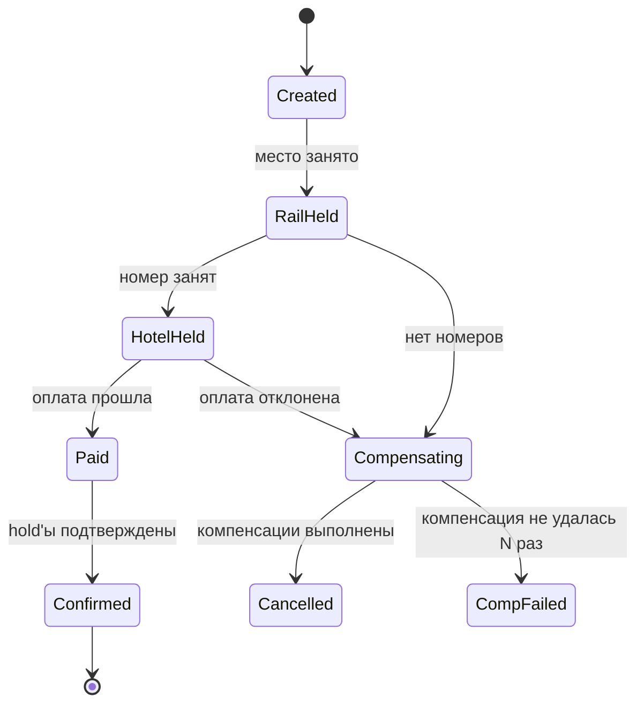
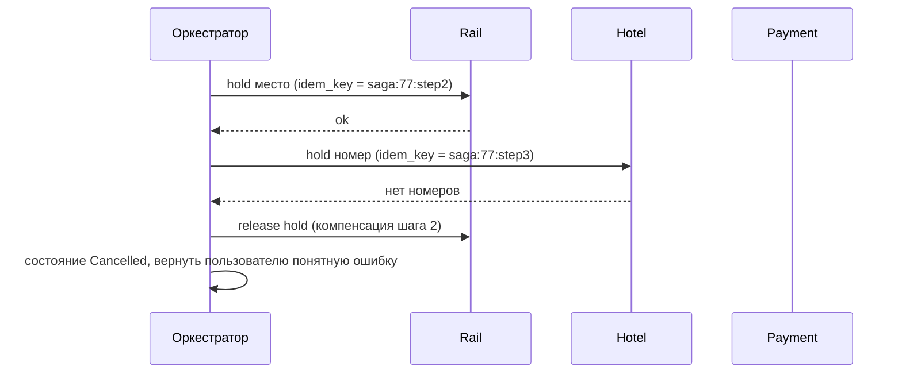

# Урок 02 — Saga для бронирования: шаги, компенсации, зависания

Цель: спроектировать сагу целиком — шаги, компенсации, состояния, таймауты — и не забыть
про самые неприятные вопросы: «а если компенсация упала?» и «а если шаг завис навсегда?».

## Разогрев

- Чем saga отличается от отката транзакции?
- Куда ставят неотменяемые шаги?
- Что такое семантическая блокировка?

## Задача

Бронирование поездки: место в поезде + отель + оплата + письмо с билетами. Четыре сервиса,
четыре базы. Нужна «всё или ничего» с точки зрения пользователя.

## Шаг 1. Разложить на локальные транзакции и компенсации

| # | Шаг | Сервис | Компенсация | Отменяем? |
|---|---|---|---|---|
| 1 | Создать бронь в статусе `pending` | Booking | пометить `cancelled` | да |
| 2 | Занять место в поезде (hold 15 мин) | Rail | снять hold | да |
| 3 | Занять номер в отеле (hold 15 мин) | Hotel | снять hold | да |
| 4 | Списать деньги | Payment | оформить возврат | да, но с задержкой и комиссией |
| 5 | Подтвердить hold'ы → `confirmed` | Rail + Hotel | — | нет |
| 6 | Отправить письмо с билетами | Notify | письмо об отмене | **нет** |

Два приёма из этой таблицы, которые надо уметь назвать:

- **Hold вместо занятия**: шаги 2 и 3 бронируют ресурс временно. Это делает компенсацию
  дешёвой и добавляет естественный дедлайн — если сага не завершилась за 15 минут, hold
  умирает сам.
- **Неотменяемое — в конец.** Письмо отправляется последним, когда всё остальное уже
  подтверждено. Деньги списываются после hold'ов, а не до: возврат дороже, чем снятие hold'а.

## Шаг 2. Оркестратор и состояния

Шагов шесть, есть ветвления и таймауты — берём **оркестрацию**. Оркестратор хранит запись
саги: `saga_id`, тип, состояние, текущий шаг, история переходов, данные для компенсаций.



Состояние саги — это **данные в БД оркестратора**, а не переменная в памяти: процесс может
умереть в любой момент, и после рестарта сага должна продолжиться с того же шага. Отсюда
требование: оркестратор хранит состояние и при старте подбирает «зависшие» саги.

## Шаг 3. Поток и компенсации



Правила, без которых сага развалится:

1. **Каждый шаг идемпотентен** по ключу `saga_id + номер шага`: повтор команды не занимает
   второе место и не списывает деньги дважды.
2. **Компенсации тоже идемпотентны**: «снять hold», который уже снят, возвращает `ok`.
3. **Компенсации в обратном порядке** — иначе можно вернуть деньги за бронь, которая всё ещё
   занимает место.
4. **Семантическая блокировка**: бронь в статусе `pending` не редактируется параллельными
   процессами, иначе компенсация будет неверной.

## Шаг 4. Самые злые вопросы

**«Шаг завис: Payment не отвечает вообще».** Таймаут на шаг (например, 30 с) + ретраи с
backoff. Но осторожно: таймаут вызова **не означает**, что деньги не списаны (см.
[`theory.md`](../theory.md), пять сценариев). Поэтому перед решением о компенсации оркестратор
**спрашивает статус** операции по своему ключу идемпотентности: «что с операцией
`saga:77:step4`?». Только получив ответ, решает — продолжать или компенсировать. Если статус
не удаётся выяснить, сага уходит в `needs_review` с алертом.

**«Компенсация упала».** Ретраи с backoff; после N попыток — состояние `compensation_failed`,
алерт, ручной разбор. Для денег дополнительно нужна периодическая **сверка** (reconciliation)
с провайдером: выгрузка его транзакций против наших, автоматическая починка расхождений или
задача оператору. Это не «на всякий случай» — расхождения возникают всегда.

**«Пользователь видит промежуточное состояние».** Да, видит: деньги списаны, бронь ещё
`pending`. Sagа даёт eventual consistency, а не изоляцию. Лечится честным UI («бронируем,
это займёт до минуты»), статусом брони и коротким временем жизни промежуточных состояний.

**«Почему не 2PC?»** Участники — четыре разных сервиса с HTTP API и внешним платёжным
провайдером; XA между ними невозможен, а блокировки на время двух фаз убили бы доступность.

## Шаг 5. Наблюдаемость саги

Метрики: число саг по состояниям, время выполнения саги (p50/p99), доля компенсаций, число
`compensation_failed` и `needs_review`, возраст самой старой незавершённой саги. Логи и трейсы
связываются по `saga_id`, он же кладётся в заголовки сообщений. Вопрос поддержки «где застряла
бронь №77123?» должен решаться одним запросом.

## Mini-drill

```drill
type: multiple-choice
prompt: "Payment вернул таймаут. Оркестратор должен сразу выполнить компенсацию?"
options: ["Да, таймаут означает неудачу", "Нет: сначала выяснить статус операции по ключу идемпотентности, потому что деньги могли быть списаны", "Да, и одновременно повторить платёж", "Нет, просто отменить сагу без компенсаций"]
answer: "Нет: сначала выяснить статус операции по ключу идемпотентности, потому что деньги могли быть списаны"
check: exact
```

```drill
type: fill-in
prompt: "Временное занятие ресурса на 15 минут вместо окончательного называется ___ и делает компенсацию дешёвой."
answer: "hold | резерв"
check: fuzzy
```

```drill
type: free-form
prompt: "Объясни вслух, почему письмо с билетами — последний шаг, и что делать, если оно всё-таки ушло преждевременно."
answer: "Письмо неотменяемо: отправленное сообщение нельзя изъять, компенсация — только второе письмо «извините, бронь отменена», что для пользователя выглядит как сбой. Поэтому все отменяемые шаги — hold'ы, оплата, подтверждение — идут раньше, и письмо отправляется, когда сага уже фактически завершена. Если письмо всё-таки ушло преждевременно, ситуация переходит из технической в продуктовую: отправляем корректирующее письмо с извинением и объяснением, гарантированно выполняем возврат, при необходимости — компенсацию клиенту. Технически же это повод пересмотреть порядок шагов и проверить, что нотификация публикуется по факту состояния Confirmed, а не по факту начала процесса. И общий принцип, который я озвучиваю: любой шаг с внешним видимым эффектом ставится максимально поздно, потому что цена ошибки в нём не откатывается кодом."
check: manual
```

```drill
type: free-form
prompt: "Набросай вслух схему таблицы саги в оркестраторе и объясни, зачем каждое поле."
answer: "Таблица sagas: saga_id (UUID v7, он же сортируем по времени), type (booking), state (created, rail_held, hotel_held, paid, confirmed, compensating, cancelled, comp_failed, needs_review), current_step (номер), payload (JSONB с данными, нужными шагам и компенсациям: id брони, id платежа, суммы), created_at и updated_at, next_attempt_at (для ретраев с backoff), attempts (счётчик попыток текущего шага), last_error. Отдельная таблица saga_steps с историей переходов: saga_id, step, status, idem_key, request, response, at — она нужна поддержке и для идемпотентности повторов. Зачем: состояние хранится в БД, потому что процесс может умереть в любой момент и после рестарта сага обязана продолжиться, а не потеряться; next_attempt_at позволяет одному фоновому воркеру подбирать зависшие саги через SELECT ... FOR UPDATE SKIP LOCKED; attempts даёт правило перехода в comp_failed; payload делает шаги независимыми от внешних чтений. Индексы: по state и next_attempt_at для подбора, по saga_id для поддержки."
check: manual
```

## Итог

Saga проектируется таблицей «шаг → компенсация → отменяемость», а не наитием. Дешёвые
компенсации получаются из hold'ов с собственным TTL; неотменяемые шаги ставятся последними;
состояние живёт в БД оркестратора, чтобы пережить рестарт. Все шаги и компенсации
идемпотентны по `saga_id + шаг`. И два вопроса, которые надо уметь отвечать не задумываясь:
таймаут шага — это «не знаю», поэтому сначала выясняем статус; упавшая компенсация — это
`compensation_failed`, алерт и сверка.
