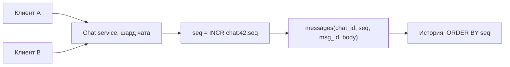

# Урок 03 — ID и порядок сообщений в мессенджере

Цель: на маленькой, но очень типичной задаче связать три темы модуля — время, порядок и
генерацию идентификаторов — и научиться защищать выбор ID числами.

## Разогрев

- Почему нельзя сортировать сообщения по `created_at` с клиентов?
- Чем UUID v7 лучше UUID v4 для первичного ключа?
- Из чего состоит Snowflake ID?

## Задача

Мессенджер: 50 млн сообщений в сутки, пик 3000 сообщений/с, чаты до 100 000 участников.
Нужно: показать историю чата в правильном порядке, листать её постранично, поддерживать
доставку с телефонов с кривыми часами и оффлайн-отправку.

## Шаг 1. Что вообще значит «правильный порядок»

Три разных порядка, которые новички смешивают:

1. **Порядок отправителя** — когда пользователь нажал «отправить» (часы клиента, врут).
2. **Порядок сервера** — когда сообщение принято сервером (единая точка отсчёта, но у
   разных серверов часы тоже расходятся на десятки миллисекунд).
3. **Причинный порядок** — «это ответ на то сообщение». Только он по-настоящему важен
   пользователю, и он не выводится из timestamp'ов.

Практическое решение, которое принимают в реальных мессенджерах: порядок определяет
**сервер**, и он задаётся не временем, а **монотонным идентификатором в пределах чата**.
Клиентский timestamp хранится как метаданные и показывается, но не сортирует.

## Шаг 2. Кандидаты на ID сообщения

| Схема | Плюс для этой задачи | Минус |
|---|---|---|
| Auto-increment глобальный | идеальный порядок и компактность | одна БД на 3000 записей/с — узкое место, при шардинге ломается |
| Последовательность **на чат** | естественный порядок внутри чата, маленькие числа | нужна координация на чат (строка-счётчик), горячие чаты дают конкуренцию |
| UUID v4 | генерируется где угодно | не сортируем, портит B-tree, пагинация по ключу невозможна |
| **UUID v7** | сортируем по времени, децентрализован, 16 байт | видно время создания; разрешение — миллисекунда |
| **Snowflake** | 8 байт, сортируем, 4096 ID/мс/узел | нужен worker id и монотонные часы |

Для 3000 msg/с оба разумных варианта работают: UUID v7 не требует никакой инфраструктуры,
Snowflake экономит 8 байт на строке и удобен как курсор. Прикинем экономию:

```text
50 млн сообщений/сутки * 365 = 18.25 млрд в год
разница 8 байт на ID: 18.25e9 * 8 байт ≈ 146 ГБ в год только на ключ
плюс индексы, где ключ дублируется: ×2–3
```

Вот теперь «UUID v7 против Snowflake» — не вкусовщина, а разговор про сотни гигабайт. Ответ
на интервью: **UUID v7 по умолчанию, Snowflake — если объёмы такие, как здесь, и мы готовы
раздавать worker id через etcd**.

## Шаг 3. Порядок внутри чата

Даже сортируемый ID не гарантирует порядок между двумя серверами, чьи часы разошлись на 5 мс.
Поэтому в мессенджерах порядок делают явным:



`seq` — счётчик на чат: строго монотонный, маленький, идеально ложится в составной первичный
ключ `(chat_id, seq)`. Требование: все сообщения одного чата обрабатываются **одним**
владельцем — шардом или партицией по `chat_id` (тот же приём, что ключ партиции в модуле
[`05-queues-and-async`](../../05-queues-and-async/index.md)). Тогда счётчик не требует
распределённого консенсуса — он локален для владельца чата.

## Шаг 4. Пагинация

Смертный грех — `LIMIT 50 OFFSET 10000`: база честно читает и выбрасывает 10 000 строк, а при
вставке новых сообщений страницы «съезжают». Правильно — **keyset (cursor) пагинация**:

```sql
SELECT chat_id, seq, msg_id, body
  FROM messages
 WHERE chat_id = $1 AND seq < $2      -- $2 — курсор: seq последнего показанного
 ORDER BY seq DESC
 LIMIT 50;
```

Именно ради этого нужен сортируемый ключ: курсор — это последний `seq` (или ID), а не номер
страницы. Работает при любом объёме и не ломается при вставках.

## Шаг 5. Идемпотентность отправки

Телефон отправил сообщение, потерял сеть, не дождался ответа и повторил. Классические пять
сценариев из [`theory.md`](../theory.md). Решение — **client_msg_id**: клиент генерирует UUID
для каждого сообщения и отправляет его вместе с текстом.

```sql
INSERT INTO messages (chat_id, seq, msg_id, client_msg_id, body)
VALUES ($1, $2, $3, $4, $5)
ON CONFLICT (chat_id, client_msg_id) DO NOTHING
RETURNING seq, msg_id;   -- пусто => дубль, читаем существующую запись и возвращаем её
```

Уникальный индекс `(chat_id, client_msg_id)` превращает «повторить отправку» в безопасную
операцию: дубликат не создаст второе сообщение, а клиент получит тот же `seq`, что и в первый
раз. Это тот самый ключ идемпотентности, только сгенерированный клиентом.

Отдельно: оффлайн-отправка. Сообщение, отправленное час назад с самолёта, придёт с
клиентским временем в прошлом, но получит **текущий** `seq`. Показывать его надо там, где
оно пришло по `seq`, с пометкой «отправлено час назад» — иначе история будет переписываться
задним числом, и пользователи будут видеть, как в старом месте появляется новое сообщение.

## Mini-drill

```drill
type: multiple-choice
prompt: "Что использовать как курсор пагинации истории чата?"
options: ["Номер страницы и OFFSET", "seq последнего показанного сообщения", "created_at с клиента", "Случайный UUID v4 сообщения"]
answer: "seq последнего показанного сообщения"
check: exact
hint: "OFFSET читает и выбрасывает строки, а страницы съезжают при вставках."
```

```drill
type: fill-in
prompt: "Чтобы повторная отправка с телефона не создала дубль, клиент генерирует ___ и на него ставится уникальный индекс."
answer: "client_msg_id | ключ идемпотентности"
check: fuzzy
```

```drill
type: free-form
prompt: "Обоснуй вслух выбор между UUID v7 и Snowflake для 50 млн сообщений в сутки."
answer: "Оба сортируемы по времени и оба генерируются без похода в центральную БД, поэтому вопрос сводится к размеру и инфраструктуре. UUID v7 — 16 байт, никакой координации не нужно вообще: любой под может выдать ID, и это самая простая эксплуатация. Snowflake — 8 байт, но требует уникального worker id на каждый процесс, обычно из etcd, и зависит от монотонности часов: перевод времени назад ломает генерацию, поэтому нужна защита. Считаю экономию: 50 млн в сутки — это 18 млрд строк в год, разница в 8 байт на ключ даёт примерно 146 ГБ в год только на само поле, а с учётом того, что первичный ключ дублируется во вторичных индексах, реально в два-три раза больше. При таких объёмах Snowflake оправдан. Если бы речь шла о миллионе сообщений в сутки, я бы без раздумий взял UUID v7 и не заводил ещё одну зависимость. И в обоих случаях порядок внутри чата я всё равно задаю отдельным seq, потому что сортируемость ID по времени не гарантирует порядок между серверами с разбежавшимися часами."
check: manual
```

```drill
type: free-form
prompt: "Интервьюер: «Сообщения в чате иногда показываются не в том порядке». Разбери причины вслух."
answer: "Сначала уточняю, где именно перепутан порядок: у одного пользователя, у всех, только при догрузке истории. Основные причины по частоте. Первая: сортировка по времени клиента — часы телефонов расходятся на секунды, и любое сообщение может встать не туда; лечится тем, что порядок определяет сервер, а клиентское время только отображается. Вторая: сортировка по серверному timestamp при нескольких серверах — их часы расходятся на десятки миллисекунд, чего достаточно для перестановки быстрых сообщений; лечится монотонным seq на чат, который выдаёт единственный владелец чата — шард или партиция по chat_id. Третья: параллельная обработка сообщений одного чата пулом воркеров — порядок ломается уже после получения; лечится параллелизмом по ключу чата, а не по сообщениям. Четвёртая: пагинация через OFFSET, из-за которой при вставках страницы съезжают и сообщения дублируются или пропадают; лечится keyset-пагинацией по seq. Пятая: оффлайн-отправка, когда сообщение с прошлым клиентским временем получает текущий seq — здесь порядок формально верный, а ощущение странное, поэтому нужен UI-маркер «отправлено час назад»."
check: manual
```

## Итог

Порядок в распределённой системе не берётся из часов — он назначается. В мессенджере это
`seq` на чат, выдаваемый единственным владельцем чата, плюс сортируемый ID сообщения
(UUID v7 по умолчанию, Snowflake при больших объёмах — и разница в 8 байт превращается в
сотни гигабайт в год). Пагинация — по курсору, а не по `OFFSET`. Повторная отправка
обезвреживается уникальным `client_msg_id`. И честная оговорка: клиентское время показываем,
но не сортируем по нему.
