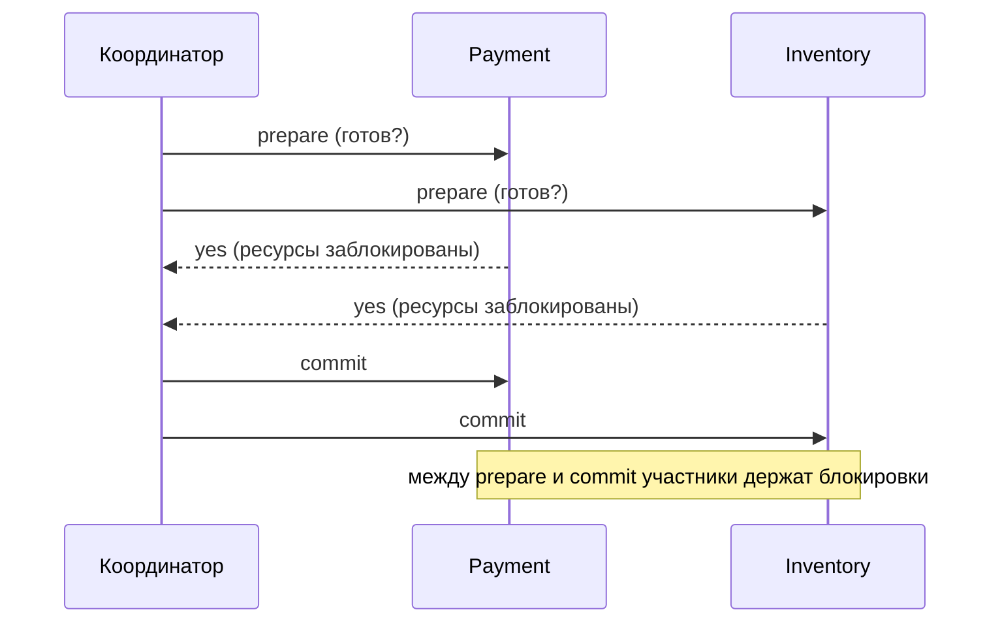
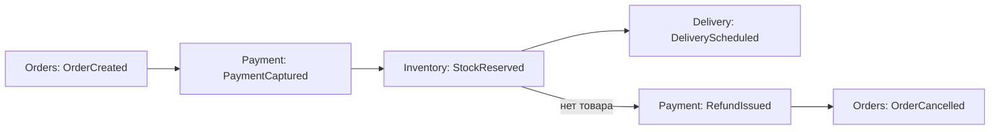
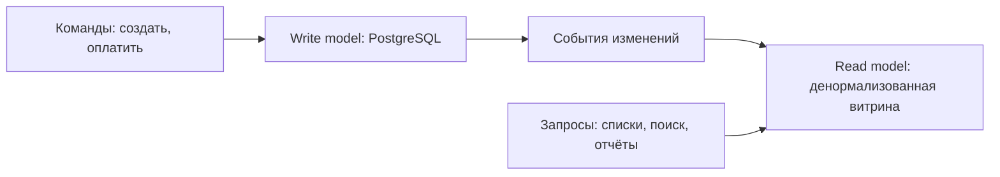

# Распределённые транзакции, saga и ID

Вторая часть модуля. Первая — отказы, время, консенсус, блокировки — в
[`theory.md`](./theory.md).

## Проблема: транзакция, которая не помещается в одну БД

В одной базе всё просто: `BEGIN … COMMIT`, и мы получаем атомарность бесплатно. Но бизнес-
операция часто затрагивает **несколько сервисов с разными базами**: списать деньги (Payment),
зарезервировать товар (Inventory), создать заказ (Orders), начислить бонусы (Loyalty).

Простыми словами: нужно, чтобы либо все четыре шага случились, либо ни одного. А общего
`COMMIT` над четырьмя базами нет.

## 2PC: почему его знают, но не любят

**Two-phase commit (двухфазный коммит)** — классический протокол с координатором:

Фаза 1 — «приготовиться»: каждый участник блокирует ресурсы и обещает, что сможет
зафиксировать. Фаза 2 — «фиксируем» или «откатываем» по решению координатора.

Почему избегают:

- **Блокирующий протокол.** Участник, ответивший `yes`, обязан ждать решения координатора,
  держа блокировки. Координатор умер между фазами — участники висят «in doubt» неопределённо
  долго; ручной разбор.
- **Координатор — SPOF** (лечится репликацией через консенсус, но это ещё сложность).
- **Латентность и связность.** Два round-trip'а плюс синхронные записи журналов у всех;
  доступность операции = произведение доступностей всех участников.
- **Мало кто поддерживает.** XA есть в некоторых СУБД и брокерах, но между HTTP-сервисами,
  Kafka и внешними API это просто неприменимо.

Вывод для интервью: 2PC — не «плохо», а «дорого и хрупко»; уместен внутри одной
инфраструктуры (например, между двумя схемами одной СУБД). Между сервисами используют saga.

## Saga: длинная транзакция из локальных шагов

**Saga** простыми словами: разбить большую транзакцию на последовательность **локальных**
транзакций, каждая из которых фиксируется сразу. Если шаг N провалился, выполняем
**компенсации** для уже сделанных шагов — не «откат», а обратные бизнес-действия.

Ключевое отличие от 2PC: **промежуточные состояния видны**. Деньги на секунду списаны, а
заказ ещё не создан. Это осознанный размен атомарности на доступность и слабую связность.

### Хореография (choreography)

Каждый сервис слушает события и публикует свои. Центрального управляющего нет.

Плюсы: нет единой точки, сервисы независимы, легко добавить нового слушателя. Минусы: логику
процесса **никто не видит целиком** — она размазана по шести сервисам; циклы и гонки трудно
отлаживать; «а на каком шаге застрял заказ №77123?» — вопрос без простого ответа.

### Оркестрация (orchestration)

Есть **оркестратор** (saga-координатор), который хранит состояние процесса и по очереди
командует участниками: «спиши деньги» → «зарезервируй» → «запланируй доставку», а при
провале выполняет компенсации в обратном порядке.

Плюсы: процесс виден в одном месте, состояние явное (можно показать в админке), проще
тестировать и менять. Минусы: оркестратор — дополнительный сервис, который надо делать
отказоустойчивым и не превращать в «монолит-божество».

Практическое правило: 2–3 шага — хореография; 4+ шагов, ветвления, таймауты, ручные
подтверждения — оркестрация.

### Требования к шагам saga

- **Идемпотентность.** Любой шаг может прийти дважды (at-least-once) — нужны ключи операций.
- **Компенсируемость.** Для каждого шага должно существовать обратное действие. Причём
  бизнес-обратное: не «удалить платёж», а «сделать возврат»; не «стереть письмо», а «отправить
  письмо об отмене» (некоторые действия неотменяемы — их ставят **последними**).
- **Порядок компенсаций** — обратный порядку шагов.
- **Семантическая блокировка.** Пока saga идёт, сущность помечается «в процессе»
  (`status = pending`), чтобы её не трогали параллельные процессы.
- **Таймауты на шаг** и явная обработка «шаг завис»: повтор, компенсация или эскалация человеку.
- **Наблюдаемость**: `saga_id`, состояние, история переходов. Без этого поддержка невозможна.

Важная честность на интервью: saga даёт **eventual consistency**, а не изоляцию. Между шагами
другой процесс может увидеть промежуточное состояние. Если бизнес этого не терпит —
пересматривай границы сервисов: возможно, эти данные должны жить в одной БД и одной
транзакции. Хороший ответ звучит так: «сначала я пытаюсь не делать распределённую транзакцию
вовсе — правильными границами; saga — это цена за то, что границы уже проведены».

## CQRS и event sourcing: когда полезно, когда перебор

**CQRS (Command Query Responsibility Segregation)** простыми словами: разделить модель для
**записи** и модель для **чтения**. Пишем в нормализованные таблицы, читаем из отдельного
хранилища/проекции, заточенной под запросы (денормализованная витрина, Elasticsearch,
материализованное представление).

Зачем: читающая нагрузка обычно на порядок больше пишущей и имеет другие требования (сложный
поиск, агрегаты, скорость). Цена: **проекции отстают** (eventual consistency — пользователь
может не увидеть только что созданный объект), больше кода, больше движущихся частей.

**Event sourcing** — более радикально: хранить не текущее состояние, а **последовательность
событий**, из которых оно выводится. Состояние = свёртка (fold) всех событий. Плюсы: полная
история и аудит «из коробки», возможность построить любую новую проекцию задним числом,
временны́е запросы («как было на 1 января»). Минусы: сложность, эволюция схемы событий,
снапшоты для скорости, «удалить данные пользователя» превращается в проблему (GDPR), и
любой запрос вне проекции неудобен.

Когда действительно уместно: финансы и ledger (там журнал операций — естественная модель),
аудит, системы с длинными бизнес-процессами. Когда перебор: CRUD-сервис, где нужен просто
список сущностей, — event sourcing удвоит сложность без выгоды.

CQRS и event sourcing **не** обязаны идти вместе: CQRS без event sourcing — обычная практика
(и вполне достаточная в 90 % случаев).

## Генерация уникальных ID

Задача звучит скучно, но встречается почти в каждом дизайне: нужен идентификатор сообщения,
заказа, файла. Критерии выбора: уникальность, **сортируемость по времени** (важна для
пагинации, индексов и порядка), размер, необходимость **координации** между узлами, и
случайно ли утекает информация (по последовательному ID видно объём бизнеса).

| Схема | Размер | Сортируем | Координация | Плюсы | Минусы |
|---|---|---|---|---|---|
| Auto-increment (SEQUENCE) | 8 байт | да | БД — единая точка | просто, компактно, идеален для индекса | не работает при шардинге, утечка объёмов, узкое место записи |
| UUID v4 (случайный) | 16 байт | **нет** | не нужна | генерируется где угодно, конфликтов практически нет | случайные вставки распухляют B-tree, плохая локальность, 36 символов в текстовом виде |
| **UUID v7** (time-ordered) | 16 байт | да (по времени, мс) | не нужна | сортируемость + децентрализация; стандартизован в RFC 9562 (2024) | видно время создания; чуть больше auto-increment |
| Snowflake (Twitter) | 8 байт | да | нужен уникальный ID узла | компактный, сортируемый, ~4096 ID/мс на узел | зависит от часов (перевод назад — беда), нужна раздача worker id |
| Ticket server (отдельная служба) | любой | да | сетевой вызов | централизованный контроль | ещё один сервис и SPOF, +латентность |
| ULID | 16 байт | да | не нужна | как UUID v7, текстовый вид короче и сортируем | менее стандартен, чем UUID v7 |

Устройство **Snowflake** полезно уметь нарисовать: 64 бита = 1 знаковый бит + 41 бит времени
в миллисекундах (хватает на ~69 лет от своей эпохи) + 10 бит идентификатора узла (1024 узла)
+ 12 бит счётчика внутри миллисекунды (4096 ID/мс/узел). Отсюда сразу видны ограничения:
конечное число узлов, зависимость от монотонности часов, необходимость выдавать worker id
(обычно через etcd/ZooKeeper).

Практический совет для интервью-ответа: **по умолчанию UUID v7** — децентрализованно,
сортируемо, дружелюбно к индексам; **auto-increment** — пока одна БД и не жалко утечки
порядковых номеров; **Snowflake** — когда нужен компактный 64-битный сортируемый ID при
большом потоке (лента, мессенджер); **ticket server** — редко, обычно как костыль совместимости.

Отдельный вопрос — **короткие публичные ID** (например, для URL shortener): там нужны не
UUID, а короткие строки в base62, и решается это либо счётчиком с кодированием, либо хешем с
проверкой коллизий. Это разбирается в модуле 10 на конкретной задаче.

## Миф exactly-once и ключи идемпотентности

Возвращаемся к тому, с чего начали часть 1: раз ответ может потеряться, повтор неизбежен.
Поэтому «ровно один раз» в распределённой системе достигается не доставкой, а **дедупликацией
эффекта**:

- Клиент генерирует **ключ идемпотентности** (`Idempotency-Key`) и присылает его с запросом.
- Сервер в **одной транзакции** проверяет ключ и применяет эффект:
  `INSERT INTO idempotency(key, response) … ON CONFLICT DO NOTHING`; если конфликт — возвращает
  **сохранённый прошлый ответ**, а не выполняет операцию заново.
- Ключи живут ограниченное время (сутки-неделя) и чистятся.

Так работают платёжные API (Stripe и другие) — и это ровно тот ответ, который ждут на
вопрос «а если клиент нажал Оплатить дважды?». Детали и связь с брокерами — в модуле
[`05-queues-and-async`](../05-queues-and-async/index.md).

Полезно проговорить и границу: если внешняя система **не** поддерживает ключи идемпотентности
(например, SMTP), гарантировать «ровно одно письмо» нельзя. Тогда честный ответ —
«минимизируем вероятность дубля и делаем его безвредным», а не «у нас exactly-once».

## Как это спрашивают на собеседовании

**«Как сделать транзакцию через три сервиса?»** Слабый ответ: «2PC». Сильный: «Сначала
спрошу, обязана ли операция быть атомарной — часто границы сервисов проведены неудачно, и
правильный ход в том, чтобы эти данные жили в одной БД. Если границы фиксированы — saga из
локальных транзакций с компенсациями; при 4+ шагах — оркестратор с явным состоянием. 2PC не
беру: блокирующий протокол, координатор — SPOF, участники висят in-doubt».

**«Хореография или оркестрация?»** Ожидают критерий: число шагов, потребность видеть
состояние процесса, ветвления и таймауты.

**«Что делать, если компенсация тоже упала?»** Хороший вопрос-ловушка. Ответ: компенсации
идемпотентны и ретраятся; если не проходят N раз — сага уходит в состояние
`compensation_failed`, алерт и ручной разбор; для денег обязательна сверка (reconciliation)
с внешней системой.

**«Какой ID выберете для сообщений мессенджера?»** Ожидают: сортируемость по времени
(для пагинации и порядка), децентрализованность, размер. UUID v7 или Snowflake, с
обоснованием, и понимание, почему UUID v4 портит индекс.

**«Что такое CQRS и нужен ли он вам?»** Сильный ответ включает «нет» как допустимый вариант:
CQRS оправдан при сильном перекосе чтение/запись и разных моделях доступа; event sourcing —
при требовании полного аудита; иначе это лишняя сложность.

**«Пользователь дважды нажал Оплатить.»** Ключ идемпотентности от клиента, проверка и эффект
в одной транзакции, сохранённый ответ на повтор.

## Типичные ошибки и заблуждения

- **Ставить 2PC по привычке** и не называть его цену (блокировки, in-doubt, SPOF).
- **Считать saga «распределённой транзакцией с откатом».** Отката нет — есть компенсирующие
  бизнес-действия, а промежуточные состояния видны.
- **Забывать про неотменяемые шаги** (письмо, физическая отгрузка): их ставят в конец.
- **Хореография на восемь шагов** — процесс перестаёт быть понятным кому-либо.
- **Нет `saga_id` и состояния** — поддержка не может ответить, где застрял заказ.
- **CQRS/event sourcing ради архитектурной красоты** в обычном CRUD.
- **Ожидание, что проекция обновится мгновенно**: пользователь создал объект и не видит его
  в списке — типичный баг CQRS, лечится чтением своей записи из write-модели или явным UI.
- **UUID v4 как первичный ключ** в большой таблице: случайные вставки бьют по B-tree и кэшу;
  для сортируемости берут UUID v7.
- **Snowflake без учёта часов**: перевод часов назад ломает монотонность и даёт дубликаты.
- **«У нас exactly-once»** без ключей идемпотентности и без разговора про внешние эффекты.

## Глоссарий

- **2PC (two-phase commit)** — протокол атомарного коммита с координатором; блокирующий.
- **In-doubt** — состояние участника 2PC, ждущего решения умершего координатора.
- **Saga** — последовательность локальных транзакций с компенсациями.
- **Компенсация** — обратное бизнес-действие (возврат средств, снятие резерва).
- **Хореография / оркестрация** — сага на событиях без центра / сага с координатором.
- **Семантическая блокировка** — пометка сущности «в процессе» на время саги.
- **CQRS** — разделение моделей чтения и записи.
- **Event sourcing** — хранение последовательности событий вместо текущего состояния.
- **Проекция (read model)** — производное хранилище, оптимизированное под чтение.
- **UUID v4 / v7** — случайный / упорядоченный по времени идентификатор (RFC 9562).
- **Snowflake** — 64-битный ID: время + номер узла + счётчик.
- **Ticket server** — централизованная выдача идентификаторов.
- **Ключ идемпотентности** — идентификатор операции, по которому распознаётся повтор.
- **Reconciliation (сверка)** — регулярное сравнение состояний двух систем и починка расхождений.

## См. также

- Martin Kleppmann, «Designing Data-Intensive Applications» (2017) — гл. 7 (транзакции,
  атомарный коммит, 2PC), гл. 9 (консенсус), гл. 11 (потоки и производные данные).
- Chris Richardson, microservices.io — паттерны «Saga», «Orchestration-based saga»,
  «Choreography-based saga», «Transactional Outbox», «CQRS», «Event Sourcing»; книга
  «Microservices Patterns» (Manning, 2018).
- Martin Fowler, martinfowler.com — эссе «CQRS», «Event Sourcing», «What do you mean by
  Event-Driven?».
- Hector Garcia-Molina, Kenneth Salem, «Sagas», ACM SIGMOD 1987 — первоисточник термина.
- RFC 9562 «Universally Unique IDentifiers (UUIDs)» (2024) — версии 4 и 7.
- Twitter Engineering, «Announcing Snowflake» (2010) и репозиторий github.com/twitter-archive/snowflake.
- Stripe API docs — идемпотентные запросы (`Idempotency-Key`).
- Начало модуля: [`theory.md`](./theory.md).
- Уроки: [`lessons/01-safe-distributed-lock.md`](./lessons/01-safe-distributed-lock.md),
  [`lessons/02-saga-for-booking.md`](./lessons/02-saga-for-booking.md),
  [`lessons/03-id-generation-for-messenger.md`](./lessons/03-id-generation-for-messenger.md).
