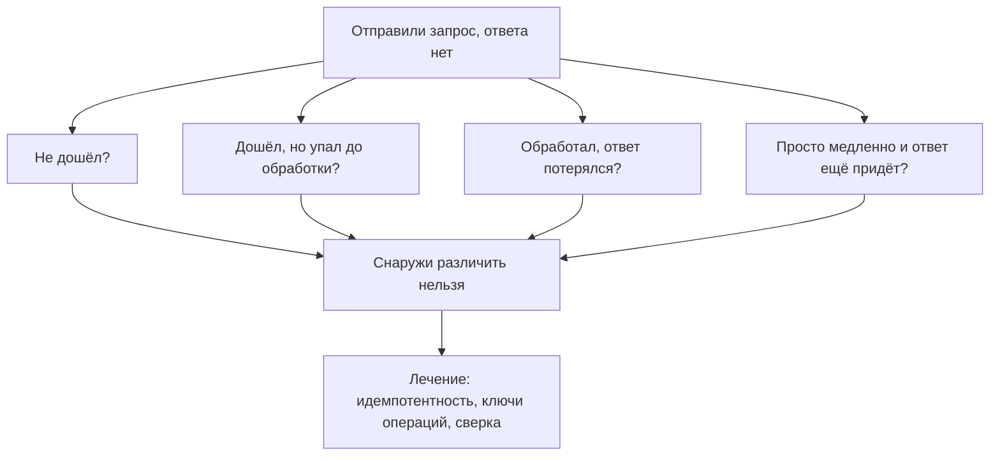
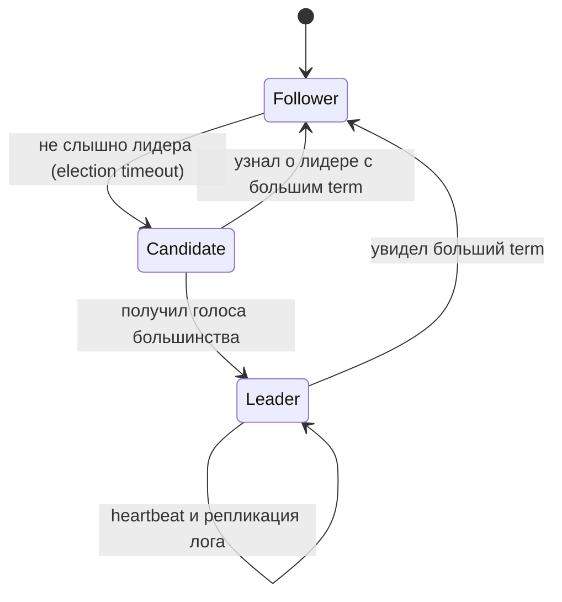
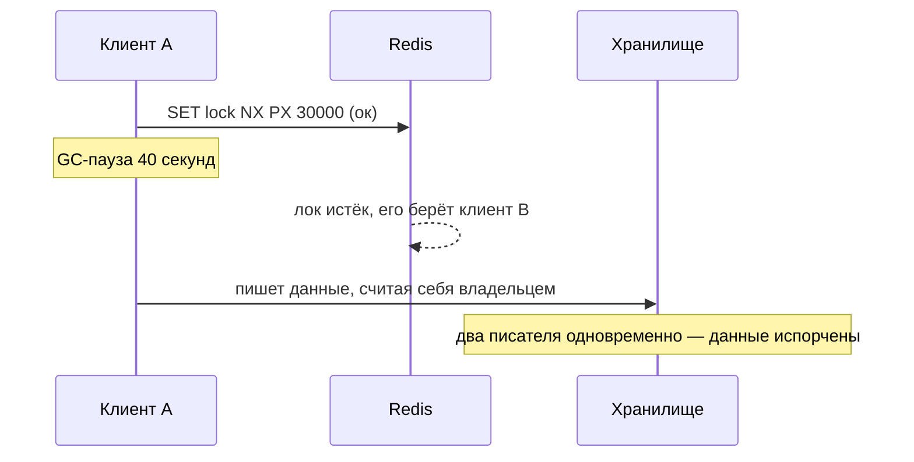

# Почему распределённое — это трудно

Первая часть модуля: отказы, сеть, время, консенсус и блокировки. Вторая — транзакции,
saga, CQRS и генерация ID — в
[`theory-2-transactions-and-ids.md`](./theory-2-transactions-and-ids.md).

## Простыми словами: частичный отказ

На одной машине всё просто: либо программа работает, либо упала. Функция либо вернула
значение, либо не вернула — третьего нет.

В распределённой системе появляется **третье состояние: «не знаю»**. Ты отправил запрос по
сети и не получил ответ. Что произошло?

1. Запрос не дошёл до получателя.
2. Дошёл, получатель умер до обработки.
3. Дошёл, обработал, но умер до отправки ответа (**операция выполнена!**).
4. Дошёл, обработал, ответ отправил, но ответ потерялся в сети (**операция выполнена!**).
5. Всё живо, просто медленно, и ответ придёт через 10 секунд.

**Отличить эти случаи снаружи невозможно.** Ни один таймаут не скажет тебе, выполнилась
операция или нет. Это и есть **частичный отказ** — фундамент всех сложностей. Отсюда растут:
идемпотентность (чтобы можно было безопасно повторить), ключи операций, компенсации и
сверки.



Аналогия: ты отправил письмо с просьбой перевести деньги и не получил ответа. Отправлять
второе письмо страшно (вдруг переведут дважды), не отправлять — тоже (вдруг не перевели).
Решение взрослых: указать в письме номер операции — «перевод №77123», чтобы повтор был
безопасен.

## Сеть: восемь заблуждений

Классический список «Fallacies of Distributed Computing» (Peter Deutsch и коллеги из Sun,
1994–1997), который стоит держать в голове: сеть надёжна; задержка нулевая; пропускная
способность бесконечна; сеть безопасна; топология не меняется; администратор один; стоимость
передачи нулевая; сеть однородна. Каждое из этих утверждений ложно, и каждое ломает
наивный дизайн.

Практический минимум:

- **Пакеты теряются, дублируются и приходят с задержкой**, TCP это маскирует, но не убирает.
- **Сетевое разделение (network partition)** — часть узлов не видит другую часть, при этом
  обе живы и продолжают работать. Не «сеть упала», а «сеть разрезана».
- **Таймаут — это догадка.** Слишком короткий — объявим живого мёртвым (false positive) и
  начнём failover без нужды; слишком длинный — будем ждать мертвеца.
- **Latency numbers**: внутри ДЦ ~0.5 мс, между зонами 1–2 мс, между регионами 30–150 мс.
  Эти числа диктуют, что можно делать синхронно, а что нельзя.

## Время: часам верить нельзя

**Wall clock (календарное время)** — `time.Now()`: показывает «который час». Синхронизируется
по NTP, а значит может **прыгнуть назад или вперёд** при коррекции. Дрейф кварцевого
генератора — порядка 10–100 ppm, то есть до нескольких секунд в сутки без синхронизации.

**Monotonic clock (монотонные часы)** — считает только вперёд, от старта машины, не прыгает.
Именно им нужно мерить длительности. В Go это встроено: `time.Now()` содержит и wall, и
monotonic компоненту, и `time.Since(start)` использует монотонную — а вот
`t2.Sub(t1)` для времён, полученных из БД или JSON, монотонности лишён.

Что из этого следует для дизайна:

- **Нельзя упорядочивать события в распределённой системе по timestamp'ам разных машин.**
  Разница часов в 50 мс легко переставит местами «создан» и «оплачен».
- **Нельзя строить блокировки на «истечёт в 12:00:05»**: у держателя лока и у хранилища часы
  разные.
- Исключение — системы с ограниченной неопределённостью часов (Google Spanner и его
  TrueTime с атомными часами и GPS), где API возвращает **интервал** вместо точки и система
  честно ждёт этот интервал. Это дорогая инфраструктура, а не `NTP на серверах`.

Как упорядочивать без часов:

- **Логические часы Лэмпорта**: у каждого узла счётчик; при событии — увеличиваем; при
  отправке сообщения — прикладываем счётчик; при получении — берём `max(свой, чужой) + 1`.
  Даёт свойство «если A повлияло на B, то счётчик A меньше». Обратное **не** верно: равные
  или соседние номера не означают причинной связи.
- **Векторные часы**: вектор счётчиков по узлам. Позволяют отличить «A раньше B» от «A и B
  конкурентны» — то есть обнаружить конфликт (так делает Dynamo и его наследники). Цена —
  размер вектора растёт с числом узлов.
- Практический вывод: если нужен порядок — задавай его явно (`version`, последовательность в
  партиции, монотонный ID), а не надейся на `created_at`.

## Две армии и FLP: чего нельзя

Две интуиции без доказательств, но с правильными выводами.

**Задача двух генералов**: две армии на холмах, договориться об атаке можно только гонцами
через долину, гонца могут перехватить. Доказано: **гарантированного соглашения достичь
нельзя** — всегда нужно ещё одно подтверждение подтверждения. Вывод для инженера: нельзя
атомарно согласовать действие с внешней системой по ненадёжному каналу. Именно поэтому
«записать в БД и опубликовать в Kafka атомарно» невозможно, и появляется outbox (см. модуль
[`05-queues-and-async`](../05-queues-and-async/index.md)).

**FLP (Fischer, Lynch, Paterson, 1985)**: в асинхронной системе, где хотя бы один узел может
упасть, нет детерминированного алгоритма консенсуса, который **гарантированно** завершится.
Практический вывод не «консенсус невозможен», а «алгоритмы вроде Raft жертвуют гарантией
времени завершения ради корректности»: они всегда безопасны (не примут два разных решения),
но при неудачном стечении обстоятельств могут задержаться с выбором лидера. На практике
рандомизированные таймауты делают такие задержки исчезающе редкими.

## Консенсус и Raft простыми словами

**Консенсус** — задача: несколько узлов должны договориться об **одном** значении (или об
одной последовательности решений), даже если часть узлов падает, а сообщения теряются. Из
консенсуса делаются: выбор лидера, реплицированный лог, распределённые блокировки,
конфигурация кластера, регистрация сервисов.

**Raft** — алгоритм консенсуса, специально придуманный, чтобы его можно было понять (Ongaro
& Ousterhout, 2014). Три идеи:

1. **Лидер.** В каждый момент один узел — лидер, остальные — followers. Все записи идут через
   лидера, что убирает половину сложности.
2. **Term (эпоха).** Время разбито на пронумерованные эпохи; в каждой не больше одного
   лидера. Номер term — это, по сути, версия власти; сообщение из старого term'а
   отвергается.
3. **Репликация лога и большинство.** Лидер дописывает команду в свой лог и рассылает
   followers. Как только запись подтвердило **большинство** (кворум, `N/2 + 1`), она
   считается зафиксированной (committed) и применяется к машине состояний.



Почему **большинство**: два непересекающихся большинства из одного набора узлов невозможны,
поэтому два лидера в одном term'е не смогут оба собрать кворум — это и защищает от **split
brain** (двух «главных», расходящихся в данных). Отсюда же нечётные размеры кластера: 3 узла
переживают отказ 1, 5 узлов — отказ 2; кластер из 4 переживает тоже только 1 отказ, но стоит
дороже.

Где это живёт в реальном стеке: **etcd** (Raft; на нём стоит Kubernetes), **Consul** (Raft),
**ZooKeeper** (ZAB, идейно близко), Kafka KRaft, CockroachDB/TiKV (Raft на уровне диапазонов
данных). Практический вывод для интервью: **консенсус не пишут сами** — берут etcd или
аналог. Своя реализация консенсуса — это годы и чужие сломанные данные.

Цена консенсуса: каждая запись — это round-trip до большинства узлов. Внутри ДЦ это единицы
миллисекунд, между регионами — десятки. Поэтому через консенсус проводят **метаданные**
(кто лидер, кто владеет шардом, конфигурация), а не поток пользовательских данных.

## Выбор лидера и аренда (lease)

**Leader election** — частный и самый частый случай консенсуса: выбрать один узел, который
делает то, что нельзя делать в N экземплярах: крутить cron, компактить данные, обрабатывать
партицию, быть мастером записи.

**Lease (аренда)** — лидерство, выданное **на время**: «ты лидер следующие 10 секунд». Лидер
обязан продлевать аренду (heartbeat); не продлил — аренда истекает, начинаются перевыборы.
Это не роскошь, а необходимость: если бы лидерство выдавалось навсегда, зависший лидер
парализовал бы систему.

Но здесь и главная ловушка, которую надо уметь произносить: **истечение аренды по часам
хранилища не останавливает процесс-лидера**. Он мог зависнуть в GC-паузе на 15 секунд,
проснуться и продолжить считать себя лидером — а кластер уже выбрал нового. На короткое
время лидеров действительно двое.

## Распределённые блокировки

Зачем: не дать двум процессам одновременно делать то, что нельзя делать дважды (обработать
файл, начислить бонус, запустить джоб).

Самая известная реализация — на Redis:

```text
SET lock:job42 <random-token> NX PX 30000    # взять лок на 30 с, только если свободен
... работа ...
# снятие ТОЛЬКО своего лока — сравнение токена и удаление атомарно в Lua:
if redis.call("GET", KEYS[1]) == ARGV[1] then return redis.call("DEL", KEYS[1]) end
```

Что здесь уже правильно: `NX` (атомарный захват), `PX` (лок сам умрёт, если держатель не
вернётся), случайный токен (иначе снимешь чужой лок).

Что всё равно не решено:



Три честных вывода:

1. **Блокировка на TTL не даёт взаимного исключения при паузах процесса.** GC-пауза, вытеснение
   планировщиком ОС, зависшая сеть — и держатель лока «оживает» уже без прав.
2. **Спасает fencing token** (Кleppmann, DDIA гл. 8): вместе с локом выдаётся монотонно
   растущее число; клиент передаёт его в хранилище при каждой записи; хранилище **отвергает**
   запись с токеном меньше уже виденного. Тогда «проснувшийся» старый лидер физически не может
   испортить данные. Условие: хранилище должно уметь проверять токен (`WHERE fence < :token`).
3. **Redlock** (алгоритм с несколькими независимыми Redis) — предмет известной публичной
   дискуссии: Martin Kleppmann («How to do distributed locking», 2016) показывает, что он не
   даёт корректности при паузах и рассинхроне часов; Salvatore Sanfilippo (автор Redis)
   отвечает. Знать про спор полезно; практический вывод — если нужна **корректность**, бери
   систему с консенсусом (etcd с lease и revision в роли fencing token) и всё равно добавляй
   проверку токена на стороне данных.

Важное различение, которое отделяет сильного кандидата: локи бывают для **эффективности**
(не делать одну и ту же работу дважды — тут ошибка стоит лишнего CPU, TTL-лока достаточно) и
для **корректности** (нельзя списать деньги дважды — тут нужен fencing token или, ещё лучше,
уникальный индекс/условный `UPDATE` в самой БД).

Самый дешёвый и надёжный ответ, о котором часто забывают: **не брать распределённый лок
вовсе**, а положиться на атомарность БД — уникальный ключ идемпотентности,
`INSERT ... ON CONFLICT DO NOTHING`, `UPDATE ... WHERE status = 'new'`,
`SELECT ... FOR UPDATE SKIP LOCKED` для раздачи задач.

## Split brain и кворум

**Split brain** — состояние, когда из-за сетевого разделения обе части кластера считают себя
главными и обе принимают записи. Итог — расходящиеся данные, которые потом нельзя честно
слить.

Защита — **кворум**: решение принимается только большинством, а меньшинство обязано
**самоустраниться** (перестать принимать записи). Отсюда правило нечётного числа узлов и
запрет автоматического failover без кворумного арбитра. Подробнее про кворумы чтения/записи
и `W + R > N` — в модуле
[`03-databases-replication-sharding`](../03-databases-replication-sharding/index.md); здесь
важно только: любая схема «второй узел заметил, что первый молчит, и стал главным» без
кворума — это заявка на split brain.

## Как это спрашивают на собеседовании

**«Вы отправили запрос и не получили ответ. Что произошло?»** Правильный ответ начинается со
слова «не знаю»: пять неразличимых сценариев, поэтому дизайн строится на идемпотентности и
ключах операций, а не на надежде.

**«Как упорядочить события из десяти сервисов?»** Ожидают: не по `created_at` (часы врут),
а по явной версии, по последовательности внутри партиции, по монотонному ID; при
необходимости — логические/векторные часы, и понимание, что они дают частичный порядок.

**«Объясните Raft за две минуты.»** Лидер, term, реплицированный лог, большинство; выборы
по таймауту; committed после подтверждения кворумом. Плюс: сами не пишем, берём etcd.

**«Сделайте распределённый лок на Redis.»** `SET NX PX` + токен + Lua-снятие, и **обязательно**
оговорка про паузы процесса, fencing token и вопрос «этот лок для эффективности или для
корректности?».

**«У вас два лидера. Как это возможно и что делать?»** Ожидают: пауза/разделение сети,
истёкшая аренда; защита — кворум, term/fencing token в хранилище, самоустранение меньшинства.

**«Зачем нечётное число узлов в кластере etcd?»** Кворум `N/2 + 1`: 3 переживают 1 отказ,
5 переживают 2, а 4 — те же 1, но дороже и медленнее.

## Типичные ошибки и заблуждения

- **«Нет ответа — значит не выполнилось.»** Может быть выполнено. Всегда идемпотентность.
- **Упорядочивание по времени машин.** Разница часов легко переставляет события местами.
- **`time.Now()` для измерения длительности** после сериализации/десериализации — потеряна
  монотонность; для интервалов только `time.Since`.
- **TTL-лок как гарантия взаимного исключения.** Без fencing token'а он ею не является.
- **Снятие чужого лока** простым `DEL` — классический баг, лечится токеном и Lua.
- **Свой консенсус.** Пишут его годами; в проде берут etcd/ZooKeeper/Consul.
- **Чётное число узлов** в кворумной системе — плата без выгоды.
- **Автоматический failover без арбитра/кворума** — прямой путь к split brain.
- **«Возьмём распределённый лок» там, где хватает уникального индекса** или условного
  `UPDATE` в одной БД. Меньше движущихся частей — меньше режимов отказа.
- **Считать, что кластер консенсуса быстрый.** Каждая запись — round-trip до большинства;
  через него гоняют метаданные, а не пользовательский трафик.

## Глоссарий

- **Частичный отказ** — часть системы работает, часть нет, и это неотличимо снаружи.
- **Network partition** — разделение сети на части, которые не видят друг друга.
- **Wall clock / monotonic clock** — календарное время / монотонно растущий счётчик.
- **Логические часы Лэмпорта** — счётчик, отражающий причинный порядок событий.
- **Векторные часы** — вектор счётчиков; позволяют отличить конкурентные события.
- **Задача двух генералов** — невозможность гарантированного соглашения по ненадёжному каналу.
- **FLP** — невозможность гарантированно завершающегося консенсуса в асинхронной системе.
- **Консенсус** — договорённость узлов об одном значении/последовательности решений.
- **Raft** — понятный алгоритм консенсуса: лидер, term, реплицированный лог, большинство.
- **Term (эпоха)** — номер «правления» лидера; защищает от устаревших лидеров.
- **Кворум** — большинство `N/2 + 1`.
- **Split brain** — два «главных» одновременно, расходящиеся данные.
- **Leader election** — выбор единственного исполнителя.
- **Lease (аренда)** — лидерство/блокировка, выданные на время и требующие продления.
- **Fencing token** — монотонный номер, позволяющий хранилищу отвергнуть запись устаревшего
  владельца лока.

## См. также

- Martin Kleppmann, «Designing Data-Intensive Applications» (2017) — гл. 8 «The Trouble with
  Distributed Systems» (частичные отказы, часы, паузы процессов, fencing tokens), гл. 9
  «Consistency and Consensus» (линеаризуемость, кворумы, консенсус).
- Diego Ongaro, John Ousterhout, «In Search of an Understandable Consensus Algorithm (Raft)»,
  USENIX ATC 2014; интерактивная визуализация — raft.github.io.
- Martin Kleppmann, «How to do distributed locking» (martin.kleppmann.com, 2016) и ответ
  Salvatore Sanfilippo (antirez.com) — дискуссия о Redlock.
- etcd docs — etcd.io/docs (lease, revision, concurrency API, выбор размера кластера);
  ZooKeeper docs — zookeeper.apache.org; Consul docs — developer.hashicorp.com/consul.
- Redis docs — redis.io/docs («Distributed Locks with Redis», `SET` с `NX`/`PX`).
- Jepsen — jepsen.io/consistency и разборы конкретных систем.
- pkg.go.dev/time — wall vs monotonic clock в Go.
- Продолжение: [`theory-2-transactions-and-ids.md`](./theory-2-transactions-and-ids.md).
- Уроки: [`lessons/01-safe-distributed-lock.md`](./lessons/01-safe-distributed-lock.md),
  [`lessons/02-saga-for-booking.md`](./lessons/02-saga-for-booking.md),
  [`lessons/03-id-generation-for-messenger.md`](./lessons/03-id-generation-for-messenger.md).
