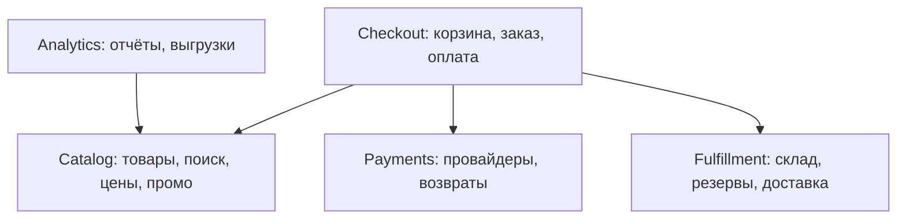

# Урок 01 — Распиливаем монолит: где границы и что не надо выносить

Задача-легенда: интернет-магазин. Монолит на Go, 250 тысяч строк, одна база PostgreSQL,
28 инженеров в четырёх командах, релиз раз в неделю по вторникам и всегда с валерьянкой.
Просьба руководства: «распилите на микросервисы». Наша работа — не согласиться и не
отказаться, а **найти границы и порядок**.

## Шаг 1. Собрать факты, а не мнения

Три вопроса, которые задаёшь до любой схемы:

1. **Что болит?** Тут: релизный поезд (все ждут всех), и раз в месяц отчёты по аналитике
   съедают память и роняют оформление заказов.
2. **Что меняется чаще всего?** Каталог и промо-акции правят ежедневно; склад — раз в месяц;
   биллинг — редко, но со страхом.
3. **Кто владеет чем?** Четыре команды: Catalog, Checkout, Fulfillment, Platform.

Это уже половина ответа. Больно от **связанного деплоя** и **отсутствия изоляции** — значит
резать надо там, где это лечится, а не «по-красивому».

## Шаг 2. Разложить возможности, а не таблицы

Выписываем бизнес-возможности и группируем в кандидаты на bounded context:



Проверяем каждую группу тремя тестами:

- **Тест связности.** Сколько раз за один пользовательский запрос группы дёргают друг друга?
  Checkout зовёт Catalog один раз (цена) и Payments один раз — нормально. А вот «Корзина» и
  «Заказ» перекликаются на каждый чих: это один сервис, не два.
- **Тест владения данными.** У таблицы `products` один писатель — Catalog. У `orders` —
  Checkout. Хорошо. А `stock_reservations` пишут и Checkout, и Fulfillment — красный флаг,
  надо решить владельца (правильно — Fulfillment, а Checkout просит резерв через API).
- **Тест транзакции.** «Оформить заказ» = создать заказ + зарезервировать товар + списать
  деньги. Три сервиса — значит одной ACID-транзакции не будет, нужна saga с компенсациями
  (см. [`../07-distributed-systems/theory.md`](../../07-distributed-systems/theory.md)). Это цена,
  и её надо назвать вслух до, а не после распила.

## Шаг 3. Выбрать порядок: что выносим первым

Первым выносят то, где **выгода максимальна, а связность минимальна**. Кандидаты:

| Кандидат | Выгода от выноса | Связность с ядром | Решение |
|---|---|---|---|
| Analytics/отчёты | огромная: перестанет ронять заказы, читает реплику | низкая (только чтение) | **выносим первым** |
| Notifications (письма, push) | средняя: асинхронно, всплески | низкая (только события) | **выносим вторым** |
| Catalog | высокая: ежедневные релизы отдельно | средняя | третьим, после подготовки API |
| Checkout (ядро) | низкая | максимальная | **не выносим** — это и есть монолит |
| Общая таблица `users` | нет | все читают | оставить владельцем Platform, отдать API |

Универсальное правило: **первым выносят «листья»** — то, что читает или слушает, но от чего
никто не зависит синхронно. Это даёт быструю победу и учит команду эксплуатации (метрики,
tracing, деплой) на низком риске.

## Шаг 4. Что НЕ надо выносить

Список, который на интервью ценится выше любой схемы:

- **Ядро домена, участвующее в каждой транзакции.** Если «оформление заказа» без сервиса не
  работает вообще, вынос даёт только сетевые ошибки и распределённую транзакцию.
- **То, что меняется вместе.** Два «сервиса», которые всегда релизят парой — это один сервис.
- **Слои.** «Сервис валидации», «сервис доступа к БД», «сервис бизнес-правил» — нарезка
  поперёк домена: каждая фича требует три релиза.
- **Мелочь на один эндпоинт.** Сервис на 200 строк тащит за собой CI, дашборд, on-call,
  сертификаты и alert'ы. Операционная стоимость постоянна и не зависит от размера кода.
- **Общие сущности без владельца.** Пока не решено, кто владеет `users`, вынос породит
  общую БД — то есть распределённый монолит.

```drill
type: multiple-choice
prompt: "Из монолита магазина решили первым вынести сервис оформления заказа (ядро, участвует в каждой транзакции). Что случится?"
options: ["Изоляция отказов улучшится", "Появится распределённая транзакция и сетевые отказы на главном пути, выгоды почти нет", "Релизы всех команд ускорятся", "Уменьшится нагрузка на БД"]
answer: "Появится распределённая транзакция и сетевые отказы на главном пути, выгоды почти нет"
check: exact
hint: Первыми выносят «листья», а не ядро.
```

## Шаг 5. Промежуточный шаг, который забывают

Между монолитом и микросервисами есть дешёвая ступень: **модульный монолит**. Внутри одного
процесса делаем пакеты `internal/catalog`, `internal/checkout`, `internal/fulfillment`, и
вводим два правила:

- модуль зовёт другой модуль **только через объявленный интерфейс** (никаких походов в чужой
  репозиторий);
- у каждого модуля **свои таблицы**, чужие — только через интерфейс владельца.

```go
// Checkout не знает про таблицы склада — только про эту абстракцию.
// Сегодня за ней вызов функции, завтра — gRPC-клиент. Код Checkout не изменится.
type StockReserver interface {
    Reserve(ctx context.Context, orderID int64, items []Item) (ReservationID, error)
    Release(ctx context.Context, id ReservationID) error
}
```

Это то, что делает будущий распил механическим: границы уже проверены компилятором, и вынос
модуля в сервис = замена реализации интерфейса на сетевого клиента + перенос таблиц.

```drill
type: free-form
prompt: "Объясни вслух за 2 минуты, зачем перед распилом делать модульный монолит и как это упрощает вынос сервиса."
answer: "Модульный монолит вводит границы бесплатно: модули общаются через интерфейсы, у каждого свои таблицы. Границы проверяются компилятором, а не договорённостями, и их можно двигать без сетевых миграций. Когда границу подтвердила практика, вынос = подменить реализацию интерфейса на сетевого клиента и перенести таблицы владельцу. Если резать сразу по сети, ошибка в границе стоит распределённой транзакции, общей БД и согласованных релизов."
check: manual
```

## Итог

Порядок действий: понять, **что болит** → выписать возможности и найти bounded contexts →
проверить связность, владение данными и транзакции → вынести сначала «листья» → ядро оставить
в монолите. Границы сначала ставить внутри процесса (модульный монолит) и только потом
разносить по сети. И главное: у каждого распила должна быть названная причина из четырёх —
независимый деплой, независимое масштабирование, изоляция отказов, границы команд. Нет
причины — нет распила.
