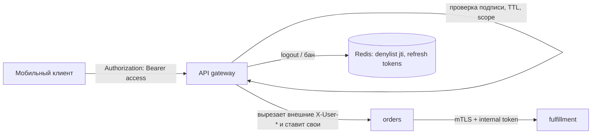
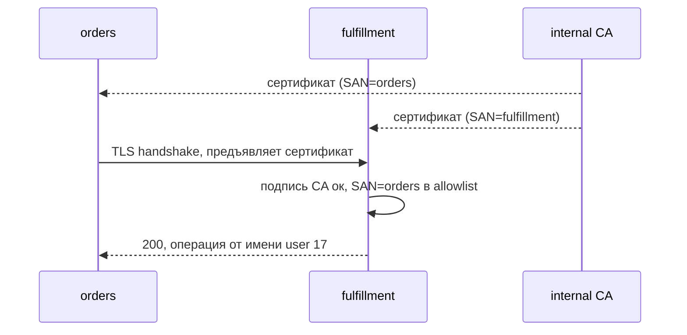

# Урок 02 — Auth для публичного API и для внутренних сервисов

Задача-легенда: у нас API того же магазина. Клиенты: веб-приложение, мобильное приложение,
партнёрский сервер (выгружает заказы), и внутри — четыре наших сервиса. Интервьюер говорит:
«спроектируйте аутентификацию». Начинаем не с JWT, а с вопроса «кто клиент?».

## Шаг 1. Разложить клиентов и требования

| Клиент | Кто «личность» | Нужен мгновенный отзыв? | Механизм |
|---|---|---|---|
| Веб-фронт (наш домен) | пользователь | да (logout, бан) | сессия в `HttpOnly` cookie |
| Мобильное приложение | пользователь | да, но допустимо 10 мин | OAuth2 code + PKCE, access 10 мин + refresh |
| Партнёрский сервер | приложение | редко, вручную | OAuth2 client credentials или API key |
| Наш сервис → наш сервис | сервис + контекст пользователя | не применимо | mTLS + внутренний короткий токен |

Уже здесь видно, что «один механизм на всё» не выйдет — и это правильный ответ, а не
уклончивый.

## Шаг 2. Путь запроса пользователя



Что здесь важно проговорить:

1. **Проверка токена — на gateway**, но сервисы не должны слепо верить заголовкам: внутренний
   токен они тоже валидируют (или доверяют только mTLS-личности gateway).
2. **Внешние заголовки идентичности вырезаются на границе.** Если клиент пришлёт
   `X-User-Id: 1`, а gateway его не удалит, любой станет админом. Это не теория, это самая
   частая реальная дыра такой схемы.
3. **Refresh-токен хранится на сервере** (хеш в БД/Redis, привязка к устройству). Тогда
   «выйти со всех устройств» и бан работают мгновенно, хотя access-токен stateless.

## Шаг 3. Настройки access-токена, которые спросят

- **TTL 5–15 минут.** Компромисс: чем короче, тем меньше окно после бана, но тем чаще ходят
  за refresh.
- **Внутрь — минимум**: `sub` (id пользователя), `exp`, `iat`, `jti`, роли/scopes, `aud`.
  Никаких email, телефонов, адресов: payload только подписан, а не зашифрован.
- **Алгоритм фиксируем на сервере.** Валидатор настроен на конкретный `alg` (например
  RS256/EdDSA); значение из заголовка токена не используется как инструкция. Иначе — классика
  `alg: none` и подмена RS256 → HS256.
- **Ключи ротируются**, у каждого свой `kid`; публичные ключи раздаются через JWKS, чтобы
  сервисы могли проверять подпись без общего секрета.
- **Отзыв.** Либо короткий TTL и «терпим до 10 минут», либо denylist по `jti` в Redis.
  Честная формулировка: denylist возвращает состояние, которое JWT хотел убрать, — платим за
  мгновенный отзыв походом в Redis.

```drill
type: multiple-choice
prompt: "Сервис принимает JWT и определяет алгоритм проверки по полю alg из заголовка токена. Чем это опасно?"
options: ["Ничем, так работает стандарт", "Атакующий подставит alg: none или HS256 с публичным ключом как секретом и подделает токен", "Токен станет слишком большим", "Подпись будет считаться медленнее"]
answer: "Атакующий подставит alg: none или HS256 с публичным ключом как секретом и подделает токен"
check: exact
hint: Инструкцию проверки нельзя брать у того, кого проверяешь.
```

## Шаг 4. Партнёрский доступ

Партнёру нужен машинный доступ без пользователя. Два варианта:

- **API key**: просто, но секрет один и живёт долго. Тогда: хранить только хеш ключа, дать
  префикс для быстрого поиска и логов (`pk_live_ab12…`), поддержать **две активные версии**
  для бесшовной ротации, ограничить по scope и по IP, вести квоту на ключ.
- **OAuth2 client credentials**: партнёр меняет `client_id`/`client_secret` на короткий
  токен. Дороже в реализации, но токен живёт минуты и отзывается через провайдера.

И в обоих случаях — **rate limiting на ключ**, потому что партнёр рано или поздно запустит
цикл без задержки и попытается выкачать всю базу заказов.

## Шаг 5. Между своими сервисами



- **mTLS** даёт личность сервиса без паролей в конфигах. Проверяется не только «сертификат
  подписан нашим CA», но и **кто именно** — иначе любой pod в кластере сможет звать всё.
- Поверх личности сервиса едет **контекст пользователя**: либо тот же короткий JWT, либо
  внутренний токен, выданный auth-сервисом с ограниченной областью («от имени user 17,
  только чтение заказов»). Это защищает от «сервис-конфьюзед-депьюти»: сервис не должен
  делать всё, что попросят, только потому что попросил другой сервис.
- Авторизация всё равно проверяется по объекту: `fulfillment` смотрит, что резерв принадлежит
  заказу этого пользователя.

```drill
type: free-form
prompt: "Спроектируй вслух auth для нашего API и объясни, почему у веба и мобильного клиента разные механизмы, и как ты обеспечишь мгновенный logout при stateless-токенах."
answer: "Веб со своим доменом: серверная сессия в HttpOnly+Secure+SameSite cookie — отзыв бесплатный (удалил запись), cookie маленькая, нужна защита от CSRF. Мобильный: OAuth2 authorization code + PKCE, access-JWT на 10 минут и refresh-токен, хранимый и отзываемый на сервере, привязанный к устройству. Мгновенный logout: удаляем refresh (новые access не выдаются) плюс, если нужно немедленно, denylist по jti в Redis до истечения TTL; это осознанный возврат состояния в обмен на мгновенный отзыв. Алгоритм подписи фиксирован на сервере, ключи с kid и JWKS. Партнёры — client credentials или хешированные API keys с ротацией и квотой. Внутри — mTLS для личности сервиса плюс внутренний токен с контекстом пользователя; на gateway вырезаем внешние заголовки идентичности."
check: manual
```

## Итог

Схема ответа: **клиенты → механизм на каждого → где живёт состояние → как отзывается →
границы доверия**. Ключевые фразы, которые надо уметь произнести: сессия для своего веба,
короткий access + серверный refresh для мобильных, client credentials или хешированные ключи
для партнёров, mTLS плюс внутренний токен между сервисами, фиксированный алгоритм подписи,
вырезание входящих заголовков идентичности и авторизация на каждый объект, а не только на
входе.
