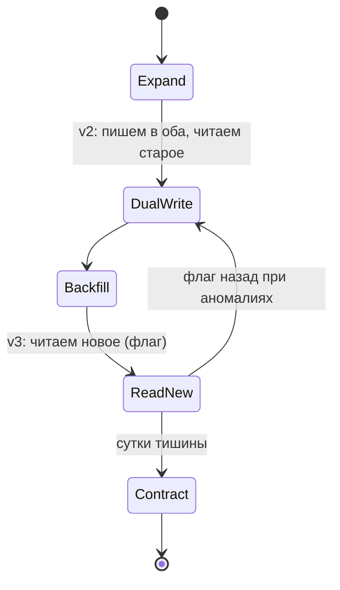

# Урок 03 — Деплой без простоя с изменением схемы БД

Задача-легенда: в таблице `users` есть колонка `phone VARCHAR(20)`. Продукт требует
поддержать несколько телефонов на пользователя и хранить признак «подтверждён». Значит:
данные переезжают в отдельную таблицу `user_phones`. В таблице 40 млн строк, сервис
принимает 3000 RPS, останавливать нельзя.

Интервьюер спросит ровно два вопроса: «как ты это выкатишь» и «что если придётся
откатиться».

## Шаг 0. Почему нельзя «просто сделать миграцию»

Во время rolling update **одновременно работают старые и новые pod'ы**. Значит любая схема
между шагами должна устраивать обе версии кода. Плюс к этому:

- `ALTER TABLE ... SET NOT NULL` или добавление колонки с volatile-значением на 40 млн строк
  берёт тяжёлую блокировку и переписывает таблицу — это и есть простой;
- `CREATE INDEX` без `CONCURRENTLY` блокирует запись в таблицу на время построения;
- один `UPDATE` на 40 млн строк = длинная транзакция, распухший WAL, лаг реплик и
  заблокированный autovacuum.

## Шаг 1. Expand — добавляем, ничего не ломая

```sql
-- Новая таблица создаётся мгновенно и никого не блокирует.
CREATE TABLE user_phones (
    id          BIGSERIAL PRIMARY KEY,
    user_id     BIGINT NOT NULL REFERENCES users(id),
    phone       TEXT   NOT NULL,
    is_primary  BOOLEAN NOT NULL DEFAULT false,
    verified_at TIMESTAMPTZ
);
CREATE UNIQUE INDEX CONCURRENTLY user_phones_uniq ON user_phones (user_id, phone);
```

Старая колонка `users.phone` остаётся на месте и продолжает работать. Ни один pod пока не
знает о новой таблице — это и есть смысл шага: **схема совместима с кодом обеих версий**.

## Шаг 2. Deploy v2 — двойная запись, чтение из старого

Код версии 2 при изменении телефона пишет **и туда, и туда**, но читает по-старому. Если v2
откатится на v1, данные в `users.phone` актуальны, ничего не потеряно.

```go
// Двойная запись в одной транзакции: если новая таблица отстанет от старой,
// после переключения чтения пользователи увидят чужой/старый телефон.
func (r *Repo) SetPhone(ctx context.Context, userID int64, phone string) error {
    tx, err := r.db.BeginTx(ctx, nil)
    if err != nil {
        return err
    }
    defer tx.Rollback()

    if _, err = tx.ExecContext(ctx, `UPDATE users SET phone=$2 WHERE id=$1`, userID, phone); err != nil {
        return err
    }
    _, err = tx.ExecContext(ctx, `INSERT INTO user_phones (user_id, phone, is_primary)
        VALUES ($1,$2,true) ON CONFLICT (user_id, phone) DO NOTHING`, userID, phone)
    if err != nil {
        return err
    }
    return tx.Commit()
}
```

Выкатываем canary: 1 реплика из 20, смотрим 15 минут на ошибки записи и на p99 (двойная
запись — это +1 запрос в транзакции). Потом rolling на все.

## Шаг 3. Backfill — переливаем историю пачками

```sql
-- Пачками по 5000, с ORDER BY по ключу и запоминанием курсора между итерациями.
-- Одним UPDATE на 40 млн строк мы бы получили длинную транзакцию и лаг реплик.
INSERT INTO user_phones (user_id, phone, is_primary)
SELECT id, phone, true FROM users
WHERE id > $1 AND phone IS NOT NULL
ORDER BY id
LIMIT 5000
ON CONFLICT (user_id, phone) DO NOTHING;
```

Практика: 40 млн / 5000 = 8000 итераций; при паузе 100 мс и ~50 мс на пачку это примерно
8000 × 0.15 с ≈ 20 минут чистого времени. Запускаем как отдельную admin-задачу (тот же
бинарник, другая команда — 12-factor), с логом прогресса, ограничением скорости и
возможностью остановиться. Обязательно следим за лагом реплик: вырос — сбавляем темп.

После backfill — **сверка**: количество непустых `users.phone` должно совпадать с числом
primary-записей в `user_phones`. Расхождение до переключения чтения — это спасённый инцидент.

```drill
type: multiple-choice
prompt: "Почему backfill 40 млн строк делают пачками с паузами, а не одним UPDATE?"
options: ["Так короче SQL", "Длинная транзакция раздувает WAL, держит блокировки, тормозит autovacuum и вызывает лаг реплик", "PostgreSQL не умеет UPDATE больше 1 млн строк", "Пачки быстрее по суммарному времени"]
answer: "Длинная транзакция раздувает WAL, держит блокировки, тормозит autovacuum и вызывает лаг реплик"
check: exact
```

## Шаг 4. Deploy v3 — читаем из нового

Теперь код читает телефоны из `user_phones` (и всё ещё пишет в оба места). Это самый
рискованный деплой, поэтому: canary + метрика «сколько запросов не нашли телефон в новой
таблице». Ноль — значит backfill полон, можно катить дальше. Не ноль — откат на v2 (данные в
старой колонке по-прежнему актуальны, откат безболезненный).

Полезный приём — **feature flag** на источник чтения: тогда переключение — это не деплой, а
изменение флага, и откат занимает секунды, а не минуты.



## Шаг 5. Contract — убираем старое, но позже

Через сутки-двое спокойной работы:

1. деплой v4: перестаём писать в `users.phone`;
2. ждём ещё (день, неделя — по вкусу и по SLA откатов);
3. только теперь `ALTER TABLE users DROP COLUMN phone;`.

Перед удалением проверяем, что колонку никто не читает: поиск по коду и по репортам, логи
медленных запросов, при желении — `pg_stat_statements`. Удалять колонку в том же релизе, что
и правку кода, — гарантированный «откатиться нельзя».

```drill
type: free-form
prompt: "Расскажи вслух, как выкатить перенос users.phone в отдельную таблицу без простоя, и что произойдёт при откате на каждом шаге."
answer: "Expand: создаём user_phones и уникальный индекс CONCURRENTLY — старый код не затронут, откат тривиален. Deploy v2 (canary → rolling): двойная запись в одной транзакции, чтение из старой колонки; откат на v1 безопасен, users.phone актуален. Backfill пачками по 5000 с паузами и контролем лага реплик, затем сверка счётчиков. Deploy v3: чтение из user_phones за feature flag, метрика промахов; откат = выключить флаг. Через сутки v4: прекращаем писать в старую колонку. Ещё через период — DROP COLUMN, предварительно убедившись, что её никто не читает. Каждый шаг совместим с обеими версиями кода, потому что при rolling update старые и новые pod'ы работают одновременно."
check: manual
```

## Итог

Формула, которую надо помнить дословно: **expand → dual write → backfill пачками → сверка →
переключить чтение (лучше флагом) → прекратить запись → contract**. Плюс инфраструктурные
условия zero downtime, без которых схема не работает: readiness probe (в трафик — только
готовые pod'ы), graceful shutdown (дать доработать текущим запросам), индексы
`CONCURRENTLY`, никаких блокирующих `ALTER` на больших таблицах и обратная совместимость API
на каждом шаге.
