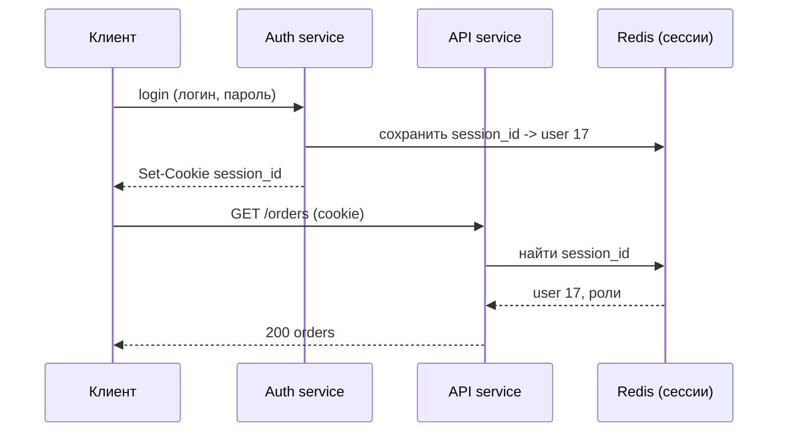
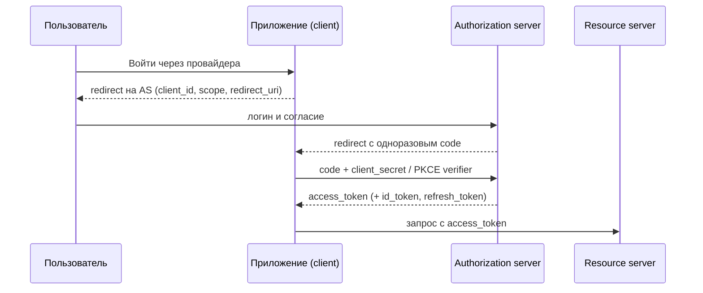
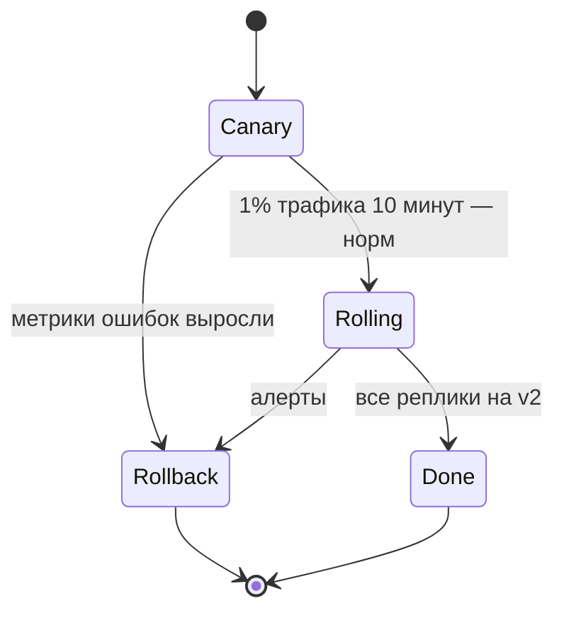
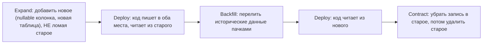

# Аутентификация, безопасность и деплой без простоя

Это вторая половина модуля 08. Первая — про то, как система разложена на сервисы
([`theory.md`](./theory.md)). Эта — про то, как в неё попадают только те, кому можно, и как
её выкатывать, не выключая.

## Часть 1. Аутентификация и авторизация

### Простыми словами

- **Аутентификация (authn)** — «кто ты?». Проверка личности: логин с паролем, код из SMS,
  токен, сертификат.
- **Авторизация (authz)** — «что тебе можно?». Проверка прав: этот пользователь может читать
  заказ #42, но не может его удалять.

Их путают в обе стороны, а на интервью это стоит очков: сильный кандидат сначала разделяет
эти два вопроса, потом отвечает на каждый.

### Сессии vs токены

**Сессия (server-side session)** — простыми словами: сервер после логина запоминает
«пользователь 17 вошёл» в своём хранилище и отдаёт клиенту случайный идентификатор в cookie.
На каждом запросе сервер по идентификатору находит запись. Cookie — это просто номерок из
гардероба: сам по себе не значит ничего, вся информация у гардеробщика.

**Токен (JWT, JSON Web Token)** — простыми словами: сервер выдаёт клиенту подписанную
«справку»: «это пользователь 17, роль admin, действует до 12:05». Сервер ничего не помнит —
он проверяет подпись и верит содержимому. Это паспорт, а не номерок: данные внутри и
защищены подписью.

| Критерий | Сессия в хранилище | JWT |
|---|---|---|
| Состояние | на сервере (Redis/БД) | у клиента |
| Проверка запроса | поход в Redis (~1 мс) | проверка подписи локально (~микросекунды) |
| Отзыв (logout, бан) | мгновенный: удалил запись | **сложный**: токен валиден до истечения |
| Размер | ~30 байт cookie | 300–1500 байт в каждом запросе |
| Масштабирование | нужен общий кэш сессий | ничего общего не нужно |
| Изменение прав | сразу видно | видно только после обновления токена |

**JWT — не «более безопасно», а «менее stateful».** Его настоящие подводные камни, которые
любят спрашивать:

1. **Отзыв.** Уволили сотрудника — его токен ещё живёт 30 минут. Лечится коротким TTL
   access-токена (5–15 минут) + refresh-токеном, который **хранится на сервере** и может быть
   отозван; либо denylist по `jti` в Redis. Заметь: как только появился denylist, ты снова
   ходишь в общее хранилище — половина «преимущества stateless» исчезла. Это нормальный
   честный trade-off, и его надо озвучивать.
2. **Размер.** Токен едет в каждом запросе. Набил туда 20 permissions — получил +2 КБ на
   запрос и риск упереться в лимит размера заголовков.
3. **Алгоритм.** Классические дыры: `alg: none` (принимаем токен без подписи) и подмена
   RS256 → HS256, когда публичный ключ используется как секрет HMAC. Правило: **сервер
   задаёт допустимый алгоритм явно**, а не берёт его из заголовка токена.
4. **Что внутри — не секрет.** Payload только подписан (base64), а не зашифрован. Пароли,
   PII и внутренние идентификаторы туда не кладут.
5. **Где хранить на клиенте.** В `localStorage` — доступен любому XSS; в cookie
   `HttpOnly; Secure; SameSite` — недоступен JS, но нужна защита от CSRF.

Практический вывод для интервью: **для собственного веб-приложения сессии часто проще и
безопаснее**; JWT оправдан там, где много сервисов должны проверять личность без похода в
общий стор, для мобильных клиентов и для межсервисного доверия. Гибрид тоже нормален:
короткий JWT для внутренних вызовов + серверная сессия/refresh для пользователя.

### OAuth2 и OIDC простыми словами

**Проблема:** сторонний сервис хочет доступ к твоим данным в другом сервисе. Отдавать ему
пароль — безумие.

**OAuth2** — протокол **делегирования доступа**. Аналогия: ключ от машины с ограничением —
парковщику даёшь valet key, который открывает двери и запускает двигатель, но не открывает
багажник и работает один вечер. Роли: **resource owner** (пользователь), **client**
(приложение, которое просит доступ), **authorization server** (выдаёт токены),
**resource server** (API с данными). Результат — **access token** с ограниченными **scopes**
и коротким сроком жизни.

**OIDC (OpenID Connect)** — тонкий слой поверх OAuth2, который добавляет
**аутентификацию**: помимо access-токена выдаётся **id_token** (JWT) с утверждениями о том,
кто именно вошёл. Это то, что стоит за кнопкой «Войти через Google».

Основной поток — **authorization code flow** (с PKCE для мобильных и SPA):

Почему сначала `code`, а не сразу токен: код одноразовый, живёт секунды и обменивается на
токен **бэкендом** — токен не светится в URL и в истории браузера. Другие гранты, которые
стоит уметь назвать: **client credentials** (сервис к сервису, без пользователя),
**device code** (для телевизоров и CLI). А вот `implicit` и `password` гранты считаются
устаревшими — их не предлагают.

### API keys и mTLS между сервисами

**API key** — простыми словами: длинная строка-пароль для программы, а не для человека.
Годится для идентификации приложения-партнёра, привязки квоты и биллинга. Ограничения:
секрет один и живёт долго, права обычно грубые, при утечке отзывать больно. Хранить надо как
пароль (хеш в БД), передавать только по TLS, поддерживать ротацию и по возможности
ограничивать по IP и по scope.

**mTLS (mutual TLS)** — простыми словами: обычный TLS проверяет сертификат сервера
(«я действительно говорю с users-service»); mutual — обе стороны предъявляют сертификаты,
поэтому и сервер знает, кто клиент. Это даёт **криптографическую идентичность сервиса** без
паролей в конфиге. Так строят zero-trust внутри кластера: сервис B принимает вызовы только
от тех, чей сертификат подписан внутренним CA и чей SAN — из списка разрешённых. Цена — PKI:
выпуск, распространение и ротация сертификатов; именно это обычно и берёт на себя service
mesh.

Практическая раскладка «чем что закрывают»:

| Кто зовёт | Механизм |
|---|---|
| Браузер пользователя | сессия в `HttpOnly` cookie или OIDC + короткий токен |
| Мобильное приложение | OAuth2 authorization code + PKCE, access/refresh токены |
| Партнёрский сервер | API key или OAuth2 client credentials |
| Свой сервис → свой сервис | mTLS (личность) + короткий внутренний токен/заголовок с контекстом пользователя |

Отдельно: **не доверяй заголовку `X-User-Id` от клиента.** Внутренний контекст пользователя
проставляет только gateway/auth-слой, а входящий одноимённый заголовок снаружи вырезается.
Классическая дыра «забыли зачистить заголовок на границе» стоит компании всех данных.

## Часть 2. Базовая безопасность, которую ждёт интервьюер

Не надо быть пентестером. Надо уверенно назвать восемь пунктов и понимать, зачем каждый.

1. **TLS везде.** Снаружи — обязательно (HTTPS, HSTS, современные шифры). Внутри — тоже:
   «внутренняя сеть безопасна» — это допущение из 2005 года. TLS даёт шифрование и
   аутентификацию сервера, но не авторизацию — это разные слои.
2. **Валидация ввода на сервере.** Клиент — не источник истины. Проверяются типы, длины,
   диапазоны, разрешённые значения (allowlist лучше denylist), размер тела запроса и размер
   загружаемых файлов. Валидация на фронте — это UX, а не защита.
3. **SQL-инъекции.** Единственное надёжное лекарство — **параметризованные запросы**.
   В Go это `db.QueryContext(ctx, "SELECT ... WHERE id = $1", id)`. Склейка строк
   недопустима даже «во внутренней админке». Имена таблиц и колонок из пользовательского
   ввода подставлять нельзя вообще — только через allowlist.
4. **Секреты.** Не в git, не в образе, не в логах. Хранилище (Vault, k8s Secrets, secret
   manager), ротация, короткий срок жизни, разные секреты на разные окружения.
5. **Least privilege.** У сервиса своя роль в БД с правами только на нужные таблицы;
   сервис-читатель не имеет `UPDATE`; у пода нет права ходить куда угодно (network
   policies). Вопрос-проверка: «что сможет сделать злоумышленник, получив этот сервис?»
6. **OWASP Top 10** — общепринятый список категорий веб-рисков (owasp.org/Top10). Достаточно
   назвать несколько своими словами: сломанный контроль доступа (самая частая — IDOR:
   `GET /orders/43` возвращает чужой заказ, потому что проверили только логин, а не
   владение), инъекции, криптографические ошибки, небезопасная конфигурация, уязвимые
   зависимости, ошибки аутентификации, отсутствие логирования и мониторинга. **Авторизацию
   проверяем на каждый объект, а не только на входе.**
7. **Rate limiting как защита от абьюза.** Лимиты на логин (защита от перебора паролей), на
   отправку кодов (защита кошелька от SMS-флуда), на дорогие эндпоинты, на IP и на аккаунт
   одновременно. Алгоритмы — в [`../06-scalability-and-reliability/theory.md`](../06-scalability-and-reliability/theory.md);
   здесь важно, что это не только про перегрузку, но и про безопасность.
8. **PII и шифрование.** Персональные данные (имя, телефон, адрес, документы) —
   инвентаризованы, минимизированы, шифруются at rest (диски/тома/колонки), не попадают в
   логи и аналитику в открытом виде. Пароли — только `bcrypt`/`argon2` с солью (никогда
   SHA-256 «с солью» и уж точно не MD5). Плюс план удаления: право «удалите мои данные»
   должно быть выполнимо технически.

Полезная привычка на интервью: любую свою схему прогони по вопросу **«где здесь граница
доверия?»** — интернет → gateway, gateway → сервис, сервис → БД, сервис → сторонний API.
На каждой границе есть аутентификация, валидация и лимит.

## Часть 3. Деплой без простоя

### Стратегии

| Стратегия | Как | Плюсы | Минусы |
|---|---|---|---|
| **Rolling update** | реплики заменяются пачками (k8s по умолчанию) | не нужен двойной ресурс, просто | v1 и v2 работают одновременно → нужна совместимость; откат небыстрый |
| **Blue-green** | поднимаем полный второй стек v2, переключаем трафик целиком | мгновенный откат переключением, тест на реальном окружении | 2× ресурсов; общая БД всё равно должна понимать оба кода |
| **Canary** | 1% → 5% → 25% → 100%, следим за метриками | ловим проблему на малой доле пользователей | нужны хорошие метрики по версиям и автоматика отката |
| **Feature flags** | код выкатывается выключенным, включается флагом | деплой ≠ релиз, включение мгновенное и адресное (по проценту, по клиенту) | флаги надо чистить, иначе комбинаторный ад |

Ключевая мысль, которая нравится интервьюерам: **любая из этих стратегий требует, чтобы
старая и новая версии умели сосуществовать** — по API и по схеме БД. Rolling — потому что
реплики разных версий работают одновременно; blue-green — потому что откат вернёт старый код
к уже изменённой базе.

Ещё одно разделение: **deploy** — «код на серверах», **release** — «фича видна
пользователям». Feature flags позволяют разнести их во времени, и это самый дешёвый способ
сделать релиз нестрашным.

### Миграции схемы без простоя: expand → migrate → contract

**Простыми словами:** нельзя одним движением переименовать колонку, если на неё смотрят два
кода одновременно. Поэтому меняем схему в три захода, каждый из которых совместим с обеими
версиями приложения.

Правила, которые стоит произнести:

- **Каждый шаг обратно совместим.** Между шагами может пройти день; в любой момент можно
  откатить код без потери данных.
- **Добавление колонки — nullable или с DEFAULT**, без переписывания таблицы под
  блокировкой; в PostgreSQL добавление колонки с константным `DEFAULT` не перезаписывает
  таблицу, но `NOT NULL` без значения на большой таблице — путь к простою.
- **Индексы — `CREATE INDEX CONCURRENTLY`**, иначе запись в таблицу встанет.
- **Backfill пачками** (по 1–10 тысяч строк, с паузами), а не одним `UPDATE` на 200 млн
  строк: иначе долгая транзакция, раздувание WAL и лаг репликации.
- **Удаление колонки — последним шагом и позже, чем кажется.** Сначала убедись, что никто не
  читает: логи запросов, метрики, поиск по коду. Удалять в том же релизе, что и правку кода,
  — классика «откат невозможен».
- **Переименование = добавить новое + копировать + переключить + удалить.** Прямого
  безопасного `RENAME` при живом трафике нет.

Ту же логику применяют к API: сначала добавляют новое поле/эндпоинт, потом переводят
клиентов, потом убирают старое — с версионированием или депрекейшн-периодом
(см. [`../02-networking-and-apis/theory.md`](../02-networking-and-apis/theory.md)).

## Как это спрашивают на собеседовании

**«Сессии или JWT для нашего API?»**
Сильный ответ: «Кто клиент и нужен ли мгновенный отзыв? Для веба со своим фронтом — сессия в
`HttpOnly` cookie: отзыв бесплатный, cookie маленькая, поход в Redis — миллисекунда. Для
мобильных и для проверки личности в десятке сервисов — короткий access-JWT (10 минут) +
серверный refresh-токен, который можно отозвать. Алгоритм подписи фиксирую на сервере,
внутрь токена — только идентификатор и роли».
Слабый: «JWT, потому что stateless и модно» — без слова про отзыв.

**«Как один сервис поймёт, что его зовёт другой наш сервис, а не кто-то из интернета?»**
Сильный: mTLS с внутренним CA даёт личность сервиса; поверх — короткоживущий токен с
контекстом пользователя, выданный auth-слоем. Заголовки вроде `X-User-Id` от внешнего
клиента режутся на gateway.

**«Как ты выкатишь переименование колонки на живой базе?»**
Сильный: expand/contract в три деплоя с двойной записью и backfill'ом пачками, индексы
`CONCURRENTLY`, удаление старой колонки — отдельным поздним релизом.

**«Что проверишь в безопасности этого дизайна за две минуты?»**
Сильный: границы доверия и на каждой — authn/authz; параметризованные запросы; авторизация
на объект (IDOR); секреты вне кода; TLS внутри и снаружи; лимиты на логин и дорогие ручки;
PII зашифрован и не в логах.

## Типичные ошибки и заблуждения

- **«JWT безопаснее сессий».** Другой trade-off, не «безопаснее». Отзыв у JWT — отдельная
  инженерная задача.
- **«Проверили токен — значит доступ есть».** Это authn. Владение конкретным объектом
  (IDOR) проверяется отдельно, на каждый запрос.
- **«Внутри кластера можно без TLS и без auth».** Один скомпрометированный pod — и вся
  внутренняя сеть открыта.
- **«ORM/prepared statements спасут от всего».** Спасают от инъекций в значениях; динамические
  имена таблиц, `ORDER BY` из параметра и `LIKE`-шаблоны всё ещё требуют allowlist.
- **«Хешируем пароли SHA-256 — быстро и надёжно».** Скорость здесь и есть уязвимость. Нужен
  медленный KDF: `bcrypt`, `argon2`.
- **«Blue-green даёт мгновенный откат».** Кода — да. Базы — нет: миграция уже применена,
  поэтому схема обязана быть совместима с обеими версиями.
- **«Rolling update — это и есть zero downtime».** Только если есть readiness probe,
  graceful shutdown и совместимость версий. Иначе это «zero downtime по документации».
- **«Feature flag — это временно».** Флаги живут годами; нужен реестр и уборка, иначе никто
  не знает, какая комбинация вообще протестирована.

## Глоссарий

- **Authn / authz** — аутентификация («кто ты») / авторизация («что тебе можно»).
- **Session** — серверная запись о входе; клиент носит только идентификатор.
- **JWT** — подписанный токен с утверждениями; проверяется без похода в хранилище.
- **Access / refresh token** — короткоживущий токен доступа / долгоживущий токен обновления,
  хранимый и отзываемый на сервере.
- **OAuth2** — протокол делегирования доступа (scopes, authorization code, client credentials).
- **OIDC** — надстройка над OAuth2 для аутентификации, добавляет `id_token`.
- **PKCE** — защита authorization code flow для клиентов без секрета (мобильные, SPA).
- **API key** — долгоживущий секрет приложения; идентификация партнёра и квоты.
- **mTLS** — взаимный TLS: обе стороны предъявляют сертификаты; личность сервиса.
- **IDOR** — доступ к чужому объекту по прямой ссылке из-за отсутствия проверки владения.
- **PII** — персональные данные, требующие минимизации и шифрования.
- **Rolling / blue-green / canary** — постепенная замена реплик / переключение на второй
  стек / выпуск на долю трафика.
- **Feature flag** — переключатель, разделяющий деплой и релиз.
- **Expand/contract** — трёхшаговая схема совместимой миграции БД.

## См. также

- OWASP Top 10: https://owasp.org/www-project-top-ten/
- OWASP Cheat Sheet Series (Authentication, Session Management, SQL Injection Prevention):
  https://cheatsheetseries.owasp.org/
- OAuth 2.0 (обзор и гранты): https://oauth.net/2/ ; OpenID Connect: https://openid.net/connect/
- RFC 8725 — JSON Web Token Best Current Practices: https://www.rfc-editor.org/rfc/rfc8725
- PostgreSQL docs — `ALTER TABLE`, `CREATE INDEX CONCURRENTLY`:
  https://www.postgresql.org/docs/current/sql-altertable.html
- Google SRE Workbook — canary releases и безопасные изменения: https://sre.google/books/
- Martin Fowler, *FeatureToggle*: https://martinfowler.com/articles/feature-toggles.html
- Уроки: [`lessons/02-auth-for-public-api-and-services.md`](./lessons/02-auth-for-public-api-and-services.md),
  [`lessons/03-zero-downtime-deploy.md`](./lessons/03-zero-downtime-deploy.md)
