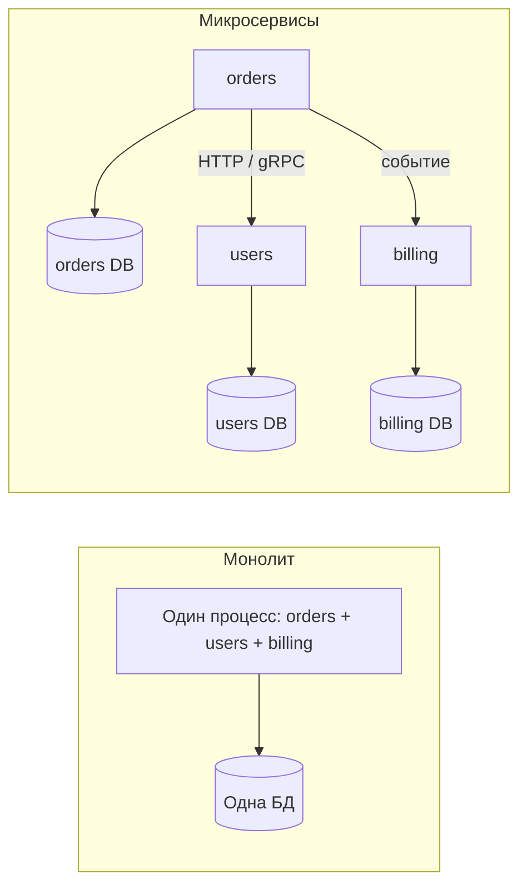
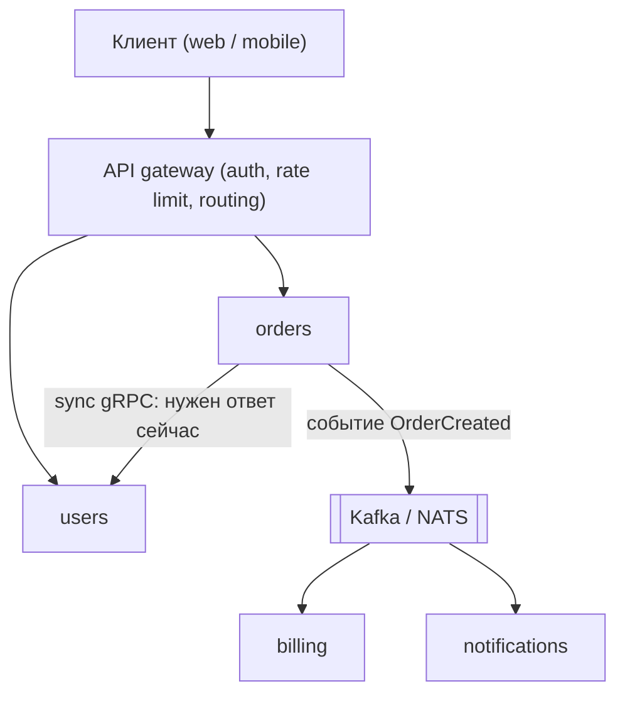
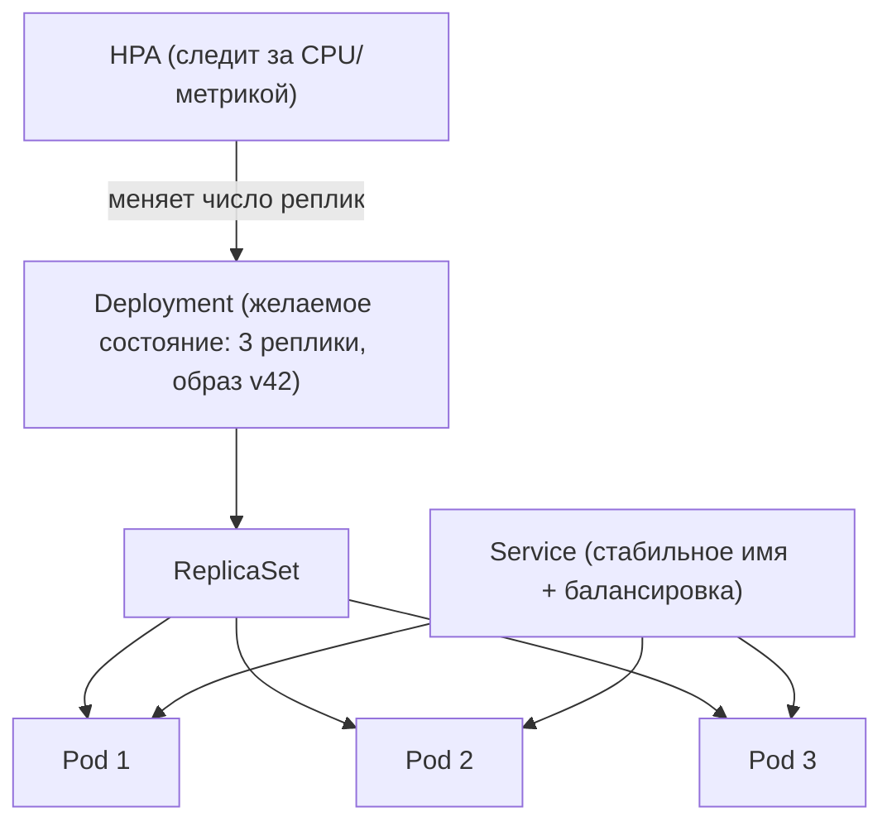

# Архитектура: монолит, микросервисы и всё, что вокруг

## Простыми словами

Любая система — это код, который надо где-то запустить. Вопрос архитектуры прост:
**сколько отдельно запускаемых кусков у тебя будет и кто из них чем владеет?**

- **Монолит** — один процесс, один деплой. Кухня, где повар, кассир и уборщик работают в
  одной комнате и кричат друг другу через стол.
- **Модульный монолит** — тот же один процесс, но внутри жёсткие внутренние границы:
  модули общаются только через объявленные интерфейсы, у каждого «свои» таблицы. Та же
  комната, но с перегородками и правилами: в холодильник соседа не лезем.
- **Микросервисы** — много процессов, каждый деплоится отдельно, у каждого своя база,
  общаются по сети. Отдельные кухни в разных зданиях, связанные курьерами.

Дальше вся глава — про цену этих трёх вариантов. Спойлер: цена микросервисов — не в коде,
а в эксплуатации.

## Зачем вообще что-то распиливать

Причин ровно четыре, и все они **организационные или операционные**, а не «код красивее»:

1. **Независимый деплой.** Команда платежей хочет релизить 10 раз в день, не спрашивая
   команду поиска. В монолите один общий релиз — значит общая очередь и общий риск.
2. **Независимое масштабирование.** Видеотранскодинг жрёт CPU, а профили — нет. В монолите
   ты масштабируешь всё целиком (клонируешь и то, что не нагружено).
3. **Изоляция отказов.** Утечка памяти в экспорте отчётов не должна ронять оформление
   заказа. В одном процессе OOM убивает всех.
4. **Границы команд.** По закону Конвея структура системы повторяет структуру
   коммуникаций в организации. Пять команд в одном репозитории с одним релизом будут
   стоять в очереди друг за другом.

Обрати внимание, чего в списке нет: «чтобы было модно», «чтобы переписать на другом языке»,
«чтобы код был чище». Чистота кода достигается модулями внутри процесса — бесплатно, без
сети.

## Как это работает: три варианта и их ценник



| Критерий | Монолит | Модульный монолит | Микросервисы |
|---|---|---|---|
| Деплой | один артефакт, общий релиз | один артефакт, общий релиз | независимые релизы |
| Вызов между модулями | вызов функции, ~100 нс | вызов через интерфейс, ~100 нс | сетевой вызов, ~1–10 мс + отказы |
| Транзакции | одна ACID-транзакция | одна ACID-транзакция | saga / eventual consistency |
| Отладка | стек-трейс | стек-трейс | distributed tracing |
| Локальный запуск | `go run ./cmd/app` | `go run ./cmd/app` | docker-compose на 12 контейнеров |
| Нужен ли CI/CD, метрики, tracing, service discovery | желательно | желательно | **обязательно** |
| Комфортный размер команды | 1–15 человек | 5–30 | 3+ независимых команды |

Главная мысль для интервью: **микросервисы меняют сложность кода на сложность
эксплуатации**. Вызов функции, который не мог упасть, становится сетевым вызовом, который
может: (а) вернуть ошибку, (б) вернуться через 30 секунд, (в) выполниться, но ответ
потеряется — и ты не знаешь, выполнился он или нет. Каждая стрелка на схеме — это таймаут,
retry, идемпотентность, метрика и алерт (см. [`../06-scalability-and-reliability/theory.md`](../06-scalability-and-reliability/theory.md)).

### Распределённый монолит — худший из миров

**Простыми словами:** это когда сервисы разрезаны физически, но не логически. Пять сервисов,
которые ходят в одну общую БД и релизятся только вместе, потому что любое изменение задевает
трёх соседей.

Признаки, по которым его узнают:
- общая база данных, в которую пишут несколько сервисов;
- чтобы выкатить фичу, нужен согласованный релиз 3+ сервисов;
- цепочка синхронных вызовов A → B → C → D на пути одного запроса пользователя;
- shared library с DTO, при изменении которой пересобирают всех.

Ты получил сетевые задержки и отказы, но не получил ни независимого деплоя, ни изоляции.
Отсюда практический совет, который любят слышать интервьюеры: **начинай с модульного
монолита и выноси сервис только тогда, когда есть конкретная причина** из списка четырёх
выше. Мартин Фаулер называет это MonolithFirst.

## Границы: DDD-lite простыми словами

**Bounded context (ограниченный контекст)** — простыми словами: участок системы, внутри
которого слово означает одно и то же. «Заказ» для склада — это список позиций и адрес
доставки; «заказ» для бухгалтерии — сумма, налог и счёт. Это два разных контекста, и
пытаться сделать одну универсальную модель `Order` на всю компанию — верный способ получить
класс на 3000 строк, который правят все.

**Aggregate (агрегат)** — простыми словами: группа объектов, которую всегда меняют как одно
целое, с одной «главной» сущностью на входе. Заказ + его позиции = агрегат: нельзя добавить
позицию, не проверив правила заказа. Практический вывод: **транзакция обычно должна менять
один агрегат**. Если бизнес-операция требует атомарно поменять два агрегата в двух сервисах —
это либо неправильная граница, либо задача для saga.

Как искать границы на интервью (и в жизни):

1. Выпиши **сущности** и **бизнес-возможности** (не таблицы): «оформить заказ», «посчитать
   доставку», «выставить счёт».
2. Сгруппируй по тому, **кто меняет данные**. У каждой сущности должен быть один владелец.
3. Проверь **связность**: внутри группы много взаимодействий, между группами — мало.
   Если два «сервиса» болтают друг с другом на каждый запрос, это один сервис.
4. Проверь **темп изменений и команду**: то, что меняется вместе и одними людьми, живёт вместе.

### Владение данными: никакой общей БД

Правило, которое надо произносить вслух: **у каждого сервиса своя база, и только он в неё
пишет и читает**. Остальные получают данные через его API или через его события.

Почему это не бюрократия:
- общая БД = общая схема = невозможно изменить колонку, не сломав чужой сервис;
- общая БД = нет изоляции отказов (один сервис положил пул соединений — легли все);
- общая БД = нет независимого деплоя, а значит нет и смысла в распиле.

Что делать, когда сервису нужны чужие данные: (1) синхронно спросить владельца;
(2) подписаться на его события и держать свою денормализованную копию (read model), приняв
eventual consistency; (3) понять, что данные вообще-то принадлежат тебе, и перенести
владение.

## Как сервисы общаются



| Способ | Когда | Плюсы | Минусы |
|---|---|---|---|
| Синхронно REST/gRPC | нужен ответ, чтобы продолжить (проверить баланс) | просто, понятный поток, легко отлаживать | связанность по времени: получатель лёг — ты лёг; задержки складываются |
| Асинхронно, события | «сообщи остальным, что случилось» (письмо, аналитика, индексация) | развязка, буферизация пиков, легко добавить подписчика | eventual consistency, дубликаты, сложнее отладка |

Практическое правило: **синхронно — только то, без чего нельзя ответить пользователю.**
Всё остальное — событием. Если на пути запроса пять синхронных хопов, посчитай доступность:
пять сервисов по 99.9% дают 99.5% — это в пять раз больше простоя, чем у каждого по
отдельности.

### API gateway, BFF

**API gateway** — простыми словами: единая входная дверь в систему. Один публичный адрес,
за которым он делает скучную, но обязательную работу: TLS-терминация, аутентификация,
rate limiting, маршрутизация по путям, ретраи и таймауты, логи и метрики запросов, иногда
агрегация нескольких вызовов в один ответ. Смысл — чтобы каждый сервис не переписывал это у
себя, а клиент не знал внутреннюю топологию.

Чего gateway делать **не должен**: содержать бизнес-логику. Как только в gateway появляется
«если заказ дороже 10000, то…» — у тебя новый монолит, только в самом критичном месте.

**BFF (backend for frontend)** — простыми словами: отдельный тонкий бэкенд под каждый тип
клиента. У мобильного приложения экран «профиль» требует данных из четырёх сервисов и должен
уложиться в один запрос по мобильной сети; у веб-админки — совсем другие потребности. Вместо
того чтобы уродовать общий API под всех, делают BFF-mobile и BFF-web, которые агрегируют
внутренние вызовы. Плата — ещё один слой, который надо деплоить и версионировать.

### Service discovery

**Простыми словами:** как сервис A узнаёт IP-адреса живых экземпляров сервиса B, если те
поднимаются и умирают каждые пять минут? Варианты:

- **DNS** — самое простое: имя `users.internal` резолвится в набор адресов. Минус —
  кэширование TTL: клиент может ещё минуту стучаться в мёртвый адрес.
- **Registry** (Consul, etcd) — сервисы при старте регистрируются, при остановке снимаются,
  плюс health-чек. Клиент спрашивает реестр (client-side discovery) или спрашивает
  балансировщик, который знает реестр (server-side discovery).
- **Kubernetes Service** — фактический стандарт: k8s сам ведёт список живых pod'ов
  (endpoints) и даёт стабильное DNS-имя. Тебе discovery «достаётся бесплатно», отсюда его
  популярность.

**Service mesh** (Istio, Linkerd) в одном абзаце: рядом с каждым сервисом ставится
sidecar-прокси, через который идёт весь сетевой трафик. Прокси берёт на себя mTLS, retry,
таймауты, circuit breaker, балансировку, метрики и трассировку — единообразно и без
изменения кода приложения. Плата: ещё один слой, +1–2 мс latency, новая система, которую
надо уметь чинить в три часа ночи. На интервью честный ответ: «нужен, когда сервисов
десятки и хочется единой политики mTLS и наблюдаемости; для пяти сервисов дешевле
библиотека и таймауты в коде».

## Config, секреты и 12-factor

Правило: **артефакт один, конфигурация внешняя.** Один и тот же образ должен запускаться в
dev, staging и prod, отличаясь только переменными окружения. Иначе «в стейдже работало».

Секреты (пароли БД, ключи API) не лежат в git и не пекутся в образ. Их выдаёт хранилище
(HashiCorp Vault, k8s Secrets, secret manager облака), желательно с ротацией и коротким
сроком жизни. В логи секреты не попадают — это отдельная дисциплина, а не «мы аккуратные».

Сводка [12factor.net](https://12factor.net/) — то, что реально спрашивают:

| Фактор | Смысл в одну строку |
|---|---|
| Codebase | один репозиторий → много деплоев |
| Dependencies | зависимости объявлены явно (`go.mod`), ничего «уже установленного» |
| Config | конфиг в окружении, не в коде |
| Backing services | БД/кэш/брокер — подключаемые ресурсы, меняются по URL |
| Build, release, run | сборка, релиз и запуск разделены; релиз неизменяем |
| Processes | процесс stateless, состояние — в БД/кэше |
| Port binding | сервис сам слушает порт, без внешнего app-сервера |
| Concurrency | масштабирование процессами (горизонтально) |
| Disposability | быстрый старт, graceful shutdown по SIGTERM |
| Dev/prod parity | окружения максимально похожи |
| Logs | логи — поток в stdout, не файлы, которые ты ротируешь сам |
| Admin processes | миграции и разовые задачи — как отдельные запуски того же кода |

Для Go-разработчика тут два практических пункта: конфиг читаем из env в одном месте на
старте (а не `os.Getenv` по всему коду), и `Disposability` — это ровно тот graceful
shutdown, который разбирается в [`../09-go-in-system-design/theory.md`](../09-go-in-system-design/theory.md).

## Контейнеры и Kubernetes обзорно

**Контейнер** — простыми словами: упакованный процесс со всем, что ему нужно из файловой
системы, изолированный от соседей (namespaces) и ограниченный по CPU/памяти (cgroups). Это
не виртуальная машина: ядро общее, накладные расходы почти нулевые. Для Go это особенно
приятно: статический бинарник + `FROM scratch`/`distroless` = образ на 15 МБ.

Минимум терминов Kubernetes, который ожидают услышать:



- **Pod** — минимальная единица запуска: один (обычно) контейнер плюс, возможно, sidecar'ы.
  У pod'а свой IP, живёт он недолго и считается расходным материалом.
- **Deployment** — декларация «хочу N реплик такого образа»; контроллер сам создаёт и
  заменяет pod'ы, умеет rolling update и rollback.
- **Service** — стабильное DNS-имя и балансировка на живые pod'ы (тот самый service
  discovery). `Ingress` — вход снаружи по HTTP-путям/хостам.
- **HPA (Horizontal Pod Autoscaler)** — автоматически меняет число реплик по метрике (CPU,
  RPS, длина очереди). Важно: он масштабирует **stateless**-сервисы; база сама не
  «отскейлится».
- **liveness / readiness probes** — простыми словами: liveness отвечает на вопрос «меня
  надо перезапустить?», readiness — «мне можно давать трафик?». Разница критична: если
  повесить liveness на проверку БД, то при недоступной БД Kubernetes начнёт вечно
  перезапускать здоровые pod'ы и превратит частичный отказ в полный. Правильно: liveness —
  дешёвая проверка «процесс живой», readiness — «зависимости на месте, могу обслуживать».

Что Kubernetes **не** делает: не масштабирует твою БД, не исправляет отсутствие таймаутов,
не делает архитектуру микросервисной. Он планировщик и рестартер, а не архитектор.

## Слои Go-сервиса

Внутри одного сервиса (монолита или микро — неважно) полезна одна и та же раскладка:
**handler → service → repository**, где зависимости смотрят внутрь, а на границах стоят
интерфейсы. Это то, что называют clean/hexagonal architecture, без пафоса.

```text
cmd/api/main.go            — сборка зависимостей, запуск сервера (единственное место с "клеем")
internal/http/             — handler'ы: разбор запроса, валидация формата, коды ответов
internal/order/            — бизнес-логика (Service) + интерфейсы того, что ей нужно
internal/storage/postgres/ — реализация репозиториев
internal/client/billing/   — исходящие вызовы чужих сервисов
pkg/                       — только то, что реально переиспользуется вне проекта
```

```go
// Интерфейс объявлен там, где он НУЖЕН (в бизнес-слое), а не рядом с реализацией:
// это позволяет менять Postgres на что угодно и тестировать service без БД.
type OrderRepo interface {
    Create(ctx context.Context, o Order) (int64, error)
    ByID(ctx context.Context, id int64) (Order, error)
}

type Service struct {
    repo    OrderRepo      // зависимость на абстракцию
    billing BillingClient
}
```

Почему это важно на интервью: вопрос «как ты разложишь этот сервис по пакетам» проверяет,
понимаешь ли ты, что **бизнес-логика не должна знать про HTTP и про SQL**. Handler не
содержит правил, репозиторий не содержит решений, `main.go` — единственное место, где всё
склеивается. Тогда «поменять REST на gRPC» или «добавить кэш перед репозиторием» — это
локальная правка, а не переписывание.

## Как это спрашивают на собеседовании

**«Монолит или микросервисы для этого проекта?»**
Сильный ответ: «Сколько у нас команд и какой темп релизов? Если это 5 инженеров и один
релиз в неделю — модульный монолит: те же границы, но без сетевых отказов и без
distributed tracing как обязательного условия. Отдельно вынесу только то, у чего другой
профиль масштабирования — например транскодинг видео или отправку писем через очередь.
Когда команд станет три и они начнут ждать друг друга в релизной очереди — распилю по уже
готовым модульным границам».
Слабый ответ: «микросервисы, это масштабируемо».

**«Как ты выберешь границы сервисов?»**
Сильный: по bounded context и владению данными; проверю связность (много общения внутри,
мало между) и то, что бизнес-транзакция укладывается в один сервис. Слабый: «по слоям» —
сервис-БД, сервис-логика, сервис-API. Это разрез поперёк, при котором любая фича требует
трёх релизов.

**«Два сервиса ходят в одну таблицу. Что скажешь?»**
Сильный: это красный флаг — общая схема убивает независимый деплой и изоляцию отказов;
надо определить владельца, а второму дать API или события (при необходимости — outbox,
см. [`../05-queues-and-async/theory.md`](../05-queues-and-async/theory.md)).

**«Зачем API gateway, если есть балансировщик?»**
Сильный: балансировщик распределяет соединения, gateway делает L7-работу — auth, rate
limit, маршрутизация по путям, единые таймауты и метрики, скрытие топологии. И это не место
для бизнес-логики.

**«Чем liveness отличается от readiness?»**
Сильный: liveness — «перезапустить меня»; readiness — «давать ли мне трафик». БД проверяют
в readiness, иначе падение БД вызовет шторм перезапусков.

## Типичные ошибки и заблуждения

- **«Микросервисы масштабируются, монолит — нет.»** Монолит масштабируется горизонтально
  ровно так же (stateless + балансировщик), просто целиком. Проблема монолита в организации
  и деплое, а не в потолке нагрузки.
- **«Разрежем на сервисы — код станет чище.»** Чистоту даёт модульность внутри процесса.
  Сеть не улучшает дизайн, она добавляет отказы.
- **«У нас 12 сервисов, значит микросервисная архитектура.»** Если у них общая БД и общий
  релиз — это распределённый монолит.
- **«Сервис на каждую сущность.»** Слишком мелкая нарезка даёт болтовню по сети и
  распределённые транзакции там, где хватило бы одного агрегата.
- **«Общий shared-package со всеми моделями — это DRY.»** Это скрытая связанность: правишь
  библиотеку — пересобираешь всех. Контракты (proto, OpenAPI) — да, общий домен — нет.
- **«Kubernetes/mesh решит проблемы надёжности.»** Без таймаутов, идемпотентности и
  backpressure в коде mesh только красиво покажет твой инцидент на дашборде.
- **«Синхронный вызов надёжнее события.»** Синхронный вызов означает, что твоя доступность
  умножается на доступность соседа.

## Глоссарий

- **Монолит** — вся система как один деплоймент-артефакт.
- **Модульный монолит** — один артефакт с жёсткими внутренними границами модулей и
  «частными» таблицами у каждого модуля.
- **Распределённый монолит** — сервисы разделены по сети, но связаны общей БД и общим
  релизом; минусы обоих подходов сразу.
- **Bounded context** — область, внутри которой термины и модель непротиворечивы.
- **Aggregate** — группа объектов, изменяемых как одно целое; единица транзакции.
- **API gateway** — единая точка входа: TLS, auth, rate limit, маршрутизация, метрики.
- **BFF** — отдельный бэкенд под конкретного клиента, агрегирующий внутренние вызовы.
- **Service discovery** — механизм поиска живых адресов сервиса (DNS, registry, k8s Service).
- **Service mesh** — sidecar-прокси у каждого сервиса, берущие на себя mTLS, retry,
  таймауты, метрики.
- **Pod / Deployment / Service / HPA** — единица запуска / декларация реплик / стабильное имя
  и балансировка / автомасштабирование реплик в Kubernetes.
- **liveness / readiness** — «перезапустить?» / «давать трафик?».
- **12-factor** — набор правил переносимого сервиса: конфиг в env, stateless-процессы, логи
  в stdout и т. д.

## См. также

- Chris Richardson, паттерны микросервисов: https://microservices.io/patterns/index.html
- Martin Fowler, *Microservices*: https://martinfowler.com/articles/microservices.html
- Martin Fowler, *MonolithFirst*: https://martinfowler.com/bliki/MonolithFirst.html
- Martin Fowler, *BoundedContext*: https://martinfowler.com/bliki/BoundedContext.html
- 12 Factor App: https://12factor.net/
- Kubernetes docs — Pods, Deployments, Services, HPA, probes:
  https://kubernetes.io/docs/concepts/
- Kleppmann, *Designing Data-Intensive Applications* — гл. 4 (эволюция схем и совместимость),
  гл. 11 (потоки событий).
- Дальше в этом модуле: [`theory-2-security-and-deploy.md`](./theory-2-security-and-deploy.md)
