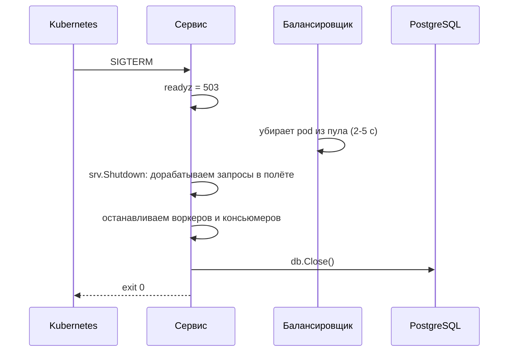

# Урок 01 — Укрепляем HTTP-сервис: таймауты, пулы, shutdown

Цель урока — получить в голове **эталонный `main.go`**, который можно надиктовать на
интервью и который переживёт прод. Не «hello world», а сервис, у которого выставлены все
границы: сколько ждать, сколько соединений держать, как умирать.

## Шаг 1. Что не так с «обычным» main

```go
func main() {
    db, _ := sql.Open("postgres", os.Getenv("DSN"))   // пул без лимитов
    http.HandleFunc("/orders", ordersHandler)          // глобальный mux
    http.ListenAndServe(":8080", nil)                  // все таймауты = 0, shutdown = kill
}
```

Четыре мины: **пул БД без потолка** (5000 горутин попробуют открыть 5000 соединений),
**нулевые таймауты сервера** (соединение можно держать вечно), **нет graceful shutdown**
(каждый деплой рвёт запросы в полёте), **ошибки проигнорированы**. Всё это не видно на
ноутбуке и отлично видно в 3 часа ночи.

## Шаг 2. Эталонный `main.go`

```go
package main

import (
	"context"
	"database/sql"
	"errors"
	"log/slog"
	"net/http"
	"os"
	"os/signal"
	"syscall"
	"time"
)

func main() {
	log := slog.New(slog.NewJSONHandler(os.Stdout, nil)) // логи в stdout: 12-factor

	db, err := sql.Open("postgres", os.Getenv("DSN"))
	if err != nil {
		log.Error("open db", "err", err)
		os.Exit(1)
	}
	// Пул небольшой: БД насыщается по ядрам и дискам, а не «чем больше, тем лучше».
	// Считаем сумму по всем pod'ам против max_connections сервера.
	db.SetMaxOpenConns(25)
	db.SetMaxIdleConns(25) // равен MaxOpen, иначе соединения постоянно пересоздаются
	db.SetConnMaxLifetime(30 * time.Minute) // перебалансировка после failover реплики
	db.SetConnMaxIdleTime(5 * time.Minute)
	defer db.Close()

	// Один клиент на процесс: иначе нет keep-alive и каждый вызов делает TCP+TLS заново.
	downstream := &http.Client{
		Timeout: 2 * time.Second, // общий потолок вызова соседа < нашего SLA
		Transport: &http.Transport{
			MaxIdleConns:        200,
			MaxIdleConnsPerHost: 100, // дефолт 2 — источник «лишних» 30 мс на каждый вызов
			MaxConnsPerHost:     200, // защищаем соседа и себя от неограниченного веера
			IdleConnTimeout:     90 * time.Second,
		},
	}

	app := NewApp(db, downstream, log)

	mux := http.NewServeMux() // свой mux: DefaultServeMux глобален и легко засоряется
	mux.HandleFunc("GET /healthz", app.Healthz)   // liveness: дешёвая проверка «процесс жив»
	mux.HandleFunc("GET /readyz", app.Readyz)     // readiness: проверяем БД и флаг shutdown
	mux.Handle("POST /orders", http.MaxBytesReader(nil, nil, 0)) // см. ниже про лимит тела
	mux.Handle("GET /orders/{id}", app.GetOrder())

	srv := &http.Server{
		Addr:              ":8080",
		Handler:           http.TimeoutHandler(mux, 5*time.Second, "timeout"), // дедлайн обработки
		ReadHeaderTimeout: 5 * time.Second,   // защита от Slowloris
		ReadTimeout:       15 * time.Second,  // запрос целиком
		WriteTimeout:      15 * time.Second,  // запись ответа
		IdleTimeout:       90 * time.Second,  // простой keep-alive
		MaxHeaderBytes:    1 << 20,
	}

	ctx, stop := signal.NotifyContext(context.Background(), os.Interrupt, syscall.SIGTERM)
	defer stop()

	go func() {
		if err := srv.ListenAndServe(); err != nil && !errors.Is(err, http.ErrServerClosed) {
			log.Error("listen", "err", err)
			stop()
		}
	}()
	log.Info("started", "addr", srv.Addr)

	<-ctx.Done()
	log.Info("shutdown started")

	app.SetNotReady()      // readyz начинает отвечать 503
	time.Sleep(5 * time.Second) // даём балансировщику убрать нас из пула

	// Таймаут уборки заведомо меньше terminationGracePeriodSeconds (по умолчанию 30 с).
	shCtx, cancel := context.WithTimeout(context.Background(), 20*time.Second)
	defer cancel()
	if err := srv.Shutdown(shCtx); err != nil {
		log.Error("graceful shutdown failed", "err", err)
	}
	app.StopWorkers(shCtx) // фоновые воркеры — после HTTP, БД закрываем последней (defer)
	log.Info("bye")
}
```

Строка с `MaxBytesReader` в примере — заглушка-напоминание: лимит тела ставится **в
handler'е**, где известен разумный размер:

```go
r.Body = http.MaxBytesReader(w, r.Body, 1<<20) // 1 МБ на JSON: без этого «загрузка» съест память
```

## Шаг 3. Почему именно такой порядок выключения



Порядок «снаружи внутрь» не декоративный: закроешь БД раньше HTTP — запросы в полёте
получат ошибку вместо ответа. А пауза после `SetNotReady` нужна потому, что балансировщик
узнаёт о неготовности не мгновенно: без неё часть трафика прилетит в уже закрытый листенер и
клиент увидит `connection refused` (для клиента это неретраибельная на первый взгляд ошибка —
особенно неприятно для POST).

```drill
type: multiple-choice
prompt: "Почему между SIGTERM и srv.Shutdown ставят паузу в несколько секунд?"
options: ["Чтобы успели долететь логи", "Балансировщик узнаёт о неготовности не мгновенно: без паузы часть запросов получит connection refused", "Так требует стандарт POSIX", "Чтобы GC успел отработать"]
answer: "Балансировщик узнаёт о неготовности не мгновенно: без паузы часть запросов получит connection refused"
check: exact
```

## Шаг 4. Числа, которые надо уметь обосновать

| Параметр | Значение | Обоснование в одну фразу |
|---|---|---|
| `MaxOpenConns` | 25 на pod | 20 pod'ов × 25 = 500 < `max_connections`? если нет — pgbouncer |
| `MaxIdleConns` | = MaxOpen | иначе соединения закрываются и открываются заново на каждом всплеске |
| `ConnMaxLifetime` | 30 мин | соединения перераспределятся после failover или добавления реплики |
| `Client.Timeout` | 2 с | меньше нашего SLA (например 3 с), чтобы успеть отдать деградированный ответ |
| `MaxIdleConnsPerHost` | 100 | дефолт 2 убивает keep-alive при нагрузке на один хост |
| `ReadHeaderTimeout` | 5 с | Slowloris и мобильные клиенты в метро |
| `TimeoutHandler` | 5 с | `ReadTimeout` не ограничивает время работы кода |
| Пауза перед `Shutdown` | 5 с | время реакции балансировщика/kube-proxy |
| Таймаут `Shutdown` | 20 с | < `terminationGracePeriodSeconds` = 30 с |

```drill
type: free-form
prompt: "Интервьюер: «У вас 30 pod'ов, в каждом MaxOpenConns=100, PostgreSQL с max_connections=200. Что будет?» Ответь и предложи решение."
answer: "Потенциально 3000 соединений против лимита 200: при всплеске часть pod'ов получит отказ на установке соединения, ошибки пойдут не там, где перегрузка, а везде сразу. Плюс даже если бы лимита не было, 3000 конкурентных запросов на нескольких ядрах дадут падение пропускной способности и рост latency. Решение: уменьшить пул до разумных единиц-десятков на pod так, чтобы сумма была заметно ниже max_connections с запасом на служебные подключения; поставить pgbouncer в режиме transaction pooling, чтобы приложение видело много соединений, а база — мало; ограничить параллельность на входе (семафор размера пула) и отдавать 503 при переполнении вместо бесконечной очереди."
check: manual
```

## Итог

Эталонный `main.go` — это пять групп решений: **пул БД с потолком и сроком жизни**,
**один HTTP-клиент с keep-alive и таймаутом**, **все таймауты сервера плюс дедлайн обработки
и лимит тела**, **readiness/liveness как разные проверки**, **graceful shutdown в правильном
порядке и с паузой**. Каждое число должно иметь обоснование — на интервью спрашивают именно
«почему столько», а не «какое значение по умолчанию».
